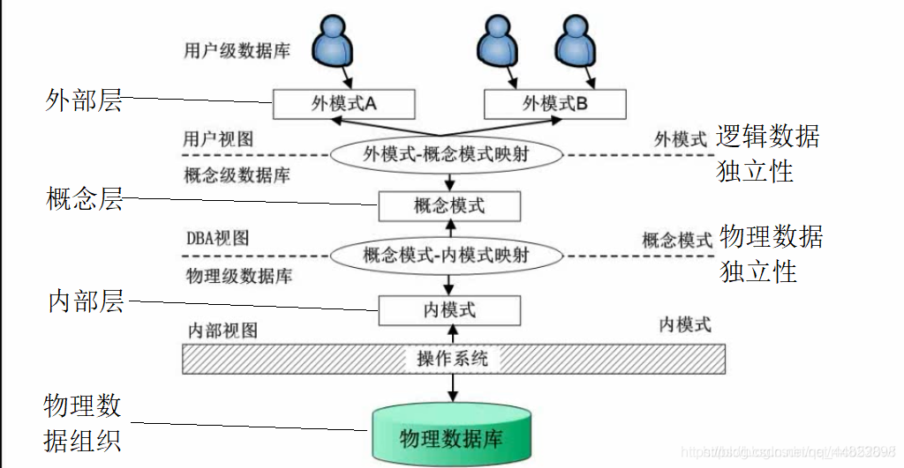

# 数据库概论

[toc]

# 1. ANSI-SPARC三层体系结构和两级映射

> 1975年，美国国家标准化协会（American National Standard Institute, ANSI）标准规划和需求委员会（SPARC）提出了数据库系统带系统目录的三层结构体系。

## 1.1 三层体系结构

> DB的数据结构有三个层次：外部层、概念层和内部层。这三个层次要用DB的数据定义语言(Data Definition Language，简称DDL)定义，定义以后的内容称为“模式”，即外模式、概念模式和内模式。

1. 三层体系结构：外部层、概念层、内部层

2. 用户从外部层观察数据，DBMS和操作系统从内部层观察数据。在内部层，数据是依靠特定数据结构和文件组织方法存储的。概念层提供内、外部层的映射和必要的独立性。

3. 三层体系结构图

    

4. 三层体系结构的目的：将用户的数据库视图与数据库的物理描述分离开。

5. 分离用户的数据库视图和数据库的物理描述的原因：
    1. 每个用户都能访问相同的数据，但可用各自定制的数据视图。每个用户都应该能够改变自己的数据视图，但这些改变不会影响其他用户。
    2. 不要求用户直接处理数据库物理存储的细节，例如索引和散列。也即是，用户与数据库的交互应该独立于存储细节。
    3. 数据库管理员（DBA）能在不影响用户视图的情况下修改数据库存储结构
    4. 数据库的内部结构不受存储的物理变化的影响，例如将数据转存到某个新的存储设备上。
    5. DBA能在不影响所有用户的情况下修改数据库的概念结构。

6. 外部层：

    > 数据库的用户视图。这一层描述与每一个用户相关的数据库部分。针对用户需求而呈现的局部数据和逻辑，可以有多个。

    1. 外模式与应用的关系：一个外模式可以为多个应用程序所使用，一个应用程序只能使用一个外模式

    2. 外模式的用途

        - 每个用户只能看见和访问所对应的外模式中的数据，简化用户视图。

        - 保证数据库安全性的一个有力措施。

    

7. 概念层：

    > 数据库的整体视图。这一层描述了哪些数据被存储在数据库中，以及这些数据之间的联系。

    1. 三层体系结构中间的一层就是概念层。这一层包含DBA所看到的整个数据库的的逻辑结构。它是组织机构关于数据需求的完整视图，但完全独立于存储考虑。
    2. 概念层描述：
        1. 所有的实体、实体的属性和实体间的联系。
        2. 数据的约束
        3. 数据的语义信息
        4. 安全性和完整性信息。
    3. 概念层支持每一个外部视图，凡是用户可访问的数据必定包含在概念层或者由概念层可导出。但是这层不包括任何依赖于存储的细节。

    

8. 内部层：

    > 数据库在计算机上的物理表示。这一层描述数据是如何存储在数据库中的。

    1. 内部层包括为了得到数据库运行时的最佳性能而采用的物理实现方法，包括在存储设备上存储数据所采用的数据结构和文件组织方法。它通过与操作系统的访问方法（存储和检索数据记录的文件管理技术）交互，完成在存储设备上存放数据、建立索引和检索数据等操作。
    2. 内部层与如下操作相关：
        1. 数据和索引的存储空间分配
        2. 用于存储的记录描述（数据项的存储大小）
        3. 记录的放置。
        4. 数据压缩和数据加密技术
    3. 内部层之下的是物理层，物理层可能在DBMS的指导下受操作系统的控制。

    

## 1.2 两级映射

1. 模式、映射和实例

    1. 对数据库的整体描述称为数据库模式。三层结构的三个抽象层次定义了三类模式：
        1. 在最高层，有**若干  外模式**（也成为子模式或用户模式），与不同的数据视图相对应。
        2. 在概念层，有**概念模式**，它描述所有的实体、属性和联系及其上的完整性约束。
        3. 在抽象的最底层，有**内模式**，是内部模型的完整描述，包括存储记录的定义、表示方法、数据域，必要时还有所使用的索引和散列方案。
    2. 一个数据库只有一个概念模式和一个内部模式，但是可以有多个外模式。
    3. DBMS负责三类模式之间的映射。它必须检查模式以确保一致性。换句话说，DBMS必须检查每个外部模式能否由概念模式导出，并使用概念模式中的信息，完成内、外模式的映射。
    4. 概念模式通过**概念层到内部层的映射**与内模式相联系。这样，DBMS就能在物理存储中找出构成概念模式中逻辑记录的实际记录或记录集，以及对逻辑记录进行操作过程中应遵守的约束。
    5. 每一个外部模式通过**外部层到概念层的映射**与概念模式相联系。这就允许DBMS将用户视图中的名称映射到概念模式中相应的部分。
    6. 数据库的描述和数据库本身的区分：
        1. 数据库的描述是数据库模式。这个模式是在数据库设计过程中指定的，并且不会经常改变。
        2. 数据库中的实际数据可以经常改变。在任一时间点上，数据库中的数据构成一个**数据库实例**。
        3. 许多数据库实例可以与相同的数据库模式相对应。
        4. 模式有时候称为数据库的**内含**，而实例称为数据库的**外延**（或者状态）。
    
    
    
2. 数据独立性

    > 三层体系结构的一个主要目的就是保证**数据独立性**，这意味着对较低层的修改不会对较高层造成影响。

    有两种类型的数据独立性：**逻辑数据独立性**和**物理数据独立性**
    
    1. 逻辑数据独立性：逻辑数据独立性指的是外模式不受概念模式变化的影响。
    
        - 对概念模式的修改，例如添加或删除实体、属性或者联系，应该不影响已存在的外模式，也不需要重新编写应用程序。显然，重要的修改只应由需要知道的用户知道，其他用户不必知道。
    
    2. 物理数据独立性：物理数据独立性指的是概念模式不受内模式变化的影响。
    
        - 对内模式的修改，例如使用不同的文件组织方式或存储结构、使用不同的存储设备、修改所引或散列算法，应该不影响概念模式和外模式。从用户的观点来看，唯一需要注意的是对性能的影响。实际上，性能变坏是改变内模式最常见的原因。
    
    3. ANSI-SPARC体系结构中的两级映射可能降低效率，但却能提供更强的数据独立性。

# 2. 完整性约束

1. 实体完整性：在基本关系中，主关键字的属性不能为空（或者：规定表的每一行在表中是惟一的实体 from百度百科）

2. 参照完整性：如果在关系中存在某个外部关键字，则它的值或者与主关系中某个元组的候选关键字取值相等，或者全为空。（保证了表之间的数据的一致性，防止了数据丢失或无意义的数据在数据库中扩散。）
3. 域完整性：是指表中的列必须满足某种特定的数据类型约束，其中约束又包括取值范围、精度等规定。
4. 用户定义的完整性：不同的关系数据库系统根据其应用环境的不同，往往还需要一些特殊的约束条件。用户定义的完整性即是针对某个特定关系数据库的约束条件，它反映某一具体应用必须满足的语义要求。

# 3. 规范化

> 规范化是生成一组具有所期望的特性又能满足企业数据需求的关系的技术

1. 目的：确定一组合适的关系以支持企业的数据需求。
2. 合适的关系应具有如下性质：
    1. 属性的个数最少，且这些属性是支持企业的数据需求所必需的
    2. 具有紧密逻辑联系（描述为函数依赖）的诸属性均在同一个关系中
    3. 最少的冗余，即每个属性仅出现一次，作为外部关键字的属性除外。因为连接相关关系必须用到外部关键字
3. 好处：
    - 数据库易于用户访问，数据易于维护

    - 在计算机上占有较小的存储空间。

## 3.1 数据冗余与更新异常

> 关系数据库设计的一个主要目标就是将属性组合成关系时，力求最少的数据冗余。
>
> 这样做的好处：
>
> 1. 能用最少的操作完成对数据库中存储数据的更新，由此可以降低数据库中出现数据不一致的概率
> 2. 减少存储基本关系所需的文件存储空间，从而降低成本
>
> 当然，关系数据库的运行也依赖于一定数据冗余的存在。这种冗余一般是以主关键字（或者候选关键字）的多个副本的形式出现，这些副本在与之相关联的关系（即主关键字或候选关键字所属关系）中，作为外部关键字出现，用以表示数据之间的联系。

### 3.1.1通过表来说明更新异常

1. Staff表

    | <u>staffNo</u> | sName       | position   | salary | branchNo |
    | -------------- | ----------- | ---------- | ------ | -------- |
    | SL21           | John White  | Manager    | 30000  | B005     |
    | SG37           | Ann Beech   | Assistant  | 12000  | B003     |
    | SG14           | David Ford  | Supervisor | 18000  | B003     |
    | SA9            | Mary Howe   | Assistant  | 9000   | B007     |
    | SG5            | Susan Brand | Manager    | 24000  | B003     |
    | SL41           | Julie Lee   | Assistant  | 9000   | B005     |

2. Branch表

    | <u>branchNo</u> | bAddress               |
    | --------------- | ---------------------- |
    | B005            | 22  Deer Rd, London    |
    | B007            | 16 Argyll St, Aberdeen |
    | B003            | 163 Main St, Glasgow   |

3. StaffBranch表
	| <u>staffNo</u> | sName       | position   | salary | branchNo | bAddress               |
   | -------------- | ----------- | ---------- | ------ | -------- | ---------------------- |
   | SL21           | John White  | Manager    | 30000  | B005     | 22  Deer Rd, London    |
   | SG37           | Ann Beech   | Assistant  | 12000  | B003     | 163 Main St, Glasgow   |
   | SG14           | David Ford  | Supervisor | 18000  | B003     | 163 Main St, Glasgow   |
   | SA9            | Mary Howe   | Assistant  | 9000   | B007     | 16 Argyll St, Aberdeen |
   | SG5            | Susan Brand | Manager    | 24000  | B003     | 163 Main St, Glasgow   |
   | SL41           | Julie Lee   | Assistant  | 9000   | B005     | 22  Deer Rd, London    |

4. 在StaffBranch表中存在冗余数据：同一个分公司信息在每一个属于该分公司的员工的信息里反复出现。相反，在Branch中，每个分公司的信息只出现了一次，而且在Staff中只有分公司的编号（branchNo）这一属性的值反复出现，这是为了能够表示出每一个员工属于哪一个分公司。
5. 存在冗余的数据关系可能存在一些问题------更新异常

### 3.1.2 数据冗余造成的更新异常

> 更新异常可分为插入异常、删除异常和修改异常

1. 插入异常

    1. 插入异常主要有两类
        - 在StaffBranch中插入一条员工信息时，这些信息中必须包括该员工将被分配到的分公司的信息。如果没有正确输入分公司的所有信息，会存在潜在的信息不一致性的情况。
        - 在StaffBranch中插入一个新的分公司信息时，由于该分公司目前可能没有员工，因此有必要将与员工有关的信息设置为null，但是由于staffNo是一个主关键字，如果将staffNo赋值为null，会违反实体完整性约束，这样是不允许的。因此我们无法插入一个staffNo为null的新的分公司的元组。

    2. 对于Staff表和Branch表来说，不会存在上面这两种插入异常。

2. 删除异常

    > 在从关系StaffBranch中删除一个元组时，如果该元组表示某分公司的最后一名员工，则删除元组之后，该分公司的信息也从数据库中丢失了。

3. 修改异常

    > 如果想要修改关系StaffBranch中某分公司的某个属性值，必须要更新在此分公司中的所有元组。如果修改操作未能在所有元组上执行，数据会产生不一致。

4. 通过把StaffBranch关系分解为Staff关系和Branch关系，可以产生更好的特性（避免了异常）。

5. 当把较大的关系分解成较小的关系时，有两个特性：

    1. **无损链接**特性：该特性确保了原关系的任一实例信息能通过较小的关系的对应实例确定出来。
    2. **依赖保持**特性：该特性确保了只需简单的在较小的关系上支持某些约束，就可以继续支持在原关系上存在的约束。也就是说，不必对较小的关系执行连接操作就可以检验他们是否违反了原关系上的约束。

## 3.2 函数依赖

> 与规范化相关的一个重要概念就是函数依赖，函数依赖描述了属性之间的联系。

1. 函数依赖的特征

    > 为了讨论函数依赖，假设有某一关系模式，该关系模式具有属性（A，B，C，......，Z），我们用一个**全域关系**R=（A，B，C，......，Z）来描述数据库。这意味着每个数据库中的属性都有一个唯一的名字。

2. 函数依赖：描述一个关系中属性之间的联系。

    > 假设A和B均为关系R的属性，若A的每个值都和B中的一个唯一的值相对应，则称B函数依赖于A（也可称为A函数决定B），记为
    >
    > A→B（A，B可能由一个或多个属性组成）

    1. 函数依赖是属性在关系中的一种语义特性。该语义特性表明了属性和属性是如何关联起来的，确定了属性之间的函数依赖。当存在某一函数依赖时，这个依赖就被视为属性之间的一种约束。
    2. 当存在函数依赖时，位于箭头左边的属性或属性组称为**决定方**，A→B称为A是B的决定方。
    
3. 完全函数依赖：决定方应该具有最少的属性，这些属性是保证右边的属性函数依赖于它所必不可少的。

    > 假设A和B是某一关系的属性（组）， 若B函数依赖于A，但不是函数依赖于A的任一真子集，则称B完全函数依赖于A。

4. 对于函数依赖A→B，如果去掉A中的任一属性都使得该依赖不再成立，那么A→B就是**完全函数依赖**。否则A→B就是**部分函数依赖**

5. 概括而言，规范化时要用到的函数依赖具有下列性质：
    1. 函数依赖左边的属性（组）（即决定方）与右边的属性（组）是一对一的联系（反过来看，右边与左边的属性（组）之间，可能是1对1，也可能是1对多）
    2. 恒成立
    3. 决定方具有最少的、足以支持与右边属性（组）之间依赖关系的属性，即右边的属性（组）完全依赖于左边的属性（组）。

## 3.4 传递依赖

> 存在传递依赖，有可能引起更新异常。
>
> 假设A、B、C是某一次关系的属性，若A→B，B→C，则称C通过B传递依赖于A（假设A并不函数依赖于B或者C）

1. 传递依赖示例

    > staffNo→sName, branchNo, bAddress
    >
    > branchNo→bAddress
    >
    > bAddress通过branchNo传递依赖于staffNo。换句话说，属性staffNo通过属性branchNo函数决定bAddress，并且branchNo和bAddress都不能函数决定staffNo。

## 3.5 规范化过程

1. 规范化是一种基于关系的主关键字（或者候选关键字）和函数依赖对关系进行分析的形式化技术。规范化技术涉及一系列的规则。当某种规范化的要求未能得到满足时，就将违反需求的关系分解为多个关系，直至分解后的关系都能满足规范化的要求。

2. 最早提出的三个范式：第一范式（1NF）、第二范式（2NF)、第三范式（3NF）。后来又提出了一种增强的第三范式，称为Boyce-Codd范式（BCNF）。除了第一范式，其余的都是基于关系的属性之间的函数依赖的。随后还提出了更高层的范式：第四范式（4NF）、第五范式（5NF），不过使用这两种范式的情况非常少。

3. 另外：对于关系数据模型，在建立关系时，只有满足第一范式的需求是必须的，其他的范式都是可选的。但是，为了避免出现更新异常，通常将规范化至少进行到第三范式。

## 3.6 第一范式（1NF）

1. 相关定义

    1. 非范式（UNF）：包含一个或多个重复组的表
    2. 第一范式（1NF）：关系的每一行和每一列相交的位置有且仅有一个值。

2. 非规范化的表消除重复组的方法：

    > 关键属性：指非规范化的表中可以唯一标识每一行的属性（组）。

    1. 在含有重复数据的那些行的空白列上输入合适的数据（根据具体的情况）。这种方法通常被看做对表的平板化处理。
    2. 将重复数据单独移到一个新的关系中，同时也将原来关系中的关键属性（组）复制到这个新的关系中。

## 3.7 第二范式（2NF）

> 第二范式基于完全函数依赖的概念，第二范式适用于具有复合关键字（主键是个属性组）的关系。
>
> **注意：主关键字仅包含一个属性的关系已经至少是2NF的。2NF可以消除一部分更新异常**

1. 定义：
    - 满足第一范式的要求，并且每个非主关键字都完全函数依赖于主关键字的关系。
2. 规范步骤：
    - 将1NF关系规范化为2NF关系需要消除部分函数依赖。如果存在部分依赖，就要将部分依赖的属性从原关系移出，移到一个新的关系中去，同时将这些属性的决定方也复制到新的关系中作为主键。

## 3.8 第三范式（3NF）

> 2NF比1NF关系的数据冗余度低，但是仍然存在更新异常问题。此时的更新异常是由传递依赖引起的。

1. 定义：
    - 满足第二范式的要求，并且所有非主关键字属性都不传递依赖于主关键字的关系。
2. 规范步骤：
    - 将2NF的关系规范化为3NF需要消除传递依赖。如果存在传递依赖，就将传递依赖的属性（组）移到一个新的关系中，并将这些属性的决定方也复制到该关系中作为主键。

## 3.9 2NF和3NF的一般化定义

> 前面的2NF和3NF的定义中，不允许存在对主关键字的部分依赖和传递依赖，以此避免更新异常。然而，这些定义并没有考虑关系中的其他候选关键字。
>
> 注意：考虑关系的候选关键字并不会影响1NF的定义，因为1NF与关键字和函数依赖无关。
>
> 规定：属于任何一个候选关键字的属性都叫做主属性。

1. 2NF

    - 定义：满足第一范式的要求并且每个非主属性都完全函数依赖于任何一个候选关键字的关系。（非主属性完全依赖于码）

2. 3NF

    - 定义：满足第一范式和第二范式的要求并且没有一个非主属性传递依赖于任何一个候选关键字的关系。

3. 使用2NF和3NF的一般化定义时，必须注意是所有候选关键字上的部分依赖和传递依赖，而不只是主关键字上的。这使得规范化过程变得更加复杂，但一般化定义能为关系增加附加约束，从而有可能发现关系中隐晦的、被遗漏的冗余。所以，**在进行规范化时，是仅简单地分析主关键字上的依赖，还是使用一般化定义进行规范化，需要权衡。**

## 3.10 BCNF

> Boyce-Codd范式是在考虑了关系中所有候选关键字上的函数依赖的基础上定义的。尽管如此，同3NF的一般化定义相比较，BCNF还添加了一些其他的约束。
>
> 3NF可能存在的更新异常：

1. 定义：当且仅当每个函数依赖的决定方都是候选关键字时，某一关系才是BCNF的。
2. 决定方：一个或一组被其他属性完全函数依赖的属性。
3. 3NF和BCNF之间的区别表现在对于一个函数依赖A→B，3NF允许B是主属性且A不是候选关键字（*3NF定义是，非主属性都不传递依赖于主键，如果B是主属性，此依赖一定满足3NF。另外，如果B是非主属性，A也是非主属性，一定会存在X→A，其中X是主键（组），这意味着此关系一定不满足3NF*）；但是，BCNF却要求在这个依赖中，A必须是候选关键字。所以，Boyce-Codd范式是增强的3NF，每一个BCNF的关系也是3NF的，反之不成立。

4. 一般满足3NF的关系很少会违反BCNF。可能违反BCNF的情况：

    1. 关系中包含两个（或更多个）合成候选关键字

    2. 候选关键字互相重叠，通常至少都包含一个相同的属性。

        1. 举例：ClientInterview(<u>clientNo</u>, <u>interviewDate</u>, interviewTime, staffNo, roomNo)
        
        2. 关系上成立的函数依赖如下：
            fd1. clientNo, interviewDate→interviewTime, staffNo, roomNo   (主关键字)
        
            fd2. staffNo, interviewDate, interviewTime→clientNo    (候选关键字)
        
            fd3. roomNo, interviewDate, interviewTime→staffNo, clientNo  （候选关键字）
        
            fd4. staffNo, interviewDate→roomNo
        
        3. 分析：函数依赖fd1、fd2、fd3都是该关系的候选关键字，所以不会给该关系带来任何问题。
        
            对于fd4，因为roomNo是主属性，即使（staffNo，interviewDate）不是候选关键字，也满足3NF。但是正因为（staffNo，interviewDate）不是候选关键字，所以该关系不满足BCNF。因此，此关系，可能出现更新异常：（staffNo，interviewDate）不是候选关键字，意味着（staffNo，interviewDate）属性组可能有重复，这样更新（staffNo，interviewDate）这个属性组时，需要更新多列，否则会导致数据库的状态不一致。
        
        4. 解决方案：分解ClientInterview关系
            1. Interview(<u>clientNo</u>, <u>interviewDate</u>, interviewTime, staffNo)
            2. StaffRoom(<u>staffNo</u>, <u>interviewDate</u>, roomNo)
            
        5. 问题：分解成BCNF关系可能造成函数依赖的丢失（也就是说，决定方和由他决定的属性被分解到了不同的关系中），其结果并非所求。在这种情况下，也很难实现该函数依赖，这个约束也因此丢失。当发生这种情况时，最好将规范化进行到3NF，分解到3NF不会丢失任何依赖。同时，如果不分解到BCNF，关系中将会存在数据冗余。
        
        6. 解决：将关系规范到3NF还是BCNF，主要考虑fd4导致的数据冗余度昌盛的影响大还是由于丢失fd3造成的影响大。
        
        