# Go 语言环境配置

## go 语言安装

1. 官网[网址](https://golang.google.cn/dl/) 下载

    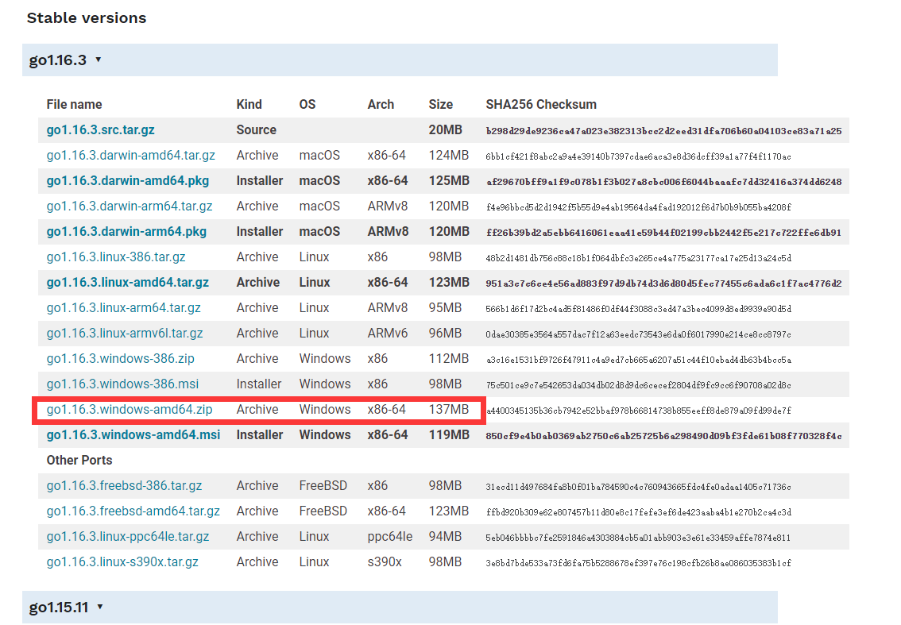

2. 运行 1 中的 msi 文件，疯狂点击 next 安装（自己选择安装路径）

    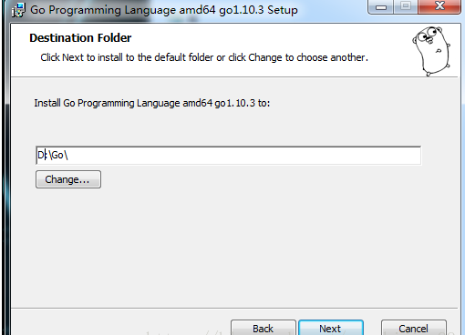

3. 安装完成后的文件视图

    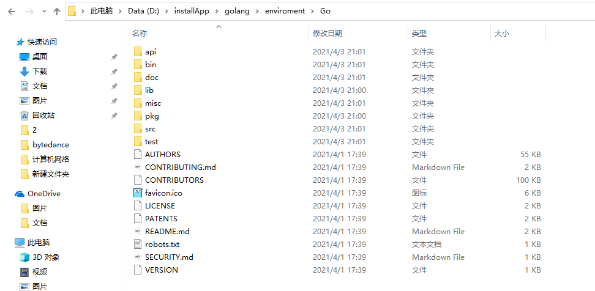

4. 新建文件夹作为 Go 的工作目录，并建立如下空文件夹

    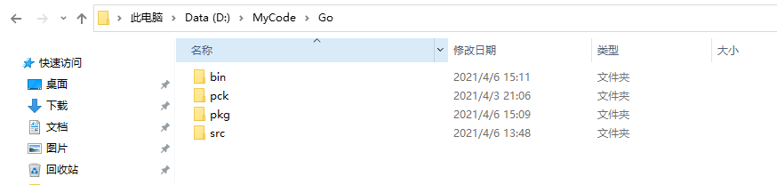

5. 配置环境变量

    - 新建 GOPATH 变量

        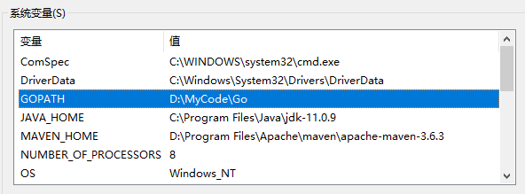

    - 在 Path 中添加 Go/bin 的环境变量

        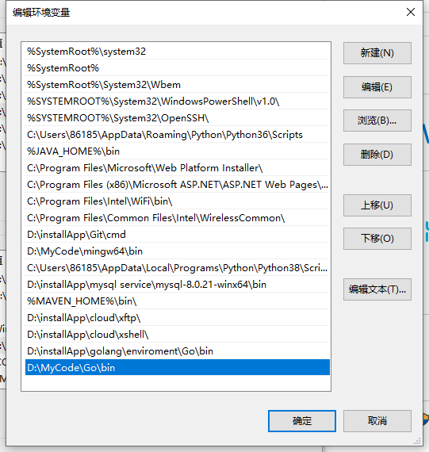

6. Linux 配置环境变量

    ```shell
    export GOROOT=/opt/go
    export GOPATH=/home/ubuntu/goCode
    export PATH=$PATH:$GOROOT/bin:$GOPATH/bin
    ```

7. 在控制台查看 go 的环境配置信息

    **注意使用 `go env -w GOPROXY=https://goproxy.cn,direct` 设置代理，否则后续在 vscode 安装 Go 相关插件时会超时**

    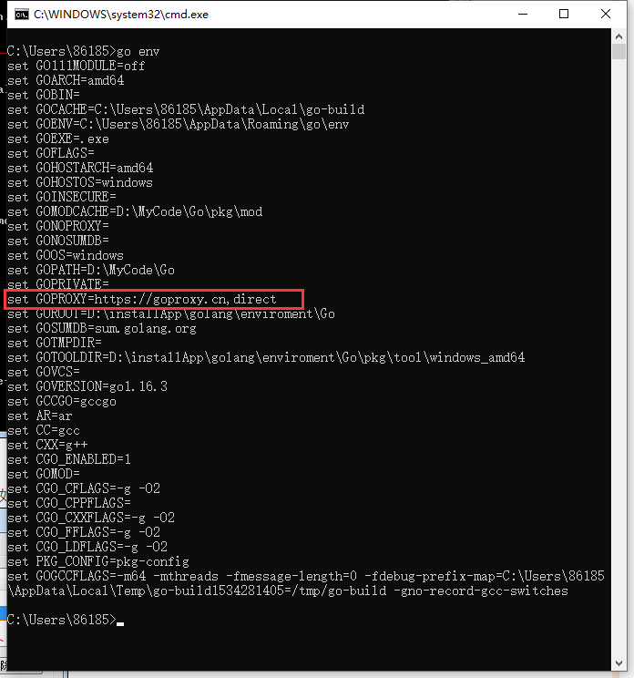

    - GOROOT：golang 安装目录
    - GOPATH：保存源码路径，开发代码路径

## vscode 安装并配置 Go 开发插件

1. 官网下载，疯狂下一步，安装完成

2. 安装汉化包

    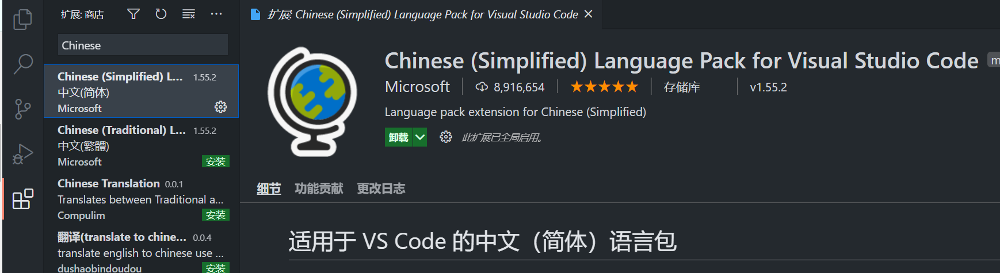

3. 安装 Go 语言插件

    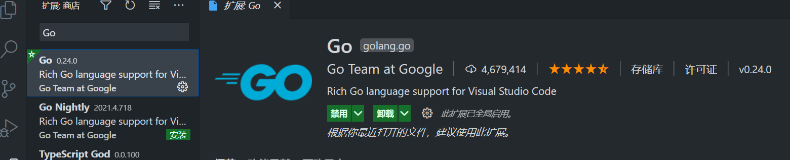

4. 安装 Go 开发相关插件

    - 使用 Ctrl + Shift + p 或者点击 查看 -> 命令面板 -> 输入 `Go:Install` 如下所示，点击安装/更新工具

        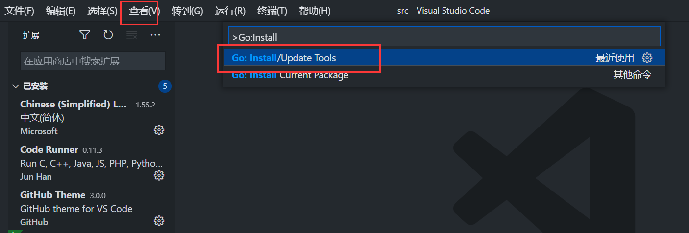

    - 全选所有工具，全部安装

        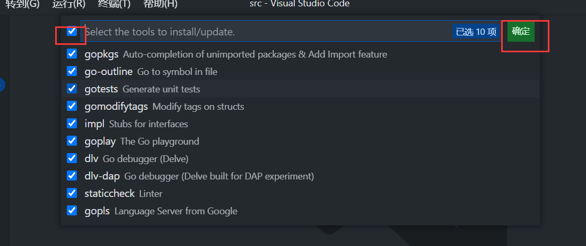

        **注意：如果先前没有配置代理，这里下载可能会超时，导致安装失败，也可以从 github 上直接下载**

        **go install 命令会把生成的二进制可执行文件拷贝到 GOPATH/bin 目录下**

    - 如果不出意外，就会全部安装完成，安装的工具存在于工作目录的 bin 目录下

        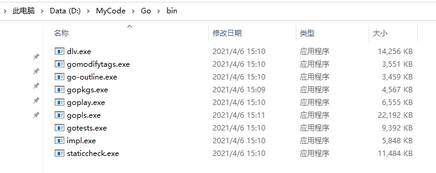

    - pkg 目录下也会多出很多文件，先留个坑

        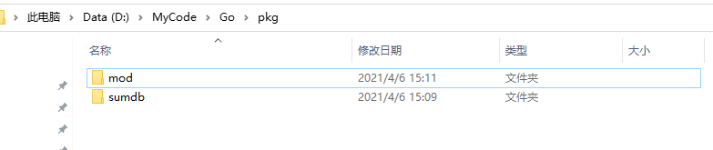

## 愉快的写代码