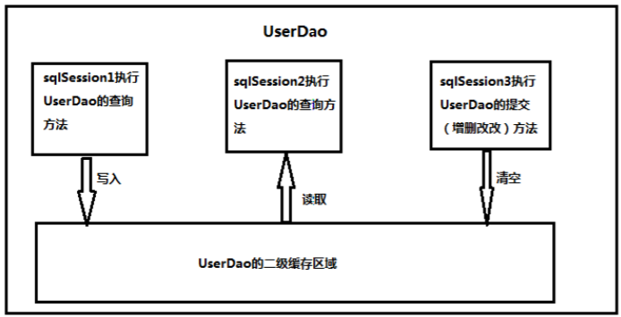

# mybatis框架

[toc]


> 数据库操作的一些细节：
>
> 0. **超级无敌重要：**
>     - **xml 中的 sql 语句中间不要写注释，会报错（用的--注释）**
>     - **持久层接口方法，如果有多个参数，加上 param注解**
>
> 1. 涉及到多线程时，获取Connection时可以借助ThreadLocal容器。
>
>     ​	`在使用完connection时，关闭close实际是把connection放回到连接池中；对应的，线程使用完后，同样是被放回到线程池中。这就意味着，该线程和该连接仍然是绑定着的，下次使用此线程，可以用的是上次的连接，这是不被期待的。`
>
>     ​	`解决办法：在某线程结束时，调用threadlocal的remove方法，解除与connection的绑定`
>     
> 2. mybatis通过`mapper`标签的`namespace`属性和`select语句的id`来唯一定位一个sql语句
>
> 3. `<sql id = "defaultSql">select * from user</sql>`使用sql标签抽取重复的sql语句（注意，抽取出的sql语句不要写分号，因为引用时，此语句后面可能还有sql语句，这种情况会报错），然后使用`<include refid="defaultSql"></include>`标签引用sql语句。
>
> 4. 标签里面的sql语句需要换行时，最好在新行的前面加上空格，否则可能在mybatis拼接sql语句时，把两个标识符合并成了一个标识符，从而报错。

## 1. 框架和mybatis

1.  什么是框架？

    > 它是我们软件开发中的一套解决方案，不同的框架解决的是不同的问题。
    > 使用框架的好处：
    > 		框架封装了很多的细节，使开发者可以使用极简的方式实现功能。大大提高开发效率。

2. 三层架构

    表现层servlet：
    		是用于展示数据的
    业务层service：
    		是处理业务需求
    持久层dao：
    		是和数据库交互的

3. 持久层技术解决方案

    JDBC技术：
    		Connection
    		PreparedStatement
    		ResultSet
    Spring的JdbcTemplate：
    		Spring中对jdbc的简单封装
    Apache的DBUtils：
    		它和Spring的JdbcTemplate很像，也是对Jdbc的简单封装

    > 以上这些都不是框架
    > 		JDBC是规范
    > 		Spring的JdbcTemplate和Apache的DBUtils都只是工具类

4. mybatis的概述

    1. mybatis是一个持久层框架，用java编写的。
        	它封装了jdbc操作的很多细节，使开发者只需要关注sql语句本身，而无需关注注册驱动，创建连接等繁杂过程。它使用了ORM思想实现了结果集的封装。
    
    2. ORM：
        	Object Relational Mapping 对象关系映射
            	简单的说：
            		就是把数据库表和实体类及实体类的属性对应起来，让我们可以操作实体类就实现操作数据库表。

5. mybatis的入门

    1. mybatis的环境搭建
        		第一步：创建maven工程并导入坐标
            		第二步：创建实体类和dao的接口
            		第三步：创建Mybatis的主配置文件。SqlMapConifg.xml
            		第四步：创建映射配置文件。IUserDao.xml
    
    2. 环境搭建的注意事项：
        		第一个：创建IUserDao.xml 和 IUserDao.java时名称是为了和我们之前的知识保持一致。
            			    在Mybatis中它把持久层的操作接口名称和映射文件也叫做：Mapper
            			    所以：IUserDao 和 IUserMapper是一样的
          第二个：在idea中创建目录的时候，它和包是不一样的。
    
        ​			    包在创建时：com.itheima.dao它是三级结构
        ​			    目录在创建时：com.itheima.dao是一级目录（所以需要三级目录时，需要逐个创建）
        第三个：mybatis的映射配置文件位置必须和dao接口的包结构相同
        ​第四个：映射配置文件的mapper标签namespace属性的取值必须是dao接口的全限定类名
        ​第五个：映射配置文件的操作配置（select），id属性的取值必须是dao接口的方法名

    当我们遵从了第三，四，五点之后，我们在开发中就无须再写dao的实现类。
    
    1. mybatis的入门案例
        	第一步：读取配置文件
            	第二步：创建SqlSessionFactory工厂
            	第三步：创建SqlSession
            	第四步：创建Dao接口的代理对象
            	第五步：执行dao中的方法
            	第六步：释放资源
    
    2. 注意事项：
        	不要忘记在映射配置中告知mybatis要封装到哪个实体类中
            	配置的方式：指定实体类的全限定类名
    
    3. mybatis基于注解的入门案例：
        	把IUserDao.xml移除，在dao接口的方法上使用@Select注解，并且指定SQL语句
            	同时需要在SqlMapConfig.xml中的mapper配置时，使用class属性指定dao接口的全限定类名。
    
    4. 明确：
        	我们在实际开发中，都是越简便越好，所以都是采用不写dao实现类的方式。
            	不管使用XML还是注解配置。
            	但是Mybatis它是支持写dao实现类的（但没必要用）。
    

## 2.  基于代理dao实现数据库的增删改查（CRUD）操作

### 2.1 SqlMapConfig.xml文件的配置及注意事项

1. 配置 `<properties> `标签和数据库环境（`<environments>`标签）

    ①. 直接使用`<property>`配置数据库连接信息(例如)

    ```xml
    <property name="driver" value="com.mysql.jdbc.Driver"/>
    <property name="url" value="jdbc:mysql://localhost:3306/eesy_mybatis"/>
    <property name="username" value="root"/>
    <property name="password" value="123456"/>
    ```

    ②. 引入外部文件

    0. 直接配置

        ```xml
        <properties>
        	<property name="jdbc.driver" value="com.mysql.jdbc.Driver"/>
        	<property name="jdbc.url" value="jdbc:mysql://localhost:3306/eesy"/>
            <!--省略-->
        </properties>
        ```

        

    1. 使用properties的resource属性

        ```xml
        <properties resource="jdbcConfig.properties">
        ```

    2. 使用properties的url属性

        ```xml
        <properties url="file:///D:/MyCode/jdbcConfig.properties">
        ```

    3. jdbcConfig.properties文件的配置信息

        ```java
        jdbc.driver=com.mysql.jdbc.Driver
        jdbc.url=jdbc:mysql://localhost:3306/eesy_mybatis
        jdbc.username=root
        jdbc.password=123456
        ```

> 使用外部文件后，在需要使用相应配置信息的地方使用 **#{jdbc.driver}** 来引用相关属性
>
> ```xml
> <environments default="mysql">
>         <!--配置mysql环境-->
>         <environment id="mysql">
>             <!--配置事务-->
>             <transactionManager type="JDBC"></transactionManager>
>             <!--配置连接池-->
>             <dataSource type="POOLED">
>                 <!--千万记住$符号-->
>                 <property name="driver" value="${jdbc.driver}"/>
>                 <property name="url" value="${jdbc.url}"/>
>                 <property name="username" value="${jdbc.username}"/>
>                 <property name="password" value="${jdbc.password}"/>
>             </dataSource>
>         </environment>
>     </environments>
> ```
>
> mabatis连接池提供了3种方式的配置：
>         配置的位置：主配置文件**SqlMapconfig.xml**中的**dataSource**标签，**type**属性就是表示采用何种连接池方式
>             type属性的取值：
>                 **POOLED** 采用传统的javax.sql.DataSource规范中的连接池，mybatis中有针对规范的实现。
>                 **UNPOOLED** 采用传统的获取链接的方式，虽然也实现了javax.sql.dataSource接口，但是并没有使用池的思想。
>                 **JNDI** 采用服务器提供的JNDI技术实现，来获取dataSource对象，不同的服务器所能拿到的dataSource是不一样的。

### 2.2  配置domain包下的bean对象的别名（typeAliases标签）

1. 使用typeAlias的**type**属性

    type属性指定实体类的全限定类名。alias属性指定别名,当指定了别名后，别名就不区分大小写，即user和USER和USer相同。

    ```xml
    <typeAliases>
             <typeAlias type="com.yato.domain.User" alias="user"></typeAlias>
     </typeAliases>
    ```

2. 使用typeAlias的**package**属性

    用于指定要配置别名的包，当指定之后，该包下的所有实体类都会配置别名，并且类名就是别名，不再区分大小写

    ```xml
    <typeAliases>
             <package name="com.yato.domain"/>
    </typeAliases>
    ```

### 2.3 配置映射文件的位置（mappers标签）

```xml
<mappers>
     <!--<package>的属性介绍
         resource属性：
             用于指定配置文件的位置，是按照类路径的写法来写，并且必须存在于类路径下
         url属性：可以在服务器上引用外部配置文件信息（协议+主机+端口+URI）
         这两个取一种方式即可。
         -->
<!--        <mapper resource="com/yato/dao/IUserDao.xml"></mapper>-->
     <!--可以使用package的方式代替上面的两种方式-->
     <!--package用于指定dao接口所在的包，当指定了之后就不需要再写mapper以及resources或者class了
         此时需要吧resources下的配置文件的路径和类的路径写匹配-->
     <package name="com.yato.dao"/>
</mappers>
```


### 2.4 配置xxxDao.xml

1. 注意事项

    > 1. mysql数据库在windows系统下不区分大小写。
    > 2. 执行sql语句之前，mybatis会把自动提交设置为false，执行之后，需要手动commit()，如果不手动提交，
    >     mybatis会让操作回滚（select语句除外，查询回滚个锤子，又不影响数据），但是，如果获取的sqlSession时调用openSession(true)方法，不需要手动提交，每次操作就会自动提交。
    > 3. mybatis使用了OGNL表达式，因此，在#{}中获取对象属性值时，只需user.username,又因为，标签中已经指明了该属性值所属的对象，因此只需写username即可，等价于user.getUsername();

2. 实体类中属性名和数据库中属性名不一致情况的解决方案。

    1. 为 sql 语句的查询属性取别名(程序执行快，但需更改sql语句，造成开发效率低)

        ```sql
        select id userId, username, address, sex, birthday from user;
        /*修改sql语句，给列名取上别名即可，因为是sql层面的修改，效率高*/
        ```

        

    2. 使用mybatis提供的resultMap标签（程序执行慢，但sql语句无需更改，开发效率高）
    
        ```xml
        <!-- mybatis官方提供了resultMap标签，配置对应关系。此时查询语句配置的resultType属性就需改成resultMap，其值为resultMap标签的id值，即为userMap -->
        <resultMap id="userMap" type="com.yato.domain.User">
             <!--主键关键字对应-->
             <id property="userId" column="id"></id>
             <!--非主键关键字对应-->
             <result property="userName" column="username"></result>
             <result property="address" column="address"></result>
             <result property="sex" column="sex"></result>
             <result property="birthday" column="birthday"></result>
     </resultMap>
        ```

        
    
    3. selectKey 标签的使用，获取插入数据的自增列的列值
    
        ```xml
        <insert id="saveUser" parameterType="UsEr">
                <!-- 配置selectKey标签，获取插入user表后，该用户的id -->
                <!--
                    keyProperty 是实体类的属性
                    keyColumn 是数据库的具体列
                    resultType 返回值
                    order 此标签语句执行顺序（在外标签语句执行之前（后）执行）
                    以下selectKey标签在当前情况下的实际意义：
                        在执行外标签的insert语句后（AFTER），执行select last_insert_id()语句，并且该语句返回值类型是int，
                        查询的列是user表的id列，并且把返回值赋值给实体类的id属性。
                 -->
                <selectKey keyProperty="userId" keyColumn="id" resultType="int" order="AFTER">
                select last_insert_id();
        </selectKey>
                insert into user(username, address, sex, birthday) values(#{userName}, #{address}, #{sex}, #{birthday});
        </insert>
        ```
    
    4. 模糊查询的实现方式
    
        方式一（推荐使用）
    
        ```java
        select * from user where username like #{uname};
         进行模糊查询的时候，#{}里面只需写上占位符即可，但是，由于此处的sql语句不能使用模糊匹配符号(%_)，因此，在调用查询函数时，需要使用模糊匹配符号来达到目的。
         dao.findByName("%王%").forEach(System.out::println);
     
        另：此种方式执行的sql语句是： select * from user where username like ?
         这意味着，使用的是PreparedStatement。
        ```
    
        
    
        方式二（存在sql注入，不推荐使用）
    
        ```java
        select * from user where username like '%${value}%';
     这种方式和方式1等价，但是${}里面的标识符只能是value，因为源码中直接默认使用value作为键。
         但是，因为此种方式可以使用模糊匹配符号。
    
         另：此种方式执行的sql语句是： select * from user where username like '%王%'
             这意味着，使用的是Statement，会出现sql注入等问题。
        ```
    
        
    
    5. 根据条件的查询
    
        ```xml
        <!--根据QueryVo中的id集合实现查询用户列表-->
         <select id="findUserInIds" resultMap="userMap">
             <!-- select * from user -->
             <!--等价于上面这种写法-->
             select * from user
             <where> <!-- 条件标签 -->
                 <if test="ids != null and ids.size() > 0"> <!-- test里面多条件要用and，不能用 && -->
                     <!--collection表示要遍历的容器
                         open表示添加的条件的开始字符串
                         close表示添加的条件的结束字符串
                         item迭代变量，存储每次迭代的值
                         separator表示open和close标签之间多次添加的值的分隔符是什么-->
                     <foreach collection="ids" open="and id in(" close=")" item="uid" separator=",">
                         <!--多条件判断-->
                         <if test="uid != 41">#{uid}</if>
                     </foreach>
                 </if>
             </where>
         </select>
        ```
        
        

## 3. 连接池技术

1. POOLED 使用连接池的数据源

2. UNPOOLED 不使用连接池的数据源

3. JNDI 使用JNDI实现的数据源

    ```xml
    <!--
    mabatis连接池提供了3种方式的配置：
      配置的位置：主配置文件SqlMapconfig.xml中的dataSource标签，type属性就是表示采用何种连接池方式
      type属性的取值：
          POOLED 采用传统的javax.sql.DataSource规范中的连接池，mybatis中有针对规范的实现。
          UNPOOLED 采用传统的获取链接的方式，虽然也实现了javax.sql.dataSource接口，但是并没有使用池的思想。
          JNDI 采用服务器提供的JNDI技术实现，来获取dataSource对象，不同的服务器所能拿到的dataSource是不一样的
    -->
    ```
    
    

## 4. 多表查询和懒加载机制

懒加载机制

1. 什么是延迟加载？
    		在真正使用数据时才发起查询，不用的时候不查询。按需加载（懒加载）
2. 什么是立即加载：
    		不管用不用，只要一调用方法，马上发起查询。
3. 在对应的四种表关系中：一对多，多对一，一对一，多对多
    		一对多，多对多：通常情况下我们都是采用延迟加载。
        		多对一，一对一：通常情况下我们都是采用立即加载。

4. 懒加载的缺点：

    ​		因为只有当需要用到数据时，才会进行数据库查询，这样在大批量数据查询时，因为查询工作也要消耗 时间，所以可能造成用户等待时间变长，造成用户体验下降。

```xml
<!--SqlMapConfig.xml文件增减settings标签-->
<settings>
        <setting name="lazyLoadingEnabled" value="true"/><!--默认为false 	-->
        <!--aggressiveLazyLoading为true时，如果访问对象的一个属性，则，mybatis同时也会加载所有该对象的其他属性值。为false时则不会。
        例如。IAccountDao懒加载查询所有的account，此时只会执行select * from account
        但是，如果访问查询结果的某一对象的id属性（其他属性也一样），如果aggressiveLazyLoading为
        false，mybatis不会加载user属性，但是，如果是true，就会执行新的sql语句查询该user信息。-->
        <setting name="aggressiveLazyLoading" value="false"/> <!--默认为false-->
</settings>
```


### 4.1 一对一（多对一）（账户对用户）

1. 需要在账户的实体类中中添加用户的属性

    此时需要在帐户的dao配置文件中添加映射信息（懒加载机制和非懒加载机制）
    
    ```xml
    <resultMap id="accountUserMap" type="com.yato.domain.Account">
      <id property="id" column="aid"></id>
      <result property="uid" column="uid"></result>
      <result property="money" column="money"></result>
      <!--此处只需要配置属性对象的映射关系，无需column属性(由里面标签拼装出来的，表里没有user的列)，不同于懒加载的配置-->
      <association property="user" column="abc" javaType="com.yato.domain.User">
          <!--association的column属性不用写，不需要-->
          <!--使用association的resultMap属性，此处就无须配置主表的result标签了-->
          <id property="id" column="id"></id>
          <result property="address" column="address"></result>
          <result property="birthday" column="birthday"></result>
          <result property="sex" column="sex"></result>
          <result property="username" column="username"></result>
      </association>
    	<!--懒加载的association配置
    <association property="user" javaType="user" select="com.yato.dao.IUserDao.findById" column="uid">映射信息</association>
    		-->
    </resultMap>
    <select id="findAllAccount" resultMap="accountUserMap">
      select u.*, a.id aid, a.uid, a.money from account a, user u where u.id = a.uid;
    <!--懒加载的sql语句
    		select * from account
    	-->
    </select>
    ```

2. 此种情况，一般不使用懒加载

1.4.2 一对多（多对多）（用户对账户）（懒加载和非懒加载）

1. 需要在用户实体类中添加账户**列表**

> ​	此时需要在帐户的dao配置文件中添加映射信息（懒加载机制）

```xml
<resultMap id="userAccountMapLazyLoading" type="user" >
     <id property="id" column="id"></id>
     <result property="username" column="username"></result>
     <result property="address" column="address"></result>
     <result property="birthday" column="birthday"></result>
     <result property="sex" column="sex"></result>
     <!--配置User对象中accounts集合的映射
			collection标签主要用于加载关联的集合对象
         注意：这里和配置一对一不一样，不是用association标签
         ofType 设置集合中元素的类型， 因为取了别名，所以此处写account即可，不用写全限定类名-->
     <collection property="accounts" ofType="account" column="id" select="com.yato.dao.IAccountDao.findAccountsByUid"></collection>
 </resultMap>
 <select id="findAllAndInfo" resultMap="userAccountMapLazyLoading">
     <!--一般都只用左外链接-->
     select * from user;
</select>
```

非懒加载机制

```xml
<resultMap id="userAccountMap" type="user" >
     <id property="id" column="id"></id>
     <result property="username" column="username"></result>
     <result property="address" column="address"></result>
     <result property="birthday" column="birthday"></result>
     <result property="sex" column="sex"></result>
     <collection property="accounts" ofType="account">
         <id property="id" column="aid"></id>
         <result property="uid" column="uid"></result>
         <result property="money" column="money"></result>
     </collection>
</resultMap>
<select id="findAllAndInfo" resultMap="userAccountMap">
     <!--一般都只用左外链接-->
     select u.*, a.id aid, a.uid, a.money from user u left outer join account a on u.id = a.uid;
</select>
```

2. 此种情况一般使用懒加载机制

## 5.  mybatis中的缓存机制

> 1. 什么是缓存
>     		存在于内存中的临时数据。
> 2. 为什么使用缓存
>     		减少和数据库的交互次数，提高执行效率。
> 3. 什么样的数据能使用缓存，什么样的数据不能使用
>     		适用于缓存：
>         			经常查询并且不经常改变的。
>         			数据的正确与否对最终结果影响不大的。
>         		不适用于缓存：
>         			经常改变的数据
>         			数据的正确与否对最终结果影响很大的。
>         			例如：商品的库存，银行的汇率，股市的牌价。
>
> 

1. mybatis的一级缓存

    1. 它指的是Mybatis中SqlSession对象的缓存。
    2. 当我们执行查询之后，查询的结果会同时存入到SqlSession为我们提供一块区域中。
    3. 区域的结构是一个Map。当我们再次查询同样的数据，mybatis会先去sqlsession中查询是否有，有的话直接拿出来用。
    4. 当SqlSession对象消失时，mybatis的一级缓存也就消失了，或者调用sqlSession.clearCache()方法，清空一级缓存。
    5. 一级缓存是SqlSession范围的缓存，当调用SqlSession的修改、添加、删除、commit()、close()等方法时，就会清空该SqlSession的一级缓存。 
    6. 缓存中封装的是对象，如果查询的是同样的数据，则查询结果的对象也是同一个对象

    

2. mybatis的二级缓存

    1. 它指的是Mybatis中SqlSessionFactory对象的缓存。由同一个SqlSessionFactory对象创建的SqlSession共享其缓存。
    2. 缓存中封装的是键值对（或者说是数据，不是存的对象），如果从缓存中取相同的数据，虽然没有再次执行sql语句查询结果，但对象是不同的，只是把键值对的值复制给了结果对象。
    3. 二级缓存的使用步骤：
    
    ​				第一步：让Mybatis框架支持二级缓存（在SqlMapConfig.xml中配置）
    ​				第二步：让当前的映射文件支持二级缓存（在IUserDao.xml中配置）
    ​				第三步：让当前的操作支持二级缓存（在select标签中配置）
    
    4. 二级缓存结构图

3. 二级缓存的开启

    1. 在 SqlMapConfig.xml 文件开启二级缓存

        ```xml
        <settings>
        	<setting name="cacheEnabled" value="true"/>
        </settings>
        <!--因为 cacheEnabled 的取值默认就为 true，所以这一步可以省略不配置。为 true 代表开启二级缓存；为false 代表不开启二级缓存。-->
        ```

    2. 配置相关的 Mapper 映射文件

        ```xml
        <mapper namespace="com.itheima.dao.IUserDao">
        <!-- 开启二级缓存的支持 -->
        	<cache></cache>
        </mapper>
        <!--<cache>标签表示当前这个 mapper 映射将使用二级缓存，区分的标准就看 mapper 的 namespace 值。-->
        ```

    3. 配置 statement 上面的 useCache 属性

        ```xml
        <!-- 根据 id 查询 -->
        <select id="findById" resultType="user" parameterType="int" useCache="true">
        	select * from user where id = #{uid}
        </select>
        <!--将 UserDao.xml 映射文件中的<select>标签中设置 useCache=”true”代表当前这个 statement 要使用二级缓存，如果不使用二级缓存可以设置为 false。
        注意：针对每次查询都需要最新的数据 sql，要设置成 useCache=false，禁用二级缓存。-->
        ```

4. 二级缓存的注意事项

    > **所缓存的类一定要实现 java.io.Serializable 接口，这种就可以使用序列化 方式来保存对象。**

## 6.  mybatis的注解开发（重点）

### 6.1 常用注解说明

1. @Insert:实现新增

2. @Update:实现更新

3. @Delete:实现删除

4. @Select:实现查询

5. @Result:实现结果集封装

    - 代替了 `<id>`标签和`<result>`标签
    
6. @Results:可以与@Result 一起使用，封装多个结果集

    - 代替的是标签`<resultMap>`
   
7. @ResultMap:实现 引用 @Results 定义的封装

8. @One:实现一（多）对一结果集封装。

    - 代替了`<assocation>`标签，是多表查询的关键，在注解中用来指定子查询返回单一对象。
   2. 属性介绍
    	select 指定用来多表查询的 `sqlmapper`
   	fetchType 会覆盖全局的配置参数 `lazyLoadingEnabled`。
    	fetchType使用延迟加载时，需要在`sqlMapConfig.xml`开启`lazyLoadingEnabled`
    3. 使用格式：
    	`@Result(property = "user", column = "uid", one=@One(fetchType = FetchType.EAGER, select = "com.yato.dao.IUserDao.findById")),`
   
9. @Many:实现一（多）对多结果集封装

    - 代替了`<Collection>`标签,是多表查询的关键，在注解中用来指定子查询返回对象集合。
    2. 注意：聚集元素用来处理“一对多”的关系。需要指定映射的 Java 实体类的属性，属性的 javaType
    （一般为 ArrayList）但是注解中可以不定义；
   3. 使用格式：
    	 `@Result(column = "id", property = "accounts", many = @Many(fetchType = FetchType.LAZY, select = "com.yato.dao.IAccountDao.findAccountByUid"))`
   
    

10. @SelectProvider: 实现动态 SQL 映射

11. @CacheNamespace:实现注解二级缓存的使用

### 6.2 基本的CRUD

> 使用注解后，无需配置xxxDao.xml文件，xml配置文件和注解不能同时存在，否则，mybatis不知道找哪个配置，以至于程序报错。

```java
// 1. 查询所有用户	
	@Select("select * from user") // sql语句
    @Results(id="userMap", // 配置映射消息
        value= {
            @Result(id=true,column="id",property="userId"), // 配置主键
            @Result(column="username",property="userName"), // 配置其他属性
            @Result(column="sex",property="userSex"),
            @Result(column="address",property="userAddress"),
            @Result(column="birthday",property="userBirthday")
        })
    List<User> findAll();
// 2. 根据id查询一个用户
    @Select("select * from user where id = #{uid} ") // #{} 一个参数时，只需要占位符即可
    @ResultMap("userMap") // 由于1中，配置了Results注解，此处可以直接使用ResultMap引用它即可
    User findById(Integer userId);
// 3. 保存用户
    @Insert("insert into user(username,sex,birthday,address)values(#{username},#{sex},#{birthday},#{address})")
    /* 由于id是自增的，保存用户，数据库自动分配id，如果想获取此次插入的用户的id，需要使用SelectKey注解获取对应的id信息封装到对象中。
    	KeyColumn 对应自增的主键
    	keyProperty 对应实体类的主属性值
    	resultType 返回的结果类型的class（此处是id信息，是个整型）
    	before 此sql语句的执行时间，为true，表示在Insert的sql语句之前执行，反之为之后执行（此处为了获取插入后的id信息，所以肯定是在插入之后）
    	statement 要执行的sql语句
    	last_insert_id()是mysql的语法，可以获取上次插入数据的id信息
    */
    @SelectKey(keyColumn="id",keyProperty="id",resultType=Integer.class,before =
    false, statement = { "select last_insert_id()" }) 
    int saveUser(User user);
// 4. 更新操作
    @Update("update user set username=#{username},address=#{address},sex=#{sex},birthday=#{birthday} where id =#{id} ")
    int updateUser(User user);

// 5.删除操作
    @Delete("delete from user where id = #{uid} ")
    int deleteUser(Integer userId);
// 6. 使用聚合函数
    @Select("select count(*) from user ")
    int findTotal();
// 7. 模糊查询
	/* 调用函数时要把模糊查询的符号（‘%’， ‘_’）传进来。
		当然可以把 #{username} 替换成'%${username}%' 以达到无需传入模糊查询符号的目的，但是可能会有sql注入，不安全，所以不建议使用*/
    @Select("select * from user where username like #{username} ")
    List<User> findByName(String name);

```

### 6.3 多表查询

```java
// 1. 一对一或者多对一（账户对用户） 一般不使用延迟加载
	// IAccountDao.java
    @Select("select * from account")
    @Results(id="accountUserMap",
             value = {
                 @Result(id = true, property = "id", column = "id"),
                 @Result(property = "uid", column = "uid"),
                 @Result(property = "money", column = "money"),
                 @Result(property = "user", column = "uid", one=@One(fetchType = FetchType.EAGER, select = "com.yato.dao.IUserDao.findById")),
             }
    List<Account> findAll();

// 2. 一对多或者多对多（用户对账户）一般使用延迟加载
	// IUserDao.java
    @Select("select * from user")
    @Results( id = "userMap",
            value = {
                    @Result(id=true, column = "id", property = "userid") ,
                    @Result(column = "username", property = "username") ,
                    @Result(column = "address", property = "useraddress") ,
                    @Result(column = "sex", property = "usersex") ,
                    @Result(column = "birthday", property = "userbirthday"),

                    @Result(column = "id", property = "accounts", many = @Many(fetchType = FetchType.LAZY, select = "com.yato.dao.IAccountDao.findAccountByUid"))
            })
    List<User> findAll();
```

### 6.4 mybatis 基于注解的二级缓存

开启步骤

1. 在 SqlMapConfig 中开启二级缓存支持

    ```xml
    <settings>
    	<!-- 开启二级缓存的支持 -->
    	<setting name="cacheEnabled" value="true"/>
    </settings>
    ```

2. 在持久层接口中使用注解配置二级缓存

    ```java
    //使用CacheNamespace注解开启二级缓存（sqlSession级别）
    @CacheNamespace(blocking = true)
    public interface IAccountDao {}
    ```


