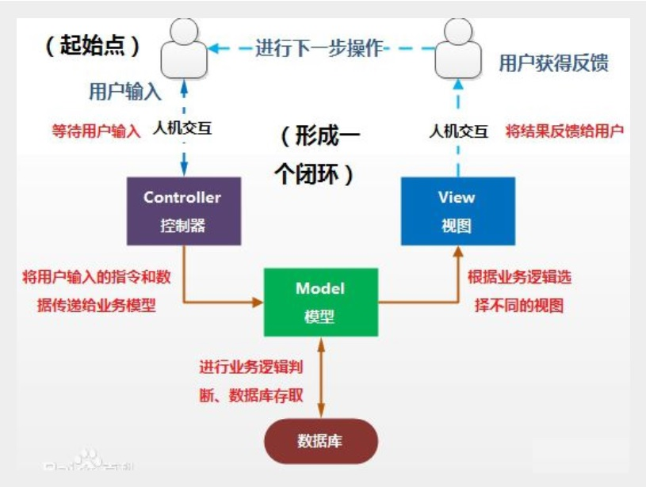
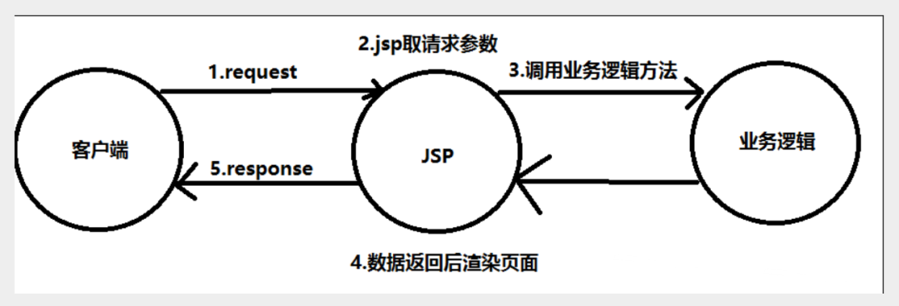
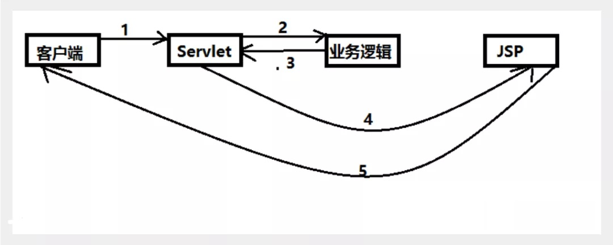
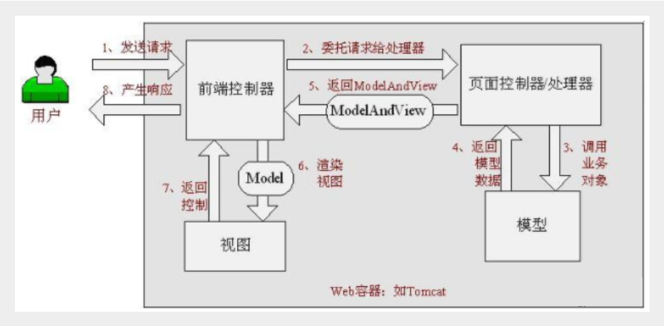
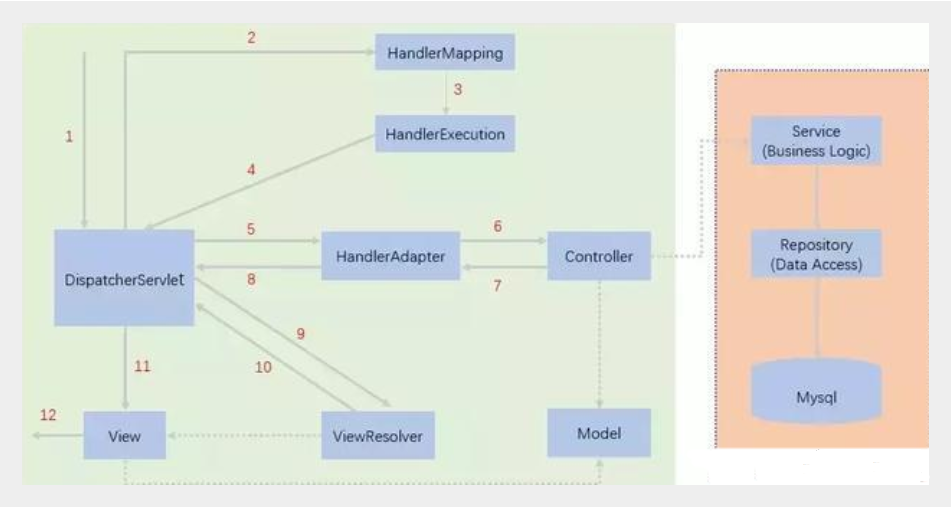

# springMVC

Maven 可能存在资源过滤的问题，所以需要在 pom.xml 文件中添加如下配置

```xml
<build>
   <resources>
       <resource>
           <directory>src/main/java</directory>
           <includes>
               <include>**/*.properties</include>
               <include>**/*.xml</include>
           </includes>
           <filtering>false</filtering>
       </resource>
       <resource>
           <directory>src/main/resources</directory>
           <includes>
               <include>**/*.properties</include>
               <include>**/*.xml</include>
           </includes>
           <filtering>false</filtering>
       </resource>
   </resources>
</build>
```


## 1. 回顾 MVC

### 1.1、什么是 MVC ？

- MVC是模型 (Model)、视图 (View)、控制器 (Controller) 的简写，是一种软件设计规范。
- 是将业务逻辑、数据、显示分离的方法来组织代码。
- MVC 主要作用是**降低了视图与业务逻辑间的双向偶合**。
- MVC 不是一种设计模式，**MVC是一种架构模式**。当然不同的MVC存在差异。

**Model（模型）：**数据模型，提供要展示的数据，因此包含数据和行为，可以认为是领域模型或JavaBean组件（包含数据和行为），不过现在一般都分离开来：Value Object（数据 Dao） 和 服务层（行为 Service）。也就是模型提供了模型数据查询和模型数据的状态更新等功能，包括数据和业务。

**View（视图）：**负责进行模型的展示，一般就是我们见到的用户界面，客户想看到的东西。

**Controller（控制器）：**接收用户请求，委托给模型进行处理（状态改变），处理完毕后把返回的模型数据返回给视图，由视图负责展示。也就是说控制器做了个调度员的工作。

**最典型的 MVC 就是 JSP + servlet + javabean 的模式。**



### 1.2、Model1时代

- 在 web 早期的开发中，通常采用的都是 Model1。
- Model1 中，主要分为两层，视图层和模型层。



Model1 优点：架构简单，比较适合小型项目开发；

Model1 缺点：JSP职责不单一，职责过重，不便于维护；

### 1.3、Model2时代

Model2 把一个项目分成三部分，包括**视图、控制、模型。**



1. 用户发请求
2. Servlet 接收请求数据，并调用对应的业务逻辑方法
3. 业务处理完毕，返回更新后的数据给 servlet
4. servlet 转向到 JSP，由 JSP 来渲染页面
5. 响应给前端更新后的页面

**职责分析：**

**Controller：控制器**

1. 取得表单数据
2. 调用业务逻辑
3. 转向指定的页面

**Model：模型**

1. 业务逻辑
2. 保存数据的状态

**View：视图**

1. 显示页面

Model2 这样不仅提高的代码的复用率与项目的扩展性，且大大降低了项目的维护成本。Model 1 模式的实现比较简单，适用于快速开发小规模项目，Model1 中JSP 页面身兼 View 和 Controller 两种角色，将控制逻辑和表现逻辑混杂在一起，从而导致代码的重用性非常低，增加了应用的扩展性和维护的难度。Model2 消除了 Model1 的缺点。

## 2、什么是SpringMVC

### 2.1、概述

> Spring MVC 是 Spring Framework 的一部分，是基于 Java 实现 MVC 的轻量级 Web 框架。
>
> Spring 的 web 框架围绕 **DispatcherServlet** [ 调度Servlet ] 设计。

#### 2.1.1 SpringMVC 特点：	

1. 轻量级，简单易学
2. 高效 , 基于请求响应的MVC框架
3. 与Spring兼容性好，无缝结合
4. 约定优于配置
5. 功能强大：RESTful、数据验证、格式化、本地化、主题等
6. 简洁灵活

### 2.2、中心控制器

​	Spring 的 web 框架围绕 DispatcherServlet 设计。DispatcherServlet 的作用是将请求分发到不同的处理器。从Spring 2.5 开始，使用Java 5 或者以上版本的用户可以采用基于注解的 controller 声明方式。

​	Spring MVC 框架像许多其他MVC框架一样, **以请求为驱动** , **围绕一个中心 Servlet 分派请求及提供其他功能**，**DispatcherServlet 实际是一个的 Servlet (它继承自HttpServlet 基类)**。


SpringMVC 的原理如下图所示：

​	当发起请求时被前置的控制器拦截到请求，根据请求参数生成代理请求，找到请求对应的实际控制器，控制器处理请求，创建数据模型，访问数据库，将模型响应给中心控制器，控制器使用模型与视图渲染视图结果，将结果返回给中心控制器，再将结果返回给请求者。



### 2.3、SpringMVC执行原理



图为 SpringMVC 的一个较完整的流程图，实线表示 SpringMVC 框架提供的技术，不需要开发者实现，虚线表示需要开发者实现。

**简要分析执行流程**

1. DispatcherServlet 表示前置控制器，是整个 SpringMVC 的控制中心。用户发出请求，DispatcherServlet 接收请求并拦截请求。

    我们假设请求的url为 : http://localhost:8080/SpringMVC/hello

    **如上url拆分成三部分：**

    http://localhost:8080   服务器域名

    **SpringMVC**  部署在服务器上的web站点

    **hello**  表示控制器

    通过分析，如上url表示为：请求位于服务器 localhost:8080 上的 SpringMVC 站点的 hello 控制器。

2. HandlerMapping 为处理器映射。DispatcherServlet 调用 HandlerMapping，HandlerMapping 根据请求 url 查找 Handler。

3. HandlerExecution 表示具体的 Handler，其主要作用是根据 url 查找控制器，如上 url 被查找的控制器为：hello。

4. HandlerExecution 将解析后的信息传递给 DispatcherServlet，如解析控制器映射等。

5. HandlerAdapter 表示处理器适配器，其按照特定的规则去执行Handler。

6. Handler 让具体的 Controller 执行。

7. Controller 将具体的执行信息返回给 HandlerAdapter， 如ModelAndView。

8. HandlerAdapter 将视图逻辑名或模型传递给 DispatcherServlet。

9. DispatcherServlet 调用视图解析器 (ViewResolver) 来解析 HandlerAdapter 传递的逻辑视图名。

10. 视图解析器将解析的逻辑视图名传给 DispatcherServlet。

11. DispatcherServlet 根据视图解析器解析的视图结果，调用具体的视图。

12. 最终视图呈现给用户。

## 3、 SpringMVC 的使用

> 1. 使用springMVC必须配置的三大件：
>     - **处理器映射器、处理器适配器、视图解析器**
> 2. 通常，我们只需要**手动配置视图解析器**，而**处理器映射器**和**处理器适配器**只需要开启**注解驱动**即可，而省去了大段的xml配置
>
> 3. **我们的两个请求都可以指向一个视图，但是页面结果的结果是不一样的，从这里可以看出视图是被复用的，而控制器与视图之间是弱偶合关系。**

### 3.1 控制器 Controller

> - 控制器负责提供访问应用程序的行为，解析用户的请求并将其转换为一个模型
>
> - 在 Spring MVC 中一个控制器类可以包含多个方法
>
> - 在 Spring MVC 中，对于 Controller 的配置方式有很多种，通常通过接口定义或注解定义两种方法实现。
>
> - 常见问题
>
>     1. **访问出现404，排查步骤：**
>
>         - 查看控制台输出，看一下是不是缺少了什么 jar 包。
>
>         - 如果 jar 包存在，显示无法输出，就在 IDEA 的项目发布中，添加 lib 依赖！
>
>         - 重启Tomcat 即可解决

1. 实现 Controller 接口

    - Controller 是一个接口，在org.springframework.web.servlet.mvc包下，接口中只有一个方法；

    - ```java
        //实现该接口的类获得控制器功能
        public interface Controller {
           //处理请求且返回一个模型与视图对象
           ModelAndView handleRequest(HttpServletRequest req, HttpServletResponse resp) throws Exception;
        }
        ```

    - 说明：
        - 实现接口Controller定义控制器是较老的办法
        - 缺点是：一个控制器中只有一个方法，如果要多个方法则需要定义多个 Controller；定义的方式比较麻烦；

2. 使用 @Controller 注解

    - @Controller注解类型用于声明Spring类的实例是一个控制器（ 还有另外3个注解，@Component、@Service、@Repository）

    - Spring 可以使用扫描机制来找到应用程序中所有基于注解的控制器类，为了保证 Spring 能找到控制器，需要在配置文件中声明组件扫描。（springmvc-servlet.xml 文件）

        ```xml
        <context:component-scan base-package="com.kuang.controller"/>
        ```

    - 增加一个ControllerTest2类，使用注解实现

        ```java
        @Controller
        public class ControllerTest2{
        
           //映射访问路径
           @RequestMapping("/t2")
           public String index(Model model){
               //Spring MVC会自动实例化一个 Model 对象用于向视图中传值
               model.addAttribute("msg", "ControllerTest2");
               //返回视图位置
               return "test";
          }
        
        }
        ```

### 3.2 RequestMapping

@RequestMapping 注解：

- @RequestMapping 注解用于映射 url 到控制器类或一个特定的处理程序方法。可用于类或方法上。用于类上，表示类中的所有响应请求的方法都是以该地址作为父路径。

- 只注解在方法上面 （访问路径：http://localhost:8080 / 项目名 / h1）

    ```java
    @Controller
    public class TestController {
       @RequestMapping("/h1")
       public String test(){
           return "test";
      }
    }
    ```

- 同时注解类与方法（访问路径：http://localhost:8080 / 项目名/ admin /h1  , 需要先指定类的路径再指定方法的路径；）

    ```java
    @Controller
    @RequestMapping("/admin")
    public class TestController {
       @RequestMapping("/h1")
       public String test(){
           return "test";
      }
    }
    ```

- **注意：建议不在类上写 @RequestMapping 注解，需要多级目录直接改 方法 返回的字符串即可，如 return "/admin/h1"**，因为，当代码量长的时候，很容易忽略了类上的路径
- RequestMapping 不指定 RequestMethod 时，默认接受所有请求

### 3.3 使用 xml 配置流程（不常用）

1. 新建一个Moudle ， springmvc-02-hello ， 添加web的支持！

2. 确定导入了SpringMVC 的依赖！

3. 配置web.xml  ， 注册DispatcherServlet

    ```xml
    <?xml version="1.0" encoding="UTF-8"?>
    <web-app xmlns="http://xmlns.jcp.org/xml/ns/javaee"
             xmlns:xsi="http://www.w3.org/2001/XMLSchema-instance"
             xsi:schemaLocation="http://xmlns.jcp.org/xml/ns/javaee http://xmlns.jcp.org/xml/ns/javaee/web-app_4_0.xsd"
             version="4.0">
        <!--配置 DispatcherServlet：这个是 springMVC 的核心；也可称为请求分发器、前端控制器-->
        <servlet>
            <!--注册 DispatcherServlet-->
            <servlet-name>springmvc</servlet-name>
            <servlet-class>org.springframework.web.servlet.DispatcherServlet</servlet-class>
            <!--关联一个 springmvc 的配置文件。 命名格式：【当前 servlet 的名字】-servlet.xml -->
            <init-param>
                <param-name>contextConfigLocation</param-name>
                <param-value>classpath:springmvc-servlet.xml</param-value>
            </init-param>
            <!--设置启动级别，因为需要此 servlet 尽早启动处理请求 。启动顺序，数字越小，启动越早-->
            <load-on-startup>1</load-on-startup>
        </servlet>
        <!--  / 匹配所有的请求（不包含 .jsp），一般用这个-->
        <!--  /* 匹配所有的请求（包含 .jsp）-->
        <servlet-mapping>
            <servlet-name>springmvc</servlet-name>
            <url-pattern>/</url-pattern>
        </servlet-mapping>
    </web-app>
    ```

4. 编写SpringMVC 的 配置文件。命名格式（习惯）：springmvc-servlet.xml  : [servletname]-servlet.xml

    ```xml
    <?xml version="1.0" encoding="UTF-8"?>
    <beans xmlns="http://www.springframework.org/schema/beans"
           xmlns:xsi="http://www.w3.org/2001/XMLSchema-instance"
           xsi:schemaLocation="http://www.springframework.org/schema/beans
           http://www.springframework.org/schema/beans/spring-beans.xsd">
        <!--配置处理器映射器-->
        <bean class="org.springframework.web.servlet.handler.BeanNameUrlHandlerMapping"></bean>
        <!--配置处理器适配器-->
        <bean class="org.springframework.web.servlet.mvc.SimpleControllerHandlerAdapter"></bean>
        <!--配置视图解析器
             传给 DispatcherServlet 的 ModelAndView 都会经过该视图解析器
            此解析器做的事:
                    1. 获取了 ModelAndView 的数据
                    2. 解析 ModelAndView 视图的名字
                    3. 拼接视图的名字，找到对应的视图 /WEB-INF/jsp/hello.jsp
                    4. 将数据渲染到这个视图上
        -->
        <bean id="InternalResourceViewResolver" class="org.springframework.web.servlet.view.InternalResourceViewResolver">
            <!--前缀-->
            <property name="prefix" value="/WEB-INF/jsp/"></property>
            <!--后缀-->
            <property name="suffix" value=".jsp"></property>
        </bean>
        <!--Handler-->
        <bean id="/hello" class="com.yato.controller.HelloController"></bean>
    </beans>
    ```

5. 添加 处理映射器

6. 添加 处理器适配器

7. 添加 视图解析器

8. 编写我们要操作业务的 Controller ，要么实现 Controller 接口，要么增加注解；需要返回一个 ModelAndView，装数据，封视图；

    ```java
    package com.yato.controller;
    
    import org.springframework.web.servlet.ModelAndView;
    import org.springframework.web.servlet.mvc.Controller;
    
    import javax.servlet.http.HttpServletRequest;
    import javax.servlet.http.HttpServletResponse;
    
    public class HelloController implements Controller {
        @Override
        public ModelAndView handleRequest(HttpServletRequest httpServletRequest, HttpServletResponse httpServletResponse) throws Exception {
            ModelAndView mv = new ModelAndView();
            mv.addObject("msg", "hello SpringMVC");
            mv.setViewName("hello");
            return mv;
        }
    }
    ```

9. 将自己的类 （HelloController）交给 SpringIOC 容器，注册 bean （在 springmvc-servlet.xml 文件中）

    ```xml
    <!--Handler-->
    <bean id="/hello" class="com.kuang.controller.HelloController"/>
    ```

10. 编写 /WEB-INF/jsp/hello.jsp 这个文件 （上面配置需要的视图）
11. 配置Tomcat 启动测试

### 3.2 使用注解配置（常用）

1. 新建一个Moudle，springmvc-03-hello-annotation 。添加web支持！

2. 在pom.xml文件引入相关的依赖：主要有Spring框架核心库、Spring MVC、servlet , JSTL等。我们在父依赖中已经引入了

3. 配置 web.xml 文件，注册 DispatcherServlet（和 xml 配置的文件内容完全一样）

    ```xml
    <?xml version="1.0" encoding="UTF-8"?>
    <web-app xmlns="http://xmlns.jcp.org/xml/ns/javaee"
             xmlns:xsi="http://www.w3.org/2001/XMLSchema-instance"
             xsi:schemaLocation="http://xmlns.jcp.org/xml/ns/javaee http://xmlns.jcp.org/xml/ns/javaee/web-app_4_0.xsd"
             version="4.0">
        <!--配置 DispatcherServlet：这个是 springMVC 的核心；也可称为请求分发器、前端控制器-->
        <servlet>
            <!--注册 DispatcherServlet-->
            <servlet-name>springmvc</servlet-name>
            <servlet-class>org.springframework.web.servlet.DispatcherServlet</servlet-class>
            <!--关联一个 springmvc 的配置文件。 命名格式：【当前 servlet 的名字】-servlet.xml -->
            <init-param>
                <param-name>contextConfigLocation</param-name>
                <param-value>classpath:springmvc-servlet.xml</param-value>
            </init-param>
            <!--设置启动级别，因为需要此 servlet 尽早启动处理请求 。启动顺序，数字越小，启动越早-->
            <load-on-startup>1</load-on-startup>
        </servlet>
        <!--  / 匹配所有的请求（不包含 .jsp），一般用这个-->
        <!--  /* 匹配所有的请求（包含 .jsp）-->
        <servlet-mapping>
            <servlet-name>springmvc</servlet-name>
            <url-pattern>/</url-pattern>
        </servlet-mapping>
    </web-app>
    ```

    **/ 和 /\* 的区别：**

    - < url-pattern > / </ url-pattern > 不会匹配到 .jsp， 只针对我们编写的请求；即：.jsp 不会进入 spring 的 DispatcherServlet 类 。
    - < url-pattern > /* </ url-pattern > 会匹配 *.jsp，会出现返回 jsp 视图时再次进入 spring 的DispatcherServlet 类，导致找不到对应的 controller 所以报 404 错。（无限嵌套 .jsp 后缀，直至找不到对应的 controller 而报错）
    - 综上，所以一般是使用 / 
4. **添加Spring MVC配置文件**

    > 在 resource 目录下添加 springmvc-servlet.xml 配置文件，配置的形式与 Spring 容器配置基本类似，为了支持基于注解的IOC，设置了自动扫描包的功能，具体配置信息见下面的代码块：
    >
    > 在视图解析器中我们把所有的视图都存放在 /WEB-INF/ 目录下，这样可以保证视图安全，因为这个目录下的文件，客户端不能直接访问。

    ```xml
    <?xml version="1.0" encoding="UTF-8"?>
    <beans xmlns="http://www.springframework.org/schema/beans"
           xmlns:xsi="http://www.w3.org/2001/XMLSchema-instance"
           xmlns:mvc="http://www.springframework.org/schema/mvc"
           xmlns:context="http://www.springframework.org/schema/context"
           xsi:schemaLocation="
            http://www.springframework.org/schema/beans
            https://www.springframework.org/schema/beans/spring-beans.xsd
            http://www.springframework.org/schema/mvc
            https://www.springframework.org/schema/mvc/spring-mvc.xsd
            http://www.springframework.org/schema/context
            https://www.springframework.org/schema/context/spring-context.xsd">
        <!--自动扫描包，让指定包下的注解生效，并由 ioc 容器统一管理-->
        <context:component-scan base-package="com.yato.controller" />
        <!--让 Spring MVC 不处理静态资源，例如 .css .js .html .mp3 .mp4 等-->
        <mvc:default-servlet-handler />
        <!--让 springMVC 支持 mvc 注解驱动
            1. 在 spring 中，一般采用 @RequestMapping 注解来完成映射关系
            2. 要想使 @RequestMapping 注解生效，必须注册 DefaultAnnotationHandlerMapping
                和 AnnotationMethodHandlerAdapter 实例
            3. 2中的两个实例分别在类级别和方法级别处理
            4. mvc:annotation-driven 的配置，帮助我们自动完成上述两个实例的注入
        -->
        <mvc:annotation-driven/>
        <!--视配置图解析器
             传给 DispatcherServlet 的 ModelAndView 都会经过该视图解析器
            此解析器做的事:
                    1. 获取了 ModelAndView 的数据
                    2. 解析 ModelAndView 视图的名字
                    3. 拼接视图的名字，找到对应的视图 /WEB-INF/jsp/hello.jsp
                    4. 将数据渲染到这个视图上
        -->
        <bean id="InternalResourceViewResolver" class="org.springframework.web.servlet.view.InternalResourceViewResolver">
            <property name="prefix" value="/WEB-INF/jsp/"></property>
            <property name="suffix" value=".jsp"></property>
        </bean>
    </beans>
    ```

5. **创建Controller**

    1. @Controller 注解

        -  作用：
            - 说明此类是一个 控制器，此类会被 spring 接管。为了让 Spring IOC容器初始化时自动扫描到；
            - 被这个注解过的类，类中的所有方法，如果返回值是 String 并且在具体页面可以跳转，那么就会被视图解析器解析

    2. @RequestMapping 注解

        - 作用：为了映射请求路径，这里因为类与方法上都有映射所以访问时应该是/HelloController/hello；

        - path（value）属性：所请求控制器的映射路径
        - 如果类上也使用了此注解，在访问类中方法声明的路径时，要加上类注解指定的路径作为父目录
        - 例子解释：如3中，hello1()，访问时，如果类上没有使用此注解，需要访问 http://localhost:8080/SpringMVC/a1 ; 如果使用了此注解，需要访问 http://localhost:8080/SpringMVC/hello/a1

    3. 方法中声明 Model 类型的参数是为了把 Action 中的数据带到视图中

    4. 方法返回的结果是视图的名称 hello，加上配置文件中的前后缀变成 WEB-INF/jsp/**hello**.jsp。

    5. 举例

        ```java
        package com.yato.controller;
        
        import org.springframework.stereotype.Controller;
        import org.springframework.ui.Model;
        import org.springframework.web.bind.annotation.RequestMapping;
        
        @Controller
        @RequestMapping("/hello")
        public class HelloController{
            @RequestMapping("/a1")
            public String hello1(Model model){
                model.addAttribute("msg", "a1");
                return "hello";
            }
            @RequestMapping("/a2")
            public String hello2(Model model){
                model.addAttribute("msg", "a2");
                return "hello";
            }
            @RequestMapping("/a3")
            public String hello3(Model model){
                model.addAttribute("msg", "a3");
                return "hello";
            }
        }
        ```
    
6. **创建视图层**

    - 视图可以直接取出并展示从Controller带回的信息；

7. **配置Tomcat运行**

## 4、数据处理及结果跳转处理

### 4.1、结果跳转处理

1. ModelAndView

    > 设置 ModelAndView 对象 , 根据 view 的名称 , 和视图解析器跳到指定的页面 

    - 页面 : {视图解析器前缀} + viewName +{视图解析器后缀}

    - 视图解析器的配置

        ```xml
        <bean class="org.springframework.web.servlet.view.InternalResourceViewResolver"
             id="internalResourceViewResolver">
           <!-- 前缀 -->
           <property name="prefix" value="/WEB-INF/jsp/" />
           <!-- 后缀 -->
           <property name="suffix" value=".jsp" />
        </bean>
        ```

    - 对应的controller类（此类拼好后的页面地址：/WEB-INF/jsp/test.jsp）

        ```java
        public class ControllerTest1 implements Controller {
           public ModelAndView handleRequest(HttpServletRequest httpServletRequest, HttpServletResponse httpServletResponse) throws Exception {
               //返回一个模型视图对象
               ModelAndView mv = new ModelAndView();
               mv.addObject("msg","ControllerTest1");
               mv.setViewName("test");
               return mv;
          }
        }
        ```

2. ServletAPI

    > 通过设置 ServletAPI , 不需要视图解析器 。

    - 通过 HttpServletResponse 进行输出

    - 通过 HttpServletResponse 实现重定向

    - 通过 HttpServletRequest 实现转发

    - 对应的 Controller 类

        ```java
        @Controller
        public class ResultGo {
        
           @RequestMapping("/result/t1")
           public void test1(HttpServletRequest req, HttpServletResponse rsp) throws IOException {
               rsp.getWriter().println("Hello,Spring BY servlet API");
          }
        
           @RequestMapping("/result/t2")
           public void test2(HttpServletRequest req, HttpServletResponse rsp) throws IOException {
               rsp.sendRedirect("/index.jsp");
          }
        
           @RequestMapping("/result/t3")
           public void test3(HttpServletRequest req, HttpServletResponse rsp) throws Exception {
               //转发
               req.setAttribute("msg","/result/t3");
               req.getRequestDispatcher("/WEB-INF/jsp/test.jsp").forward(req,rsp);
          }
        }
        ```

        

3. SpringMVC（不配置视图解析器）

    > 通过 SpringMVC 来实现转发和重定向（此时没有配置视图解析器的情况）

    请求转发：

    - 返回值：对应的路径（此路径是完整路径）
    - 返回值：forward:/WEB-INF/jsp/hello.jsp
    - 注意：**forward:/WEB-INF 中，冒号和斜杠之间不能有空格，否则会找不到资源，而报错**

    请求重定向：

    - 返回值：redirect:/index.jsp 或者 redirect:http://www.baidu.com

    - 注意：

        - redirect:/index.jsp 中 / 表示 web 目录下，此时会请求 web 目录下的 index.jsp （首页）
        - redirect:index.jsp 此时会请求到 本 Controller 指定目录（类注解 @RequestMapping）下的 index.jsp，如果没有类注解，会请求到工程名路径下的 index.jsp
        - **冒号和斜杠之间不能有空格，否则会找不到资源**；
        - 请求重定向可以访问本服务器之外的地址（毕竟重定向是浏览器重新发了请求），请求转发只能访问本服务器之内的地址。
        - 请求重定向不能访问 WEB-INF 目录下的任何资源（因为 web-inf 目录是浏览器是隐藏的，只能服务器自己访问），而请求转发可以访问 WEB-INF 目录下的所有资源。

        ```java
        @Controller
        public class ResultSpringMVC {
           @RequestMapping("/rsm/t1")
           public String test1(){
               //转发
               return "/WEB-INF/jsp/hello.jsp";
          }
           @RequestMapping("/rsm/t2")
           public String test2(){
               //转发二
               return "forward:/index.jsp";
          }
           @RequestMapping("/rsm/t3")
           public String test3(){
               //重定向
               return "redirect:/index.jsp";
          }
        }
        ```

        

4. SpringMVC （有视图解析器）

    > 当映射的返回值写了 forward: 或者 redirect: 时，就不会经过视图解析器了，所以注意路径问题
    >
    > 可以实现重定向到另外一个请求
    >
    > 其余细节见上面 SpringMVC（无视图解析器）的注意点
    >
    > 有视图解析器时，请求转发会经过视图解析器的拼接，而重定向就不会经过视图解析器。

    ```java
    @Controller
    public class ResultSpringMVC2 {
       @RequestMapping("/rsm2/t1")
       public String test1(){
           //转发，经过了视图解析器的拼接
           return "test";
      }
    
       @RequestMapping("/rsm2/t2")
       public String test2(){
           //重定向
           return "redirect:/index.jsp";
           //return "redirect:hello.do"; //hello.do为另一个请求/
      }
    }
    ```

### 4.2、数据处理

#### 4.2.1、处理提交数据

1. 提交的域名称和处理方法的参数名一致

    - 提交数据 : http://localhost:8080/d1/a?name=yato

    - 处理方法 ：此时，形参 name 用不用 @RequestParam("name") 注解都能获取到值

        ```java
        @RequestMapping("/a")
        public String d1(String name){
            System.out.println(name);
            return "hello";
        }
        ```

    - 后台输出：yato

2. 提交的域名称和处理方法的参数名不一致

    - 提交数据: http://localhost:8080/d1/a?username=yato

    - 处理方法：此时，必须使用 @RequestParam("username") 注解，注明请求的哪个参数（这里是 username 参数）变量注入到 name 形参中

        ```java
        @RequestMapping("/b")
            public String d2(@RequestParam("username") String name){
                System.out.println(name);
                return "hello";
            }
        ```

    - 后台输出：yato

3. 提交的是一个对象

    - 要求：提交的表单域和对象的属性名一致  , 参数使用对象即可

    - 实体类：

        ```java
        public class User {
           private int id;
           private String name;
           private int age;
           //构造
           //getter / setter
           //tostring()
        ```

    - 提交数据：http://localhost:8080/d1/c?username=yato&age=12&id=1

    - 处理方法：注意，请求参数名和对象属性名一致的，可以注入上值，不一致（或者不存在）的值为 null

        ```java
        @GetMapping("/c")
        public String d3(User user){
            System.out.println(user);
            return "hello";
        }
        ```

    - 后台输出：User(name=null, age=12, id=1)

#### 4.2.2、数据显示到前端

1. ModelAndView

    - 举例

        ```java
        public class ControllerTest1 implements Controller {
           public ModelAndView handleRequest(HttpServletRequest httpServletRequest, HttpServletResponse httpServletResponse) throws Exception {
               //返回一个模型视图对象
               ModelAndView mv = new ModelAndView();
               mv.addObject("msg","ControllerTest1");
               mv.setViewName("test");
               return mv;
          }
        }
        ```

2. ModelMap

    - 举例

        ```java
        @RequestMapping("/hello")
        public String hello(@RequestParam("username") String name, ModelMap model){
           //封装要显示到视图中的数据
           //相当于req.setAttribute("name",name);
           model.addAttribute("name",name);
           System.out.println(name);
           return "hello";
        }
        ```

3. Model

    - 举例

        ```java
        @RequestMapping("/ct2/hello")
        public String hello(@RequestParam("username") String name, Model model){
           //封装要显示到视图中的数据
           //相当于req.setAttribute("name",name);
           model.addAttribute("msg",name);
           System.out.println(name);
           return "test";
        }
        ```

4. 上面三种方式的对比
    1. 简单来说
        - Model 只有寥寥几个方法只适合用于储存数据，简化了新手对于 Model 对象的操作和理解
        - ModelMap 继承了 LinkedMap，除了实现了自身的一些方法，同样的继承 LinkedMap 的方法和特性
        - ModelAndView 可以在储存数据的同时，可以进行设置返回的逻辑视图，进行控制展示层的跳转。
    2. 更深层次的，以后开发考虑的更多的是性能和优化，就不能单单仅限于此的了解。（具体百度）

#### 4.2.3、乱码处理

## 4、RestFul 风格介绍

### 4.1、概念

Restful就是一个资源定位及资源操作的风格。不是标准也不是协议，只是一种风格。基于这个风格设计的软件可以更简洁，更有层次，更易于实现缓存等机制。

### 4.2、功能

- 资源：互联网所有的事物都可以被抽象为资源

- 资源操作：使用POST、DELETE、PUT、GET，分别对应 添加、 删除、修改、查询。使用不同方法对资源进行操作。


### 4.3、传统方式操作资源 

> 通过不同的参数来实现不同的效果！方法单一，post 和 get
>
> **（貌似也可以通过相同请求地址，更具请求方式的不同，产生不同的效果）**

​	http://127.0.0.1/item/queryItem.action?id=1    查询,GET

​	http://127.0.0.1/item/saveItem.action                新增,POST

​	http://127.0.0.1/item/updateItem.action           更新,POST

​	http://127.0.0.1/item/deleteItem.action?id=1   删除,GET或POST

### 4.4 使用 RESTful 操作资源

> 可以通过不同的请求方式来实现不同的效果！如下：请求地址一样，但是功能可以不同！

​	http://127.0.0.1/item/1   查询,GET

​	http://127.0.0.1/item      新增,POST

​	http://127.0.0.1/item      更新,PUT

​	http://127.0.0.1/item/1   删除,DELETE

### 4.5举例

注意形参列表的顺序，请求的写法和注解的不同（涵盖了很多的写法，可以互换的）

注意：

1. RestFul 风格，注解使用的路径变量要用 {} 包起来，并且变量名对应的路径变量名要一致，否则找不到资源

2. 不使用 RestFul 风格的函数的参数 a, b 是从请求中传过来的，要和请求中的变量名一致

3. 在Spring MVC中可以使用  @PathVariable 注解，让方法参数的值对应绑定到一个 URI 模板变量上。

4. 使用路径变量的好处：

    - 使路径变得更加简洁；
    - 获得参数更加方便，框架会自动进行类型转换。
    - 通过路径变量的类型可以约束访问参数，如果类型不一样，则访问不到对应的请求方法，如这里访问是的路径是/commit/1/a，则路径与方法不匹配，而不会是参数转换失败。

5. 方法级别的注解变体有如下几个

    - 组合注解：@GetMapping、@PostMapping、@PutMapping、@DeleteMapping、@PatchMapping

    - 解释：@GetMapping 是一个组合注解，平时使用的会比较多！它所扮演的是 `@RequestMapping(method =RequestMethod.GET)` 的一个快捷方式。

6. 扩展：小黄鸭调试法（橡皮鸭调试法）：它是软件工程中最常使用调试方法之一。

    > 此概念据说来自《程序员修炼之道》书中的一个故事，传说程序大师随身携带一只小黄鸭，在调试代码的时候会在桌上放上这只小黄鸭，然后详细地向鸭子解释每行代码，然后很快就将问题定位修复了。

6. 代码举例

    ```java
    package com.yato.controller;
    
    import org.springframework.stereotype.Controller;
    import org.springframework.ui.Model;
    import org.springframework.web.bind.annotation.*;
    
    @Controller
    public class RestFulController {
        @RequestMapping(value = "/hello", method = RequestMethod.POST)
        public String notRestFul1(Model model, int a, int b){
            int ret = a + b;
            model.addAttribute("msg", "notRestFul-POST：" + ret);
            return "hello";
        }
        @GetMapping(value = "/hello")
        public String notRestFul2(int a, int b, Model model){
            int ret = a + b;
            model.addAttribute("msg", "notRestFul-GET：" + ret);
            return "hello";
        }
        @RequestMapping(value = "/hello/{a}/{b}", method = {RequestMethod.GET})
        public String RestFul1(Model model, @PathVariable int a, @PathVariable int b){
            int ret = a + b;
            model.addAttribute("msg", "restFul1-GET " + ret);
            return "hello";
        }
        @PostMapping(value = "/hello/{a}/{b}")
        
        public String RestFul2(@PathVariable int a, @PathVariable int b, Model model){
            int ret = a + b;
            model.addAttribute("msg", "restFul1-POST " + ret);
            return "hello";
        }
    }
    
    ```

    


