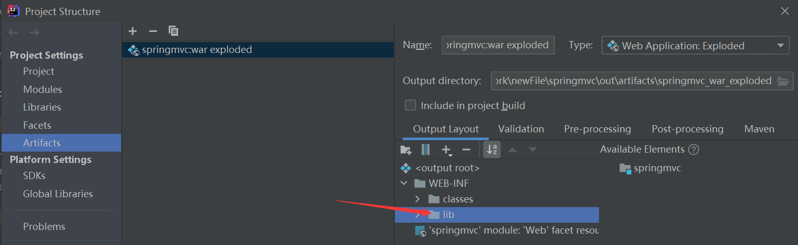
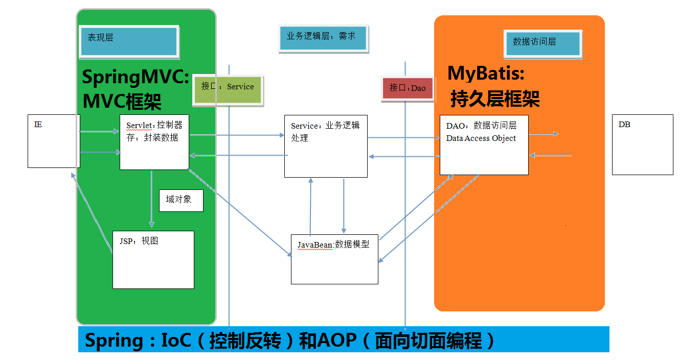
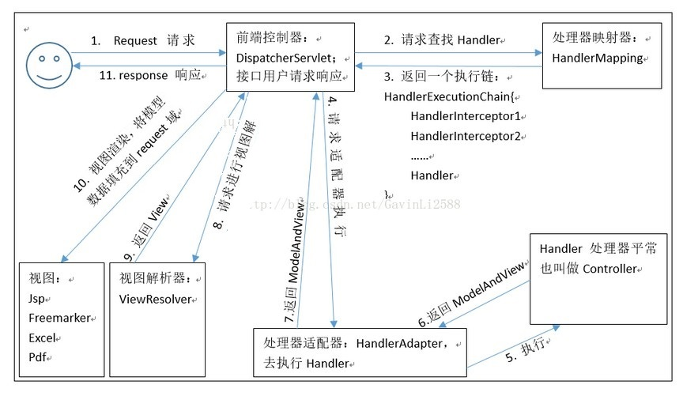
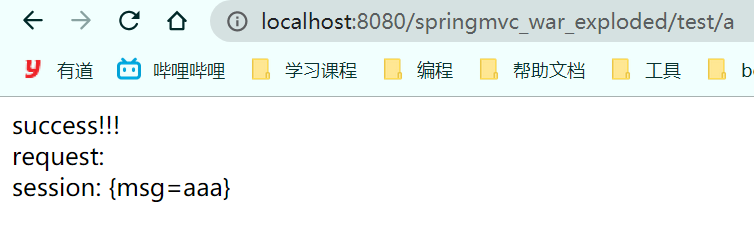
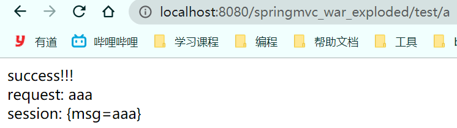
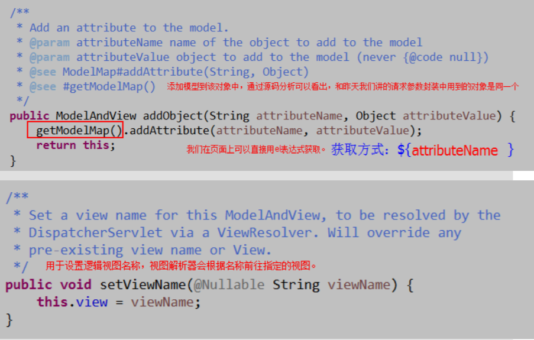

# springMVC

- Maven 可能存在资源过滤的问题，所以需要在 pom.xml 文件中添加如下配置

    ```xml
    <build>
       <resources>
           <resource>
               <directory>src/main/java</directory>
               <includes>
                   <include>**/*.properties</include>
                   <include>**/*.xml</include>
               </includes>
               <filtering>false</filtering>
           </resource>
           <resource>
               <directory>src/main/resources</directory>
               <includes>
                   <include>**/*.properties</include>
                   <include>**/*.xml</include>
               </includes>
               <filtering>false</filtering>
           </resource>
       </resources>
    </build>
    ```

- 需要添加 lib 文件，加入对应的依赖，使 tomcat 能找到 依赖；否则部署到服务器，由于 tomcat 找不到依赖而有可能会产生 404 错误

    

- 需要的依赖坐标

    ```xml
    <dependencies>
            <dependency>
                <groupId>org.springframework</groupId>
                <artifactId>spring-webmvc</artifactId>
                <version>5.1.9.RELEASE</version>
            </dependency>
            <dependency>
                <groupId>javax.servlet</groupId>
                <artifactId>servlet-api</artifactId>
                <version>2.5</version>
            </dependency>
            <dependency>
                <groupId>javax.servlet.jsp</groupId>
                <artifactId>jsp-api</artifactId>
                <version>2.2</version>
            </dependency>
    </dependencies>
    ```

    

# 一、SpringMVC 的基本概念 

## 1、三层架构

> 我们的开发架构一般都是基于两种形式，一种是 C/S 架构，也就是客户端/服务器，另一种是 B/S 架构，也就是浏览器服务器。在 JavaEE 开发中，几乎全都是基于 B/S 架构的开发。那么在 B/S 架构中，系统标准的三层架构包括：表现层、业务层、持久层。

## 2、三层架构各层处理的问题

1. 表现层
    - 也就是我们常说的 web 层。它负责接收客户端请求，向客户端响应结果，通常客户端使用 http 协议请求 web 层，web 需要接收 http 请求，完成 http 响应。
    - 表现层包括展示层和控制层：控制层负责接收请求，展示层负责结果的展示。
    - 表现层依赖**业务层**，接收到客户端请求一般会调用业务层进行业务处理，并将处理结果响应给客户端。
    - 表现层的设计一般都使用 MVC 模型。（MVC 是表现层的设计模型，和其他层没有关系）
2. 业务层
    - 也就是我们常说的 service 层。它负责业务逻辑处理，和我们开发项目的需求息息相关。web 层依赖业务层，但是业务层不依赖 web 层。
    - 业务层在业务处理时可能会依赖持久层，如果要对数据持久化需要保证事务一致性。（也就是我们说的， 事务应该放到业务层来控制）
3. 持久层
    - 也就是我们是常说的 dao（mapper） 层。负责数据持久化，包括数据层即数据库和数据访问层，数据库是对数据进行持久化的载体，数据访问层是业务层和持久层交互的接口，业务层需要通过数据访问层将数据持久化到数据库中。通俗的讲，持久层就是和数据库交互，对数据库表进行增删改查的。

## 3、MVC模型

> MVC 全名是 Model View Controller，是模型 (model)－视图 (view)－控制器 (controller) 的缩写， 是一种用于设计创建 Web 应用程序表现层的模式，是一种软件设计规范。MVC 中每个部分各司其职。

1. Model（模型）：
    - 通常指的就是我们的数据模型，提供要展示的数据。现在一般都分离开来：Value Object（数据 Dao） 和 服务层（行为 Service）。也就是模型提供了模型数据查询和模型数据的状态更新等功能，包括数据和业务。
    - 作用：一般情况下用于封装数据。
2. View（视图）：
    - 负责进行模型的展示，通常指的就是我们的 jsp 或者 html。
    - 作用：一般就是展示数据的。 通常视图是依据模型数据创建的。
3. Controller（控制器）： 
    - 接收用户请求，委托给模型进行处理（状态改变），处理完毕后把返回的模型数据返回给视图，由视图负责展示。也就是说控制器做了个调度员的工作。
    - 作用：一般就是处理程序逻辑的

4. MVC 的特点：
    - 采用业务逻辑、数据、显示 分离的方法来组织代码。
    - 可以降低视图与业务逻辑间的双向偶合
    - MVC 不是一种设计模式，**MVC是一种架构模式**。当然不同的 MVC 存在差异

5. 最典型的 MVC ： JSP + servlet + javabean 的模式。


## 4、SpringMVC 概述

1. 什么是 SpringMVC

    > SpringMVC 是一种基于 Java 的实现 MVC 设计模型的请求驱动类型的轻量级 Web 框架，属于 Spring FrameWork 的后续产品，已经融合在 Spring Web Flow 里面。Spring 框架提供了构建 Web 应用程序的全功能 MVC 模块。使用 Spring 可插入的 MVC 架构，从而在使用 Spring 进行 WEB 开发时，可以选择使用 Spring 的 Spring MVC 框架或集成其他 MVC 开发框架，如 Struts1(现在一般不用)，Struts2 等。 
    >
    > SpringMVC 已经成为目前最主流的 MVC 框架之一，并且随着 Spring3.0 的发布，全面超越 Struts2，成为最优秀的 MVC 框架。 
    >
    > 它通过一套注解，让一个简单的 Java 类成为处理请求的控制器，而无须实现任何接口。同时它还支持 RESTful 编程风格的请求。
    >
    > SpringMVC 框架围绕 **DispatcherServlet** [ 调度Servlet ] 设计。

2. SpringMVC 在三层架构的位置

    

3. SpringMVC 的优势

    1. 清晰的角色划分： 
        - 前端控制器（DispatcherServlet） 
        - 请求到处理器映射（HandlerMapping） 
        - 处理器适配器（HandlerAdapter） 
        - 视图解析器（ViewResolver） 
        - 处理器或页面控制器（Controller） 
        - 验证器（ Validator） 
        - 命令对象（Command 请求参数绑定到的对象就叫命令对象） 
        - 表单对象（Form Object 提供给表单展示和提交到的对象就叫表单对象）。 
    2. 分工明确，而且扩展点相当灵活，可以很容易扩展，虽然几乎不需要。 
    3. 由于命令对象就是一个 POJO，无需继承框架特定 API，可以使用命令对象直接作为业务对象。 
    4. 和 Spring 其他框架无缝集成，是其它 Web 框架所不具备的。 
    5. 可适配，通过 HandlerAdapter 可以支持任意的类作为处理器。 
    6. 可定制性，HandlerMapping、ViewResolver 等能够非常简单的定制。 
    7. 功能强大的数据验证、格式化、绑定机制。 
    8. 利用 Spring 提供的 Mock 对象能够非常简单的进行 Web 层单元测试。 
    9. 本地化、主题的解析的支持，使我们更容易进行国际化和主题的切换。 
    10. 强大的 JSP 标签库，使 JSP 编写更容易。 
    11. 还有比如RESTful风格的支持、简单的文件上传、约定大于配置的契约式编程支持、基于注解的零配 置支持等等。

4. SpringMVC 和 Struts2 的优略分析

    1. 共同点： 

        - 它们都是表现层框架，都是基于 MVC 模型编写的。 
        - 它们的底层都离不开原始 ServletAPI。 
        - 它们处理请求的机制都是一个核心控制器。 

    2. 区别： 

        - Spring MVC 的入口是 Servlet, 而 Struts2 是 Filter 

        - Spring MVC 是基于方法设计的，而 Struts2 是基于类，Struts2 每次执行都会创建一个动作类。所以 Spring MVC 会稍微比 Struts2 快些。 

        - Spring MVC 使用更加简洁，同时还支持 JSR303，处理 ajax 的请求更方便

        - Struts2 的 OGNL 表达式使页面的开发效率相比 Spring MVC 更高些，但执行效率并没有比 JSTL 提 升，尤其是 struts2 的表单标签，远没有 html 执行效率高。

            > JSR303 是一套 JavaBean 参数校验的标准，它定义了很多常用的校验注解，我们可以直接将这些注 解加在我们 JavaBean 的属性上面，就可以在需要校验的时候进行校验了。

# 二、 SpringMVC 的入门

## 1、中心控制器

> Spring 的 web 框架围绕 DispatcherServlet 设计。DispatcherServlet 的作用是将请求分发到不同的处理器。从Spring 2.5 开始，使用 Java 5 或者以上版本的用户可以采用基于注解的 controller 声明方式。
>
> ​	Spring MVC 框架像许多其他MVC框架一样, **以请求为驱动** , **围绕一个中心 Servlet 分派请求及提供其他功能**，**DispatcherServlet 实际是一个的 Servlet (它继承自HttpServlet 基类)**。
>


## 2、SpringMVC 执行原理

### 2.1、执行原理图

1. SpringMVC 的原理如下图所示：

    ​	当发起请求时被前置的控制器拦截到请求，根据请求参数生成代理请求，找到请求对应的实际控制器，控制器处理请求，创建数据模型，访问数据库，将模型响应给中心控制器，控制器使用模型与视图渲染视图结果，将结果返回给中心控制器，再将结果返回给请求者。

​	

2. SpringMVC 的一个较完整的流程图，实线表示 SpringMVC 框架提供的技术，不需要开发者实现，虚线表示需要开发者实现。

​		


### 2.2、组件介绍

1. DispatcherServlet：前端控制器
    - 用户请求到达前端控制器，它就相当于 mvc 模式中的 c，dispatcherServlet 是整个流程控制的中心，由 它调用其它组件处理用户的请求，dispatcherServlet 的存在降低了组件之间的耦合性。
2. HandlerMapping：处理器映射器
    - HandlerMapping 负责根据用户请求找到 Handler 即处理器，SpringMVC 提供了不同的映射器实现不同的 映射方式，例如：配置文件方式，实现接口方式，注解方式等。
3. Handler：处理器
    - 它就是我们开发中要编写的具体业务控制器。由 DispatcherServlet 把用户请求转发到 Handler。由 Handler 对具体的用户请求进行处理。
4. HandlAdapter：处理器适配器
    - 通过 HandlerAdapter 对处理器进行执行，这是适配器模式的应用，通过扩展适配器可以对更多类型的处理 器进行执行。
5. View Resolver：视图解析器
    - View Resolver 负责将处理结果生成 View 视图，View Resolver 首先根据逻辑视图名解析成物理视图名 即具体的页面地址，再生成 View 视图对象，最后对 View 进行渲染将处理结果通过页面展示给用户。
6. View：视图
    - SpringMVC 框架提供了很多的 View 视图类型的支持，包括：jstlView、freemarkerView、pdfView 等。我们最常用的视图就是 jsp。 一般情况下需要通过页面标签或页面模版技术将模型数据通过页面展示给用户，需要由程序员根据业务需求开 发具体的页面。

### 2.2、分析执行流程

1. DispatcherServlet 表示前端控制器，是整个 SpringMVC 的控制中心。用户发出请求，DispatcherServlet 接收请求并拦截请求。

    - 我们假设请求的url为 : http://localhost:8080/SpringMVC/hello

    - **如上url拆分成三部分：**
    - http://localhost:8080   服务器域名
        - **SpringMVC**  部署在服务器上的web站点
    - **hello**  表示控制器
    
- 通过分析，如上url表示为：请求位于服务器 localhost:8080 上的 SpringMVC 站点的 hello 控制器。
  
2. HandlerMapping 为处理器映射。DispatcherServlet 调用 HandlerMapping，HandlerMapping 根据请求 url 查找 Handler。

3. HandlerExecution 表示具体的 Handler，其主要作用是根据 url 查找控制器，如上 url 被查找的控制器为：hello。

4. HandlerExecution 将解析后的信息传递给 DispatcherServlet，如解析控制器映射等。

5. HandlerAdapter 表示处理器适配器，其按照特定的规则去执行Handler。

6. Handler 让具体的 Controller 执行。

7. Controller 将具体的执行信息返回给 HandlerAdapter， 如ModelAndView。

8. HandlerAdapter 将视图逻辑名或模型传递给 DispatcherServlet。

9. DispatcherServlet 调用视图解析器 (ViewResolver) 来解析 HandlerAdapter 传递的逻辑视图名。

10. 视图解析器将解析的逻辑视图名传给 DispatcherServlet。

11. DispatcherServlet 根据视图解析器解析的视图结果，调用具体的视图。

12. 最终视图呈现给用户。

## 3、 SpringMVC 的使用

1. 使用springMVC必须配置的三大件：

    - **处理器映射器、处理器适配器、视图解析器**

    - 常用的三大件

        ```xml
        <!-- HandlerMapping -->
        <bean class="org.springframework.web.servlet.mvc.method.annotation.RequestMappingHandlerMapping"></bean>
        <bean class="org.springframework.web.servlet.handler.BeanNameUrlHandlerMapping"></bean>
        <!-- HandlerAdapter -->
        <bean class="org.springframework.web.servlet.mvc.method.annotation.RequestMappingHandlerAdapter"></bean>
        <bean class="org.springframework.web.servlet.mvc.HttpRequestHandlerAdapter"></bean>
        <bean class="org.springframework.web.servlet.mvc.SimpleControllerHandlerAdapter"></bean>
        <!-- HadnlerExceptionResolvers -->
        <bean class="org.springframework.web.servlet.mvc.method.annotation.ExceptionHandlerExceptionResolver"></bean>
        <bean class="org.springframework.web.servlet.mvc.annotation.ResponseStatusExceptionResolver"></bean>
        <bean class="org.springframework.web.servlet.mvc.support.DefaultHandlerExceptionResolver"></bean>
        ```
2. 通常，我们只需要手动配置 视图解析器，而 处理器映射器 和 处理器适配器 只需要开启 注解驱动（`<mvc:annotation-driven/>`） 即可，而省去了大段的 xml 配置

3. 我们的两个请求都可以指向一个视图，但是页面结果的结果是不一样的，从这里可以看出视图是被复用的，而控制器与视图之间是弱偶合关系。

### 3.1 控制器 Controller

> - 控制器负责提供访问应用程序的行为，解析用户的请求并将其转换为一个模型
>
> - 在 Spring MVC 中一个控制器类可以包含多个方法
>
> - 在 Spring MVC 中，对于 Controller 的配置方式有很多种，通常通过接口定义或注解定义两种方法实现。
>

1. 实现 Controller 接口

    - Controller 是一个接口，在 org.springframework.web.servlet.mvc 包下，接口中只有一个方法；

    - ```java
        //实现该接口的类获得控制器功能
        public interface Controller {
           //处理请求且返回一个模型与视图对象
           ModelAndView handleRequest(HttpServletRequest req, HttpServletResponse resp) throws Exception;
        }
        ```

    - 然后需要在 spring 配置文件中，注册 bean，使该控制器被创建到 ioc 容器中，id 属性代表请求路径
      
    - 说明：
      
        - 实现接口Controller定义控制器是较老的办法
        - 缺点是：一个控制器中只有一个方法，如果要多个方法则需要定义多个 Controller；定义的方式比较麻烦；

2. 使用 @Controller 注解

    - 说明此类是一个 控制器（ 还有另外3个注解，@Component、@Service、@Repository），此类会被 spring 接管。为了让 Spring IOC容器初始化时自动扫描到；
    - 被这个注解过的类，类中的所有方法，如果返回值是 String 并且在具体页面可以跳转，那么就会被视图解析器解析

    - Spring 可以使用扫描机制来找到应用程序中所有基于注解的控制器类，为了保证 Spring 能找到控制器，需要在配置文件中声明组件扫描。（springmvc-servlet.xml 文件）

        ```xml
        <context:component-scan base-package="com.kuang.controller"/>
        ```

    - 增加一个ControllerTest2类，使用注解实现

        ```java
        @Controller
        public class ControllerTest2{
           //映射访问路径
           @RequestMapping("/t2")
           public String index(Model model){
               //Spring MVC会自动实例化一个 Model 对象用于向视图中传值
               model.addAttribute("msg", "ControllerTest2");
               //返回视图位置
               return "test";
          }
        }
        ```

### 3.2、@RequestMapping 注解

1. 属性：

    - value：用于指定请求的 URL。它和 path 属性的作用是一样的。 

    - method：用于指定请求的方式。 

    - params：用于指定限制请求参数的条件。它支持简单的表达式。要求请求参数的 key 和 value 必须和 配置的一模一样。

        例如： 

        params = {"accountName"}，表示请求参数必须有 accountName 

        params = {"accountName=abc"}，表示请求参数 accountName 的值 必须是 abc

        params = {"moeny!100"}，表示请求参数中 money 不能是 100。

    - headers：发送的请求中必须包含的请求头。

3. @RequestMapping 注解用于映射 url 到控制器类或一个特定的处理程序方法。可用于类或方法上。用于类上，表示类中的所有响应请求的方法都是以该地址作为父路径。

4. 只注解在方法上面 （访问路径：http://localhost:8080 / 项目名 / h1）

    ```java
    @Controller
    public class TestController {
       @RequestMapping("/h1")
       public String test(){
           return "test";
      }
    }
    ```

5. 同时注解类与方法（访问路径：http://localhost:8080 / 项目名/ admin /h1  , 需要先指定类的路径再指定方法的路径；）

    ```java
    @Controller
    @RequestMapping("/admin")
    public class TestController {
       @RequestMapping("/h1")
       public String test(){
           return "test";
      }
    }
    ```

6. 注意
    - 建议不在类上写 @RequestMapping 注解，需要多级目录直接改 方法 上的 @RequestMapping 注解即可，如 @RequestMapping("/admin/h1")，因为，当代码量长的时候，很容易忽略了类上的路径
    - requestMapping 不指定 RequestMethod 时，默认接受所有请求
    - 前端请求的 ${ pageContext.request.contextPath } 可以省略不写，但是路径上不能写 /，否则会 404 找不到资源

### 3.3、配置流程

2. 导入 SpringMVC 及其他相关的依赖！

2. 配置web.xml，注册DispatcherServlet

    ```xml
    <?xml version="1.0" encoding="UTF-8"?>
    <web-app xmlns="http://xmlns.jcp.org/xml/ns/javaee"
             xmlns:xsi="http://www.w3.org/2001/XMLSchema-instance"
             xsi:schemaLocation="http://xmlns.jcp.org/xml/ns/javaee http://xmlns.jcp.org/xml/ns/javaee/web-app_4_0.xsd"
             version="4.0">
        <!--配置 DispatcherServlet：这个是 springMVC 的核心；也可称为请求分发器、前端控制器-->
        <servlet>
            <!--注册 DispatcherServlet-->
            <servlet-name>springmvc</servlet-name>
            <servlet-class>org.springframework.web.servlet.DispatcherServlet</servlet-class>
            <!--关联一个 springmvc 的配置文件。 命名格式：【当前 servlet 的名字】-servlet.xml -->
            <init-param>
                <param-name>contextConfigLocation</param-name>
                <param-value>classpath:springmvc-servlet.xml</param-value>
            </init-param>
            <!--设置启动级别，因为需要此 servlet 尽早启动处理请求 。启动顺序，数字越小，启动越早-->
            <load-on-startup>1</load-on-startup>
        </servlet>
        <servlet-mapping>
            <servlet-name>springmvc</servlet-name>
            <!--注意这里是 / ，如果 为 /* ，会出问题-->
            <url-pattern>/</url-pattern>
        </servlet-mapping>
        
        <!--配置过滤器处理乱码问题-->
        <filter>
            <filter-name>encoding</filter-name>
            <filter-class>org.springframework.web.filter.CharacterEncodingFilter</filter-class>
            <init-param>
                <param-name>encoding</param-name>
                <param-value>utf-8</param-value>
            </init-param>
        </filter>
        <filter-mapping>
            <filter-name>encoding</filter-name>
            <!--注意这里是 /*，因为 jsp 文件也要处理乱码问题-->
            <url-pattern>/*</url-pattern>
        </filter-mapping>
    </web-app>
    ```

    - **/ 和 /\* 的区别：**

        - < url-pattern > / </ url-pattern > 不会匹配到 .jsp， 只针对我们编写的请求；即：.jsp 不会进入 spring 的 DispatcherServlet 类 。
        - < url-pattern > /* </ url-pattern > 会匹配 *.jsp，会出现返回 jsp 视图时再次进入 spring 的DispatcherServlet 类，导致找不到对应的 controller 所以报 404 错。（无限嵌套 .jsp 后缀，直至找不到对应的 controller 而报错）
        - 综上，所以一般是使用 / 

3. 编写SpringMVC 的 配置文件。命名格式（习惯）：springmvc-servlet.xml  : [servletname]-servlet.xml

    1. xml 配置方式（同时添加 处理映射器、处理器适配器、视图解析器）

        ```java
        <?xml version="1.0" encoding="UTF-8"?>
        <beans xmlns="http://www.springframework.org/schema/beans"
               xmlns:xsi="http://www.w3.org/2001/XMLSchema-instance"
               xsi:schemaLocation="http://www.springframework.org/schema/beans
               http://www.springframework.org/schema/beans/spring-beans.xsd">
        
            <!--配置处理器映射器-->
            <bean class="org.springframework.web.servlet.handler.BeanNameUrlHandlerMapping"></bean>
            <!--配置处理器适配器-->
            <bean class="org.springframework.web.servlet.mvc.SimpleControllerHandlerAdapter"></bean>
            <!--配置视图解析器->
            <bean id="InternalResourceViewResolver" class="org.springframework.web.servlet.view.InternalResourceViewResolver">
                <!--前缀-->
                <property name="prefix" value="/WEB-INF/jsp/"></property>
                <!--后缀-->
                <property name="suffix" value=".jsp"></property>
            </bean>
            <!--配置 Handler->
            <bean id="/hello" class="com.yato.controller.HelloController"></bean>
        </beans>
        ```
        - 视图解析器的作用：传给 DispatcherServlet 的 ModelAndView 都会经过该视图解析器
            - 获取了 ModelAndView 的数据
            - 解析 ModelAndView 视图的名字
            -  拼接视图的名字，找到对应的视图 /WEB-INF/jsp/hello.jsp
            - 将数据渲染到这个视图上
        - 每一个自定义的 controller 都要在这里配置

    2. 注解的配置方式（只需要添加 视图解析器。因为 `<mvc:annotation-driven/>`内部配制了默认的 处理映射器和处理器适配器）

        ```java
        <?xml version="1.0" encoding="UTF-8"?>
        <beans xmlns="http://www.springframework.org/schema/beans"
               xmlns:xsi="http://www.w3.org/2001/XMLSchema-instance"
               xmlns:mvc="http://www.springframework.org/schema/mvc"
               xmlns:context="http://www.springframework.org/schema/context"
               xsi:schemaLocation="
                http://www.springframework.org/schema/beans
                https://www.springframework.org/schema/beans/spring-beans.xsd
                http://www.springframework.org/schema/mvc
                https://www.springframework.org/schema/mvc/spring-mvc.xsd
                http://www.springframework.org/schema/context
                https://www.springframework.org/schema/context/spring-context.xsd">
        
            <!--自动扫描包，让指定包下的注解生效，并由 ioc 容器统一管理-->
            <context:component-scan base-package="com.yato.controller" />
                
            <!--让 Spring MVC 不处理静态资源，例如 .css .js .html .mp3 .mp4 等-->
            <mvc:default-servlet-handler />
                
            <!--让 springMVC 支持 mvc 注解驱动
                1
            -->
            <mvc:annotation-driven/>
                
            <!--视配置图解析器
                 传给 DispatcherServlet 的 ModelAndView 都会经过该视图解析器
                此解析器做的事:
                        1. 获取了 ModelAndView 的数据
                        2. 解析 ModelAndView 视图的名字
                        3. 拼接视图的名字，找到对应的视图 /WEB-INF/jsp/hello.jsp
                        4. 将数据渲染到这个视图上
            -->
            <bean id="InternalResourceViewResolver" class="org.springframework.web.servlet.view.InternalResourceViewResolver">
                <property name="prefix" value="/WEB-INF/jsp/"></property>
                <property name="suffix" value=".jsp"></property>
            </bean>
        </beans>
        ```

        - `<mvc:annotation-driven/>`作用：
            - . 在 spring 中，一般采用 @RequestMapping 注解来完成映射关系
            - 要想使 @RequestMapping 注解生效，必须注册 DefaultAnnotationHandlerMapping            和 AnnotationMethodHandlerAdapter 实例
            - 上述的两个实例分别在类级别和方法级别处理
            - mvc:annotation-driven 的配置，帮助我们自动完成上述两个实例的注入

4. 编写我们要操作业务的 Controller ，要么实现 Controller 接口，要么增加注解；

    1. 实现接口（需要在 spring 配置文件中 使用 bean 把此对象添加到 ioc 容器中）

        - 需要返回一个 ModelAndView，装数据，封视图；

        - 将自己的类 （HelloController）交给 SpringIOC 容器，注册 bean （在 springmvc-servlet.xml 文件中）

            ```xml
            <bean id="/hello" class="com.kuang.controller.HelloController"/>
            ```

        - ```java
            package com.yato.controller;
            
            import org.springframework.web.servlet.ModelAndView;
            import org.springframework.web.servlet.mvc.Controller;
            
            import javax.servlet.http.HttpServletRequest;
            import javax.servlet.http.HttpServletResponse;
            
            public class HelloController implements Controller {
                @Override
                public ModelAndView handleRequest(HttpServletRequest httpServletRequest, HttpServletResponse httpServletResponse) throws Exception {
                    ModelAndView mv = new ModelAndView();
                    mv.addObject("msg", "hello SpringMVC");
                    mv.setViewName("hello");
                    return mv;
                }
            }
            ```

    2. 使用注解

        ```java
        package com.yato.controller;
        
        import org.springframework.stereotype.Controller;
        import org.springframework.ui.Model;
        import org.springframework.web.bind.annotation.RequestMapping;
        
        @Controller
        @RequestMapping("/hello")
        public class HelloController{
            @RequestMapping("/a1")
            public String hello1(Model model){
                model.addAttribute("msg", "a1");
                return "hello";
            }
            @RequestMapping("/a2")
            public String hello2(Model model){
                model.addAttribute("msg", "a2");
                return "hello";
            }
            @RequestMapping("/a3")
            public String hello3(Model model){
                model.addAttribute("msg", "a3");
                return "hello";
            }
        }
        ```

        - 方法中声明 Model 类型的参数是为了把 Action 中的数据带到视图中
        - 方法返回的结果是视图的名称 hello，加上配置文件中的前后缀变成 WEB-INF/jsp/**hello**.jsp。

5. 编写 /WEB-INF/jsp/hello.jsp 这个文件 （上面配置需要的视图）

6. 配置Tomcat 启动测试

# 三、请求参数的绑定

## 1、绑定说明

1. 绑定的机制

    - 我们都知道，表单中请求参数都是基于 key=value 的。 SpringMVC 绑定请求参数的过程是通过把表单提交请求参数，作为控制器中方法参数进行绑定的。
    - 要求：提交表单的 name 和参数的名称是相同的
    - 明确：SpringMVC 绑定请求参数是自动实现的，但是要想使用，必须遵循使用要求。

2. 支持的数据类型和使用要求

    1. 基本类型参数：

        1. 包括基本数据类型和 String

        2. 要求：参数名称必须和控制器中方法的形参名称保持一致。(严格区分大小写)

        3. 举例

            - jsp 代码：

                ```xml
                <a href="account/findAccount?accountId=10&accountName=zhangsan">查询账户</a>
                ```

            - 控制器代码:

                ```java
                @RequestMapping("/findAccount")
                public String findAccount(Integer accountId,String accountName) {
                    System.out.println("查询了账户。。。。"+accountId+","+accountName);
                	return "success";
                }
                ```

            - 参数名要一致，否则，形参会绑定不上值，可以使用 @RequestParam 注解注明不一致的名称，@RequestParam 注解详情见下面的常用注解

    2. pojo 类型参数：

        1. 包括实体类以及它所关联的实体类

        2. 要求表单中参数名称和 POJO 类的属性名称保持一致。并且控制器方法的参数类型是 POJO 类型。

        3. 举例

            - 实体类代码

                ```java
                public class Account implements Serializable {
                    private Integer id;
                    private String name;
                    private Float money;
                    private Address address;
                    //getters and setters
                }
                
                public class Address implements Serializable {
                    private String provinceName;
                    private String cityName;
                    //getters and setters
                }
                ```

            - jsp 代码

                ```jsp
                <form action="account/saveAccount" method="post">
                    账户名称：<input type="text" name="name" ><br/>
                    账户金额：<input type="text" name="money" ><br/>
                    账户省份：<input type="text" name="address.provinceName" ><br/>
                    账户城市：<input type="text" name="address.cityName" ><br/>
                    <input type="submit" value="保存">
                </form>
                ```

            - 控制器代码

                ```java
                @RequestMapping("/saveAccount")
                public String saveAccount(Account account) {
                    System.out.println("保存了账户。。。。"+account);
                    return "success";
                }
                ```

            - 实体类中的引用属性，需要以 `引用名.属性名`的方式绑定参数

    3. 数据和集合类型参数：

        1. 包括 list 结构和 map 结构的集合（包括数组）

        2. 要求集合类型的请求参数必须在 POJO 中。在表单中请求参数名称要和 POJO 中集合属性名称相同。

            - 给 List 集合中的元素赋值，使用下标。 
            - 给 Map 集合中的元素赋值，使用键值对。

        3. 接收的请求参数是  json 格式数据。需要借助一个注解实现。

        4. 举例

            - 实体类代码

                ```java
                public class User implements Serializable {
                    private String username;
                    private String password;
                    private Integer age;
                    private List<Account> accounts;
                    private Map<String,Account> accountMap;
                    //getters and setters
                    //toString
                }
                ```

            - jsp 代码：

                ```jsp
                <form action="account/updateAccount" method="post">
                    用户名称：<input type="text" name="username" ><br/>
                    用户密码：<input type="password" name="password" ><br/>
                    用户年龄：<input type="text" name="age" ><br/>
                    账户 1 名称：<input type="text" name="accounts[0].name" ><br/>
                    账户 1 金额：<input type="text" name="accounts[0].money" ><br/>
                    账户 2 名称：<input type="text" name="accounts[1].name" ><br/>
                    账户 2 金额：<input type="text" name="accounts[1].money" ><br/>
                    账户 3 名称：<input type="text" name="accountMap['one'].name" ><br/>
                    账户 3 金额：<input type="text" name="accountMap['one'].money" ><br/>
                    账户 4 名称：<input type="text" name="accountMap['two'].name" ><br/>
                    账户 4 金额：<input type="text" name="accountMap['two'].money" ><br/>
                    <input type="submit" value="保存">
                </form>
                ```

            - list  的绑定，需要指出索引；map 的绑定需要指出键

## 2、请求参数中文乱码的解决

1. 在 web.xml 中配置 Spring 提供的过滤器类

    ```xml
    <filter>
        <filter-name>characterEncodingFilter</filter-name>
        <filter-class>org.springframework.web.filter.CharacterEncodingFilter</filter-class>
        <!-- 指定字符集 -->
        <init-param>
            <param-name>encoding</param-name>
            <param-value>UTF-8</param-value>
        </init-param>
    </filter>
    <filter-mapping>
        <filter-name>characterEncodingFilter</filter-name>
        <url-pattern>/*</url-pattern>
    </filter-mapping>
    ```

2. tomacat 对 GET 和 POST 请求处理方式是不同的，GET 请求的编码问题，要改 tomcat 的 server.xml 配置文件，如下：

    ```xml
    <Connector connectionTimeout="20000" port="8080"
    protocol="HTTP/1.1" redirectPort="8443"/>
    ```

    改为： 

    ```xml
    <Connector connectionTimeout="20000" port="8080"
    protocol="HTTP/1.1" redirectPort="8443"
    useBodyEncodingForURI="true"/>
    ```

    如果遇到 ajax 请求仍然乱码，把 `useBodyEncodingForURI="true"`改为 `URIEncoding="UTF-8" `即可。

## 3、自定义类型转换器

> 表单提交的任何数据类型全部都是字符串类型，但是后台定义 Integer 类型，数据也可以封装上，说明 Spring框架内部会默认进行数据类型转换。

1. Converter 接口，该接口有两个泛型，S 表示接受的类型，T 表示目标类型。

    ```java
    public interface Converter<S, T> {/
        @Nullable
        T convert(S source);
    }
    ```

2. 自定义数据类型转换步骤

    1. 定义一个类，实现 Converter 接口

        ```java
        package com.yato.utils;
        public class StringToDateConverter implements Converter<String,Date>{
            @Override
            public Date convert(String source) {
                // 判断
                if(source == null){
                    throw new RuntimeException("请您传入数据");
                }
                DateFormat df = new SimpleDateFormat("yyyy-MM-dd");
                try {
                    // 把字符串转换日期
                    return df.parse(source);
                } catch (Exception e) {
                    throw new RuntimeException("数据类型转换出现错误");
                }
            }
        
        }
        ```

    2.  注册自定义类型转换器，在 springmvc.xml 配置文件中编写配置

        ```xml
        <!-- 开启注解扫描 -->
            <context:component-scan base-package="com.yato.controller"/>
        
            <!-- 视图解析器对象 -->
            <bean id="internalResourceViewResolver" class="org.springframework.web.servlet.view.InternalResourceViewResolver">
                <property name="prefix" value="/WEB-INF/pages/"/>
                <property name="suffix" value=".jsp"/>
            </bean>
        
            <!--配置自定义类型转换器-->
            <bean id="conversionService" class="org.springframework.context.support.ConversionServiceFactoryBean">
                <property name="converters">
                    <set>
                        <bean class="com.yato.utils.StringToDateConverter"/>
                    </set>
                </property>
            </bean>
        
        
            <!-- 开启SpringMVC框架注解的支持 -->
            <mvc:annotation-driven conversion-service="conversionService"/>
        ```

    3. 注意：自定义日期转换器后，原有的就不能用了，所以为了兼容性，还要自己完善转换器

## 4、在控制器中使用原生的 ServletAPI 对象 

> SpringMVC 还支持使用原始 ServletAPI 对象作为控制器方法的参数。

1. 支持原始 ServletAPI 对象有
    - HttpServletRequest 
    - HttpServletResponse 
    - HttpSession 
    - java.security.Principal 
    - Locale 
    - InputStream 
    - OutputStream 
    - Reader 
    - Writer 

2. 我们可以把上述对象，直接写在控制的方法参数中使用。

3. 示例

    ```java
    @RequestMapping("/testServletAPI")
    public String testServletAPI(HttpServletRequest request,
                                                HttpServletResponse response,
                                                HttpSession session) {
        System.out.println(request);
        System.out.println(response);
        System.out.println(session);
        return "success";
    }
    
    ```

# 四、常用注解

## 1、Restful 风格介绍

> 什么是 rest？ 
>
> - REST（英文：Representational State Transfer，简称 REST）描述了一个架构样式的网络系统， 比如 web 应用程序。它首次出现在 2000 年 Roy Fielding 的博士论文中，他是 HTTP 规范的主要编写者之 一。在目前主流的三种 Web 服务交互方案中，REST 相比于 SOAP（Simple Object Access protocol，简单 对象访问协议）以及 XML-RPC 更加简单明了，无论是对 URL 的处理还是对 Payload 的编码，REST 都倾向于用更 加简单轻量的方法设计和实现。值得注意的是 REST 并没有一个明确的标准，而更像是一种设计的风格。 它本身并没有什么实用性，其核心价值在于如何设计出符合 REST 风格的网络接口。

### 1.1、概念

Restful 就是一个资源定位及资源操作的风格。不是标准也不是协议，只是一种风格。基于这个风格设计的软件可以更简洁，更有层次，更易于实现缓存等机制。

### 1.2、restful 的特性

- 资源（Resources）：网络上的一个实体，或者说是网络上的一个具体信息。 它可以是一段文本、一张图片、一首歌曲、一种服务，总之就是一个具体的存在。可以用一个 URI（统一 资源定位符）指向它，每种资源对应一个特定的 URI 。要 获取这个资源，访问它的 URI 就可以，因此 URI 即为每一个资源的独一无二的识别符。
- 表现层（Representation）：把资源具体呈现出来的形式，叫做它的表现层 （Representation）。 比如，文本可以用 txt 格式表现，也可以用 HTML 格式、XML 格式、JSON 格式表现，甚至可以采用二 进制格式。
- 状态转化（State Transfer）：每发出一个请求，就代表了客户端和服务器的一次交互过程。 HTTP 协议，是一个无状态协议，即所有的状态都保存在服务器端。因此，如果客户端想要操作服务器， 必须通过某种手段，让服务器端发生“状态转化”（State Transfer）。而这种转化是建立在表现层之上的，所以就是 “表现层状态转化”。具体说，就是 HTTP 协议里面，四个表示操作方式的动词：GET 、POST 、PUT、 DELETE。它们分别对应四种基本操作：GET 用来获取资源，POST 用来新建资源，PUT 用来更新资源，DELETE 用来删除资源。

### 1.3、传统方式操作资源 

> 通过不同的参数来实现不同的效果！方法单一，post 和 get
>
> **（貌似也可以通过相同请求地址，更具请求方式的不同，产生不同的效果）**

http://127.0.0.1/item/queryItem.action?id=1    查询,GET

http://127.0.0.1/item/saveItem.action                新增,POST

http://127.0.0.1/item/updateItem.action           更新,POST

http://127.0.0.1/item/deleteItem.action?id=1   删除,GET或POST

### 1.4 使用 RESTful 操作资源

> 可以通过不同的请求方式来实现不同的效果！如下：请求地址一样，但是功能可以不同！

http://127.0.0.1/item/1   查询,GET

http://127.0.0.1/item      新增,POST

http://127.0.0.1/item      更新,PUT

http://127.0.0.1/item/1   删除,DELETE

### 1.5举例

注意形参列表的顺序，请求的写法和注解的不同（涵盖了很多的写法，可以互换的）

注意：

1. RestFul 风格，注解使用的路径变量要用 {} 包起来，并且变量名对应的路径变量名要一致，否则找不到资源

2. 不使用 RestFul 风格的函数的参数 a, b 是从请求中传过来的，要和请求中的变量名一致

3. 在 Spring MVC 中可以使用  @PathVariable 注解，让方法参数的值对应绑定到一个 URI 模板变量上。

4. 注意：使用路径变量时，必须要用 @PathVariable 注解，此注解不加参数，会去匹配和变量名相同的路径占位符，也可以加 value 参数，指明哪个路径占位符

5. 使用路径变量的好处：

    - 使路径变得更加简洁；
    - 获得参数更加方便，框架会自动进行类型转换。
    - 通过路径变量的类型可以约束访问参数，如果类型不一样，则访问不到对应的请求方法，如这里访问是的路径是 /commit/1/a，则路径与方法不匹配，而不会是参数转换失败。

6. 方法级别的注解变体有如下几个

    - 组合注解：@GetMapping、@PostMapping、@PutMapping、@DeleteMapping、@PatchMapping

    - 解释：@GetMapping 是一个组合注解，平时使用的会比较多！它所扮演的是 `@RequestMapping(method =RequestMethod.GET)` 的一个快捷方式。

7. 扩展：小黄鸭调试法（橡皮鸭调试法）：它是软件工程中最常使用调试方法之一。

    > 此概念据说来自《程序员修炼之道》书中的一个故事，传说程序大师随身携带一只小黄鸭，在调试代码的时候会在桌上放上这只小黄鸭，然后详细地向鸭子解释每行代码，然后很快就将问题定位修复了。

8. 代码举例

    ```java
    package com.yato.controller;
    
    import org.springframework.stereotype.Controller;
    import org.springframework.ui.Model;
    import org.springframework.web.bind.annotation.*;
    
    @Controller
    public class RestFulController {
        @RequestMapping(value = "/hello", method = RequestMethod.POST)
        public String notRestFul1(Model model, int a, int b){
            int ret = a + b;
            model.addAttribute("msg", "notRestFul-POST：" + ret);
            return "hello";
        }
        @GetMapping(value = "/hello")
        public String notRestFul2(int a, int b, Model model){
            int ret = a + b;
            model.addAttribute("msg", "notRestFul-GET：" + ret);
            return "hello";
        }
        @RequestMapping(value = "/hello/{a}/{b}", method = {RequestMethod.GET})
        public String RestFul1(Model model, @PathVariable int a, @PathVariable int b){
            int ret = a + b;
            model.addAttribute("msg", "restFul1-GET " + ret);
            return "hello";
        }
        @PostMapping(value = "/hello/{a}/{b}")
        
        public String RestFul2(@PathVariable int a, @PathVariable int b, Model model){
            int ret = a + b;
            model.addAttribute("msg", "restFul1-POST " + ret);
            return "hello";
        }
    }
    
    ```

    

## 2、@RequestParam

1. 作用：把请求中指定名称的参数给控制器中的形参赋值。

2. 使用位置：只能注解形参变量

3. 属性：

    - value（name）：请求参数中的名称。
    -  required：请求参数中是否必须提供此参数。默认值：true。表示必须提供，如果不提供将报错。

4. 示例

    - 请求 url ：http://localhost:8080/springmvc_war_exploded/anno/a?uname=5

    - 控制器代码

        ```java
        @RequestMapping("/a")
            public String test1(@RequestParam(value = "uname") String name, Model m){
                m.addAttribute("msg", name);
                return "success";
            }
        ```

    - 输出结果：5

## 3、@RequestBody

1. 作用：用于获取请求体内容。直接使用得到是 key=value&key=value...结构的数据。

2. 使用位置：只能注解形参变量

3. 注意：get 请求没有请求体，所以不适用 get 请求

4. 属性：

    - required：是否必须有请求体。默认值是：true。当取值为 true 时，get 请求方式会报错。如果取值为 false，get 请求得到是 null。

5. 示例（post 请求）

    - 表单代码

        ```jsp
        <form action="springmvc/useRequestBody" method="post">
            用户名称：<input type="text" name="username" ><br/>
            用户密码：<input type="password" name="password" ><br/>
            用户年龄：<input type="text" name="age" ><br/>
            <input type="submit" value="保存">
        </form>
        ```

    - 控制器代码

        ```java
        @RequestMapping("/useRequestBody")
        public String useRequestBody(@RequestBody(required=false) String body){
            System.out.println(body);
            return "success";
        }
        
        ```

    - 输出结果：username=yato&password=123&age=18

## 4、@PathVaribale

1. 作用：用于绑定 url 中的占位符。例如：请求 url 中 /delete/{id}，这个 {id} 就是 url 占位符。 url 支持占位符是 spring3.0 之后加入的。是 springmvc 支持 restful 风格 URL 的一个重要标志。

2. 使用位置：只能注解形参变量

3. 属性：

    - value：用于指定 url 中占位符名称。 
    - required：是否必须提供占位符。

4. 注意：此注解 value 属性取默认值时，会去匹配和变量名相同的路径占位符位置的变量。

5. 示例

    - 请求的 url ：http://localhost:8080/springmvc_war_exploded/usePathVariable/3

    - 控制器代码

        ```java
        @RequestMapping("/usePathVariable/{uid}")
        public String usePathVariable(@PathVariable("uid") Integer id){
            System.out.println(id);
            return "success";
        }
        ```

    - 输出结果：3

## 5、@RequestHeader

1. 作用：用于获取请求消息头。

2. 使用位置：只能注解形参变量

3. 属性：

    - value：指定获取的消息头名称 
    - required：是否必须有此消息头

4. 注：在实际开发中一般不怎么用。

5. 示例

    - 控制器代码

        ```java
        @RequestMapping("/b")
            public String test2(@RequestHeader("Accept") String header, Model m){
                m.addAttribute("msg", header);
                return "success";
            }
        ```

    - 输出结果：text/html,application/xhtml+xml,application/xml;q=0.9,image/avif,image/webp,image/apng,*/*;q=0.8,application/signed-exchange;v=b3;q=0.9

## 6、@CookieValue

1. 作用：用于获取指定cookie的名称的值 

2. 属性 

    - value：指定获取的 cookie 的名称
    - required：是否必须有此 cookie。

3. 使用位置：只能注解形参变量

4. 示例：

    - 控制器代码

        ```java
        @RequestMapping("/c")
            public String test3(@CookieValue("JSESSIONID") String cookie, Model m){
                m.addAttribute("msg", cookie);
                return "success";
            }
        ```

    - 输出：5310104D2ECC4F8F91F4CB4817C14028

## 7、@ModelAttribute

1. 作用：该注解是 SpringMVC4.3 版本以后新加入的。

    - 出现在方法上：表示当前方法会在控制器的方法执行之前，先执行。它可以修饰没有返回值的方法，也可以修饰有具体返回值的方法。 
    - 出现在形参上：获取指定的数据给参数赋值。

2. 使用位置：可以用于修饰方法，也可以用于修饰形参。 

3. 应用场景：

    - 当表单提交数据不是完整的实体类数据时，保证没有提交数据的字段使用数据库对象原来的数据。 例如： 我们在编辑一个用户时，用户有一个创建信息字段，该字段的值是不允许被修改的。在提交表单数据是肯定没有此字段的内容，一旦更新会把该字段内容置为 null，此时就可以使用此注解解决问题。

4. 属性：

    - value：用于获取数据的 key。key 可以是 POJO 的属性名称，也可以是 map 结构的 key。

5. 示例1（修饰有返回值的方法）

    - 请求的 url：http://localhost:8080/springmvc_war_exploded/anno/d?name=abc

    - 控制器代码

        ```java
        @ModelAttribute
            public User init(String name){
                User user = new User();
                user.setUname(name);
                user.setAge(18);
                return user;
            }
        
            @RequestMapping("/d")
            public String test4(Model m, User user){
                m.addAttribute("msg", user);
                return "success";
            }
        ```

    - 输出：User{uname='abc', age=18}

6. 示例2（修饰没有返回值的方法）

    - 请求的 url：http://localhost:8080/springmvc_war_exploded/anno/d?name=yato

    - 控制器代码

        ```java
        @ModelAttribute
            public void init(String name, Map<String, User> map){
                User user = new User();
                user.setUname(name);
                user.setAge(18);
                map.put("xxx", user);
            }
        
            @RequestMapping("/d")
            public String test4(Model m, @ModelAttribute("xxx") User user){
                m.addAttribute("msg", user);
                return "success";
            }
        ```

    - 输出结果：User{uname='yato', age=18}

## 8、@SessionAttributes

1. 作用： 用于多次执行控制器方法间的参数共享。

2. 使用位置：只能注解类

3. 属性： 

    - value：用于指定存入的属性名称 
    - type：用于指定存入的数据类型。

4. 示例

    -  jsp 代码

        ```jsp
        <a href="springmvc/testPut">存入 SessionAttribute</a>
        <a href="springmvc/testGet">取出 SessionAttribute</a>
        <a href="springmvc/testClean">清除 SessionAttribute</a>
        ```

    - 控制器中的代码

        ```java
        @Controller
        @RequestMapping(path="/user")
        @SessionAttributes(value= {"username","password","age"},types={String.class,Integer.class}) // 把数据存入到session域对象中
        public class HelloController {
        /**
        * 向session中存入值
        */
            @RequestMapping(path="/save")
            public String save(Model model) {
                System.out.println("向session域中保存数据");
                model.addAttribute("username", "root");
                model.addAttribute("password", "123");
                model.addAttribute("age", 20);
                return "success";
            }
        /**
        * 从session中获取值
        */
            @RequestMapping(path="/find")
            public String find(ModelMap modelMap) {
                String username = (String) modelMap.get("username");
                String password = (String) modelMap.get("password");
                Integer age = (Integer) modelMap.get("age");
                System.out.println(username + " : "+password +" : "+age);
                return "success";
            }
        /**
        * 清除值
        */
            @RequestMapping(path="/delete")
            public String delete(SessionStatus status) {
                    status.setComplete();
            	return "success";
            }
        }
        ```

    - 注意：

        1. model 的 addAttribute 方法内部会把参数存到 request 域中，而非 session中，因为用 SessionAttributes 注解的存在，才会又在 session 域中”备份一份“参数。

        2. 可以从 ModelMap 对象中获取 session 域中所存的数据

        3. 可以用 SessionStatus 的成员方法 setComplete() 方法，清空 session 域中的数据

        4. **存在的问题：**

            - 控制器中的代码

                ```java
                @Controller
                @RequestMapping("/test")
                @SessionAttributes({"msg"})
                public class testController {
                    @RequestMapping("/a")
                    public String test(HttpServletRequest req){
                        req.getSession().setAttribute("msg", "aaa");
                        return "success";
                    }
                    @RequestMapping("/b")
                    public String test2(){
                        return "success";
                    }
                }
                ```

            - success.jsp 中的代码

                ```jsp
                <body>
                    success!!!<br/>
                    request: ${requestScope.msg}<br/>
                    session: ${sessionScope}<br/>
                </body>
                ```

            - 第一次请求：请求 /a 的结果

                

            - 第二次请求：请求 /a 或者 /b 都会是如下结果

                

            - 问题：为什么 request 域中也有了 msg 的键值（不用 SessionAttributes 注解就不会出现这种情况）

# 五、响应数据和结果视图

## 1、返回值分类

### 1.1、返回字符串

1.  Controller 方法 返回字符串可以指定逻辑视图的名称，通过视图解析器解析为物理视图的地址。

2. 返回字符串的方式，内部也是用返回 ModelAndView 的方式实现的

3. 这是一个请求转发

4. 示例

    ```java
    //指定逻辑视图名，经过视图解析器解析为 jsp 物理路径：/WEB-INF/pages/success.jsp
    @Controller
    @RequestMapping("/resp")
    public class ResponseController {
        @RequestMapping("/a")
        public String test1(Model m){
            User user = new User("yato", "123", 20);
            m.addAttribute("msg", user);
            return "success";
        }
    }
    ```

### 1.2、返回 void

1.  如果控制器的方法返回值编写成 void，如果找不到默认 jsp 页面，则会报 404 的异常。 

    - 请求的 url ：http://localhost:8080/springmvc_response_war_exploded/resp/b

    -  默认会跳转到 `/WEB-INF/pages/resp/b.jsp`（视图解析器根据 resp/b 拼接成的完整的物理视图地址） 的页面。

2. 可以使用请求转发或者重定向跳转到指定的页面，甚至是直接返回字符串

    ```java
    @RequestMapping(value="/initAdd")
    public void initAdd(HttpServletRequest request,HttpServletResponse response) throws Exception {
    	System.out.println("请求转发或者重定向");
        // 请求转发
        // request.getRequestDispatcher("/WEB-INF/pages/add.jsp").forward(request, response);
        // 重定向
        // response.sendRedirect(request.getContextPath()+"/index.jsp");
        response.setCharacterEncoding("UTF-8");
        response.setContentType("text/html;charset=UTF-8");
        // 直接响应数据
        response.getWriter().print("你好");
        return;
    }
    ```

3. 这种方式和 servlet 差不多

### 1.3、返回 ModelAndView 对象

1. ModelAndView 是 SpringMVC 为我们提供的一个对象，可以用来调整具体的JSP视图。该对象也可以用作控制器方法的返回值。 
2. 该对象中的两个常用方法：



3. 示例

    ```java
    @RequestMapping("/testReturnModelAndView")
    public ModelAndView testReturnModelAndView() {
        ModelAndView mv = new ModelAndView();
        mv.addObject("username", "张三");
        mv.setViewName("success");
        return mv;
    }
    ```

- 注意：此代码中的 setViewName 会经过视图解析器解析成  /WEB-INF/pages/success.jsp 
- 返回 ModelAndView 类型时，浏览器跳转只能是请求转发。

## 2、spring 框架提供的转发和重定向

### 2.1、forward 请求转发

1. 配置视图解析器后，可以直接根据返回值的资源名，找到拼接后对应的物理请求地址，这是一个请求转发

    ```java
    @RequestMapping("/a")
    public String test1(){
        return "success";
    }
    ```

2. 使用原生 HttpServletRequest 的对象来进行请求转发，有没有视图解析器都可。

    ```java
    @RequestMapping(value="/initAdd")
    public void initAdd(HttpServletRequest request,HttpServletResponse response) throws Exception {
        request.getRequestDispatcher("/WEB-INF/pages/add.jsp").forward(request, response);
        return;
    }
    ```

3. 配置视图解析器后，返回值是 ModelAndView 时，是一个请求转发

    ```java
    @RequestMapping("/testReturnModelAndView")
    public ModelAndView testReturnModelAndView() {
        ModelAndView mv = new ModelAndView();
        mv.setViewName("success");
        return mv;
    }
    ```

4. 当需要视图解析器的请求转发，没有配置视图解析器时，必须要写完整的资源路径才能请求到正确的资源

    - 如，没有配置视图解析器，下面这种方式，和配置视图解析器的 return "success" 等价

        ```java
        @RequestMapping("/a")
        public String test1(){
            return "/WEB-INF/pages/success.jsp";
        }
        ```

5. 返回值使用字符串 forword: 作为前缀，是一个请求转发。**这种方式不会经过视图解析器（无论是否配置了视图解析器），所以要注意路径问题**

    - 注意：**forword:/ 中冒号和斜杠之间没有空格，如果有空格会 404**

    ```java
    @RequestMapping("/delete")
    public String delete() throws Exception {
        System.out.println("delete方法执行了...");
        return "forward:/WEB-INF/pages/success.jsp";
    }
    ```

### 2.2、redirect 请求重定向

1. 使用 原生 HttpServletResponse 的对象进行请求重定向，有没有视图解析器都可

    ```java
    @RequestMapping(value="/initAdd")
    public void initAdd(HttpServletRequest request,HttpServletResponse response) throws Exception {
        // response.sendRedirect("/springmvc_response_war_exploded/index.jsp")
        response.sendRedirect(request.getContextPath()+"/index.jsp");
    }
    ```

2. 返回值使用字符串 redirect: 作为前缀，是一个请求重定向（注意路径问题）。这种方式不会经过视图解析器。

    - 注意：**redirect:/ 中冒号和斜杠之间没有空格，如果有空格会 404**

    ```java
    @RequestMapping("/testRedirect")
    public String testRedirect() {
        return "redirect:testReturnModelAndView";
        // return "redirect:http://www.baidu.com";
    }
    ```

### 2.3、请求转发和请求重定向的注意事项

1. redirect:/index.jsp 中 / 表示 web 目录下，此时会请求 web 目录下的 index.jsp （首页）
2. 使用 HttpServletResponse 对象进行重定向到本项目，需要指定项目名，但是使用 redirect:/index.jsp 这种方式不能指定项目名。

- redirect:index.jsp 此时会请求到 本 Controller 指定目录（类注解 @RequestMapping("/resp")）下的 index.jsp，如果没有类注解，会请求到工程名路径下的 index.jsp（例如：请求的 url ：http://localhost:8080/springmvc_response_war_exploded/resp/b）
- **冒号和斜杠之间不能有空格，否则会找不到资源**；
- 请求重定向可以访问本服务器之外的地址（毕竟重定向是浏览器重新发了请求），请求转发只能访问本服务器之内的地址。
- 请求重定向不能访问 WEB-INF 目录下的任何资源（因为 web-inf 目录是浏览器是隐藏的，只能服务器自己访问），而请求转发可以访问 WEB-INF 目录下的所有资源。

## 3、@ResponseBody 注解响应 json 数据

> @ResponseBody 注解：
>
> 1. 使用位置：类上或者方法上
>
>  	2. 放在方法上，会把该方法的返回值转化成响应数据

### 3.1、问题

1. DispatcherServlet 会拦截到所有的资源，导致一个问题就是静态资源（img、css、js）也会被拦截到，从而不能被使用。解决问题就是需要配置静态资源不进行拦截，在 springmvc.xml 配置文件添加如下配置

    1. 静态资源被拦截的场景：

        - 当请求的页面中有 jquery 文件时，请求页面同样会请求对应的 jquery 文件，而请求 jquery 文件会被 DispatcherServlet 拦截并进行处理后，变成请求控制器中的 `js/jquery.min.js`，而不是请求 js 文件夹下的 jquery.min.js 资源，从而报错（因为 js/jquery.min.js 一般情况是没人会写这么样的请求，就算请求到了，程序不报错，语义也是错的）。

    2. mvc:resources标签配置不过滤 

        - location 元素表示 webapp 目录下的包下的所有文件 

        - mapping 元素表示以 /static 开头的所有请求路径，如 /static/a 或者 /static/a/b

        - 配置内容

            ```xml
            <mvc:resources location="/css/" mapping="/css/**"/> <!-- 样式 -->
            <mvc:resources location="/images/" mapping="/images/**"/> <!-- 图片 -->
            <mvc:resources location="/js/" mapping="/js/**"/> <!-- javascript -->
            ```

    3. 添加 jackson 的依赖

        > Springmvc 默认用 MappingJacksonHttpMessageConverter 对 json 数据进行转换，需要加入 jackson 的包。

        ```xml
        <dependency>
            <groupId>com.fasterxml.jackson.core</groupId>
            <artifactId>jackson-databind</artifactId>
            <version>2.11.2</version>
        </dependency>
        <dependency>
            <groupId>com.fasterxml.jackson.core</groupId>
            <artifactId>jackson-core</artifactId>
            <version>2.11.2</version>
        </dependency>
        <dependency>
            <groupId>com.fasterxml.jackson.core</groupId>
            <artifactId>jackson-annotations</artifactId>
            <version>2.11.2</version>
        </dependency>
        ```

    4. **添加新的依赖后，一定要把新的依赖添加到对应项目的 lib 文件夹下**

### 3.2、使用示例

1. 使用 @RequestBody 注解获取请求体中的内容

    ```java
    @RequestMapping("/testJson")
    public void testJson(@RequestBody String body) {
        System.out.println(body);
    }
    ```

2.  使用 @RequestBody 注解把请求体的 json 的字符串转换成 JavaBean 的对象

    ```java
    @RequestMapping("/testJson")
    public void testJson(@RequestBody User user) {
        System.out.println(address);
    }
    ```

3.  使用 @ResponseBody 注解把 JavaBean 对象转换成 json 字符串，直接响应

    - 要求方法需要返回 JavaBean 的对象

    ```java
    @RequestMapping("/testJson")
        public @ResponseBody User test5(@RequestBody User user){
            System.out.println(user);
            user.setName("yato");
            user.setPassword("password");
            user.setAge(20);
            return user;
        }
    ```

4. json 字符串和 JavaBean 对象互相转换的过程中，需要使用 jackson 的 jar 包

5. 前端发送 ajax 请求的代码

    ```java
    $(function () {
               $("#btn").click(function () {
                   $.ajax({
                       url:"resp/testJson",
                       contentType:"application/json;charset=UTF-8",
                       data:'{"name":"aaa","password":"100","age":12}',
                       dataType:"json",
                       type:"post",
                       success:function(data){
                           alert(JSON.stringify(data));
                       }
                   });
               });
    });
    ```

3. 控制器处理请求的代码

    ```java
    @RequestMapping("/testJson")
        public @ResponseBody User test5(@RequestBody User user){
            System.out.println(user);
            user.setName("yato");
            user.setPassword("password");
            user.setAge(20);
            return user;
        }
    ```

# 六、SpringMVC 实现文件上传

0. 导入 jar 包

    ```xml
    <dependency>
        <groupId>commons-fileupload</groupId>
        <artifactId>commons-fileupload</artifactId>
        <version>1.3.1</version>
    </dependency>
    <dependency>
        <groupId>commons-io</groupId>
        <artifactId>commons-io</artifactId>
        <version>2.4</version>
    </dependency>
    
    ```

1. 文件上传的回顾
2. SpringMVC 传统方式文件上传
   
    - SpringMVC 框架提供了 MultipartFile 对象，该对象表示上传的文件，要求变量名称必须和表单 file 标签的 name 属性名称相同。
3.  SpringMVC跨服务器方式文件上传
4. 具体待补充

# 七、SpringMVC 的异常处理

# 八、SpringMVC 框架中的拦截器

# 九、SSM 的整合
