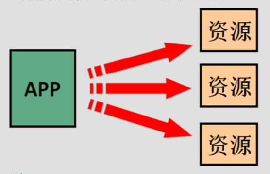
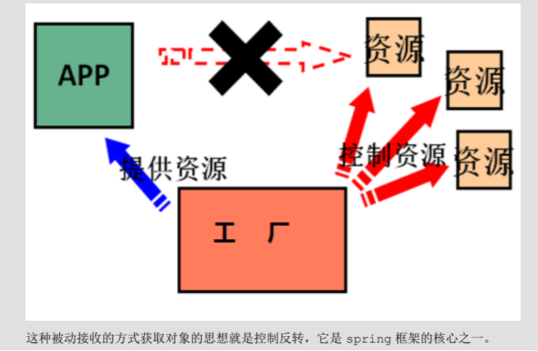
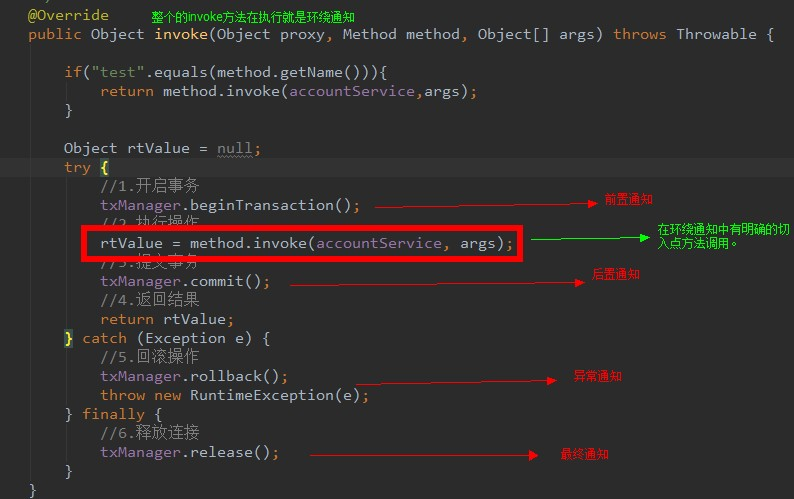
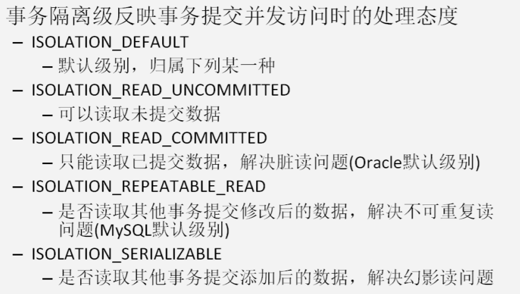

# spring框架

写在前面

> 1. maven工程解决工程重新打开或者修改坐标时，模块的 language level 自动变成1.5的问题
>
>     ```xml
>     <build> <!--在pom.xml文件中添加此配置文件即可-->
>             <plugins>
>                 <plugin>
>                     <groupId>org.apache.maven.plugins</groupId>
>                     <artifactId>maven-compiler-plugin</artifactId>
>                     <version>3.8.1</version>
>                     <configuration>
>                         <source>12</source>
>                         <target>12</target>
>                     </configuration>
>                 </plugin>
>     
>             </plugins>
>     </build>
>     ```
> 
>2. spring 的声明式事务只有碰到 RuntimeException 时才会触发事务回滚，注意非运行时异常的回滚行为。

[toc]

# spring的优势：

- 方便解耦，简化开发

    通过 Spring 提供的 IoC 容器，可以将对象间的依赖关系交由 Spring 进行控制，避免硬编码所造成的过度程序耦合。用户也不必再为单例模式类、属性文件解析等这些很低层的需求编写代码，可以更专注于上层的应用。

- AOP 编程的支持

    通过 Spring 的 AOP 功能，方便进行面向切面的编程，许多不容易用传统 OOP 实现的功能可以通过 AOP 轻松应付

- 声明式事务的支持（通过配置的方式实现功能）

    可以将我们从单调烦闷的事务管理代码中解脱出来，通过声明式方法灵活地进行事务的管理，提高开发效率和质量。

- 方便程序的测试（整合 Junit）

    可以用非容器依赖的编程方式进行几乎所有的测试工作，测试不再是昂贵的操作，而是随手可做的事情。

- 方便集成各种优秀框架

    Spring 可以降低各种框架的使用难度，提供了对各种优秀框架的直接支持

- 降低 JavaEE API 的使用难度

    Spring 对 JavaEE API （如 JDBC、JavaMail、远程调用等）进行了薄薄的封装层，使这些 API 的使用难度大大降低

- Java 源码是经典学习范例

    Spring 的源码设计精妙、结构清晰、匠心独用，处处体现着大师对 Java 设计模式灵活运用以及对 Java 技术的高神造诣，它的源代码无疑是 Java 技术的最佳实践的范例

    

## 1. IOC（inversion of control ）反转控制

### 1.1 程序的耦合和解耦

1. 程序的耦合

    > 耦合性(Coupling)，也叫耦合度，是对模块间关联程度的度量。耦合的强弱取决于模块间接口的复杂性、调 用模块的方式以及通过界面传送数据的多少。模块间的耦合度是指模块之间的依赖关系，包括控制关系、调用关 系、数据传递关系。模块间联系越多，其耦合性越强，同时表明其独立性越差( 降低耦合性，可以提高其独立 性)。耦合性存在于各个领域，而非软件设计中独有的，但是我们只讨论软件工程中的耦合。 在软件工程中，耦合指的就是就是对象之间的依赖性。对象之间的耦合越高，维护成本越高。因此对象的设计 应使类和构件之间的耦合最小。软件设计中通常用耦合度和内聚度作为衡量模块独立程度的标准。划分模块的一个 准则就是高内聚低耦合。

2. 内聚与耦合

    > 内聚标志一个模块内各个元素彼此结合的紧密程度，它是信息隐蔽和局部化概念的自然扩展。内聚是从 功能角度来度量模块内的联系，一个好的内聚模块应当恰好做一件事。它描述的是模块内的功能联系。耦合是软件 结构中各模块之间相互连接的一种度量，耦合强弱取决于模块间接口的复杂程度、进入或访问一个模块的点以及通 过接口的数据。 程序讲究的是低耦合，高内聚。就是同一个模块内的各个元素之间要高度紧密，但是各个模块之 间的相互依存度却要不那么紧密。 内聚和耦合是密切相关的，同其他模块存在高耦合的模块意味着低内聚，而高内聚的模块意味着该模块同其他 模块之间是低耦合。在进行软件设计时，应力争做到高内聚，低耦合。

### 1.2 解决程序耦合的思路

1. 我们在开发中，有些依赖关系是必须的，有些依赖关系可以通过优化代码来解除的。

    > ​	例如 jdbc 通过反射来注册驱动，此时只需要传入字符串即可，即使没有导入mysql的jar包也能通过编译（但运行肯定会报错），同时可以通过引用外部文件来确定传入的字符串，来进一步解耦。

2. 工厂模式解耦

    > 在实际开发中我们可以把三层的对象都使用配置文件配置起来，当启动服务器应用加载的时候，让一个类中的 方法通过读取配置文件，把这些对象创建出来并存起来。在接下来的使用的时候，直接拿过来用就好了。 那么，这个读取配置文件，创建和获取三层对象的类就是工厂。

### 1.3 控制反转(IOC)（重点）

​	工厂就是负责给我们从容器中获取指定对象的类。这时候我们获取对象的方式发生了改变。

​	原来：获取对象通过new 的方式，是主动的



​	现在：获取对象通过工厂获取，由工厂进行对象的查找或者创建，是被动的



**这种被动接收的方式获取对象的思想就是控制反转，它是 spring 框架的核心之一。**


### 1.4 spring的IOC解决程序的耦合

#### 1.4.1 业务层和持久层的依赖关系解决	

- 添加依赖

    ```xml
    <dependency>
                <groupId>org.springframework</groupId>
                <artifactId>spring-context</artifactId>
                <version>5.2.8.RELEASE</version>
    </dependency>
    ```

- 把对象的创建交给spring来管理

***spring对对象管理的细节：***

1. 创建bean的三种方式（具体例子见5. spring元数据的配置文件beans.xml）

    1. 使用默认构造函数创建。
                 在spring的配置文件中使用bean标签，配以id和class属性之后，且没有其他属性和标签时，采用的就是默认构造函数，此时，如果类中没有默认构造函数（无参），则对象无法创建。

        ```java
        <bean id="accountService" class="com.yato.service.impl.AccountServiceImpl"></bean>
        ```

    2. 使用工厂中的普通方法创建对象（使用某个类中的普通方法创建对象，并存入spring容器）
         			创建工厂的bean使用方式一，同时使用新的bean标签配置目标对象的信息。其中factory-bean指定对应的工厂对象的id，factory-method指定工厂中的可以创建目标对象的方法名

        ```java
           <bean id="accountServiceFactory" class="com.yato.factory.AccountServiceFactory"></bean>
            <bean id="accountService" factory-bean="accountServiceFactory" factory-method="getAccountService"></bean>
        ```
        
    3. 使用工厂中的静态方法创建对象（使用某个类中的静态方法创建对象，并存入spring容器）
              id设置为目标对象的id，class设置为对应工厂的全限定类名，同时添加factory-method属性，指出使用工厂的哪个静态方法创建对象（注意，必须是静态方法的方法名）。

          ```java
          bean id="accountService" class="com.yato.factory.AccountServiceFactory" factory-method="getAccountService">
          ```

          

2. bean标签的其他属性

    ​	init-method	需要赋值为所创建对象的方法名。并且，创建对象时会执行那个方法

    ​	destory-method  需要赋值为所创建对象的方法名。并且，释放对象时会执行那个方法

 3. bean对象的作用范围调整

       **bean标签的scope属性用来指定bean的作用范围**
       
       1. singleton（常用）：单例的（默认值）
       
       2. prototype（常用）：多例的
       
       3. request：作用于web应用的请求范围
       
       4. session：作用于web应用的会话范围
       
       5. global-session：作用于集群环境的会话范围（全局会话范围），当不是集群环境时，它就是session
       
           > 集群环境：使用多台服务器集群处理用户请求，需要使用户信息在全部的物理服务器的流通，就需要使用global-session
       
   4. bean对象的生命周期

         1. 单例对象：和容器的生命周期相同
         
             ​	当容器创建时，会创建出单例对象，当容器被释放时，此单例对象才会被释放
         
         2. 多例对象：
         
             ​	当获取对象时，对象才被创建，只有在该对象不被引用时，才会等着java垃圾回收器回收。

5. spring元数据的配置文件beans.xml

    使用下面这个标签，可以**引用外部文件的mysql连接信息**

    ```xml
    <context:property-placeholder location="jdbc.properties"></context:property-placeholder>
    ```

    在需要使用时，使用 `${对应信息名}`即可引用相关数据

    ```xml
    <?xml version="1.0" encoding="UTF-8"?>
    <beans xmlns="http://www.springframework.org/schema/beans"
        xmlns:xsi="http://www.w3.org/2001/XMLSchema-instance"
        xsi:schemaLocation="http://www.springframework.org/schema/beans
            https://www.springframework.org/schema/beans/spring-beans.xsd">
        <!-- 
    		bean 标签：用于配置让 spring 创建的对象，并且存入 ioc 容器之中
    		id 属性：对象的唯一标识。后续根据id来获取指定对象
         	class 属性：指定要创建对象的全限定类名
        -->
        <!-- 创建bean的第一种方式，要求要有默认构造函数 -->
        <bean id="accountService" class="com.yato.service.impl.AccountServiceImpl"></bean>
        <!-- 第二种方式，使用工厂的普通方法创建对象 -->
        <bean id="accountServiceFactory" class="com.yato.factory.AccountServiceFactory"></bean>
        <bean id="accountService" factory-bean="accountServiceFactory" factory-method="getAccountService"></bean>
        <!-- 第三种方式，使用工厂的静态方法创建对象-->
        <bean id="accountService" class="com.yato.factory.AccountServiceFactory" factory-method="getAccountService"></bean>
    ```

6. 核心容器对象ApplicationContext（接口）的三个常用实现类

    ApplicationContext接口的三个常用实现类

       1. ClassPathXmlApplicationContext 

          ​	可以加载类路径下的配置文件（要求配置文件必须在类路径下，否则，加载不了）（这个比第二个常用，注解肯定更常用）

    2. FileSystemXmlApplicationContext 

      ​	可以加载磁盘任意路径下的配置权限（要求具有这个路径的访问权限）

    3. AnnotationConfigApplicationContext 

      ​	用于读取注解，创建容器。

7. 由核心容器中的 ApplicationContext （间接实现了 BeanFactory 接口）和 BeanFactory 这两个接口引发的问题思考

    1. ApplicationContext:（单例对象适用于这个） （一般用于此接口）
                 它在创建核心容器时，创建bean对象采取的策略是采用立即加载的方式。也就是说，一旦读取完配置文件，立即创建配置文件中配置的bean对象。
    2. BeanFactory：（非单例对象适用于这个）
              它在创建核心容器时，创建bean对象采用的策略是延迟加载的方式，什么时候使用id获取bean对象，什么时候创建这个bean对象。

#### 1.4.2 spring的依赖注入

1. IOC的作用是降低程序间的依赖关系（耦合）

2. 依赖关系的管理：

    ​	以后都交给spring维护。

    ​	在当前类需要用到其他类的对象时，由spring为我们提供，我们只需要在配置文件中说明。

3. 依赖关系的维护就称之为依赖注入。

4. 能注入的数据有三类

    1. 基本类型和string
    2. 其他bean类型（在配置文件中或者注解配置过的bean）
    3. 复杂类型/集合类型

5. 注入的方式有三种

    1. 使用构造函数提供（构造函数注入一般不用，见6（弊端））
    
        1. 使用的标签：construct-arg
        
        2. 标签的位置：bean标签的内部
        
        3. 标签中的属性介绍:
        
            ​	type:指定要注入的数据的数据类型，该数据类型也是构造函数中某个或某些参数的类型
        
            ​	index：用于指定要注入的数据	给构造函数中指定索引位置的参数赋值，索引从0开始
        
            ​	name(常用)：用于指定给构造函数中指定名称的参数赋值
        
            ​	value：用于提供基本类型和String类型的数据
        
            ​	ref：用于指定其他的bean类型数据。它指定的是IOC核心容器中出现过的bean对象
        
        4. 代码
        
            ```xml
            <bean id="accountService" class="com.yato.service.impl.AccountServiceImpl">
                    <constructor-arg name="age" value="18"></constructor-arg>
                    <constructor-arg name="name" value="泰思特"></constructor-arg>
                    <constructor-arg name="birthday" ref="now"></constructor-arg>
            </bean>
            <bean id="now" class="java.util.Date"></bean>
            ```
        
        5. 构造函数注入的优势：
        
            ​	在获取bean对象时，注入数据是必须的操作，否则无法注入。
        
        6. 弊端：
        
            ​	改变了bean对象的实例化方式。在我们创建对象时，如果用不到这些数据，也必须得提供。
    
    2. 使用set方法提供（更常用）
    
        1. 使用的标签：property
        
        2. 标签的位置：bean标签的内部
        
        3. 标签中的属性介绍:
        
            ​	name：用于指定注入时所调用的set方法名称（其值是相应set方法名，去掉set字符并且剩余字符首字母小写的值，见样例注释）
        
            ​	value：用于提供基本类型和String类型的数据
        
            ​	ref：用于指定其他的bean类型数据。它指定的是IOC核心容器中出现过的bean对象
        
        4. 代码：
        
            ```xml
            <bean id="now" class="java.util.Date"></bean>
            <bean id="accountService1" class="com.yato.service.impl.AccountServiceImpl">
                	<!-- 注意此时的name属性，比如name="age",意味着调用该对象的setAge()方法，和属性名称没有任何关系 -->
                    <property name="age" value="18"></property>
                    <property name="name" value="名字"></property>
                    <property name="birthday" ref="now"></property>
            </bean>
            ```
        
        5. set方法注入优势：
        
            ​	创建对象没有明确的限制，可以直接使用默认构造函数
        
        6. 弊端：
        
            ​	如果有某个成员必须有值，则获取对象是有可能set方法没有被执行（不能保证某个成员有值）
    
    3. （2的补充）复杂类型的注入/集合的注入
    
        1. 用于给List结构集合（数组，List，Set等）注入的标签：
        
            ​	list	array	set
        
        2. 用于给Map结构集合（Map，Properties等）注入的标签：
        
            ​	map	props
        
        3. 结构相同，标签可以互换，例如给List注入数据，list、array、set标签都可以使用。
        
        4. 代码举例：
        
            ```xml
            <bean id="accountService" class="com.yato.service.impl.AccountServiceImpl">
                	<!-- 为String数组注入数据 -->
                	<!-- name属性指出需要注入的对象名，下同 -->
                    <property name="myStrArray">
                        <!-- 使用array标签为list集合结构注入数据 -->
                        <array>
                            <!-- 使用array的字标签value输入数据 -->
                            <value>AAA</value>
                            <value>BBB</value>
                            <value>CCC</value>
                        </array>
                    </property>
                    <property name="myStrList">
                        <!-- 使用list标签为list集合结构注入数据 -->
                        <list>
                            <value>AAA</value>
                            <value>BBB</value>
                            <value>CCC</value>
                        </list>
                    </property>
                    <property name="myStrSet">
                        <!-- 使用set标签为list集合结构注入数据 -->
                        <set>
                            <value>AAA</value>
                            <value>BBB</value>
                            <value>CCC</value>
                        </set>
                    </property>
                    <property name="myStrMap">
                        <!-- 使用map标签为map集合结构注入数据 -->
                        <map>
                            <!-- 使用map的子标签entry标明数据，有两种方式 -->
                            <!-- 方式一：容易写，常用 -->
                            <!-- key和value属性指明键和值 -->
                            <entry key="key1" value="value1"></entry>
                            <!-- 方式二：不容易写，不常用 -->
                            <entry key="key2">
                                <value>value2</value>
                            </entry>
                        </map>
                    </property>
                    <property name="myProperties">
                        <!-- 使用props标签为map集合结构注入数据 -->
                        <props>
                            <!-- 使用props标签的子标签prop指明数据 -->
                            <!-- 此方式只有一种写法，key属性指出键，标签内容指出值 -->
                            <!-- 注意和map的子标签entry的两种方式的区别 -->
                            <prop key="key1">value1</prop>
                        </props>
                    </property>
            </bean>
            ```
        
            
    
    4. 使用注解提供
    
        > 见下面的注解分析

### 1.5  spring基于注解的  ioc  以及 ioc 案例

#### 1.5.1  常用IOC注解

> 虽然使用了注解，但是还是需要配置xml信息。

1. 曾经的xml的配置

    ```java
    <?xml version="1.0" encoding="UTF-8"?>
    <beans xmlns="http://www.springframework.org/schema/beans"
           xmlns:xsi="http://www.w3.org/2001/XMLSchema-instance"
           xsi:schemaLocation="http://www.springframework.org/schema/beans
            https://www.springframework.org/schema/beans/spring-beans.xsd">
    	<bean id="accountService1" class="com.yato.service.impl.AccountServiceImpl" scope="" init-method="" destory-method="">
            <property name="age" value="18"></property>
            <property name="birthday" ref="now"></property>
    	</bean>-->
    </beans>
    ```

 2. 现在的xml配置

    ```java
    <?xml version="1.0" encoding="UTF-8"?>
    <beans xmlns="http://www.springframework.org/schema/beans"
     xmlns:xsi="http://www.w3.org/2001/XMLSchema-instance"
     xmlns:context="http://www.springframework.org/schema/context"
     xsi:schemaLocation="http://www.springframework.org/schema/beans
      https://www.springframework.org/schema/beans/spring-beans.xsd
      http://www.springframework.org/schema/context
      https://www.springframework.org/schema/context/spring-context.xsd">
    	<!--告知spring在创建容器时要扫描的包，配置所需要的使用的标签不是beans，而是一个名称为context的名称空间和约束中的标签-->
    <context:component-scan base-package="com.yato"></context:component-scan>
    
    </beans>
    ```

3. 可以使用注解，达到不使用此xml文件的目的，见下面的知识点2.3.5 配置类。

4. 但是也可能使用xml+注解的方式配置更方便，视情况而定。不管用不用，都得会！！！！。（配置第三方的包，需要引入配置类，并使用一些配置类的注解来完成第三方对象的创建，使用注解未必会更简便）。例如，两种方式结合的实现思路。

    ```xml
    <?xml version="1.0" encoding="UTF-8"?>
    <beans xmlns="http://www.springframework.org/schema/beans"
           xmlns:xsi="http://www.w3.org/2001/XMLSchema-instance"
           xmlns:context="http://www.springframework.org/schema/context"
           xsi:schemaLocation="http://www.springframework.org/schema/beans
            https://www.springframework.org/schema/beans/spring-beans.xsd
            http://www.springframework.org/schema/context
            https://www.springframework.org/schema/context/spring-context.xsd">
        <!--告知spring在创建容器时要扫描的包，用于扫描自定义的类-->
        <context:component-scan base-package="com.yato"></context:component-scan>
        <!--主要配置第三方的包-->
        <bean id="runner" class="org.apache.commons.dbutils.QueryRunner" scope="prototype">
            <constructor-arg name="ds" ref="dataSource"></constructor-arg>
        </bean>
        <bean id="dataSource" class="com.alibaba.druid.pool.DruidDataSource">
            <property name="driverClassName" value="com.mysql.jdbc.Driver"></property>
            <property name="url" value="jdbc:mysql://localhost:3306/eesy"></property>
            <property name="username" value="root"></property>
            <property name="password" value="123456"></property>
        </bean>
    	<!--自己定义的类的创建，使用注解的方式配置-->
    </beans>
    ```


5. 用于创建对象的注解：（作用是和在xml文件中编写一个bean标签实现的功能是一样的）
    1. @Component    如果对象不属于三层，则使用这个注解

        ​	作用：把当前类对象存入spring容器中

        ​	属性：

        ​			value：用于指定bean的id。默认值是当前类名且首字母改成小写。

    2. @Controller                                        一般用在表现层

    3. @Service                                            一般用在业务层

    4. @Repository(英语仓库的意思)           一般用在持久层

        ​	2、3、4的注解作用和属性和Component完全一样。spring框架为了使三层对象更加清晰，创建了这三个注解，其实这三个注解都是由Component注解衍生出来的

6. 用于注入数据的注解：（作用是和在xml文件的bean标签中编写一个properties标签实现的功能是一样的）

    > 重要：复合类型或者集合类型的注入只能通过xml来实现。

    1. @Autowired:

        1. 作用：自动按照类型注入。
        2. 注入的注意事项
            - 容器中有唯一的一个bean对象类型（可以是它的子类或者实现类）和要注入的变量类型匹配，这种直接可以注入成功。（注意，此时寻找匹配时，会跳过key，直接和value值进行比较匹配）
            - ioc容器中没有与要注入的变量类型匹配，会报错。
            - 如果容器中有多个bean对象与要注入的变量类型匹配时，此时会寻找ioc容器的与要注入变量类型匹配的对象中（类型不匹配会类型转换异常，所以肯定是选择类型匹配的），是否存在id是此注入变量的变量名，如果存在，返回此id对应的对象，不存在就报错。

        3. 出现位置：可以是成员变量，也可以是成员方法，也可以是其他（其他的不常用）
        4. 细节：**在使用注解注入时，set方法就不是必须的了（反射）。**

    2. @Qualifier：

        1. 作用：在按照类型注入的基础之上，再按照名称注入。它在给类成员注入时，不能单独使用；但是在给方法参数注入时，可以单独使用。

        2. 属性：value用于指定注入bean的id

            ```java
            @Autowired
            @Qualifier("accountDao2") // 必须要先使用Autowired注解先过滤bean对象类型，再使用Qualifier注解获取对应id的bean对象。否则会注入失败。
            private IAccountDao accountDao;
            ```

        3. Qualifier给方法参数注入，实际也隐藏着Autowired的功能，先按类型筛选，然后查找id

            **注意：单例对象和多例对象的线程间干扰的情况（单例可能会出现干扰）**

            ```java
            @Bean(name="queryRunner")
             @Scope("singleton") // 指定QueryRunner对象的生命周期
            	// 在ioc容器中有多个类型时DataSource的bean时，并且没有id和形参变量名一致时，需要使用Qualifier注解指明使用哪个bean对象，否则程序会报错。
             public QueryRunner createQueryRunner(@Qualifier("dataSource") DataSource dataSource){
                 return new QueryRunner(dataSource);	
             }
            ```

    3. @Resource

        1. 作用：直接按照bean的id进行使用
        2. 属性：
            - name：用于指定bean的id

        3. 另外：jdk11之后无法使用Resource注解，需要添加 javax.annotation-api 

    > - 以上三个注解都只能注入其他bean类型的数据
    >
    > - 基本类型和String类型无法使用上述注解来实现，但可以使用 Value 注解来完成。
    > - 集合类型的注入只能通过 xml 实现

    4. @Value
        1. 作用：用于注入基本类型和String类型的数据
        2. 属性：
            - value：用于指定数据的值。他可以使用spring中的SpEL（也就是spring的el表达式）
            - SpEl的写法：${表达式}

 3. 用于改变作用范围的注解：（作用是和在xml文件的bean标签修改scope属性实现的功能是一样的）

    1. @Scope
1. 作用：用于指定bean的使用范围
        2. 属性：
    
    - value：指定范围的取值。常用取值：singleton prototype
    
 4. 和生命周期相关的注解（了解）：（作用是和在xml文件的bean标签中使用init-method和destory-method的作用是一样的）

    1. @PreDestory
    
        ​		作用：用于指定销毁方法，写在销毁方法的上面。
    
    2. @PostConstruct
    
        ​		作用：用于指定初始化方法，写在初始化方法的上面。

#### 1.5.2 配置类中的注解（可以完全代替bean.xml文件，但不是必须的）

一些细节：

1. 当使用注解配置方法时，如果方法有参数，spring框架会去容器中查找有没有可用的bean对象。查找的方式和 Autowired 注解的查找方式一样。

2. 此时使用的spring的容器是AnnotationConfigApplicationContext，而不是ClassPathXmlApplicationContext

3. @Configuration 注解。

    1. 当某配置类的字节码作为AnnotationConfigApplicationContext对象创建的参数时（参数是可变类型，可以传入多个配置类的字节码），那个配置类的Configuration注解可以省略不写
    2. 作为AnnotationConfigApplicationContext对象创建的参数的类，需要用ConponentScan注解指定spring容器创建对象所要扫描的包。
    3. 如果只是在 AnnotationConfigApplicationContext对象创建时作为传入参数的类 中使用ConponentScan注解指明子配置类所在的包，而子配置类没有使用Configuration注解（使用此注解并且指示spring扫描子配置类才能完成需求），spring框架在扫描时，由于认为该类不是配置类（没有用Configuration），所以还是不会扫描该类里面的注解。 
    4. 可以用Import注解导入主配置类的其他子配置类，此时子配置类可以不使用Configuration注解（只使用Import注解即可完成需求），不同于3

4. @Import 注解和 @Configuration 注解和 @ConponentScan 注解的一些关系

    当有主配置和子配置类时：
    
    1. 在主配置类中使用ConponentScan注解指明子配置类所在的包，并且，在子配置类中添加Configuration注解可以实现功能的配置。
    2. 在主配置类中使用Import注解导入子配置类的字节码后，既不用Configuation配置子类，也不用ConponentScan指明子类所在的包，也可以实现功能的配置
    3. 1和2这两种方式等价。

1. @Configuration
        	作用：指定当前类是一个配置类

2. @ConponentScan
            作用：用于通过注解指定spring在创建容器时需要扫描的包
            属性：
                    basePackages和value属性等价，都是指定spring创建容器时需要扫描的包
            替代：

    ​         		使用了此注解，相当于在xml文件中配置了 

    ​			`<context:component-scan base-package="com.yato"></context:component-scan>`

3. @Bean
            作用：用于把当前方法的返回值作为bean对象存入 ioc 容器中
            属性：
                    name：用于指定bean的id，默认值为当前方法的名称。
        
8. **细节**：当使用注解配置方法时，如果方法有参数，spring 框架会去容器中查找有没有可用的 bean 对象。查找的方式可 Autowired 注解查找方式一样，如果多个，可以使用 @Qualifier 注解指定 id 名

9. @Scope

      ​	作用：用于指定对象的生命周期

10. @Import

      ​	作用：用于导入其它配置类

      ​	属性：

      ​			value：用于指定其他配置类的字节码（可以有多个）

      ​				当使用Import注解后，有Import注解的类就是父配置类，而导入的都是子配置类。

11. @PropertySource

       ​		作用：用于指定properties文件的位置；

       ​		属性：

       ​				value：指定文件的名称和路径

       ​							关键字：classpath，表示类路径下，classpath:com/yato/JdbcConfig.properties

       ​							**resources 资源文件夹代表类路径**

12. 举例分析

       ```java
       // 主配置类 com.config.SpringConfiguration
       @Configuration
       // 方式一
       @ComponentScan(basePackages = "com.yato") // bean对象的包
       @Import(JdbcConfiguration.class) // 导入子配置类，子配置类无需使用Configuration，主配置类也不用扫描子配置类所在的包
       /* 方式二，此种方式没有主配置类和子配置类的逻辑关系，并且com.config的配置类必须要有 Configuration注解
       @ComponentScan(basePackages = {"com.yato", "com.config"})
       */
       public class SpringConfiguration {
           
       }
       // 子配置类 com.config.JdbcConfiguration
       // 方式二，需要添加configuration注解
       // @Configuration 
       @PropertySource("classpath:jdbc.properties")// 加载配置文件（不使用classpath也没事，待查明）
       public class JdbcConfiguration {
           @Value("${jdbc.url}")
           private String url;
           @Value("${jdbc.driverClassName}")
           private String driver;
           @Value("${jdbc.username}")
           private String username;
           @Value("${jdbc.password}")
           private String password;
           
           @Bean(name="queryRunner")
           @Scope("singleton") // 指定QueryRunner对象的声明周期
           public QueryRunner createQueryRunner(DataSource dataSource){
               return new QueryRunner(dataSource);
           }
           @Bean(name = "dataSource")
           public DataSource createDataSource(){
               DruidDataSource dds = new DruidDataSource();
               dds.setUrl(url);
               dds.setDriverClassName(driver);
               dds.setUsername(username);
               dds.setPassword(password);
               return dds;
           }
       }
       ```

       

#### 1.5.3  spring整合junit

1. spring整合junit的作用

    > 在测试类中，不需要关注对象如何创建，而只关注相关代码的正确性和效率

2. 思路

    > 在使用junit测试程序时，如果需要注入测试程序的对象，需要使ioc容器先创建后，再去执行测试程序，即把 执行 Junit 集成的 main 方法，替换成执行 spring 集成的 main 方法。

3.  spring 整合 junit 的配置

    1. 导入 spring 整合 junit 的 jar（坐标）

        ```xml
        <dependency>
                    <groupId>org.springframework</groupId>
                    <artifactId>spring-test</artifactId>
                    <version>5.2.8.RELEASE</version>
        </dependency>
        ```

    2. 使用 junit 提供的 @Runwith 注解把 junit 原有的 main 方法替换了，替换成 spring 提供的 main 方法。

    3. 告知 spring 的运行器，spring 和 ioc 创建是基于 xml 还是注解，并且说明位置。

        ​		@ContextConfiguration

        ​					locations：指定xml文件的位置，加上classpath关键字，表示在类路径下

        ​					classes：指定注解类的字节码文件

    4. 注意事项：当使用 spring5.x 时，要求 junit 的 jar 必须是4.12及以上。

    5. 举例

        ```java
        // SpringJUnit4ClassRunner 类继承了 Junit 的核心类 Runner 
        @RunWith(SpringJUnit4ClassRunner.class) 
        @ContextConfiguration(classes = SpringConfiguration.class) // 注解配置
        //@ContextConfiguration(locations = "classpath:bean.xml")xml配置使用此注解
        public class AccountMapperTest {
            // 如此配置之后，后面的使用Test注解修饰的函数中，再使用service对象时，可以直接使用，spring会为service注入值。
            @Autowired
            private IAccountService service;
            @Test
            public void findAllAccount() {
                service.findAllAccount().forEach(System.out::println);
            }
        }
        ```

### 1.6  代理模式

> 代理模式（Proxy）是通过代理对象访问目标对象，这样可以在目标对象基础上增强额外的功能，如添加权限，访问控制和审计等功能。

#### 1.6.1 静态代理

1. 作用：可以做到在不修改目标对象的功能前提下，对目标功能扩展。

2. 前提：目标对象需要实现了接口，否则不能使用静态代理。

3. 不足：静态代理实现了目标对象的所有方法，一旦目标接口增加方法，代理对象和目标对象都要进行相应的修改，增加维护成本。

4. 使用举例

    ```java
    // IUserMapper.java
    public interface IUserMapper {
        void save();
    }
    // UserMapperImpl.java
    public class UserMapperImpl implements IUserMapper {
        public void save() {
            System.out.println("----已经保存数据!----");
        }
    }
    // UserDaoProxy.java
    public class UserMapperProxy implements IUserMapper{
        //接收保存目标对象
        private IUserMapper target;
        public UserMapperProxy(IUserMapper target){
            this.target=target;
        }
        public void save() {
            System.out.println("开始事务...");
            target.save();//执行目标对象的方法
            System.out.println("提交事务...");
        }
    }
    // App.java
    public class App {
        public static void main(String[] args) {
            //目标对象
            UserMapperImpl target = new UserMapperImpl();
            //代理对象,把目标对象传给代理对象,建立代理关系
            UserMapperProxy proxy = new UserMapperProxy(target);
            proxy.save();//执行的是代理的方法，代理方法增强目标方法。
        }
    }
    ```

    

#### 1.6.2 动态代理

动态代理：

1. 特点：字节码随用随创建， 随用随加载。它与静态代理的区别也在于此。因为静态代理是字节码一上来就创建好，并完成加载。 装饰者模式就是静态代理的一种体现。
2. 作用：不修改源码的基础上对方法增强
3. 分类：
    1. 基于接口的动态代理
    2. 基于子类的动态代理 

1. 解决的问题：解决静态代理对象必须实现接口的所有方法的问题，Java给出了动态代理

2. 提供者：JDK 官方的 Proxy 类。

3.  要求：被代理类最少实现一个接口。

4. 特点：

    `1.代理对象,不需要实现接口
     2.代理对象的生成,是利用JDK的API,动态的在内存中构建代理对象(需要我们指定创建代理对象/目标对象实现的接口的类型)
     3.动态代理也叫做:JDK代理,接口代理`

5. 不足：代理对象不需要实现接口,但是目标对象一定要实现接口,否则不能用动态代理

6. Proxy.newProxyInstance()的参数说明

    ```java
    /*
    1. ClassLoader 类加载器：用于加载代理对象的字节码，和被代理对象使用相同的类加载器。
    2. Class 字节码数组：用于让代理对象和被代理对象有相同的方法。
    3. InvocationHandler 事件处理。执行目标对象的方法时,会触发事件处理器的方法,会把当前执行目标对象的方法作为参数传入，通常情况下都是使用匿名内部类。
    */
    public static Object newProxyInstance(ClassLoader loader,
                                          @NotNull Class<?>[] interfaces,
                                          @NotNull reflect.InvocationHandler h)
    ```

7. InvocationHandler接口的invoke()方法参数说明

    ```java
    IUserMapper proxyMapper = (IUserMapper) Proxy.newProxyInstance(mapper.getClass().getClassLoader(), mapper.getClass().getInterfaces(), new InvocationHandler() {
                 /*
                0. 作用：执行被代理对象的任何接口方法都会经过该方法
                1. proxy：代理对象的引用。
                2. method：当前执行的方法。
                3. args：当前执行方法所需要的参数。
                4. 返回值：和被代理对象方法有相同的返回值。
                */
                @Override
                public Object invoke(Object proxy, Method method, Object[] args) throws Throwable {
                    Object obj = null;
                    if ("save".equals(method.getName())){
                        System.out.println("开始事务...");
                        obj = method.invoke(mapper, args);
                        System.out.println("提交事务...");
                    }
                    return obj;
                }
            });
    ```

    

8. 使用举例（包含Proxy的参数说明）

    ```java
    // IUserMapper.java
    interface IUserMapper {
        void save();
    }
    // UserMapperImpl.java
    class UserMapperImpl implements IUserMapper {
        public void save() {
            System.out.println("----已经保存数据!----");
        }
    }
    
    // App.java
    public class ProxyTest {
        public static void main(String[] args) {
            IUserMapper mapper = new UserMapperImpl();
            IUserMapper proxyMapper = (IUserMapper) Proxy.newProxyInstance(mapper.getClass().getClassLoader(), mapper.getClass().getInterfaces(), new InvocationHandler() {
                @Override
                public Object invoke(Object proxy, Method method, Object[] args) throws Throwable {
                    Object obj = null;
                    if ("save".equals(method.getName())){
                        System.out.println("开始事务...");
                        obj = method.invoke(mapper, args);
                        System.out.println("提交事务...");
                    }
                    System.out.println("obj =" + obj);
                    return obj;
                }
            });
            proxyMapper.save();
    
        }
    }
    ```

    

#### 1.6.3 Cglib代理（基于子类的动态代理）

> Cglib代理是在内存中构建一个子类对象从而实现对目标对象功能的扩展

1. 解决的问题：上面的静态代理和动态代理模式都是要求目标对象是实现一个接口的目标对象，但是有时候目标对象只是一个单独的对象，并没有实现任何的接口，这个时候就可以使用以目标对象子类的方式类实现代理。

2. 特点：

    ​	`1. 广泛地被AOP框架使用`

    ​	`2. Cglib包的底层是通过使用一个小而快的字节码处理框架ASM来转换字节码并生成新的类`

3. 不足：目标对象不能是final类(报错)，且目标对象的方法不能是final或static（不会被拦截，即不会执行目标对象额外的业务方法）。

4. 实现方案：

    1.需要引入Cglib的jar文件，但是Spring的核心包中已经包括了Cglib功能，所以直接引入`spring-core-3.2.5.jar`即可。
    2.引入功能包后,就可以在内存中动态构建子类

5. Enhancer类的 create() 方法参数说明

    ```java
    /*
    1. Class superclass：用于指定被代理对象的字节码。
    2. Class[] interfaces：// 实现的接口，没有实现接口，此参数可以省略，因为有重载的方法
    3. Callback：用于提供增强的代码。一般都是实现该接口的子接口：MethodInterceptor
    */
    public static Object create(Class superclass,
                                Class[] interfaces,
                                org.springframework.cglib.proxy.Callback callback)
    ```

6. MethodInterceptor接口的intercept()方法参数说明

    ```java
    UserMapperImpl proxyMapper = (UserMapperImpl) Enhancer.create(mapper.getClass(), mapper.getClass().getInterfaces()， new MethodInterceptor() {
        		/*
                0. 作用：执行被代理对象的任何接口方法都会经过该方法
                1. o (proxy)：代理对象的引用。
                思考：o 是代理对象的引用，为什么需要这个参数？为什么不用 this ？ this 指代的不是当前的代理对象？ this 指代的是谁？
                2. method：当前执行的方法。
                3. objects (args)：当前执行方法所需要的参数。
                以上三个参数，和基于接口的动态代理的invoke方法的参数一样。
                4. methodProxy: 当前执行方法的代理对象
                4. 返回值：和被代理对象方法有相同的返回值。
                */
                @Override
                public Object intercept(Object o, Method method, Object[] objects, MethodProxy methodProxy) throws Throwable {
                    Object obj = null;
                    if ("save".equals(method.getName())){
                        System.out.println("开始事务...");
                        obj = method.invoke(mapper, args);
                        System.out.println("提交事务...");
                    }
                    return obj;
                }
            });
    ```

    
    

## 2. AOP的相关概念（理解）

1. 什么是AOP

    > 全称是 Aspect Oriented Programming 即：面向切面编程。通过预编译的方式和运行期间动态代理实现程序功能的统一维护的一种技术。是OOP的延续，是函数式编程衍生的一种泛型。利用AOP可以对业务逻辑的各个部分进行隔离，从而使得业务逻辑各部分之间的耦合度降低，提高程序的可重用性，同时提高开发效率。
    >
    > 
    >
    > 简单的说它就是把我们程序重复的代码抽取出来，在需要执行的时候，使用动态代理的技术，在不修改源码的 基础上，对我们的已有方法进行增强。

2. 作用： 在程序运行期间，不修改源码对已有方法进行增强。 

3. 优势： 减少重复代码、提高开发效率、维护方便

### 2.1  spring中的AOP（重点）

#### 2.1.1  介绍

1. 说明：学习 spring 的 aop，就是通过配置的方式，不用写过多代码，就能实现功能。

2. AOP相关术语

    1. Joinpoint(连接点): 所谓连接点是指那些被拦截到的点。在 spring 中，这些点指的是方法，因为 spring 只支持方法类型的连接点。 
    
    2. Pointcut(切入点): 所谓切入点是指我们要对哪些 Joinpoint 进行拦截的定义。（切入点就是代理拦截到的连接点，如果某连接点不被拦截，就不是切入点）
    
    3. Advice(通知/增强): 所谓 通知是指拦截到 Joinpoint 之后所要做的事情就是通知。 通知的类型：前置通知（业务层调用方法的前面的代码），后置通知（业务层调用方法的后面的代码），异常通知（catch里面的代码），最终通知（finally里面的代码），环绕通知。 
    
        
    
    4. Introduction(引介): 引介是一种特殊的通知在不修改类代码的前提下，Introduction 可以在运行期为类动态地添加一些方法或 Field。 
    
    5. Target(目标对象): 代理的目标对象（被代理的对象）。 
    
    6. Weaving(织入): 是指把增强应用到目标对象来创建新的代理对象的过程（是一个动作）。 spring 采用动态代理织入，而 AspectJ 采用编译期织入和类装载期织入。 
    
    7. Proxy（代理）: 一个类被 AOP 织入增强后，就产生一个结果代理类。 
    
    8. Aspect(切面): 是切入点和通知（引介）的结合。理解：建立切入点方法和通知方法（例如添加事务支持时，commit()、rollback() 等方法就是通知方法，有的是前置通知、有的是后置通知……）在执行调用的对应关系就是切面（也就是建立增强的那个方法，只不过通过配置的方式实现）

3. 学习spring中的AOP要明确的事

    1. 开发阶段（我们做的） 
    
        > 编写核心业务代码（开发主线）：大部分程序员来做，要求熟悉业务需求。
        >
        >  把公用代码抽取出来，制作成通知。（开发阶段最后再做）：AOP 编程人员来做。 
        >
        > 在配置文件中，声明切入点与通知间的关系，即切面。：AOP 编程人员来做。 
        >
        
    2. 运行阶段（Spring 框架完成的） Spring 框架监控切入点方法的执行。一旦监控到切入点方法被运行，使用代理机制，动态创建目标对 象的代理对象，根据通知类别，在代理对象的对应位置，**将通知对应的功能织入**，完成完整的代码逻辑运行。
    
4. 代理的选择

    > 在 spring 中，框架会根据目标类是否实现了接口来决定采用哪种动态代理的方式。
    >
    > 当然，基于接口的动态代理也可以使用Cglib的方式。

#### 2.1.2 基于 XML 的 AOP 配置步骤

```xml
<beans xmlns="http://www.springframework.org/schema/beans"
    xmlns:xsi="http://www.w3.org/2001/XMLSchema-instance"
    xmlns:aop="http://www.springframework.org/schema/aop"
    xsi:schemaLocation="
        http://www.springframework.org/schema/beans https://www.springframework.org/schema/beans/spring-beans.xsd
        http://www.springframework.org/schema/aop https://www.springframework.org/schema/aop/spring-aop.xsd">
    <!-- this is the object that will be proxied by Spring's AOP infrastructure -->
    <!-- 这是将由 Spring 的 AOP 架构代理的对象 -->
    <!-- 配置 spring 的 ioc ，把 service 对象配置进来 -->
    <bean id="personService" class="x.y.service.DefaultPersonService"/>
    
    <!-- this is the actual advice itself -->
    <!-- 这是实际的通知 -->
    <bean id="profiler" class="x.y.SimpleProfiler"/>
    
    <!--  配置 AOP -->
    <aop:config>
        <!-- 配置切入点表达式 -->
        <aop:pointcut id="pt" expression="execution(* com.yato.service.impl.*.*(..))"/>
        <!-- 配置切面 -->
        <aop:aspect ref="profiler" id="logAdvice">
    	<!-- 配置通知的类型，并且建立通知方法和切入点方法的关联 -->
            <!-- 前置通知使用了配置的切入点表达式 -->
            <aop:before method="beforeLogger" pointcut-ref="pt"></aop:before>
            <aop:after-returning method="afterReturningLogger" pointcut="execution(* com.yato.service.impl.*.*(..))"></aop:after-returning>
            <aop:after-throwing method="afterThrowingLogger" pointcut="execution(* com.yato.service.impl.*.*(..))"></aop:after-throwing>
            <aop:after method="afterLogger" pointcut="execution(* com.yato.service.impl.*.*(..))"></aop:after>          
        </aop:aspect>
    </aop:config>

</beans>
```

1. 把通知类（SimpleProfiler）交给 spring 管理

2. 使用 aop:config 标签表明开始 AOP 配置

3. 使用 aop:aspect 标签表明配置切面

    - id 属性：是给切面提供一个唯一标识
    - ref 属性：是指定通知类 bean 的 id

4. 在 aop:aspect 标签的内部使用对应标签来配置通知的类型

    1. aop:before   配置前置通知（在切入点方法执行之前执行 ）

        - method 属性：用于指定通知类中哪个方法是前置通知
        - pointcut 属性：用于指定切入点表达式，该表达式的含义指的是对业务层中哪些方法增强
        - pointcut-ref 属性：指定切入点表达式的 id

    2. aop:after-returning  配置后置通知（在切入点方法正常执行之后执行 ）

        - method 属性：用于指定通知类中哪个方法是前置通知
        - pointcut 属性：用于指定切入点表达式，该表达式的含义指的是对业务层中哪些方法增强
        - pointcut-ref 属性：指定切入点表达式的 id

    3. aop:after-throwing   配置异常通知：在切入点方法执行产生异常之后执行（当然，前置通知产生了异常，切入点方法就不会执行了，直接执行异常通知，然后执行最终通知）

        - method 属性：用于指定通知类中哪个方法是前置通知
        - pointcut 属性：用于指定切入点表达式，该表达式的含义指的是对业务层中哪些方法增强
        - pointcut-ref 属性：指定切入点表达式的 id

    4. aop:after   配置最终通知（必定在切入点方法执行之后执行，无论切入点方法是否产生异常 ）

        - method 属性：用于指定通知类中哪个方法是前置通知
        - pointcut 属性：用于指定切入点表达式，该表达式的含义指的是对业务层中哪些方法增强
        - pointcut-ref 属性：指定切入点表达式的 id

    5.   aop:around   配置环绕通知

        1. 属性：

            - method 属性：用于指定通知类中哪个方法是前置通知
            - pointcut 属性：用于指定切入点表达式，该表达式的含义指的是对业务层中哪些方法增强
        - pointcut-ref 属性：指定切入点表达式的 id
        
    2. 环绕通知的作用：
       
        1.  spring 框架为我们提供了一个接口——ProceedingJoinPoint。该接口有一个 proceed() 方法，此方法相当于明确调用切入点方法。
        
        2. ProceedingJoinPoint 接口可以作为环绕通知的方法参数，在程序执行时， spring 框架会为我们提供该接口的实现类供我们使用。
        
        3. spring 中的环绕通知
        
            - 它是 spring 框架为我们提供的一种可以在代码中手动控制增强方法何时执行的方式
        
        4. 注意：使用了环绕通知，就不能再用前置通知、后置通知等标签配置额外的通知了，否则通知的执行顺序就混乱了。至于为什么输出结果是那个顺序，以后再深究。
        
        5. 使用举例
        
                ```java
                <!--配置切面-->
                <aop:aspect>
                	<aop:around method="aroundLogger" pointcut-ref="pt"></aop:around>
                </aop:aspect>
                
                // 环绕通知
                public Object aroundLogger(ProceedingJoinPoint pst){
                        Object ret = null;
                        // 得到方法执行所需要的参数
                        Object[] args = pst.getArgs();
                        try {
                            System.out.println("前置");
                            ret = pst.proceed(args);  // 明确调用切入点方法
                            System.out.println("后置");
                            return ret;
                        } catch (Throwable throwable) {
                            System.out.println("异常");
                            throwable.printStackTrace();
                        } finally {
                            System.out.println("最终");
                        }
                        return ret;
                    }
                ```
        
    6. **后置通知和异常通知永远只能执行一个 **

5. 切入点表达式的写法：

    - 关键字：execution(表达式)
    - 表达式：访问修饰符 返回值 包名.包名...类名.方法名(参数列表)
    - 标准的表达式写法：`public void com.yato.service.impl.AccountServiceImpl.saveAccount()`
    - 访问修饰符可以省略：`void com.yato.service.impl.AccountServiceImpl.saveAccount()`
    - 返回值可以使用通配符 * ，表示任意返回值：`* com.yato.service.impl.AccountServiceImpl.saveAccount()`
    - 包名可以使用通配符，表示任意包。但是有几级包，就需要写几个`*.`：`* *.*.*.*.AccountServiceImpl.saveAccount()`
    - 包名可以使用`*..`表示当前包及其子包：`* *..AccountServiceImpl.saveAccount()`
    - 类名和方法名都可以使用 `*` 来实现通配：`* *..*.*()`
    - 参数列表：
        1. 直接写数据类型：
            - 基本数据类型直接写名称：int
            - 引用类型写`包名.类名`的方式：java.lang.String
        2. 使用通配符 * 表示任意类型，但是必须是有参数的函数：`* *..*.*(*)`
        3. 使用 `..`表示有无参数均可，有参数可以是任意类型：`* *..*.*(..)`
    - 全通配写法：`* *..*.*(..)`
    - 实际开发中切入点表达式的通常写法：
        - 切到业务层实现类下的所有方法：`* com.yato.service.impl.*.*(..)`

6. 配置切入点表达式，达到复用的目的

    - 标签：aop:pointcut

    - 属性：

        - id：指定表达式的唯一标识
        - expression：指定表达式的内容

    - 作用范围：

        - 写在 aop:aspect 标签内部（位置没有限制，可最上面、可最下面、也可在中间）：只能供当前切面使用
        - 写在 aop:config 标签内部，且在 aop:aspect 标签外面（位置只能放在切面标签 aop:aspect 的最上面）：能供所有切面使用

    - 使用配置好的切入点表达式

        ```xml
        <aop:pointcut id="pt" expression="execution(* com.yato.service.impl.*.*(..))"/>
        <!-- 不用配置的切入点表达式的写法 -->
        <aop:before method="beforeLogger" pointcut="execution(* com.yato.service.impl.*.*(..))"></aop:before>
        <!-- 使用配置的切入点表达式的写法 -->
        <aop:before method="beforeLogger" pointcut-ref="pt"></aop:before>
        ```

#### 2.1.3 基于 注解 的 AOP 配置步骤

1. 注解和 xml 配置相结合的方式

    1. xml 文件的配置

        ```xml
        <beans xmlns="http://www.springframework.org/schema/beans"
               xmlns:xsi="http://www.w3.org/2001/XMLSchema-instance"
               xmlns:aop="http://www.springframework.org/schema/aop"
               xmlns:context="http://www.springframework.org/schema/context"
               xsi:schemaLocation="
                http://www.springframework.org/schema/beans https://www.springframework.org/schema/beans/spring-beans.xsd
                http://www.springframework.org/schema/aop https://www.springframework.org/schema/aop/spring-aop.xsd
                http://www.springframework.org/schema/context https://www.springframework.org/schema/context/spring-context.xsd">
                <!-- 配置 spring 创建容器时所要扫描的包 ioc 编程 -->
                <context:component-scan base-package="com.yato"></context:component-scan>
        
                <!-- 配置 spring 开启注解 AOP 的支持 -->
                <aop:aspectj-autoproxy></aop:aspectj-autoproxy>
        </beans>
        ```

        - 注意：**`<aop:aspectj-autoproxy></aop:aspectj-autoproxy>`一定要写上这句，开启注解 AOP ，否则不会报错，但是增强不了切入点方法。**

    1. 其他 service 类用到的是 ioc 的知识，让 spring 创建容器时，创建好需要的对象

    2. 通知类（？切面类？）的注解配置

        1. @Component   注解用于让 ioc 容器创建对象
        2. @Aspect   注解表明此类是一个切面类
        3. @Pointcut   注解声明一个通用的切入点表达式，并以 `函数名()`的形式当参数传入的通知注解内使用
        4. @Before   前置通知（注意 junit 包中也有 before 注解，注意区分包）
        5. @AfterReturning   后置通知
        6. @AfterThrowing   异常通知
        7. @After   最终通知
        8. @Around   环绕通知
        9. 注意事项：旧版本 spring 使用注解后，后置通知和最终通知的执行是相反的（可能造成程序报错，比如 jdbc 操作中，如果最终通知关闭了连接，然后，后置通知提交时，连接已经关闭了），新版 (5.2.8.Release) 没有出现此问题
        10. 配置举例

        ```java
        @Component("logger")
        @Aspect // 表示当前类是一个切面类
        public class Logger {
            @Pointcut("execution(* com.yato.service.impl.*.*(..))")
            public void pt1(){}
            //@Before("pt1()")
            public void beforeLogger(){
                System.out.println("前置通知 " );
            }
            //@AfterReturning("pt1()")
            public void afterReturningLogger(){
                System.out.println("后置通知 " );
            }
            //@AfterThrowing("pt1()")
            public void afterThrowingLogger(){
                System.out.println("异常通知 " );
            }
            //@After("pt1()")
            public void afterLogger(){
                System.out.println("最终通知 " );
            }
            @Around("pt1()")
            public Object aroundLogger(ProceedingJoinPoint pst){
                Object ret = null;
                // 得到方法执行所需要的参数
                Object[] args = pst.getArgs();
                try {
                    this.beforeLogger();
                    // 明确调用切入点方法
                    ret = pst.proceed(args);
                    this.afterReturningLogger();
                    return ret;
                } catch (Throwable throwable) {
                    this.afterThrowingLogger();
                    throwable.printStackTrace();
                } finally {
                    this.afterLogger();
                }
                return ret;
            }
        }
        
        ```

2. 纯注解的方式

    - 只需要在配置类的基础上加上 @EnableAspectJAutoProxy 注解即可

        ```java
        @Configuration
        @ComponentScan(basePackages="com.yato")
        @EnableAspectJAutoProxy
        public class SpringConfiguration{}
        ```

## 3. JdbcTemplate 的使用

### 3.1 JdbcTemplate 概述

1. 它是 spring 框架中提供的一个对象，是对原始 Jdbc API 对象的简单封装。 spring 框架为我们提供了很多的操作模板类。

2. 操作关系型数据库的：

    - JdbcTemplate
    - HibernateTemplate

3. 操作 nosql 数据库的：

    - RedisTemplate

4. 操作消息队列的：

    - JmsTemplate

5. JdbcTemplate 需要导入的包

    `spring-jdbc-5.0.2.RELEASE.jar`，此外还要导入和事务相关的包

    `spring-tx-5.0.2RELEASE.jar`

### 3.2 JdbcTemplate 的使用

```java
DriverManagerDataSource ds = new DriverManagerDataSource();
ds.setDriverClassName("com.mysql.cj.jdbc.Driver");
ds.setUrl("jdbc:mysql://localhost:3306/eesy?serverTimezone=UTC");
ds.setUsername("root");
ds.setPassword("123456");
JdbcTemplate jt = new JdbcTemplate();
jt.setDataSource(ds);
```

1. JdbcTemplate 创建注意点
    1. spring 提供了一个内置的数据源（`DriverManagerDataSource`）供我们使用
    2. 创建 JdbcTemplate 对象，可以在构造方法中传入数据源，或者使用 setDataSource(ds) 方法设置数据源
    3. 当然可以使用 ioc 容器直接获取 JdbcTemplate 对象

2. JdbcTemplate 的 CRUD（creat、read、update、delete） 操作
    1. 增加

        ```java
        jt1.update("insert into account(name, money) values(?, ?)","aaa", 111f);
        ```

    2. 删除

        ```java
        jt1.update("delete from account where id = ?", 9);
        ```

    3. 修改

        ```java
        jt1.update("update account set name = ?, money = ? where id = ?", "xxx", 1f, 8);
        ```

    4. 查询多行多列

        ```java
        List<Account> accounts = jt1.query("select * from account", new BeanPropertyRowMapper<Account.class>(Account.class))
        ```

        - 可以自定义实现 RowMapper 接口的方法，但是一般情况都是用 BeanPropertyRowMapper 这个类，返回值是个 List 类型

    5. 查询一行

        ```java
        List<Account> accounts = jt1.query("select * from account where id = ?", new BeanPropertyRowMapper<>(Account.class), 6)
        ```

        - 查询一行可以等价于查询多行的条件，只不过 List 集合里面最多有一个元素

    6. 查询一行一列

        ```java
        int ans = jt1.queryForObject("select count(*) from account where id > ?", int.class, 3);
        ```

        - 第二个参数是返回值的字节码，只要返回值能转化成该类型即可。
        - 第三个参数是可变的，是需要传入的 sql 语句的参数。

### 3.3 通用代码的抽取

> 问题描述：当在持久层使用 JdbcTemplate 时，可能会有很多 mapper 文件，这就意味着要写很多下面的代码
>
> ```java
> JdbcTemplate jdbcTemplate;
> public void setJdbcTemplate(JdbcTemplate jdbcTemplate) {
>     this.jdbcTemplate = jdbcTemplate;
> }
> ```
>
> 我们可以直接把这些代码抽取出来弄成一个抽象的基类，并且提供一个 get 方法直接获取 JdbcTemplate 对象，就可以简化代码。

1. spring 为我们提供了一个类` org.springframework.jdbc.core.support.JdbcDaoSupport;`可以作为上述的基类，然后持久层的实现类继承此类即可调用 getJdbcTemplate() 方法获取 jdbcTemplate 对象，部分代码如下

    ```java
    public abstract class JdbcDaoSupport extends DaoSupport {
        @Nullable
        private JdbcTemplate jdbcTemplate;
    
        public JdbcDaoSupport() {
        }
    
        public final void setDataSource(DataSource dataSource) {
            if (this.jdbcTemplate == null || dataSource != this.jdbcTemplate.getDataSource()) {
                this.jdbcTemplate = this.createJdbcTemplate(dataSource);
                this.initTemplateConfig();
            }
    
        }
        protected JdbcTemplate createJdbcTemplate(DataSource dataSource) {
            return new JdbcTemplate(dataSource);
        }
        @Nullable
        public final DataSource getDataSource() {
            return this.jdbcTemplate != null ? this.jdbcTemplate.getDataSource() : null;
        }
    
        public final void setJdbcTemplate(@Nullable JdbcTemplate jdbcTemplate) {
            this.jdbcTemplate = jdbcTemplate;
            this.initTemplateConfig();
        }
        ......
    }
    ```

    - JdbcDaoSupport 类注入时，不仅能注入 jdbcTemplate 方法，还能注入 dataSource 方法，因为有对应的 set 方法（spring 不会考虑是否有成员变量，只考虑 set 方法）
    - 继承 spring 提供的 JdbcDaoSupport 类的方式，虽然方便，但是不能使用注解注入，因为是第三方的 jar 包，一般是不修改第三方 jar 的类的文件的。所以如果需要注解注入，还是在持久层的实现类中自定义一个成员变量 JdbcTemplate，然后使用 @Autowired 注解注入数据。

## 4. spring 中的事务控制

### 4.1 Spring 事务控制我们要明确的 

1. JavaEE 体系进行分层开发，事务处理位于业务层，Spring 提供了分层设计业务层的事务处理解决方 案。
2. spring 框架为我们提供了一组事务控制的接口。这组接口是在 spring-tx-5.0.2.RELEASE.jar 中。 
3. spring 的事务控制都是基于 AOP 的，它既可以使用编程的方式实现，也可以使用配置的方式实现。重点是使用配置的方式实现。

### 4.2 Spring 中事务控制的 API 介绍

1. PlatformTransactionManager   此接口是 spring 的事务管理器，它里面提供了我们常用的操作事务的方法（总共下面这三个）

    - 获取事务状态信息：  ` TransactionStatus getTransaction(@Nullable TransactionDefinition definition) throws TransactionException;`
    - 提交事务：   `void commit(TransactionStatus status) throws TransactionException;`
    - 回滚事务：  `void rollback(TransactionStatus status) throws TransactionException;`

2. 开发中使用 PlatformTransactionManager 接口的实现类。所以，真正管理事务的对象是：

    1.  org.springframework.jdbc.datasource.DataSourceTransactionManager

        使用 Spring JDBC 或 iBatis 进行持久化数据时使用（需要注入数据源）

    2. org.springframework.orm.hibernate5.HibernateTransactionManager 

        使用 Hibernate 版本进行持久化数据时使用

3. TransactionDefinition   它是事务的定义信息对象，里面有如下方法

    1. tring getName();  获取事务对象名称
    2. int getIsolationLevel();  获取事务隔离级别
    3. int getPropagationBehavior();  获取事务传播行为
    4. int getTimeout();  获取事务超时时间
    5. boolean isReadOnly();  获取事务是否只读
    6. 超时时间：默认值是-1，没有超时限制。如果有，以秒为单位进行设置。
    7. 是否只读事务：建议查询时设置为只读。
    8. 事务的隔离级别

    

    7.  事务的传播行为
        1. **REQUIRED:如果当前没有事务，就新建一个事务，如果已经存在一个事务中，加入到这个事务中。一般的选 择（默认值） **
        2. **SUPPORTS:  支持当前事务，如果当前没有事务，就以非事务方式执行（没有事务） **
        3. MANDATORY：使用当前的事务，如果当前没有事务，就抛出异常 
        4. REQUERS_NEW:  新建事务，如果当前在事务中，把当前事务挂起。 
        5. NOT_SUPPORTED:  以非事务方式执行操作，如果当前存在事务，就把当前事务挂起 
        6. NEVER:  以非事务方式运行，如果当前存在事务，抛出异常 
        7. NESTED:  如果当前存在事务，则在嵌套事务内执行。如果当前没有事务，则执行 REQUIRED 类似的操作。

4. TransactionStatus   此接口提供的是事务具体的运行状态，方法介绍如下 6 个

    1. boolean isNewTransaction();   获取事务是否是新的事务
    2. boolean hasSavepoint();   获取是否存在存储点
    3. void setRollbackOnly();   设置事务回滚
    4. boolean isRollbackOnly();   获取事务是否会滚
    5. void flush();   刷新事务
    6. boolean isCompleted();   获取事务是否完成

### 4.3 基于 XML 的声明式事务控制（以配置的方式完成事务的需求）重点

1. 添加 spring-jdbc-5.0.2.RELEASE 和 spring-tx-5.0.2.RELEASE 包

2. 创建 spring 的配置文件并导入约束

    ```xml
    <!-- 此处需要导入 aop 和 tx 两个命名空间 -->
    <?xml version="1.0" encoding="UTF-8"?>
    <beans xmlns="http://www.springframework.org/schema/beans"
     xmlns:xsi="http://www.w3.org/2001/XMLSchema-instance"
     xmlns:aop="http://www.springframework.org/schema/aop"
     xmlns:tx="http://www.springframework.org/schema/tx"
     xsi:schemaLocation="http://www.springframework.org/schema/beans
     http://www.springframework.org/schema/beans/spring-beans.xsd
     http://www.springframework.org/schema/tx
     http://www.springframework.org/schema/tx/spring-tx.xsd
     http://www.springframework.org/schema/aop
     http://www.springframework.org/schema/aop/spring-aop.xsd">
    </beans>
    
    ```

3. 配置 创建持久层对象、业务层对象和数据源对象并放入到 ioc 容器中

4. 开始配置事务控制

    1. 配置事务管理器

        ```xml
        <bean id="transactionManager" class="org.springframework.jdbc.datasource.DataSourceTransactionManager">
                <property name="dataSource" ref="ds"></property>
            </bean>
        ```

    2. 配置事务的通知

        > **此时我们需要导入事务的约束 （就是前面的头文件），tx 名称空间和约束、aop 的名称空间和约束**

        - 使用 tx:advice 标签配置事务通知

            - id 属性：给事务通知取一个唯一标识名
            - transaction-manager：给事务通知提供一个事务管理器引用

        - 代码

            ```xml
            <tx:advice id="txAdvice" transaction-manager="transactionManager"></tx:advice>
            ```

    3. 配置 AOP 中通用切入点表达式

    4. 建立事务通知和切入点表达式的对应关系

        ```xml
        <!-- 配置 AOP -->
        <aop:config>
                <!-- 配置切入点表达式 -->
                <aop:pointcut id="pt1" expression="execution(* com.yato.service.impl.*.*(..))"/>
                <!-- 建立切入点表达式和事务通知的关系 -->
                <aop:advisor advice-ref="txAdvice" pointcut-ref="pt1"></aop:advisor>
            </aop:config>
        ```

    5. 配置事务的属性

        1. 在事务的通知 tx:advice 标签的内部配置事务的属性

            - name：指定切入点的方法名（可以使用通配符 * 来匹配多个。例如 * 代表所有切入点方法，find* 表示以 find 开头的切入点方法名）

                **注意：使用通配符后，如果某一个切入点被多次指定，这个切入点织入后的属性，最终取决于范围小的那个**

                ```xml
                            <tx:method name="*" read-only="false" propagation="REQUIRED"/>
                            <tx:method name="find*" read-only="true" propagation="SUPPORTS"/>
                ```

                例如上面这个例子，* 指代了所有的切入点，而 find* 只指代了 find开头的切入点，所以 find* 的优先级更高。这意味着，find 开头的切入点方法的传播行为是 SUPPORTS，其余的切入点方法传播行为是 REQUIRED

            - isolation：用于指定事务的隔离级别。默认值是 DEFAULT，表示使用数据库的默认隔离界别
            - propagation：用于指定事务的传播行为。默认值是 REQUIRED，表示一定会有事务（增删改一般选择这个，查询方法可以选择 SUPPORTS）
            - read-only：用于指定事务的超时时间，默认值是 -1，表示永不超时。如果指定了数值，以秒为单位。
            - rollback-for：用于指定一个异常，当产生该异常时，事务回滚，产生其他异常时，事务不回滚。没有指定该属性的值，表示任何异常都回滚
            - no-rollback-for：用于指定一个异常，当产生该异常时，事务不回滚，产生其他异常时事务回滚。没有指定该属性的值，表示任何异常都回滚（和 rollback-for 没有指定时一样）

        2. 使用举例：

            ```xml
            <tx:advice id="txAdvice" transaction-manager="transactionManager">
                    <tx:attributes>
                        <tx:method name="*" read-only="false" propagation="REQUIRED"/>
                        <tx:method name="find*" read-only="true" propagation="SUPPORTS"/>
                    </tx:attributes>
                </tx:advice>
            ```

### 4.4 基于注解的声明式事务控制

1. 添加 spring-jdbc-5.0.2.RELEASE 和 spring-tx-5.0.2.RELEASE 包

2. 创建 spring 的配置文件并导入约束

    ```xml
    <!-- 此处需要导入 aop 和 tx 和 context 三个命名空间 -->
    <?xml version="1.0" encoding="UTF-8"?>
    <beans xmlns="http://www.springframework.org/schema/beans"
           xmlns:xsi="http://www.w3.org/2001/XMLSchema-instance"
           xmlns:aop="http://www.springframework.org/schema/aop"
           xmlns:tx="http://www.springframework.org/schema/tx"
           xmlns:context="http://www.springframework.org/schema/context"
           xsi:schemaLocation="http://www.springframework.org/schema/beans
     http://www.springframework.org/schema/beans/spring-beans.xsd
     http://www.springframework.org/schema/tx
     http://www.springframework.org/schema/tx/spring-tx.xsd
     http://www.springframework.org/schema/aop
     http://www.springframework.org/schema/aop/spring-aop.xsd
    http://www.springframework.org/schema/context
     http://www.springframework.org/schema/context/spring-context.xsd">
    </beans>
    
    ```

3. 配置 JdbcTemplate 对象、和数据源对象并放入到 ioc 容器中并使用 `<context:component-scan base-package="com.yato"></context:component-scan>`让 spring 创建 ioc 容器时 扫描指定的包

4. 开始配置事务控制

    1. 配置事务管理器

        ```xml
        <bean id="transactionManager" class="org.springframework.jdbc.datasource.DataSourceTransactionManager">
                <property name="dataSource" ref="ds"></property>
        </bean>
        ```

    2. 开启 spring 对注解事务的支持

        - xml 的方式

            ```java
            <tx:annotation-driven transaction-manager="transactionManager"></tx:annotation-driven>
            ```

        - 纯注解的方式：在配置类上加上 `@EnableTransactionManagement`注解即可

    3. 在需要事务支持的地方使用 @Transactional 注解（业务层）

        @Transactional 注解的源码

        ```java
        public @interface Transactional {
            @AliasFor("transactionManager")
            String value() default "";
            @AliasFor("value")
            String transactionManager() default "";
            Propagation propagation() default Propagation.REQUIRED;
            Isolation isolation() default Isolation.DEFAULT;
            int timeout() default TransactionDefinition.TIMEOUT_DEFAULT;
            boolean readOnly() default false;
            Class<? extends Throwable>[] rollbackFor() default {};
            String[] rollbackForClassName() default {};
            Class<? extends Throwable>[] noRollbackFor() default {};
            String[] noRollbackForClassName() default {};
        }
        ```

    4. @Transactional 注解介绍

        - @Transactional 属性包含了所有事务控制的属性，设置对应的值即可
        - 可以在类上使用此注解配置所有方法的事务属性
        - 也可以在方法上使用此注解配置当前方法的事务属性
        - 如果都使用了，方法上配置的事务属性会覆盖类上配置的事务属性
        - 一般把事务属性相同个数多的放在类上，其他的放在方法上覆盖

    5. 使用举例

        ```java
        @Service("accountService")
        @Transactional(readOnly = true, propagation = Propagation.REQUIRED)
        public class AccountServiceImpl implements IAccountService {
            @Autowired
            private IAccountMapper accountMapper;
        
            @Override
            public Account findAccountById(Integer id) {
                return accountMapper.findAccountById(id);
            }
        
            @Override
            @Transactional(readOnly = false, propagation = Propagation.REQUIRED)
            public void transfer(String sourceName, String targerName, Float money) {
                accountMapper.transfer(sourceName, targerName, money);
            }
        }
        ```

## 5. spring 中的事务控制（基于纯注解的方式案例）

1. 测试类

    ```java
    public class Main {
        public static void main(String[] args) {
            ApplicationContext ac = new AnnotationConfigApplicationContext(SpringConfiguration.class);
            IAccountService service = ac.getBean("accountService", IAccountService.class);
            service.transfer("aaa", "bbb", 100f);
        }
    }
    ```

2. 主配置类

    ```java
    @Configuration // 可写可不写
    @ComponentScan("com.yato")  // 配置 spring 创建 ioc 需要扫描的包 
    @Import({JdbcConfiguration.class, TransactionConfiguration.class}) // 导入子配置类
    @PropertySource("jdbcConfig.properties") // 引入配置文件，供创建 dataSource 时使用
    @EnableTransactionManagement // 开启 spring 对注解事务的支持
    public class SpringConfiguration {
    }
    ```

3. jdbc 相关的配置类

    ```java
    @Configuration // 因为主配置类使用了 @Import 注解导入了此类，所以此注解也可写可不写
    public class JdbcConfiguration {
        // 主配置类使用了 @PropertySource 注解导入了配置信息，直接用即可
        @Value("${jdbc.driver}")  
        private String driver;
        @Value("${jdbc.url}")
        private String url;
        @Value("${jdbc.username}")
        private String username;
        @Value("${jdbc.password}")
        private String password;
        // 创建 JdbcTemplate 对象放入 ioc 容器
        @Bean(name = "JdbcTemplate")
        public JdbcTemplate createJdbcTemplate(@Qualifier("dataSource") DataSource dataSource){
            return new JdbcTemplate(dataSource);
        }
        // 创建 DataSource 对象放入 ioc 容器
        @Bean(name = "dataSource")
        public DataSource createDataSource(){
            DriverManagerDataSource ds = new DriverManagerDataSource();
            ds.setDriverClassName(driver);
            ds.setUrl(url);
            ds.setUsername(username);
            ds.setPassword(password);
            return ds;
        }
    }
    ```

4. 事务管理器的配置类（有且仅有一个 PlatformTransactionManager 对象在 ioc 容器中，spring 自动去容器中 找一个匹配的事务管理器，如果多个或者没有都会报错）

    ```java
    @Configuration // 此注解可写可不写
    public class TransactionConfiguration {
        // 创建 事务管理器对象 并放入 ioc 容器
        @Bean(name="transactionManager")
        public PlatformTransactionManager createTreansactionManager(@Qualifier("dataSource") DataSource dataSource){
            return new DataSourceTransactionManager(dataSource);
        }
    }
    ```

5. 配置文件 （jdbcConfig.properties）

    ```properties
    jdbc.driver=com.mysql.cj.jdbc.Driver
    jdbc.url=jdbc:mysql://localhost:3306/eesy?serverTimezone=UTC
    jdbc.username=root
    jdbc.password=123456
    ```

6. 业务层的实现类

    ```java
    @Service("accountService")
    @Transactional(readOnly = true, propagation = Propagation.REQUIRED)  // 配置事务控制的属性
    public class AccountServiceImpl implements IAccountService {
        @Autowired
        private IAccountMapper accountMapper;
    
        @Override
        public Account findAccountById(Integer id) {
            return accountMapper.findAccountById(id);
        }
    
        @Override
        @Transactional(readOnly = false, propagation = Propagation.REQUIRED)
        public void transfer(String sourceName, String targerName, Float money) {
            accountMapper.transfer(sourceName, targerName, money);
        }
    }
    ```

    

7. 持久层的实现类

    ```java
    @Repository("accountMapper")
    public class AccountMapperImpl implements IAccountMapper {
        @Autowired
        private JdbcTemplate jdbcTemplate;
    
        @Override
        public void transfer(String sourceName, String targerName, Float money) {
            Account source = findAccountByName(sourceName);
            Account targer = findAccountByName(targerName);
            source.setMoney(source.getMoney() - money);
            targer.setMoney(targer.getMoney() + money);
    
            updateAccount(source);
            //int i = 1/0;
            updateAccount(targer);
        }
        ......
    }
    ```

    