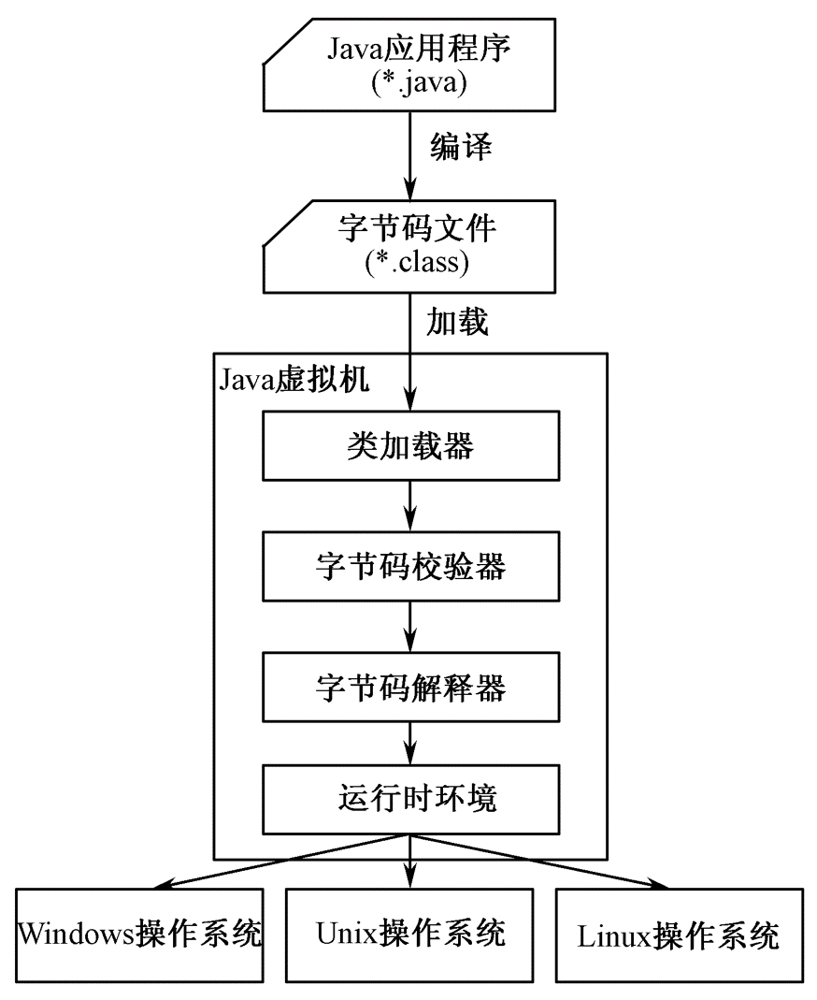

## 第一章 Java概述

#### 1. Java 特点

```
1. 平台无关性 （通过jvm实现）
2. 完全面向对象和简单性（放弃全局变量，goto，宏定义，全局函数，结构，联合和指针。放弃多继承，采用单继承+接口实现，放弃友元类，运算符重载。提供内存自动管理）
3. 可靠性（严密的语法规则，编译时严格检查错误，提供异常处理机制，内存自动回收管理机制）
4. 安全性
5. 多线程
6. 直接支持分布式网络应用，JSP, TCP/IP Socket编程
```

#### 2. java程序运行过程



#### 3. Java jdk目录结构

```
1. bin - 工具和程序，可帮助开发、执行、调试、保存Java程序
2. include - C头文件，支持使用java本机界面、JVM TM工具界面以及java平台的其他功能进行本机代码编程的头文件。
3. lib - 附加库，开发工具需要的附加类库和支持文件，并且放置了JDK的源文件（src.zip）。
```

#### 4. Java应用程序的两种形式

```
1. Application 
	能独立运行的应用程序，有控制台和图形界面两种运行方式。
2. Applet
	嵌入到Web页面运行，通过浏览器中的Java解释器执行。
```

#### 5.  程序规范

```
1. 程序开始加注释（目的，作者，最后修改时间等）
2. 标识符都采用驼峰命名法。另外类名以大写字母开头，常量全部字母大写。
3. 标识符由字母、数字、下划线、美元符组成。
```

## 第二章 Java语言基础

#### 1. 数据类型

1. 数据类型定义

    ```
    数据  是描述客观事物的数字、字符、以及所有能输入到计算机中并能被计算机接受的各种符号的集合。数据是计算机程序的处理对象。
    类型  是具有相同逻辑的一组值的集合。
    计算机语言中， 数据类型  是一个类型和定义在这个类型上的操作集合。数据类型定义了数据的性质、取值范围以及对数据所能进行的运算和操作。
    ```

2. 数据类型分类

    1. 基本数据类型

        ```java
        byte short int long float double char boolean
        ```

    2. 引用数据类型（可理解为地址）

        ```java
        数组（array）
        类（class）
        接口（interface）
        ```

        

3. 数据类型注意事项

    ```java
    小数在Java中默认为double类型。float类型要加上f后缀。
    
    整数在Java中默认为int类型。long类型要加上L后缀。
    
    布尔类型不能转换成数字表示形式。一个数字不能表示 true OR false
    
    字符类型char 表示Unicode字符，占用16位（2字节）。
    
    字符常量两种表示方法：①'A', 'a'
    				  ②'\u0000'-'\uffff'
    ```

4. Java基本数据类型自带默认值，0，false，'\u0000'

5. 常量用final修饰，常量名全部大写

#### 2. 运算符

```
1. | 和 & 不短路
2. || 和 && 短路
3. instanceof 实例运算符
	A instanceof B A是否是B类型
```

#### 3. switch的case取值可以是byte、short、int、char、String