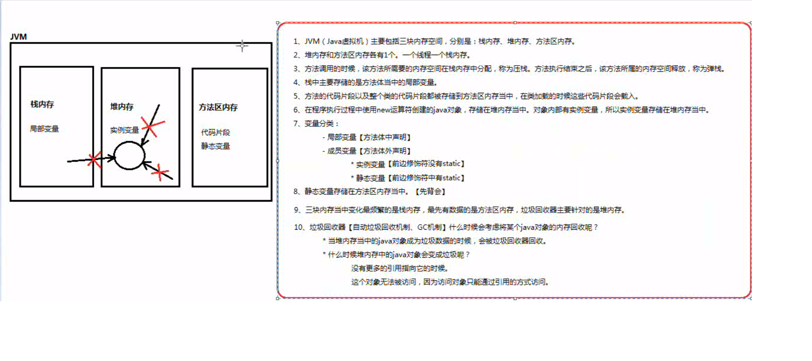
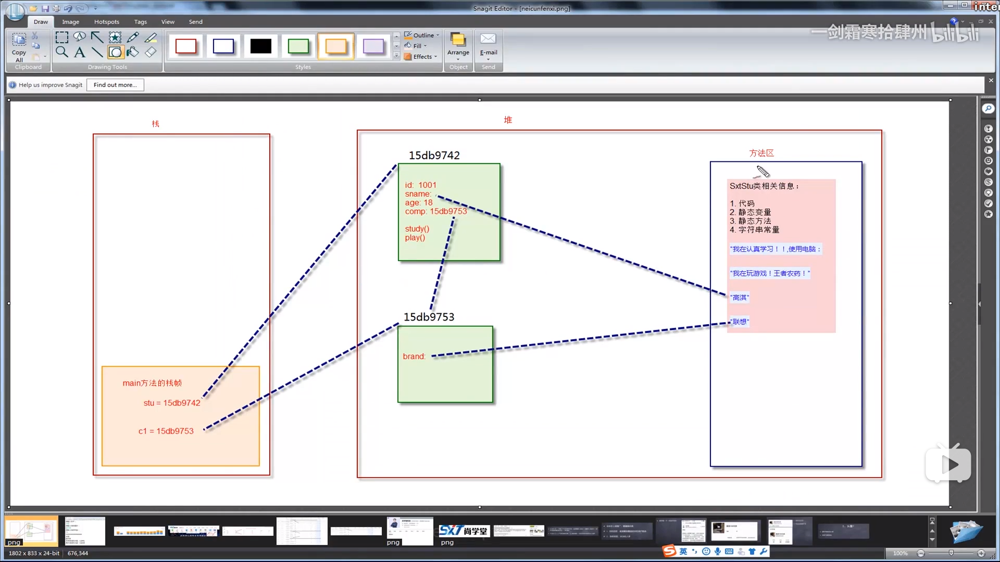

## 一、基础知识

##### 1. 运算符

```java
1. 包含： 
	+-*\%等等
2. %运算符
	式子的正负和左边操作数相同， 例7%-3=1;  -7%3=-1.
3. 两个操作数，一个为 long, 结果也为 long ， 否则为 int, 即使操作	数全为 short,byte.
4. 两操作数全为 float ，结果为 float, 否则为 double.
```
##### 2.八大基本数据类型之间的互相转换

```java
① 八大数据类型：
	整形: byte(1), short(2), int(4), long(8字节)
    浮点型： float(4)， double(8)
    布尔型： boolean(1)
    字符型： char(2) //java用unicode编码，char可直接赋值为中文
② 转换规则：
	1. 八种基本数据类型中，除布尔类型外，都可相互转换
	2. 小容量向大容量进行自动类型转换
	byte < short = char < int < long < float < 	double
		注：任何浮点类型都比整型容量大
	3. 大容量转小容量进行强制类型转换， 否则编译不通过， 另会有可能损失精度，谨慎使用
	4. 当整数字面值没有超出byte, short, char的取值范围， 可直接复制给byte, short, char类型的变量
	    注：是字面值，不是变量值
	5. byte, short, char 混合运算的时候， 各自先转换成int再算
		所以： byte a = 3；// right
			  a = a + 3; //编译错误， a+3是个int,编译时不能保证a+3不超byte范围， 故报错。
	6. 多种数据类型混合运算， 先转换成容量最大的哪种类型再作运算。
	
```


##### 3. +运算符
```java
1. 求和 或 连接字符串
2. 两操作数全为数字， 作为求和运算， 有一个为字符或字符串，作为字符串	连接符。
3. 式子含有多个 + ， 遵循从左至右依次运算。
	例： 10 + 20 + "30" 代表字符串 "3030"
         "10" + 20 + 30 代表字符串 "102030"
    
```


##### 4. 扩展类的赋值运算符

```java
1. 类型：
	+= -= *= \= %= 
2. 特点：
	此类赋值运算符不改变运算结果的类型
	即，byte a = 1;
	a += 1等价于 a = (byte)(a+1)
          而不等价于 a = a+1， 此式子会报错。
```

##### 5. a **= b+3; 等价于 a = a*(b+3)

##### 6. 逻辑运算符

```java
1. 分类
	&(逻辑与) // 两真为真	
    |(逻辑或) // 两假为假
    !(逻辑非) // 真为假， 假为真
    ^(逻辑异或) // 两算子只要不一样就是真
	&&(短路与) // 运算式子结果和逻辑与相同， 但会短路
    ||(短路或) // 运算式子结果和逻辑或相同， 但会短路
    
 2. 逻辑运算符要求两边算子都是布尔类型，且最终结果也是布尔类型
 	注：区别于c语言， int不能表示真假， 只有boolean才能。
 3. &和|既是逻辑运算符，又是位运算符，两操作数为boolean类型，作为逻辑运算符（区别于&&,||),两操作数为整数时，作为位运算符。
	注：上述左右操作符要为同类型，否则报错。
```

##### 7. 字符串链接符 "+"

```
3+"4"+5=345             
3+4+"5"=75                   
3+'a'=100    ('a'的unicode编码为97）
```

##### 8. 逻辑运算符优先级

```
逻辑非>逻辑与>逻辑或
例如a||b&&c等价于a||(b && c)
```

##### 9. 自动类型转化

```java
 示例1：
	byte a=1, b=2;     
    byte c = a + b;报错，因为a,b是变量，可能会超过byte的范围，编				译器会自动把a+b的结果转化为int类型。
    byte c = 1 + 2;正确，因为编译器可以确定表达式结果不会超过byte				范围。
示例2：
	byte a = 1;
	a += 128；//等同于 a = (byte)(a+128), 不等同于a = a+128
    //故，a+=128不会报错，只会损失精度。
	//同时， 即使a = a+1也会报错，但a+=10000总不会错
```


##### 10. 强制类型转换

```java
int b = 2;    long a=20亿 * b;结果会溢出，后面表达式的类型为int,结果超出int范围，造成溢出，即使没有超出long范围，但结果仍然是错的。
解决办法：把其中一个值强制转换成long，例如long a = 20亿 * （long）b；      或者long a = 20亿 * 2L; 
```

##### 11. break和continue的标签用法；

```java
1. switch中， case可合并（同c语言）
    语法： 
    	case 1: case 2: case 10: 
			java语句；
			break;
2. 只能用于循环中， break终止标签所在的循环， continue终止标签所在的循环的本次循环。
```

##### 12. 基本类型传递的是该数据值的copy值
	引用类型传递的是该对象引用的copy值， 但指向的是同一个对象。


## 二、面向对象

##### 1. 类的定义

```java
/*1. 成员变量： 在类体当中， 方法体之外的变量。
	     赋值情况：成员变量没有赋值，系统赋初值（向0看齐）。*/
/*2. java数据类型：基本数据类型、引用数据类型*/
public class address{
    //..........
}
public class users{
    public static void main(String [] args){
        address addr = new address();
    }
    /*此时， address就是引用数据类型, "new在堆中分配空间， 返回地址给addr, addr是地址的引用， java中不能通过地址来修改堆内存（此时分配的address）中变量的值， 只能通过引用addr来修改值"*/
    //引用是变量， 此变量保存了指向堆内存中的对象的地址
}

```

##### 2. 内存分析


```java
/**
1. JVM(java虚拟机)主要包括三块内存空间， 分别是：栈内存、堆内存、方法区内存。
2. 堆内存和方法区内存各有一个， 一个线程一个栈内存。
3. 方法调用的时候， 该方法所需要的内存空间在栈内存中分配， 称为压		栈；方法执行结束后， 该方法所属的内存空间释放， 称为弹栈。
4. 栈中主要存储的是方法体中的局部变量。
5. 方法的代码片段以及整个类的代码片段都被存储到方法区内存当中， 在类加载的时候， 这些代码片段会载入。
6. 在程序执行过程中， 使用new运算符创建的java对象， 存储在堆内存中， 对象内部有实例变量， 所以实例变量存储在堆内存中。
7. 变量分类：
	-局部变量【方法体中生命】
	-成员变量【方法体外生命】
			*实例变量【前面修饰符没有static】“引用.”
			*静态变量【前面修饰符中有static】“类名.”
8. 静态变量存储在方法区内存中。
9. 三块内存中， 变化最频繁的是栈内存， 最先有数据的是堆内存， 垃圾回收器主要针对的是堆内存。
10. 垃圾回收器【自动垃圾回收机制、GC机制】考虑回收某个java对象的内存的条件：
	*当堆内存中的java对象 成为垃圾数据（① 没有更多的引用指向它；②这个对象无法被访问， 因为访问对象只能通过引用的方式访问）的时候， 会被垃圾回收器回收。
11. 静态变量需要用“类名.”的方式访问， 但是使用“引用.”的方式访问程序不会报错， 实际执行时， 和引用没关系， 仍是执行的“类名.”的方式， 因此， 即便是引用为空， 调用静态变量， 也不会出现空指针异常， 但最好不要采用引用调用静态方法和变量。
*/
```



##### 3. this的本质

```java
public class testThis{
    int a, b, c;
    
    testThis(int a, int b){
        this.a = a;     //a一般采用就近原则， 此处不指名都为形参里的a。
        // a = a; 		  此时， 两个a都是指 testThis(int a, int b) 中的a。
        this.b = b;
    }
    //构造器重载
    testThis(int a, int b, int c){
        //方式一
        /*
        this.a = a;
        this.b = b;
        this.c = c;
        */
        //方式二
        this(a, b);//构造函数调用必须是构造函数的第一个语句。
        			//调用构造函数也不同， 没有函数名。
        this.c = c;//若把this（a， b）放到不是第一语句， 程序报错！！！
    }
}
```



```java
this 不能用于 static 方法中， 因为初始化时， 还没有产生对象， 就没有this。
```

##### 4. static关键字

```java
static 修饰的成员变量和方法从属于类；
普通对象和方法从属于对象；
static 方法不可直接访问非 static 的成员；
一、可以用 static 关键字定义“静态代码块”：
	1. 语法格式：
		static {
			java 语句;
		}
	2. 在类加载时执行 (main()函数之前), 并且只执行一次。
	3. 一个类中可以编写多个， 并遵循自上而下顺序。
	4. 作用：
		- 和需求有关， 例如要求在类加载时刻执行代码完成日志的记录。
		- 执行特殊的程序和预备工作。例如数据的准备工具：初始化连接池， 解析XML配置文件......
二、 初始化块（不常用）:
	1. 语法格式：
		{
			java 语句;
		}
	2. 在构造函数执行之前执行， 不new对象， 不会执行。
三、 main方法可重载。
```

##### 5. 静态初始化块

```java
形式：static {
     ......(静态变量或函数)
	 }
作用：用于类的初始化工作
注意：静态初始化块中， 不能直接访问非 static 成员
	 在构造函数调用之前执行
执行顺序：上溯基类， 直到上溯到 Object 类， 先执行 Object 类的静态初始化块， 再向下执行子类的静态初始化块，直到执行完本类的静态初始化块为止。 
```

​		构造方法和上述执行顺序一致！！！

##### 6.继承

```java
1. “基本”作用：代码复用， 但最重要的作用还是有了继承，才有以后的“方法的覆盖”和“多态机制”。
2. 语法格式：
	【修饰符列表】 class 类名 extends 父类名{
		类体 = 属性 + 方法;
	}
3. 术语：若B类继承A类
		A类称为：父类、基类、超类、superclass
		B类称为：子类、派生类、subclass
4. java中， 子类继承父类的数据范围：
	- 私有的不支持继承
	- 构造方法不支持继承
	- 其他数据都可以继承
5. java只支持单继承， 但可以间接继承其他类。
	C extends B{}
	B extends A{}
	A extends T{}
	其中， C直接继承B类， 但间接继承了T和A类。
6. java语言中， 假设一个类没有显式地继承任何类， 该类默认继承javase库当中提供的java.lang.Object类(所有类的祖先)。
```

##### 7. 方法重写

```java
满足方法重写的条件：
	- 方法重写发生在具有继承关系的父子类之间。
	- 重写时， 返回值类型相同， 方法名相同。
	- 重写时， 访问权限不能更低。
		public > protected > default > private
    - 重写时， 抛出异常不能更多。
    - 构造方法和私有方法不能继承， 所以不能覆盖。
    - 静态方法不存在覆盖。
    - 覆盖只针对方法， 不谈属性。
```

##### 8. 多态

```java
一、基础语法
    1.父类型引用指向子类型对象，这种机制导致程序存在编译阶段(静态绑定)和运行阶段(动态绑定)两种不同的形态/状态， 这种语法机制可以称为一种多态语法机制。
    2. 子类转换成父类： 向上转型、upcasting、自动类型转换。
        //向上转型只要编译通过， 一定能运行。
        /**
        ①、用子类可以初始化父类引用。
        ②、在①的前提下， 父类如果调用子类特有方法， 编译期在父类的字节码文件中没找到此方法， 导致静态绑定失败， 编译不通过(可通过强制类型转换实现)。
        ③、在①的前提下， 父类调用子类继承父类的方法， 无论是否重写此方法， 调用的仍是子类的方法。
        ④、总结： 父类引用指向一个对象， 是否能调用某函数， 取决于该引用所指代的类(父类)是否含有该方法； 执行期执行的函数是堆中对象的函数， 和指向该对象（父类）的引用类型无关。  
        */
    3. 父类转换成子类(需要强制转换符)： 向下转型、downcasting、强制类型转换。
        //向下转型， 即便编译通过， 运行期仍可能异常， 向下转型存在隐患。
        应用：父类引用指向子类对象， 使用父类引用调用子类特有的方法和属性编译不通过， 此时需要向下转型。
    4. 异常：
        bird extends animal{}
        cat extends animal{}
        animal a = new bird();//向上转型
        bird b = (bird)a;//向下转型
        cat c = (cat)a;//向下转型， 编译通过， 符合语法， 但是jvm堆内存中真实存在的对象是bird类型， bird类型对象无法转换成cat对象，因为cat类和bird类没有任何继承关系， 运行阶段异常。该异常十分常见----java.lang.ClassCastException(常发生于向下转型时)。
    5. 避免3异常的运算符-instanceof
        - 语法格式：
                (引用 instanceof 数据类型名)
        - 上述表达式返回结果是 boolean 类型。
        - 关于返回值(假设： a instanceof animal)
            true: a这个引用指向的对象是一个animal类型。
            false:a这个引用指向的对象不是一个animal类型。
        - java规范中要求：在进行强制类型转换之前， 建议采用instanceof运算符进行判断， 避免ClassCastException异常的发生。
二、 作用
	1. 降低程序耦合度， 提高程序扩展能力。
	2. 使用父类类型引用指向子类型对象(方法形参用父类引用， 传参可用任意子类， 达到多态， 提高扩展能力)。
	3. 能多态， 尽量用多态。
	核心：面向抽象编程， 不要面向具体编程。
```

##### 9. final关键字

```java
1. final 是一个关键字， 表示最终的， 不可变的。
2. final 修饰的类无法被继承。
3. final 修饰的方法无法被覆盖。
4. final 修饰的变量一旦赋值，不可重新赋值。
5. final 修饰的实例变量(实例变量系统赋默认值， 而final修饰后， 一经赋值无法修改， 故java语言规定， final修饰的实例变量必须手动赋初始值， 不能采用系统默认值， 否则编译错误)。
	/**
	* 解决办法：
	* 		1. final int a = 10;//直接赋初始值。(构造函数执行时完成赋值操作)
	*       2. final int b;//构造函数中赋初识值。(二者本质一样)
	*/
6. final 修饰的引用，指向某个对象后，不能指向别的对象，仍可通过该引用修改指向对象的属性。(本质同4， 修改对象属性， 引用指向没改变)
7. 通过final定义常量：
	- final 一般和 static 联合使用修饰成员变量， 即为常量。
	- 常量定义语法格式：
		public static final 类型 常量名（规范要求所有字母大写) = 值;
```

##### 10. java语言包机制

```java
1. 包又称为 package, java中引入package这种语法机制主要是为了方便程序的管理。不同功能的类被分门别类放到不同的软件包中，查找比较方便，管理比较方便，易维护。
2. 定义一个 package ：
	 - 在java源程序的第一行编写 package语句
     - package只能编写一个语句
     - 语法结构：
     		package 包名;
3. 命名规范：(降低重名率)
	公司域名倒序+项目名+模块名+功能名;
	例：com.baidu.javase.day1;
4. 包名要求全部小写，包名也是标识符，必须遵守标识符的命名规则。
5. 一个包对应一个目录。
6. 使用了package 机制之后的编译和运行：（一般不用，直接用集成开发环境可忽视次过程）
	方式1：
		- 类名(假如是 Test )变为com.baidu.javase.day1.Test
		- 编译: javac java源文件路径
		- 手动方式创建目录(在.java目录下创建com文件夹，然后在com文件夹下创建baidu文件夹， 以此类推，最后创建day1文件夹，再把Test.class剪切到day1文件夹下)。
		- 运行(先切换到com所在的路径)： java com.baidu.javase.day1.Test
	方式二：（编译+运行）（自动建文件夹）
		- 编译：javac -d 编译后的存放路径 java源文件路径
		- 例如：将F:\Hello.java文件编译后放到C盘根目录
				javac -d C:\ F:\Hello.java
		- javac -d . *.java
			将当前路径中所有java文件编译之后放到当前目录下
7. 一个类使用同一包下的类时，不需要加包名，否则需要加包名.类名(可以用import导入包中某一类后，可直接使用类名)
8. import 关键字
	- 作用：导入其他类，同一包下的类不需要导入，不在同一包下需要手动导入。
	- 语法格式：
		import 类名（完整名，如com.baidu.javase.day1.Test）;
		import 包名.*（导入该包下所有类）
    - import语句编在 package语句之下， class语句之上;
	java.lang.*  java语言包是java语言的核心类， 不需要手动导入，系统自动导入。
	- 需要 import导入的情况：
		不在java.lang包下并且不在同一包下，需要导入。
```

##### 11. 访问权限修饰符

```java
1. 访问权限修饰符用来控制元素的访问范围。
2. 包括：
	- public 公开的，任何位置都可访问
	- 缺省 只能在同包下访问
	- protected 同包下或者子类中(子类可以不在此包中)
    - private 私有的，只能在本类中访问
3. 访问权限修饰符可以修饰类、变量、方法......
4. 类只能用public 或缺省 修饰（内部类除外）
4. 当某个数据只希望子类使用时，用protected修饰
5. 修饰符范围：
	private < 缺省 < protected < public
```

