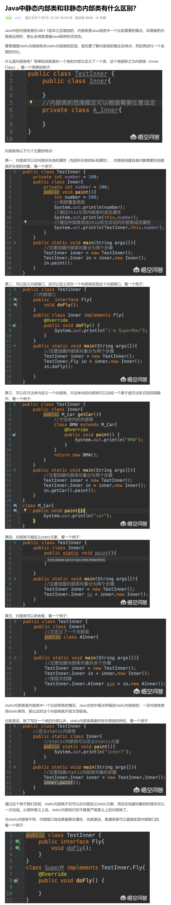

# 初始化与清理

#### 0.规范

```
1. final和static同时修饰的基本数据类型，变量名全部大写，用下划线分隔各个单词。
```


#### 1. 静态初始化

```
1. 静态初始化只有在必要时刻才会进行，只有在第一次访问静态数据（或者第一个对象被创建(因为构造函数也是静态方法)）的时候， 静态变量才会被初始化。
2. 初始化的顺序是：先静态对象(注意第3点)， 后非静态对象，然后才调用构造函数
3. 构造器也是static 方法，尽管static 关键字没有显式地写出来。因此更准确地讲，类是在其任何static 成员被访问时加载的。
```

#### 2. 静态块（静态子句）

```
1.只有在必要时刻才会进行，只有在第一次访问静态数据（或者第一个对象被创建）的时候， 静态变量才会被初始化。
2. 格式：
	static {
		.......
	}
```

#### 3.  非静态实例初始化

```
1. 语法格式 {}
2. 语句块， 在构造函数之前初始化。
```

#### 4. 数组初始化

```
1. int[] a1 = {1, 2, 3, 4, 5};
	等价于使用new来分配空间
	a1 是数组的引用

```

#### 5. this关键字

```java
1. 在构造器中调用构造器
	public class f{
		f(int a){...}
		f(int a, int b){
			this(a);
			......
		}
	}
	this调用别的构造器，必须置于起始处，否则编译报错（也就是说只能调用一个构造器）
2. static方法是没有this的方法，在static方法内部不能调用非静态方法（不是完全不可能），反之可以。
```

#### 6. 清理：终结处理和垃圾回收（finalize（）方法）

```
补充1：垃圾回收器准备释放对象占用的存储空间时，将首先调用其finalize()方法，并且在下一次垃圾回收动作发生时，才会真正回收对象占用的内存。
补充2：无论是“垃圾回收”还是“终结”， 都不保证一定会发生。如果jvm并未面临内存耗尽的情形，他是不会浪费时间去执行垃圾回收以恢复内存的。

1. 三点知识
	① 对象可能不被垃圾回收
	② 垃圾回收不等于析构
	③ 垃圾回收只与内存有关
2. 垃圾回收器只释放由new分配的内存， 所以如果有对象获得了一块‘特殊’的内存区域，需要定义finalize()方法（不等同于析构函数）。
3. finalize（）主要作用于使用“本地方法”情况， 调用非java代码， 如c语言的malloc函数申请内存， 要自己释放， 垃圾回收机制不知道如何释放该内存， 要在finalize函数中调用free（）函数释放内存。
```

#### 7. 可变参数列表

```java
1. class aaa{}
public class array {
    static void printArr(Object[] args){
        for(Object obj : args){
            System.out.print(obj.getClass().getName() + "  ");
        }
        System.out.println();
    }
    public static void main(String[] args) {
        printArr(new Object[] {new aaa(), 1, 1.0, 3L});
    }
}
//java se5之后可以用下面这种方法
2. static void fun(Object... args){
	for(Object obj : args)System.out.print(obj + "  ");
}
	//另外可以采用下面这种方法调用
	fun(aaa(), 1, 1.0, 3L);
	//第一种定义，这样调用会报错。	
	/*错误:(19, 9) java: 无法将类 mycode.array中的方法 		printArr应用到给定类型;
  	需要: java.lang.Object[]
  	找到: mycode.aaa,int,double,long
  	原因: 实际参数列表和形式参数列表长度不同*/
3. 使用2时， 可变参数列表可以和自动包装机制共存，自动包装机制将有选择的将int参数提升为Integer.
4. 当不使用参数调用可变参数列表时， 编译器会不知道调用哪一个方法， 可以通过在某个方法中增加一个非可变参数来解决。
5. 注意：你应该总是只在重载方法的一个版本上使用可变参数列表， 或者压根就不是用它。
```

#### 8. enum类型

```java
1. 定义 // enumWeek.java
	public enum enumWeek{
    	monday, tuesday, wednesday, thursday, friday, 			saturday, sunday //常量一般大写
	}
2. 使用 // enumInstance.java
    public class enumInstance {
    public static void main(String[] args) {
        enumWeek week = enumWeek.friday;//定义引用使用它
        for(enumWeek e : enumWeek.values()) 				System.out.println(e + ", ordinal = "+e.ordinal());
    }
	}
	/*
	* 运行结果
	* monday, ordinal = 0
	* tuesday, ordinal = 1
	* wednesday, ordinal = 2
	* thursday, ordinal = 3
	* friday, ordinal = 4
	* saturday, ordinal = 5
	* sunday, ordinal = 6
	*/
3. enum会创建toString()方法，这正是能直接sout的原因。
4. enum会创建ordinal()方法，表示某个常量的声明顺序。
5. enum会创建static values()方法，按照常量的声明顺序，产生这些常量值构成的数组，可以用 values()[1]，表示第二个枚举tuesday。
6. enum看起来类似于一个数据类型，但是enum是一个类，并且具有自己的方法。可以吧enum当做任何类一样来处理。
7. 与switch配合使用，是个绝佳组合。
```

# 第六章 访问权限控制

## 1. 组合与继承

```
在面向对象编程中，可以运用组合技术使用现有的类来开发新的类，而继承技术是不太常用的。在OOP时，应慎用继承。继承的使用场合仅限于你确信使用该技术确实有效的情况。

到底该用组合还是继承，一个最清晰的判断方法就是问问自己是否需要从新类向基类进行向上转型。如果必须向上转型，则继承是必要的；如果不需要，则应当好好考虑自己是否需要继承。
```

## 2. final关键字

```
1. 对于基本数据类型，final使数值恒定不变；对于对象引用，final使引用恒定不变（一旦引用被初始化指向一个对象，就无法再把它改为指向另一个对象。然而，对象其自身却是可以被修改的，java未提供是任何对象恒定不变的途径，但是可以自己编写类实现此效果），这一限制同样适用于数组，它也是对象。

2. 我们不能因为某数据是final，就认为在编译时就可以知道它的值。例如
private final int i4 = rand.nextInt(20);
static final int INT_5 = rand.nextInt(20);

3. java允许生成“空白final（blank final）”（指被声明为final但又未给定初值的域）。无论什么情况，编译器都确保空白final在使用前被初始化。如何做到这样？就是必须在域的定义处或者每个构造器中用表达式对final进行赋值。

4. java允许在参数列表中以声明的方式将参数指明为final。这意味着在方法中无法更改参数引用所指向的对象（同1）。

5. private方法属于final方法
```

# 第章 多态

## 1. 实现多态时，要覆盖父类的方法，而不是重载

```java
//file1.java
public enum Note{
    MIDDLE_C, C_SHARP, B_FLAT;
}
//file2.java
class Instrument{
	public void play(Note n){
        System.out.println("Instrument.play()");
    }
}
//file3.java
public class Wind extends Instrument{
    //注意play的参数列表，和父类一样，谓之方法覆盖
    public void play(Note n){
        System.out.println("Wind.play() " + n);
    }
}
//file4.java
public class Music{
    public static void main(String [] args){
        Wind flute = new Wind();
        tune(flute);//Upcasting
    }
}
/*-------Output-------------
Wind.play() MIDDLE_C
*--------End---------------/
```

## 2. 方法调用绑定（将一个方法调用同一个方法主体关联起来被称作绑定）

```
前期绑定：在程序执行之前进行绑定（如果有的话，由编译器和连接程序实现）
后期绑定（动态绑定或运行时绑定）：在运行时根据对象的类型进行绑定。
```

## 3. 注意点（缺陷：“覆盖私有方法”）

结论：只有非private方法才可以被覆盖

例子：

```java
public class PrivateOverride{
	private void f(){
        System.out.println("private f()");
    }
    public static void main(String[] args){
        PrivateOverried po = new Derived();
        po.f();
    }
} 
class Derived extends PrivateOverride{
    public void f(){
        System.out.println("public f()");
    }
}
/*******Output*****
private f()
********End*******/
/*
我们期望的输出是public f()， 但是由于private方法被自动认为是final方法，而且对导出类时屏蔽的。因此，在这种情况下，Derived类中的f()方法就是一个全新的方法；既然基类f()方法在子类Derived中不可见，因此甚至也不能被重载。
*/
```

## 4. 注意点（缺陷：域与静态方法）

只有普通的方法调用可以是多态的，静态方法的行为也不具有多态性。例如，如果你直接访问某个域，这个访问就将在编译期进行解析，如下例子：

```java
class Super{
	public int field = 0;
    public int getField(){return field;}
}
class Sub extends Super{
    public int field = 1;
    public int getField(){return field;}//覆盖
    public int getSuperField(){return super.field;}
}
public class FieldAccess{
    public static void main(String[] args){
        Super sup = new Sub();//Upcast
        System.out.println(sup.field + " " + sup.getField());
    }
}
/*********Output******
0 1
***********End*******/
/*
当Sub对象转型为Super引用时，任何域访问操作都将由编译器解析，因此不是多态的。在本例中，为Super.field和Sub.field分配了不同的存储空间。
*/
```

## 5. 构造器和多态

1. 基类的构造器总是在导出类的构造过程中被调用，而且按照继承层次逐渐向上链接，以使每个基类的构造器都能得到调用。

2. 组合、继承以及多态在构建顺序上的作用举例：

    ```java
    class Meal{
        Meal(){print("Meal()");}
    }
    class Bread{
        Bread(){print("Bread()");}
    }
    class Cheese{
        Cheese(){print("Cheese()");}
    }
    class Lettuce{
        Lettuce(){print("Lettuce()");}
    }
    class Lunch extends Meal{
        Lunch(){print("Lunch()");}
    }
    class PortableLunch extends Lunch{
        PortableLunch(){print("PortableLunch()");}
    }
    public class Sandwich extends PortableLunch{
        private Bread b = new Bread();
        private Cheese c = new Cheese();
        private Lettuce l = new Lettuce();
        public Sandwich(){print("Sandwich()");}
        public static void main(String[] args){
            new Sandwich();
        }
    }
    /*******Output*******
    Meal()
    Lunch()
    PortableLunch()
    Bread()
    Cheese()
    Lettuce()
    Sandwich()
    **********End*******/
    ```

    由上可见复杂对象调用构造器要遵照下面的顺序：

    ```
    调用基类构造器。这个步骤会不断反复递归下去，首先是构造这种层次结构的根，然后是下一层导出类，等等，直到最低层的导出类（本类的直接父类）。
    按声明顺序调用成员的初始化方法。
    调用导出类构造器的主体。
    ```

3. 构造器内部的多态方法的行为

    ```java
    class Glyph{
    	void draw(){print("Glyph.draw()");}
        Glyph(){
            print("Glyph() before draw()");
            draw();
            print("Glyph() after draw()");
        }
    }
    class RoundGlyph extends Glyph{
        private int radius = 1;
        RoundGlyph(int r){
            radius = r;
            print("RoundGlyph.RoundGlyph(), radius = " + radius);
        }
        void draw(){
            print("RoundGlyph.draw(), radius = " + radius);
        }
    }
    public class aaa{
        public static void main(String[] args){
            new RoundGlyph(5);
        }
    }
    /*******Output*******
    Glyph() before draw()
    RoundGlyph.draw(), radius = 0
    Glyph() after draw()
    RoundGlyph.RoundGlyph(), radius = 5
    **********End*******/
    /*
    Glyph.draw()方法设计为将要被覆盖，这种覆盖是在RoundGlyph中发生的，但是Glyph构造器会调用这个方法，结果导致了RoundGlyph.draw()的调用。当Glyph的构造器调用draw（）方法时，radius不是默认初始值1，而是0。所以这样的方式，会使结果难以预料。从而得出以下结论（初始化的实际过程）
    */
    ```

    ​	初始化的实际过程：

    ```
    1. 在其他任何事物发生之前，将分配给对象的存储空间初始化成二进制的零。
    2. 如前所述那样调用基类构造器。此时调用被覆盖后的draw()方法（要在调用RoundGlyph构造器之前调用），由于步骤1的缘故，我们此时会发现radius的值为0.
    3. 按照声明的顺序调用成员的初始化方法。
    4. 调用导出类的构造器主体。
    
    这样做的优点：所有东西都至少初始化为0
    ```

## 6. 协变返回类型（导出类（子类）覆盖（即重写）基类（父类）方法时，返回的类型可以是基类方法返回类型的子类）

```java
class Grain{
	public String toString(){return "Grain";}
}
class Wheat extends Grain{
    public String toString(){return "Wheat";}
} 
class Mill{
    Grain process(){return new Grain();}
}
class WheatMill extends Mill{
	//方法覆盖；
    Wheat process(){return new Wheat();}
}
/*
java SE5与java较早版本之间的主要差异就是，较早版本将强制process()的覆盖版本必须返回Grain，而不能返回Wheat，尽管Wheat是从Grain导出的。协变返回类型允许返回更具体的Wheat类型。
*/
```

7. 向下转型与运行时类型识别

    ```
    java语言中，所有的转型都会得到检查，即使是用加括号形式的类型转换，在运行期时仍然会对其进行检查，以便保证它的确是我们希望的那种类型。如果不是，就会返回一个ClassCastException（类转型异常）。这种在运行期间对类型进行检查的行为称作“运行时类型识别”（RTTI）。
    例如父类引用指向子类对象，如果想要访问子类扩展的方法，就可以尝试进行向下转型。
    ```

## 第九章 接口

## 1. 抽象类和抽象方法

1. 抽象类：包含抽象方法的类
2. 如果一个类包含一个或多个抽象方法，该类必须被限定为抽象的，否则编译器报错。
3. 如果一个抽象类不完整，那么当创建该类的对象时，编译器会报错。
4. 如果从一个抽象类继承，并想创建该新类的对象，那么就必须为基类的所有抽象方法提供方法定义。如果不这样做（可以选择不做），那么导出类便也是抽象类，且编译器将会强制我们用abstract关键字来限定这个类。
5. 我们可能会创建一个没有抽象方法的抽象类。（如果有一个类，让其包含任何abstract方法都显得没有实际意义，而且我们也想要阻止产生这个类的任何对象，那么这样做就有意义了）

## 2. 接口

1. 可以在interface前面添加public关键字（但仅限于该接口在与其同名的文件中被定义）。如果不添加public，则它只具有包访问权限，这样它就只能在同一个包内可用

2. 接口也可以包含域，但是这些域隐式地是final和static的。

3. 接口中被定义的方法必须是public的，可以选择在接口中显式地将方法声明为public，但即使不这么做，它们默认也是public的。

3. 使用接口的原因：

    ```
    reason1（核心原因）：为了能够向上转型为多个基类类型（以及由此而带来的灵活性）（一个类继承了多个接口，这个类能够向上转型为任意一个继承的接口类型）。
    reason2（与使用抽象基类相同）：防止客户端程序员创建该类的对象，并确保这仅仅是建立一个接口（引发出下一问题，该用接口还是抽象类？）。
    reason3：允许同一个接口具有多个不同的具体实现。
    ```

4. 使用接口创建常量组(java SE5之后，使用更强大灵活的enum来定义，使用接口的方式意义不大)

    ```java
    public interface Months{
        int
            JANUARY = 1, FEBRUARY = 2, MARCH = 3, ......, NOVEMBER = 11, DECEMBER = 12;
    }
    ```

5. 初始化接口中的域

    ```
    1. 在接口中定义的域（一定是final static）不能是“空final”， 但是可以被非常量表达式初始化。他们在类第一次被加载时初始化（这发生在任何域首次被访问时）。
    ```

    

6. 在打算组合的不同接口中使用相同的方法名通常会造成代码可读性的混乱，请尽量避免这种情况。

7. 该使用接口还是抽象类？

    ```
    如果要创建不带任何方法定义和成员变量的基类，那么就应该选择接口而不是抽象类。
    事实上，如果知道某事物应该成为一个基类，那么第一选择应该是使它成为一个接口。
    ```

    

8. 完全解耦（待补充，没看太明白）

    1. 策略设计模式：创建一个能够根据所传递的参数对象的不同而具有不同行为的方法。

        ```
        这类方法包含所要执行的算法中固定不变的部分，而“策略”包含变化的部分。
        策略就是传递进去的参数对象，它包含要执行的代码。
        ```

    2. 适配器设计模式：将一个类的接口转成客户期望的另外一个接口。适配器模式使得原本由于接口不匹配而不能一起工作的那些类可以一起工作。
    3. 工厂方法设计模式：与直接调用构造器不同，我们在工厂对象上调用的是创建方法，而该工厂对象将生成接口的某个实现的对象。（理论上，我们的代码将完全与接口的实现分离，这就使我们可以透明的将某个实现替换为另一个实现）。
    4. 迭代器设计模式。

4. java中的多重继承（接口是实现多重继承的途径）

    1. 将一个具体类和多个接口组合到一起时（用一个类继承这个类和这些接口），这个具体类必须放在前面，后面跟着的才是接口，否则编译器报错。例如：

        ```java
        class Hero extends Action implements CanFight, CanSwim, CanFly{}
        //class Hero implements CanFight, CanSwim, CanFly extends Action{}
        //上面这样写编译器报错。
        ```

5. 嵌套接口（内部接口）：接口可以嵌套在类或其他接口中。

    ```
    1. 像非嵌套接口一样，嵌套接口可以拥有public和“包访问”两种可视性。同时作为一种新添加的方式，接口也可以被实现为private的（接口嵌套于类中）。
    2. 接口嵌套于接口中，必须为public。
    3. 内部接口只能是static（可以省略不写，默认也是静态的），因为接口不能被实例化，只有静态的才有意义。
    例子：
    //Map.java
    
    public interface Map {
        interface Entry{
            int getKey();
        }
    
        void clear();
    }
    
    //MapImpl.java
    
    public class MapImpl implements Map {
    
    //如果Entry不是static的，使用Entry接口还需要构造Map对象。会出现什么问题，所以编译器不允许非静态。
        class ImplEntry implements Map.Entry{
            public int getKey() {
                return 0;
            }       
        }
    
        @Override
        public void clear() {
            //clear
        }
    }
    ```

## 第十章 内部类

可以将一个类的定义放在另一个类的定义内部，这就是内部类。

## 1. 如果想从外部类的非静态方法之外的任意位置创建某个内部类的对象，那么必须以   “外部类名.内部类名”的方式，具体指明这个对象的类型。

## 2. 内部类的作用：

```
1. 是一种名字隐藏和组织代码的模式。
2（最引人注目的）. 当生成一个内部类的对象时，此对象与制造他的外围对象之间就有了一种联系，所以他能访问其外围对象的所有成员，而不需要任何特殊条件。此外，内部类还拥有其外围类的所有元素的访问权。
```

## 3. 内部类自动拥有对其外围类所有成员的访问权的实现原理：

```
当某个对象创建了一个内部类对象时，此内部类对象必定会秘密地捕获一个指向那个外围类对象的引用。然后，在你访问此外围类的成员时，就是用那个引用来选择外围类的成员（编译器会帮助处理所有的细节）。

内部类的对象只能在与其外围类的对象相关联的情况下才能被创建（就想你应该看到的，在内部类是static类时）。构建内部类对象时，需要一个指向其外围类对象的引用，如果编译器访问不到这个引用就会报错。
```

## 4. 使用 .this 与 .new

1. 如果需要生成对外部类对象的引用，可以使用“外部类的名字.this”。这样产生的引用自动地具有正确的类型，这一点在编译期就被知晓并受到检查，因此没有任何运行时开销。例如：

    ```java
    public class DotThis{
        void f(){
            print("DotThis.f()");
        }
        public class Inner{
            public DoThis outer(){
                return DotThis.this;
            }
        }
        public Inner inner(){
            return new Inner();
        }
        public static void main(String[] args){
            DotThis dt = new DotThis();
            DotThis.Inner dti = dt.inner();
            dti.outer().f();
        }
        //output
        //DotThis.f()
    }
    ```

2. 有时你可能想要告知某些其他对象，去创建其某个内部类的对象。要实现此目的，必须在new表达式中提供对其他外部类对象的引用，这就需要.new语法，例如：

    ```java
    public class DotNew{
        public class Inner{}
        public static void main(String[] args){
            DotNew dn = new DotNew();
            //要想创建内部类对象，必须通过外部类的对象
            DotNew.Inner dni = dn.new Inner();
        }
    }
    ```

3. 在拥有外部类对象之前是不可能创建内部类对象的。也就是，要想直接创建内部类的对象，必须使用外部类的对象来创建，就像上面的程序那样。这就解决了内部类名字作用域的问题，因此不必声明（实际上也不能声明）dn.new DotNew.Inner()。

## 5. 在方法和作用域内的内部类

1. 可以在一个方法里面或者在任意的作用域内定义内部类，这么做的理由：

    ```
    1. 如果实现了某类型的接口，于是可以创建并返回对其的引用。
    2. 要解决一个复杂的问题，想创建一个类来辅助你的解决方案，但是又不希望这个类是公共可用的。
    ```

2. 在方法的作用于内（而不是在其他类的作用于内）创建一个完整的类，这被称作局部内部类：

    ```java
    public class Parcel5{
        public Destination destination(String s){
            classs PDestination implements Destination{
                private String label;
                private PDestination(String w){label = w;}
                public String readLabel(){return label;}
            }
           return new PDestination(s);
        }
        public static void main(String[] args){
            Parcel5 p = new Parcel5();
            Destination d = p.Destination("Tasmania");
        }
    }
    /*
    PDestination类时destination（）方法的一部分，而不是Parcel5的一部分，所以，在destination（）之外不能访问PDestination。
    */
    ```

## 6. 匿名内部类

```java
public class Parcel7{
    public Contents contnets(){
        return new Contents(){
            private int i = 11;
            public int value(){return i;}
        };//注意分号标记的是表达式的结束，和别的分号作用一样
    }
    public static void main(String[] args){
        Parcel7 p = new Parcel7();
        Contents c = p.contents();
    }
} 
```

contents()方法将返回值的生成与表示这个返回值的类的定义结合在一起。另外，这个类是匿名的，它没有名字。这种语法指的是：创建一个继承自Contents的匿名类的对象。通过new表达式返回的引用被自动向上转型为对Conents的引用。

1. 在匿名类中定义字段时，还能够对其执行初始化操作

    ```java
    public class Parcel9{
        public Destination destination(final String dest){
            return new Destination(){
                private String label = dest;
                public String readLabel(){
                    return label;
                }
            };
        }
        public static void main(String[] args){
            Parcel9 p = new Parcel9();
            Destination d = p.destination("Tasmania");
        }
    }
    /*
    如果定义一个匿名内部类，并希望它使用一个在其外部定义的对象，那么编译器会要求其参数引用时final的，否则报错。
    */
    ```

## 7. 嵌套类：

1. 如果不需要内部类对象与其外围类对象之间有联系，那么可以将内部类声明为static，这通常称为嵌套类。

    嵌套类意味着：

    1. 要创建嵌套类的对象，并不需要其外围类的对象。
    2. 不能从嵌套类的对象中访问非静态的外围类对象。

    嵌套类与普通的内部类还有一个区别：普通内部类的字段与方法，只能放在类的外部层次上，所以普通的内部类不能有static数据和static字段，也不能包含嵌套类。但是嵌套类可以包含所有这些东西。

## 8. 为什么需要内部类？

1. 每个内部类都能独立地继承自一个（接口的）实现，所以无论外围类是否已经继承了某个（接口的）实现，对于内部类都没有影响。
2. 内部类允许继承多个非接口类型（译注：类或抽象类）

## 9. 内部类知识补充

1. 网址：https://blog.csdn.net/vcliy/article/details/85235363

1. 

    


# 第十二章 通过异常处理错误

## 1. 能够抛出任意类型的Throwable对象，它是异常类型的根类。

## 2. 捕获异常

1. try块与异常处理程序

    ```java
    try{
    	//code
    }catch (Type1 a){
        //code
    }catch (Type2 a){
        //code
    }
    ```

2. 异常与记录日志

    java.util.logging

3. 异常说明

    ```
    0. 关键字throws
    1. 异常说明属于方法声明的一部分，后面接一个所有潜在异常类型的列表，多个异常类型用逗号分隔。例如
    void f() throws E1, E2, E3{//...}
    2. 从RuntimeException继承的异常，可以在没有说明的情况下被抛出。
    3. 如果一个函数声明部分有异常说明，那么在调用该函数时，必须放在try块里面，并catch异常类型。
    4. 方式：可以声明方法将抛出异常，实际上却不抛出。编译器相信了这个声明，并强制此方法的用户像真的抛出异常那样使用这个方法。
    	好处：这样做的好处是，为异常先占个位子，以后就可以抛出这种异常而不用修改已有的代码。
    	用途：定义抽象基类和接口时，很重要，这样派生类或接口实现就能抛出这些预先声明的异常。
    ```

4. 使用finally进行清理

    ```
    格式：
    	try{...}
    	catch(...){...}
    	catch(...){...}
    	finally{...}
    特点：1. finally里的代码总能运行，无论异常是否被抛出。
    	 2. 当涉及break和continue语句的时候，finally子句也会得到执行。
    	 3. 在函数return代码之后的finally也仍会执行。
    用途：当要把除内存之外的资源恢复到他们的初识状态时，就要用到finally子句。这种需要清理的资源包括：已经打开的文件或网络连接，在屏幕上画的图形，甚至可以是外部世界的某个开关。
    ```

    

## 3. 异常的限制

```java
package ThinkInJava.MyException;

class BaseBallException extends Exception{}
class Foul extends BaseBallException{}
class Strike extends BaseBallException{}

abstract class Inning{
    public Inning() throws BaseBallException{}
    public void event() throws BaseBallException{}
    public abstract void atBat() throws Strike, Foul;
    public void walk(){}
}

class StormException extends Exception{}
class RainedOut extends StormException{}
class PopFoul extends Foul{}

interface Storm{
    public void event() throws RainedOut;
    public void rainHard() throws RainedOut;
}

public class StormyInning extends Inning implements Storm{
    //异常限制对构造器不起作用，此构造器可以抛出任何异常，而不用理会基类所抛出的异常。
    //然而，因为基类构造器必须以这样或那样的方式被调用，所以，派生类构造器的异常说明必须包含基类构造器的异常说明。
    //派生类构造器不能捕获基类构造器抛出的异常
    public StormyInning() throws RainedOut, BaseBallException{}
    public StormyInning(String s) throws Foul, BaseBallException{}
    /* 因为多态的存在，调用Inning.walk()的时候不用做异常处理，而当把StormyInning强制转换为Inning对象时
     * 可能会抛出异常，于是程序就失灵了。所以，通过强制派生类遵守基类方法的异常说明，对象的可替换性得到了保证。
     */
    //void walk() throws PopFoul{} //编译错误，因为方法覆盖时，基类的walk方法不会抛出异常
    //接口不能向基类中的现有方法添加异常
    //public void event() throws RainedOut{}
    //如果event这个方法不是覆盖的基类的方法，上面的代码是对的。
    /* 如果一个类（StormyInning）在扩展基类（Inning）的同时又实现了一个接口（Storm），那么Storm里的event（）
     * 方法就不能改变在Inning中的event（）方法的异常接口。否则的话，在使用基类的时候就不能判断是否捕获了正确的
     * 异常，所以这很合理。当然，如果接口里定义的方法不是来自于基类，比如rainHard，那么此方法抛出什么样的异常都
     * 没有问题。
     */
    public void rainHard() throws RainedOut{}    //不能抛出实现的接口所规定的异常之外的异常。
    //public void rainHard() throws Foul{}    //错误
    //重写方法只能抛出继承的异常，但也可以不抛出异常，即使它是基类所定义的异常，因为这样不会破坏已有程序。
    public void event(){}   //只能抛出基类和接口的共同的异常类型。因为没有共同的（当然，肯定有RuntimeException异常），所以次函数不能抛出异常
    public void atBat() throws PopFoul{}    //正确，基类会抛出Strike, Foul的异常，而PopFoul继承自Foul，基类肯定会捕获道这个异常。
    //知识点：异常说明本身不属于方法类型的一部分，方法类型是由方法的名字与参数的类型组成的。因此，不能基于异常说明来重载方法。
    public static void main(String[] args) {
        try{
            StormyInning si = new StormyInning();
            si.atBat();
        }catch (PopFoul e){
            System.out.println("pop foul");
        }catch(RainedOut e){
            System.out.println("rained out");
        }catch(BaseBallException e){
            System.out.println("Generic baseball exception");
        }
        try{
            Inning i = new StormyInning();
            i.atBat();
        }catch (Strike e){
            System.out.println("Strike");
        }catch (Foul e){
            System.out.println("Foul");
        }catch (RainedOut e){
            System.out.println("Rained out");
        }catch (BaseBallException e){
            System.out.println("Generic baseball exception");
        }
    }
}

```

## 4. 异常匹配

1. 抛出异常的时候，异常处理系统就会按照代码的书写顺序找出“最近”的处理程序。找到匹配的处理程序之后，它就认为异常将得到处理，然后就不再继续查找。

2. 查找的时候不要求抛出的异常同处理程序所声明的异常完全匹配。派生类的对象也可以匹配其基类的处理程序。

3. 如果把捕获基类异常的catch子句，放在捕获派生类异常的catch子句之前，以此想把派生类的异常完全给“屏蔽”掉，这样编译器会发现E2的catch子句永远也得不到执行，因此报错。例如：

    ```java
    class E1 extends Exception{}
    class E2 extends E1{}
    public class ExceptionMatch {
        public static void main(String[] args) {
            try{
                throw new E2();
            }catch (E1 e){}//此代码也会捕获到E2类的异常，所以下面这句永远都不会执行。编译错误。
            catch (E2 e){}
        }
    }
    ```

## 5. 异常使用指南

1. 在恰当的级别处理问题。（在知道该如何处理的情况下才捕获异常。）
2. 解决问题并且重新调用产生异常的方法。
3. 进行少许修补，然后绕过异常发生的地方继续执行。
4. 用别的数据进行计算，以代替方法预计会返回的值。
5. 把当前运行环境下能做的事情尽量做完，然后把相同的异常重抛到更高层。
6. 把当前运行环境下能做的事情尽量做完，然后把不同的异常抛到更高层。
7. 终止程序。
8. 进行简化。（如果你的异常模式使问题变得太复杂，那用起来会非常痛苦也很烦人。）
9. 让类库和程序更安全。（这既是在为调试做短期投资，也是在为程序的健壮性做长期投资。）

# 第十三章 字符串

## 1. 不可变String

1. String对象时不可变的。String类中每一个看起来会修改String值的方法，实际上都是创建了一个全新的String对象，以包含修改后的字符串内容。而最初的String对象则丝毫未动。

    ```java
    package ThinkingInJava.MyString;
    
    public class Immutable {
    
        public static void main(String[] args) {
            String s = new String("aaa");
            System.out.println(System.identityHashCode(s));
            s = new String("bbb");
            System.out.println(System.identityHashCode(s));
            s = new String("aaa");
            System.out.println(System.identityHashCode(s));
            s = "aaa";
            System.out.println(System.identityHashCode(s));
            s = "bbb";
            System.out.println(System.identityHashCode(s));
            s = "aaa";
            System.out.println(System.identityHashCode(s));
        }
    }
    /**********Output**********
    284720968
    189568618
    793589513
    1313922862
    495053715
    1313922862
     ***********End***********/
    ```

## 2. StringBuilder

1. 编译器自动引入java.lang.StringBuilder类。对于

    ```java
    String mango = "mango";
    String s = "abc" + mango + "def" + 47;
    //编译器创建了一个StringBuilder对象，用以构造最终的String，并为每个字符串调用一次StringBuild的append（）方法，总计四次。最后调用toString（）方法生成结果，并存为s。
    ```

    编译器会自动使用StringBuilder类，因为它更高效。

2. 显式创建StringBuilder还允许预先指定其大小。可以避免因空间不够而多次重新分配缓冲。
3. 当为一个类编写toString（）方法时，如果字符串操作比较简单，那就可以信赖编译器，他会为你合理地构造最终的字符串结果。但是，如果要在toString（）方法中使用循环，那么最好自己创建一个StringBuilder对象，用它来构造最终的结果。
4. 如果想走捷径，例如append("aaa" + "bbb" + str)，那么编译器就会调入陷阱，从而为你另外创建一个StringBuilder对象处理括号内的字符串操作。 

## 3. String成员方法

1. charAt()方法：传递 int 索引， 返回该索引位置的char

2. getChars(),getBytes()方法：传递要复制部分的起点和终点的索引，复制到的目标数组，目标数组的起始索引；

    ```java
    String s1 = "abcdefg";
    char[] arrChar = new char[10];
    s1.getChars(0, 4, arrChar, 0);
    //此时arrChar = ['a','b','c','d']
    //复制的元素不包含终点索引位置的那个元素
    ```

3. toCharArray()方法：无参函数，返回一个char[]， 包含String的所有字符。
4. equals(), equalsIgnoreCase()方法。
5. compareTo（）方法。
6. contains（）方法：
7. 注意点：当需要改变字符串的内容时，String类的方法都会返回一个新的String对象。同时，如果内容没有发生改变，String的方法只是返回指向原对象的引用而已。这可以节约存储空间以及避免额外的开销。

## 4. 格式化输出

1. System.out.printf() 和 System.out.format()这两个等价，并和c语言的printf用法一样。

2. Formatter类：java中，所有新的格式化功能都由java.util.Formatter类处理。

3. String.format()

    ```
    1. java SE5参考了c中的sprintf（）方法，以生成格式化的String对象。它接受与Formatter.format()方法一样的参数。
    2. 当你只需使用format（）方法一次的时候，String.format（）用起来很方便。
    3. 其实，Sting.format()内部，它也是创建一个Formatter对象，然后将传入的参数转给该Formatter。不过，预期自己做这些事情，不如使用便捷的String.format()方法，何况这样的代码更清晰易读。
    ```

## 5. 正则表达式

# 第十四章 类型信息

# 第二十二章 图形化用户界面

# 附一  GOF23设计模式

创建型模式：单例模式、工厂模式、抽象工厂模式、建造者模式、原型模式。

结构型模式：适配器模式、桥接模式、装饰模式、组合模式、外观模式、享元模式、代理模式。

行为型模式：模板方法模式、命令模式、迭代器模式、观察者模式、中介者模式、备忘录模式、解释器模式、状态模式、策略模式、职责链模式、访问者模式。

## 1. 单例设计模式

优点：①由于单例模式只生成一个实例，减少了系统性能开销，当一个对象产生需要比较多的资源时，如读取配置、产生其他依赖对象时，则可以通过在应用启动时直接产生一个单例对象，然后永久驻留内存的方式来解决。

​			②单例模式可以在系统设置全局的访问点，优化环共享资源访问，例如可以设计一个单例类，负责所有数据表的映射处理。

1. 饿汉式（线程安全，调用效率高。但是，不能延迟加载）

    ```java
    public class SingletonDemo2{
        private static (final) SingletonDemon2 instance = new SinletonDemo2();//类初始化时，立即加载这个对象
        private SingletonDemo2(){}//私有化构造器
        public static SingletonDemo2 getinstance(){//方法没有同步，调用效率高
            return instance;
        }
    }
    /**
    ① 饿汉式单例模式代码中，static变量会在类装载时初始化，此时不会涉及多个线程对象访问该对象的问题。虚拟机保证只会装载一次该类，肯定不会发生并发访问的问题。因此getinstance方法可以省略synchronized关键字，提高效率。
    ② 问题：如果只是加载本类，而不是要调用getinstance（），设置永远没有调用，则会造成资源浪费。
    */
    ```

    

2. 懒汉式（线程安全，调用效率不高【因为使用了互斥锁】。但是，可以延迟加载）

    ```java
    public class SingletonDemo1{
        private static (final) SingletonDemon2 instance;//类初始化时，不加载这个对象，等到使用时，再去加载。
        private SingletonDemo1(){}//私有化构造器
        public static synchronized SingletonDemo1 getinstance(){//方法同步，线程安全，但调用效率低
            if (null == instance)
                instance = new SingletonDemo1();
            return instance;
        }
    }
    /**
    ① lazy load, 延时加载，懒加载，真正用的时候才加载，资源利用率高。
    ② 问题：每次调用getinstance()方法都要同步，并发效率较低。
    */
    ```

    

3. 双重检测锁实现（由于JVM底层内部模型原因【指令重排】，偶尔会出问题。不建议使用）

    ```java
    public class SingletonDemo3{
        private static (final) SingletonDemon3 instance = null;
        private SingletonDemo3(){}//私有化构造器
        public static SingletonDemo3 getinstance(){
            if (null == instance){
                SingletonDemo3 s;
                synchronized (SingletonDemo3.class){
                    s = instance;
                    if (null == s){
                        synchronized (SingletonDemo3.class){
                            if (null == s)
                                s = new SingletonDemo3();
                        }
                        instance = s;
                    }
                }
            }
            return instance;
        }
    }
    /**
    ① 双重检测锁将同步内容放到if内部，提高了执行效率，不必每次获取对象都进行同步，只有第一次才同步。
    ② 问题：由于编译器优化原因和JVM底层内部模型原因，偶尔会出现问题（指令重排）。
    */
    ```

    

4. 静态内部类实现方式（线程安全，调用效率高，可以延迟加载）

    ```java
    public class SingletonDemo4{
        private static class SingletonClassInstance{
            private static (final) SingletonDemon4 instance = new SingletonDemo4();
        } 
        private SingletonDemo4(){}//私有化构造器
        public static SingletonDemo4 getinstance(){//方法没有同步，调用效率高
            return instance;
        }
    }
    /**
    ① 外部类没有static属性，则不会像饿汉式那样立即加载对象
    ② 只有真正调用getinstance方法时，才会加载静态内部类。加载类时是线程安全的。instance是static final类型，保证了内存中只有这样一个实例存在，而且只能被赋值一次，从而保证了线程安全性。
    ③ 兼备了并发高效调用和延迟加载的优势。
    */
    ```

    

5. 枚举式（不需延迟加载时，强烈推荐）（线程安全，调用效率高，但是，不能延迟加载）

    ```java
    public enum SingletonDemo5{
        // 定义了一个枚举元素，它就代表了Singleton的一个实例
        INSTANCE;
        // 单例可以有自己的操作
        public void singletonOperation(){}
    }
    /**
    ① 实现简单
    ② 枚举本身就是单例模式。由JVM从根本上提供保障，避免通过反射和反序列化的漏洞
    ③ 问题：无延迟加载
    */
    ```

    1） 如何选用哪种单例模式？？？

    1. 单例对象占用资源少，不需要延时加载：

        枚举式 好于 饿汉式

    2. 单例对象占用资源大，需要延时加载：

        静态内部类式 好于 懒汉式

    2） 问题

     1. 反射可以破解上面几种（除了枚举式）实现方式。

        解决：在构造方法中手动抛出异常控制

    2. 反序列化可以破解上面几种（除了枚举式）实现方式。

        解决：可以通过定义readResolve()方法防止获得不同对象。

        ```java
        // 反序列化时，如果对象所在的类定义了readResolve()，（实际上是一种回调）,定义返回哪个对象。（貌似不是重写方法，但格式必须这样）
        public class SingletonDemo1 implements Serializable{
            private static SingletonDemo1 s;
            private SingletonDemo1() throws Exception{
                if (null != s){
                    throw new Exception("只能创建一个对象");
                    //避免通过反射创建多个对象。
                }
            }
            public static synchronized SingletonDemo1 getinstance() throws Exception{
                if (null == s){
                    s = new SingletonDemo1();
                }
                return s;
            }
            //反序列化时，如果对象所在类定义了readResolve()。（实际是一种回溯）。定义返回哪个对象。
            private Object readResolve() throws ObjectStreamException{
                return s;
            }
        }
        ```

    3)  效率

    	1. 懒汉式效率最低，大约慢25倍
     	2. 双重检查锁式其次，大约慢2倍
     	3. 其余差不多