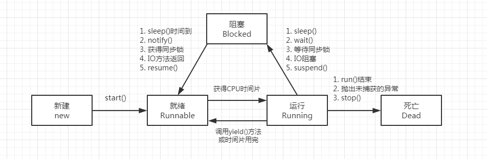
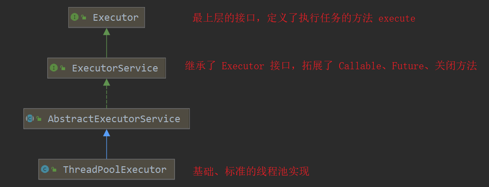
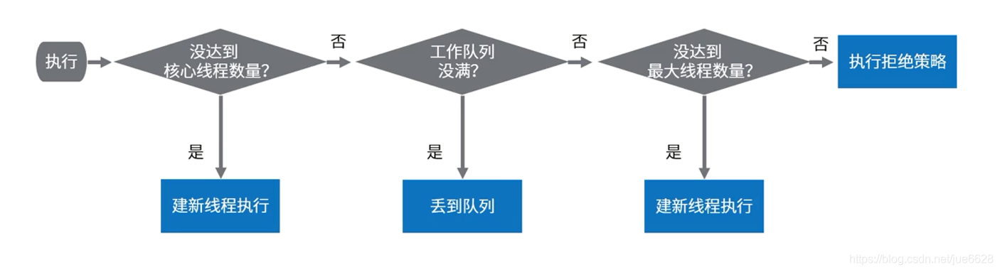

## 1.并发和并行

> “并发（concurrent）”通常表示：不止一个任务正在执行（单核 cpu 下，线程实际还是串行执行的。操作系统有一个组件叫做任务调度器，将 cpu 的时间片分给不同的线程使用，只是由于 cpu 在线程间（时间片很短）的切换非常快，感觉上是同时运行的。总结：微观串行，宏观并行）。
>
> “并行（parallel）”几乎总是代表：不止一个任务同时执行（真正意义上的同时进行多种事情。这种只可以在多核CPU的基础下完成。）
>
> 引用 Rob Pike 的一段描述：
>
> - 并发是同一时间应对（dealing with）多件事情的能力
> - 并行是同一时间动手做（doing）多件事情的能力。

1. 问题：“并行”也有不止一个任务正在执行的语义在里面。区别就在于细节：**究竟是怎么“执行”的**。此外，还有一些场景重叠：为并行编写的程序有时在单处理器上运行，而一些并发编程系统可以利用多处理器。

2. 并发定义：同时完成多任务。无需等待当前任务完成即可执行其他任务。“并发”解决了程序因外部控制而无法进一步执行的阻塞问题。最常见的例子就是 I/O 操作，任务必须等待数据输入（在一些例子中也称阻塞）。这个问题常见于 I/O 密集型任务。

3. 并行定义：同时在多个位置完成多任务。这解决了所谓的 CPU 密集型问题：将程序分为多部分，在多个处理器上同时处理不同部分来加快程序执行效率。

4. 并发与多线程之间的关系就是目的与手段之间的关系

    > 并发（Concurrent）的反面是串行。串行好比多个车辆行驶在一股车道上，它们只能“鱼贯而行”。而并发好比多个车辆行驶在多股车道上，它们可以“并驾齐驱”。并发的极致就是并行（Parallel）。多线程就是将原本可能是串行的计算“改为”并发（并行）的一种手段、途径或者模型。因此，有时我们也称多线程编程为并发编程。当然，目的与手段之间常常是一对多的关系。并发编程还有其他的实现途径，例如函数式（Functional programming）编程

### 1.1 并发编程

> **新定义（on java8作者赋予的定义）：并发性是一系列性能技术，专注于减少等待**

1. 定义：这实际上是一个相当复杂的表述，所以我将其分解：

    - 这是一个集合：包含许多不同的方法来解决这个问题。这是使定义并发性如此具有挑战性的问题之一，因为技术差异很大。
    - 这些是性能技术：就是这样。并发的关键点在于让你的程序运行得更快。在Java中，并发是非常棘手和困难的，所以绝对不要使用它，除非你有一个重大的性能问题 - 即使这样，使用最简单的方法产生你需要的性能，因为并发很快变得无法管理。
    - “减少等待”部分很重要而且微妙。无论（例如）你运行多少个处理器，你只能在等待发生时产生效益。如果你发起I/O请求并立即获得结果，没有延迟，因此无需改进。如果你在多个处理器上运行多个任务，并且每个处理器都以满容量运行，并且没有任务需要等待其他任务，那么尝试提高吞吐量是没有意义的。并发的唯一机会是如果程序的某些部分被迫等待。等待可以以多种形式出现 - 这解释了为什么存在如此不同的并发方法。

    - 值得强调的是，这个定义的有效性取决于“等待”这个词。如果没有什么可以等待，那就没有机会去加速。如果有什么东西在等待，那么就会有很多方法可以加快速度，这取决于多种因素，包括系统运行的配置，你要解决的问题类型以及其他许多问题。

2. 缺点。并发编程的主要缺点是：

    1. 在线程等待共享资源时会降低速度。
    2. 线程管理产生额外CPU开销。
    3. 糟糕的设计决策带来无法弥补的复杂性。
    4. 诸如饥饿，竞速，死锁和活锁（多线程各自处理单个任务而整体却无法完成）之类的问题。
    5. 跨平台的不一致。 通过一些示例，我发现了某些计算机上很快出现的竞争状况，而在其他计算机上却没有。 如果你在后者上开发程序，则在分发程序时可能会感到非常惊讶。

3. 选择并发编程的理由：

    需要并发的唯一理由是“等待太多”。这也可以包括用户界面的响应速度，但是由于Java用于构建用户界面时并不高效，因此这仅仅意味着“你的程序运行速度还不够快”。

    如果并发很容易，则没有理由拒绝并发。 正因为并发实际上很难，所以你应该仔细考虑是否值得为此付出努力，并考虑你能否以其他方式提升速度。

    例如，迁移到更快的硬件（这可能比消耗程序员的时间要便宜得多）或者将程序分解成多个部分，然后在不同的机器上运行这些部分。

## 2. wait()、notify()、notifyAll()、join()、sleep()、yield()方法介绍

- 
- 看图，看图，看图，结合图来分析

1. - wait()：使当前线程阻塞（进入等待状态），前提是必须先获得锁，一般配合synchronized 关键字使用。当线程执行wait()方法时候，会释放当前的对象锁，然后让出CPU，进入等待状态（***重要：处于等待状态的线程不具有争夺对象锁的权限，只有被唤醒之后才会有争夺对象锁的权限，正因为如此，nofity 才可能造成死锁***）。只有当 notify/notifyAll() 被执行时候，才会唤醒一个或多个正处于等待状态的线程，当操作系统再次让此线程执行时，此线程才会继续往下执行，直到执行完synchronized 代码块的代码或是中途遇到wait() ，再次释放锁。

    - wait(long timeout) ： **timeout等于 0 时表示等待无限时间，等同于 wait() **，让当前线程处于“等待(阻塞)状态”，“直到其他线程调用此对象的 notify() 方法或 notifyAll() 方法，或者超过指定的时间量”，当前线程被唤醒(进入“就绪状态”)。

    - wait(long timeout, int nanos) ：让当前线程处于“等待(阻塞)状态”，“直到其他线程调用此对象的 notify() 方法或 notifyAll() 方法，或者其他某个线程中断当前线程，或者已超过某个实际时间量”，当前线程被唤醒(进入“就绪状态”)。

2. notify()：唤醒在此对象锁上等待的单个线程。从所有等待该对象锁的线程中唤醒一个线程（由操作系统决定），使其重新进入该对象锁的争夺队列中。只是具有了争夺对象锁的权限（具体是哪一个由操作系统决定）

3. notifyAll()：唤醒在此对象锁上等待的所有线程。唤醒所有等待该对象锁的线程，使它们都重新进入该对象锁的争夺队列中

4. wait()、notify/notifyAll() 方法是Object的本地final方法，无法被重写。

5. 在多线程中要测试某个条件的变化，使用 if 还是 while？

    目的是为了避免出现一些微妙的bug，因为在调用了 wait 方法中，理论上该线程是进入休眠状态的，但是由于cpu可能会存在虚假唤醒的情况，如果我们使用 if 语句，那么当出现虚假唤醒的时候，程序就可能会出现一些异常，比如队列已经满了，生产线程应该休眠，等待消费线程消费，但由于生产线程休眠后被虚假唤醒，然后继续生产，那么就会导致发生异常，这里如果使用while语句，将会确保即使发生虚假唤醒，也会根据条件判断是否合格，如果不合适就让其再次进入 wait 状态，从而保证我们的程序更加健壮。

6. 为什么wait，notify，notifyAll定义在Object中而不是在Thread类中？

    - 这是个设计相关的问题，它考察的是面试者对现有系统和一些普遍存在但看起来不合理的事物的看法。回答这些问题的时候，你要说明为什么把这些方法放在Object类里是有意义的，还有不把它放在Thread类里的原因。一个很明显的原因是JAVA提供的锁是对象级的而不是线程级的，每个对象都有锁，通过线程获得。如果线程需要等待某些锁那么调用对象中的wait()方法就有意义了。如果wait()方法定义在Thread类中，线程正在等待的是哪个锁就不明显了。简单的说，由于wait，notify和notifyAll都是锁级别的操作，所以把他们定义在Object类中，是因为锁属于对象。

    另外一种答案：

    - 跟Java的锁机制有关系，Java允许任何对象都可以成为一个锁也叫做对象监视器，监视器本身是一种信号量，对于信号量应该是共享的用来互斥或者线程通信的，如果把这三个方法定义在线程类里面，那就意味着不同的线程需要相互侵入才能完成通信，比如A线程调用了自己的wait方法，然后它需要告诉B线程，你可以工作了，这就是典型的侵入依赖，其实A线程可以不用知道其他任何的线程，它只需要告诉监视器自己睡眠了，然后监视器自己去通知其他的一样使用该监视器的线程该干工作了就可以了。这有点类似大街上的红绿灯，我们完全不需要知道其他的车到底是在谁开，只需要看信号的通知即可。

7. 为什么这三个方法必须出现在同步方法或同步块中？

    这其实很容易理解，首先为什么需要同步？ 因为可能有多个线程同时操作共享变量，导致冲突，所以我们需要一个临界区，来保证每次只能有一个线程执行。也就是说wait，notify，notifyAll存在的时候肯定是会发生data race（数据竞争），在Java里面如果发生数据竞争肯定是需要同步的，所以这三个方法如果要出现那么一定是在同步的时候。如果你不在同步块里面调用这三个方法，那么将会抛出不合法监视器状态异常：

    `java.lang.IllegalMonitorStateException`

8. - join() 方法把指定的线程添加到当前线程中。主要作用是**同步**，它可以使得线程之间的**并行执行变为串行执行**。在A线程中调用了B线程的join()方法时，表示只有当B线程执行完毕时，A线程才能继续执行。

    - join() 方法中如果传入参数（和 wait() 一样有3个重载），则表示这样的意思：如果A线程中掉用B线程的join(10)，则表示A线程会等待B线程执行10毫秒，10毫秒过后，A、B 线程并行执行。需要注意的是，**jdk规定，join(0)的意思不是A线程等待B线程0秒，而是A线程等待B线程无限时间，直到B线程执行完毕，即join(0)等价于join()**。

    - join()方法必须在线程start()方法调用之后调用才有意义

    - join方法的原理就是调用相应线程的 wait 方法进行等待操作的，例如A线程中调用了B线程的join方法，则相当于在A线程中调用了自己的 wait 方法，当B线程执行完（或者到达等待时间），B线程会自动调用自身的notifyAll方法唤醒A线程，从而达到同步的目的。

        ```java
        public static void main(String[] args) throws InterruptedException {
                Thread t1 = new Thread(new MultiT("a"));
                Thread t2 = new Thread(new MultiT("b"));
                Thread t3 = new Thread(new MultiT("c"));
                
                t1.start();
                t1.join();
        
                t2.start();
                t2.join();
        
                t3.start();
                t3.join();
            }
        /*
        	最终，我们会看到，线程会按照t1，t2，t3顺序执行。因为，主线程main总会等调用join方法的那个线程执行完之后，才会往下执行。
        */
        ```

        

9. sleep()：当调用 Thread.sleep(long millis) 睡眠方法时，就会使当前线程进入阻塞状态。millis参数指定了线程睡眠的时间，单位是毫秒。 当时间结束之后，线程会重新进入就绪状态。

    **注意，sleep()中指定的时间是线程不会运行的最短时间。因此，sleep()方法不能保证该线程睡眠到期后就开始执行。在调用sleep()方法的过程中，线程不会释放对象锁。**

10. - Thread.yield()：作用是：暂停当前正在执行的线程对象，使其进入到就绪状态。

    - yield()：应该做的是让当前运行线程回到可运行状态，以允许具有相同优先级的其他线程获得运行机会。因此，使用yield()的目的是让相同优先级的线程之间能适当的轮转执行。但是，实际中无法保证yield()达到让步目的，因为让步的线程还有可能被线程调度程序再次选中。

    - 结论：yield()从未导致线程转到等待/睡眠/阻塞状态。在大多数情况下，yield()将导致线程从运行状态转到可运行状态，但有可能没有效果。

11. 在 Thread.java 中，定义了 join()、sleep()、yield() 等方法，其中 sleep()、yield() 是静态方法，并且是本地方法，join() 是成员方法，不是本地的。

12. notify() 使用不当可能会导致死锁，nofityAll() 不会出现死锁

     notify() 产生死锁的案例分析：

     - 生产者、消费者数量都为2，缓冲区为1，当按照下列并发顺序执行的时候出现死锁：

         1. 消费者1获得锁，发现缓冲区为0，wait（wait自动释放锁）；

         2. 消费者2获得锁，发现缓冲区为0，wait（wait自动释放锁）；

         3. 生产者1获得锁，发现缓冲区为0可以生产，生产以后放在缓冲区，notify，现在缓冲区为1；

         4. 第3步notify唤醒了消费者1，但是消费者1没有抢到锁，锁被生产者2拿到了；

         5. 生产者2发现缓冲区为1（因为只是唤醒了消费者1，但是消费者1没有抢到锁，没法消费），wait（wait自动释放锁）；

         6. 现在消费者1获得了锁，消费并且notify（此时生产者2和消费者2都处于wait状态），缓冲区为0；

         7. 很不幸，第6步notify唤醒了消费者2，消费者2醒来后拿到锁发现缓冲区为0，接着wait，与此同时，生产者2也在wait，死锁产生（因为对象锁的争夺队列中没有了线程，并且等待中的线程只有被唤醒后进入到对象锁的争夺队列中才能被执行，所以产生了死锁）。

     - 可以看出问题的关键在于两个地方，一个是第4步notify并不能保证notify唤醒的线程获得锁，一个是第7步notify可能会唤醒同一种角色的线程。

     - 可以用Lock/Condition解决，两个Condition可以保证notify（signal）不同角色的线程，也可以用notifyAll解决，使线程间变成对锁的竞争。

## 3. 线程池的原理及实现

1. 多线程技术解决的问题：主要解决处理器单元内多个线程执行的问题，它可以显著减少处理器单元的闲置时间，增加处理器单元的吞吐能力

2. 线程池的使用场景：假设一个服务器完成一项任务所需时间为：T1 创建线程时间，T2 在线程中执行任务的时间，T3 销毁线程时间。如果：T1 + T3 远大于 T2，则可以采用线程池，以提高服务器性能。

3. 线程池的基本组成部分

    - 线程池管理器（ThreadPool）：用于创建并管理线程池，包括 创建线程池，销毁线程池，添加新任务；
    - 工作线程（PoolWorker）：线程池中线程，在没有任务时处于等待状态，可以循环的执行任务；
    - 任务接口（Task）：每个任务必须实现的接口，以供工作线程调度任务的执行，它主要规定了任务的入口，任务执行完后的收尾工作，任务的执行状态等；
    - 任务队列（taskQueue）：用于存放没有处理的任务。提供一种缓冲机制。

4. 优点：线程池技术

    - **降低资源消耗**。通过重复利用已创建的线程降低线程创建和销毁造成的消耗。
    - **提高响应速度**。当任务到达时，任务可以不需要等到线程创建就能立即执行。
    - **提高线程的可管理性**。线程是稀缺资源，如果无限制的创建，不仅会消耗系统资源，还会降低系统的稳定性，使用线程池可以进行统一的分配，调优和监控。

    - 正是关注如何缩短或调整T1,T3时间的技术，从而提高服务器程序性能的。它把T1，T3分别安排在服务器程序的启动和结束的时间段或者一些空闲的时间段，这样在服务器程序处理客户请求时，不会有T1，T3的开销了。

5. 线程池原理（代码实现）

    ```java
    ublic final class ThreadPool {
        // 线程池中默认线程的个数为5
        private static int worker_num = 5;
        // 工作线程
        private WorkThread[] workThrads;
        // 未处理的任务
        private static volatile int finished_task = 0;
        // 任务队列，作为一个缓冲,List线程不安全
        private List<Runnable> taskQueue = new LinkedList<Runnable>();
        private static ThreadPool threadPool;
    
        // 创建具有默认线程个数的线程池
        private ThreadPool() {
            this(5);
        }
    
        // 创建线程池,worker_num为线程池中工作线程的个数
        private ThreadPool(int worker_num) {
            ThreadPool.worker_num = worker_num;
            workThrads = new WorkThread[worker_num];
            for (int i = 0; i < worker_num; i++) {
                workThrads[i] = new WorkThread();
                workThrads[i].start();// 开启线程池中的线程
            }
        }
    
        // 单例模式，获得一个默认线程个数的线程池
        public static ThreadPool getThreadPool() {
            return getThreadPool(ThreadPool.worker_num);
        }
    
        // 单例模式，获得一个指定线程个数的线程池,worker_num(>0)为线程池中工作线程的个数
        // worker_num<=0创建默认的工作线程个数
        public static ThreadPool getThreadPool(int worker_num1) {
            if (worker_num1 <= 0) {
                worker_num1 = ThreadPool.worker_num;
            }
            if (threadPool == null) {
                threadPool = new ThreadPool(worker_num1);
            }
            return threadPool;
        }
    
        // 执行任务,其实只是把任务加入任务队列，什么时候执行有线程池管理器决定
        public void execute(Runnable task) {
            synchronized (taskQueue) {
                taskQueue.add(task);
                taskQueue.notify();
            }
        }
    
        // 批量执行任务,其实只是把任务加入任务队列，什么时候执行有线程池管理器决定
        public void execute(Runnable[] task) {
            synchronized (taskQueue) {
                Collections.addAll(taskQueue, task);
                taskQueue.notify();
    
            }
        }
    
        // 销毁线程池,该方法保证在所有任务都完成的情况下才销毁所有线程，否则等待任务完成才销毁
        public void destroy() {
            while (!taskQueue.isEmpty()) {// 如果还有任务没执行完成，就先睡会吧
                try {
                    Thread.sleep(10);
                } catch (InterruptedException e) {
                    e.printStackTrace();
                }
            }
            // 工作线程停止工作，且置为null
            for (int i = 0; i < worker_num; i++) {
                workThrads[i].stopWorker();
                workThrads[i] = null;
            }
            threadPool=null;
            taskQueue.clear();// 清空任务队列
        }
    
        // 返回工作线程的个数
        public int getWorkThreadNumber() {
            return worker_num;
        }
    
        // 返回已完成任务的个数,这里的已完成是只出了任务队列的任务个数，可能该任务并没有实际执行完成
        public int getFinishedTasknumber() {
            return finished_task;
        }
    
        // 返回任务队列的长度，即还没处理的任务个数
        public int getWaitTasknumber() {
            return taskQueue.size();
        }
    
        // 覆盖toString方法，返回线程池信息：工作线程个数和已完成任务个数
        @Override
        public String toString() {
            return "WorkThread number:" + worker_num + "  finished task number:"
                    + finished_task + "  wait task number:" + getWaitTasknumber();
        }
    
        /**
         * 内部类，工作线程
         */
        private class WorkThread extends Thread {
            // 该工作线程是否有效，用于结束该工作线程
            private boolean isRunning = true;
    
            /*
             * 关键所在啊，如果任务队列不空，则取出任务执行，若任务队列空，则等待
             */
            @Override
            public void run() {
                Runnable r = null;
                while (isRunning) {// 注意，若线程无效则自然结束run方法，该线程就没用了
                    synchronized (taskQueue) {
                        while (isRunning && taskQueue.isEmpty()) {// 队列为空
                            try {
                                taskQueue.wait(20);
                            } catch (InterruptedException e) {
                                e.printStackTrace();
                            }
                        }
                        if (!taskQueue.isEmpty()) {
                            r = taskQueue.remove(0);// 取出任务
                        }
                    }
                    if (r != null) {
                        r.run();// 执行任务
                    }
                    finished_task++;
                    r = null;
                }
            }
    
            // 停止工作，让该线程自然执行完run方法，自然结束
            public void stopWorker() {
                isRunning = false;
            }
        }
    }
    ```

    ```java
    public class TestThreadPool {
        public static void main(String[] args) throws InterruptedException {
            // 创建3个线程的线程池
            ThreadPool t = ThreadPool.getThreadPool(3);
            t.execute(new Runnable[] { new Task(), new Task(), new Task() });
            t.execute(new Runnable[] { new Task(), new Task(), new Task() });
            Thread.sleep(10);
            System.out.println(t);
            t.destroy();// 所有线程都执行完成才destory
            System.out.println(t);
        }
    
        // 任务类
        static class Task implements Runnable {
            private static volatile int i = 1;
    
            @Override
            public void run() {// 执行任务
                System.out.println("任务 " + (i++) + " 完成");
            }
        }
    }
    
    ```

6. java 类库中提供的线程池（常用 java.util.concurrent.ThreadPoolExecutor 类来创建线程池）

    

    1. 一个任务通过 execute(Runnable)方法被添加到线程池，任务就是一个 Runnable类型的对象，任务的执行方法就是 Runnable 类型对象的run()方法。

    2. ThreadPoolExecutor 的构造方法

        ```java
        private static final RejectedExecutionHandler defaultHandler = new AbortPolicy();
         /*
         	此处只是其中一个构造方法，其他重载的构造函数，是为了让后两个参数可选
         	ThreadFactory 默认值是 Executors.defaultThreadFactory()
         	RejectedExecutionHandler 默认值是一个 AbortPollcy 对象，本代码是部分源码
         */
        public ThreadPoolExecutor(int corePoolSize,
                                  int maximumPoolSize,
                                  long keepAliveTime,
                                  TimeUnit unit,
                                  BlockingQueue<Runnable> workQueue,
                                  ThreadFactory threadFactory,
                                  RejectedExecutionHandler handler) {
            if (corePoolSize < 0 || maximumPoolSize <= 0 || maximumPoolSize < corePoolSize || keepAliveTime < 0)
                throw new IllegalArgumentException();
            if (workQueue == null || threadFactory == null || handler == null)
                throw new NullPointerException();
            this.corePoolSize = corePoolSize;
            this.maximumPoolSize = maximumPoolSize;
            this.workQueue = workQueue;
            this.keepAliveTime = unit.toNanos(keepAliveTime);
            this.threadFactory = threadFactory;
            this.handler = handler;
        }
        ```

    3. 构造方法的参数介绍

        1. **corePoolSize**（必需）：核心线程数。默认情况下，核心线程会一直存活，但是当将**allowCoreThreadTimeout**设置为true时，核心线程也会超时回收。
        2. **maximumPoolSize**（必需）：线程池所能容纳的最大线程数。
        3. **keepAliveTime**（必需）：线程闲置超时时长。如果超过该时长，非核心线程就会被回收。如果将**allowCoreThreadTimeout**设置为true时，核心线程也会超时回收。
        4. **unit**（必需）：指定keepAliveTime参数的时间单位。常用的有：**TimeUnit.MILLISECONDS**（毫秒）、**TimeUnit.SECONDS**（秒）、**TimeUnit.MINUTES**（分）。
        5. **workQueue**（必需）：任务队列。通过线程池的 execute() 方法提交的 Runnable 对象将存储在该参数中。其采用阻塞队列实现。
        6. **threadFactory**（可选）：线程工厂。用于指定为线程池创建新线程的方式。
        7. **handler**（可选）：拒绝策略。当达到最大线程数时需要执行的饱和策略。

    4. #### 线程池的execute()和submit()方法

        - execute()，执行一个任务，没有返回值。

        - submit()，提交一个线程任务，有返回值。
        - submit(Callable task)能获取到它的返回值，通过future.get()获取（ Future.get 方法会使取结果的线程进入阻塞状态，直到线程执行完成之后，唤醒取结果的线程，然后返回结果）。
        - 一般使用FutureTask+Callable配合使用（IntentService中有体现）。
        - submit(Runnable task, T result)能通过传入的载体result间接获得线程的返回值。
        - submit(Runnable task)则是没有返回值的，就算获取它的返回值也是null。

    5. 线程池的工作原理（当调用 execute() 方法添加一个任务时，线程池会做如下判断）

        

    5. handler的拒绝策略：

        1. AbortPolicy: 不执行新任务，直接抛出异常，提示线程池已满
        2. DisCardPolicy: 不执行新任务，也不抛出异常，直接丢弃
        3. DisCardOldSetPolicy: 将消息队列中的第一个任务替换为当前新进来的任务执行
        4. CallerRunsPolicy: 直接调用execute来执行当前任务

    6. 四种常见的线程池：

        1. CachedThreadPool: 可缓存的线程池，该线程池中没有核心线程，非核心线程的数量为Integer.max_value，就是无限大，当有需要时创建线程来执行任务，没有需要时回收线程，适用于耗时少，任务量大的情况。
        2. SecudleThreadPool: 周期性执行任务的线程池，按照某种特定的计划执行线程中的任务，有核心线程，但也有非核心线程，非核心线程的大小也为无限大。适用于执行周期性的任务。
        3. SingleThreadPool: 只有一条线程来执行任务，适用于有顺序的任务的应用场景。
        4. FixedThreadPool: 定长的线程池，有核心线程，核心线程的即为最大的线程数量，没有非核心线程

    7. 线程池使用举例

        ```java
        public class TestJavaPool {
            /**
             * 测试： 提交15个执行时间需要3秒的任务,看线程池的状况
             */
            public void testCommon(ThreadPoolExecutor threadPoolExecutor) throws Exception {
                // 测试： 提交15个执行时间需要3秒的任务，看超过大小的2个，对应的处理情况
                for (int i = 0; i < 15; i++) {
                    int n = i; // 注意此处：需要弄一个临时变量，否则输出结果可能都一样
                    threadPoolExecutor.submit(new Runnable() {
                        @Override
                        public void run() {
                            try {
                                Thread.sleep(3000L);
                                System.err.println("执行结束:" + n);
                            } catch (InterruptedException e) {
                                e.printStackTrace();
                            }
                        }
                    });
        
                    System.out.println("任务提交成功 :" + i);
                }
                // 查看线程数量，查看队列等待数量
                Thread.sleep(500L);
                System.out.println("当前线程池线程数量为：" + threadPoolExecutor.getPoolSize());
                System.out.println("当前线程池等待的数量为：" + threadPoolExecutor.getQueue().size());
                // 等待15秒，查看线程数量和队列数量（理论上，超出线程最大数量的线程自动销毁）
                Thread.sleep(15000L);
                System.out.println("当前线程池线程数量为：" + threadPoolExecutor.getPoolSize());
                System.out.println("当前线程池等待的数量为：" + threadPoolExecutor.getQueue().size());
            }
        
            public static void main(String[] args) throws Exception {
                new TestJavaPool().threadPoolExecutorTest2();
            }
            private void threadPoolExecutorTest2() throws Exception {
                // 创建一个 核心线程数量为5，最大数量为10,等待队列最大是3 的线程池，也就是最大容纳3个任务。
                // 默认的策略是抛出RejectedExecutionException异常，java.util.concurrent.ThreadPoolExecutor.AbortPolicy
                ThreadPoolExecutor threadPoolExecutor = new ThreadPoolExecutor(5, 10, 5, TimeUnit.SECONDS,
                        new LinkedBlockingQueue<Runnable>(3), new RejectedExecutionHandler() {
                    @Override
                    public void rejectedExecution(Runnable r, ThreadPoolExecutor executor) {
                        System.err.println("有任务被拒绝执行了");
                    }
                });
                testCommon(threadPoolExecutor);
                // 预期结果：
                // 1、 5个任务直接分配线程开始执行
                // 2、 3个任务进入等待队列
                // 3、 队列不够用，临时加开5个线程来执行任务(5秒没活干就销毁)
                // 4、 队列和线程池都满了，剩下2个任务，没资源了，被拒绝执行。
                // 5、 任务执行，5秒后，如果无任务可执行，销毁临时创建的5个线程
            }
        }
        
        ```

        

## 4. 死锁

1. 解释：某些任务必须去**等待-阻塞**来获得其他任务的结果。由于任务可以被阻塞，因此一个任务有可能卡在等待另一个任务上，而后者又在等待别的任务，这样一直下去，直到这个链条上的任务又在等待第一个任务释放锁。这得到了一个任务之间相互等待的连续循环依赖， 没有哪个线程能继续， 这称之为死锁

2. 死锁产生的条件：当以下四个条件同时满足时，就会发生死锁：

    1. 互斥条件。任务使用的资源中至少有一个不能共享的。 这里，一根筷子一次就只能被一个哲学家使用。
    2. 至少有一个任务它必须持有一个资源且正在等待获取一个被当前别的任务持有的资源。也就是说，要发生死锁，哲学家必须拿着一根筷子并且等待另一根。
    3. 资源不能被任务抢占， 任务必须把资源释放当作普通事件。哲学家很有礼貌，他们不会从其它哲学家那里抢筷子。
    4. 必须有循环等待， 这时，一个任务等待其它任务所持有的资源， 后者又在等待另一个任务所持有的资源， 这样一直下去，直到有一个任务在等待第一个任务所持有的资源， 使得大家都被锁住。

3. 死锁的解决：

    - 因为必须满足所有条件（4个）才能导致死锁，所以要阻止死锁的话，只需要破坏其中一个即可。
    - 当然，避免并发问题的最简单，最好的方法是永远不要共享资源-不幸的是，这并不总是可能的。

4. 死锁的举例

    ```java
    public class DeadLock implements Runnable {
        public int flag = 1;
        static Object o1 = new Object(), o2 = new Object();
    
        @Override
        public void run() {
            System.out.println("flag=" + flag);
            if(flag == 1) {
                synchronized(o1) {
                    try {
                        Thread.sleep(500);
                    } catch (Exception e) {
                        e.printStackTrace();
                    }
                    synchronized(o2) {
                        System.out.println("1");
                    }
                }
            }
            if(flag == 0) {
                synchronized(o2) {
                    try {
                        Thread.sleep(500);
                    } catch (Exception e) {
                        e.printStackTrace();
                    }
                    synchronized(o1) {
                        System.out.println("0");
                    }
                }
            }
        }
    
        public static void main(String[] args) throws InterruptedException {
            DeadLock td1 = new DeadLock();
            DeadLock td2 = new DeadLock();
            td1.flag = 1;
            td2.flag = 0;
            // 由于两个flag的值不同，所以先拿的对象锁是不同的，又因为，每个线程拿到了第一个对象锁后
            // sleep 了500毫秒，此时确保了第一个执行的线程拿第二个对象锁之前，第二个线程已拿走了那个锁，
            // 所以此时，两个线程拿到了不同的锁，并且请求第二个对象锁，而陷入僵持状态，造成了死锁。
            new Thread(td1).start();
    //        Thread.sleep(600);
            new Thread(td2).start();
    
        }
    }
    
    ```

## 5. 进程和线程

1. 进程：
    - 程序由指令和数据组成，但这些指令要运行，数据要读写，就必须将指令加载至CPU、数据加载至内存。在指令运行过程中还需要用到磁盘、网络等设备。进程就是用来加载指令、管理内存、管理IO的
    - 当一个程序被运行，从磁盘加载这个程序的代码至内存，这时就开启了一个进程。
    - 进程可以视为程序的一个实例。大部分程序可以同时运行多个实例进程，也有的程序只能启动一个实例进程
2. 线程
    - 一个进程之内可以分为一到多个线程。
    - 一个线程就是一个指令流，将指令流中的一条条指令以一定的顺序交给CPU执行
    - Java 中，线程作为处理器任务调度和执行的基本单位，进程作为操作系统资源分配的基本单位。在 Windows 中，进程是不活动的，只是作为线程的容器。
3. 进程和线程的区别

	- 进程和线程的根本区别是进程是操作系统资源分配的基本单位，而线程是处理器任务调度和执行的基本单位。另外区别还有资源开销、包含关系、内存分配、影响关系、执行过程等。
- 资源开销：每个进程都有独立的代码和数据空间（程序上下文），程序之间的切换会有较大的开销；线程可以看做轻量级的进程，同一类线程共享代码和数据空间，每个线程都有自己独立的运行栈和程序计数器（PC），线程之间切换的开销小。
	- 包含关系：如果一个进程内有多个线程，则执行过程不是一条线的，而是多条线（线程）共同完成的；线程是进程的一部分，所以线程也被称为轻权进程或者轻量级进程。
- 内存分配：同一进程的线程共享本进程的地址空间和资源，而进程之间的地址空间和资源是相互独立的。
	- 影响关系：一个进程崩溃后，在保护模式下不会对其他进程产生影响，但是一个线程崩溃整个进程都死掉。所以多进程要比多线程健壮。
- 执行过程：每个独立的进程有程序运行的入口、顺序执行序列和程序出口。但是线程不能独立执行，必须依存在应用程序中，由应用程序提供多个线程执行控制，两者均可并发执行。

## 6. 同步和异步

1. 从方法调用的角度来讲，如果

    - 需要等待结果返回，才能继续运行就是同步
    - 不需要等待结果返回，就能继续运行就是异步

    注意：同步在多线程中还有另外一层意思，是让多个线程步调一致。

## 7. gc机制

### 7.1介绍

​		垃圾回收器工作时，一边回收内存，一边使堆中的对象紧凑排列。垃圾回收器通过重新排列对象，实现了一种高速的、有无限空间可分配的堆模型。

### 7.2 垃圾回收机制

1. 引用计数法

    1. 解释：每个对象中含有一个引用计数器，每当有引用指向该对象时，引用计数加 1。当引用离开作用域或被置为 **null** 时，引用计数减 1。

        因此，管理引用计数是一个开销不大但是在程序的整个生命周期频繁发生的负担。垃圾回收器会遍历含有全部对象的列表，当发现某个对象的引用计数为 0 时，就释放其占用的空间。

    2. 缺点：如果对象之间存在循环引用，那么它们的引用计数都不为 0，就会出现应该被回收但无法被回收的情况。对垃圾回收器而言，定位这样的循环引用所需的工作量极大。

        引用计数常用来说明垃圾回收的工作方式，但似乎从未被应用于任何一种 Java 虚拟机实现中。

## 8. interface

1. 定义接口的格式

    ```java
    [ public ] interface 接口名称 [ extends 父接口1, 父接口2, 父接口3, ...... ]
    {
        //静态常量
        [ public ] [ static ] [ final ] 数据类型 变量名 = 常量值;
        //抽象方法
        [ public ] [ abstract ] [ native ] 返回值类型 方法名（参数列表）;
    }
    ```

2. 注意：

    - 接口支持多继承，一个接口可以继承多个接口
    - 接口不支持使用 implements 关键字
    - 接口支持本地方法 native 关键字
    - 注意新版 jdk 的新特性

3. 特点：

    1. 接口是隐式抽象的，当声明一个接口的时候，不必使用 abstract 关键字（使用会报错）。
    2. 接口中每一个方法也是隐式抽象的，声明时同样不需要 abstract 关键字（使用不会报错）。
    3. 接口中的方法都是公有的。
    4. 编译时自动为接口里定义的方法添加 public abstract 修饰符
    5. Java 接口里的成员变量只能是 public static final 共同修饰的，并且必须赋初值，可以不写 public static final，编译的时候会自动添加

4. jdk 8 新特性：

    1. 函数式接口

        > 函数式接口 ( Functional Interface ) 就是一个有且仅有一个抽象方法，但是可以有多个非抽象方法的接口（default）。

        - 函数式接口可以被隐式转换为 lambda 表达式（JAVA 8 之前一般是用匿名类实现的）。

            ```java
            @FunctionalInterface
            interface GreetingService {
                void sayMessage(String message);
            }
            // GreetingService greetService1 = message -> System.out.println("Hello " + message);
            ```

            java.util.function 它包含了很多类，用来支持 Java 的函数式编程

    2. 接口的非静态默认方法

        > 默认方法就是接口可以有实现方法，而且不强制要求实现类去实现这个默认方法。只需在方法名前面加个 default 关键字即可。

        1. **为什么要有这个特性？**

            首先，之前的接口是个双刃剑，好处是面向抽象而不是面向具体编程，缺陷是，当需要修改接口时候，需要修改全部实现该接口的类，目前的 java 8 之前的集合框架没有 foreach 方法，通常能想到的解决办法是在JDK里给相关的接口添加新的方法及实现。然而，对于已经发布的版本，是没法在给接口添加新方法的同时不影响已有的实现。所以引进的默认方法。他们的目的是为了解决接口的修改与现有的实现不兼容的问题。

        2. 语法

            ```java
            public interface Vehicle {
               default void print(){
                  System.out.println("我是一辆车!");
               }
            }
            ```

        3. 多个默认方法

            > 一个接口有默认方法，考虑这样的情况，一个类实现了多个接口，且这些接口有相同的默认方法，以下实例说明了这种情况的解决方法：

            ```java
            interface Vehicle {
               default void print(){
                  System.out.println("我是一辆车!");
               }
            }
            interface FourWheeler {
               default void print(){
                  System.out.println("我是一辆四轮车!");
               }
            }
            // 第一种解决方案：创建自己的默认方法，来覆盖重写接口的默认方法
            class Car implements Vehicle, FourWheeler {
               default void print(){
                  System.out.println("我是一辆四轮汽车!");
               }
            }
            // 第二种解决方案：使用 super 来调用指定接口的默认方法
            public class Car implements Vehicle, FourWheeler {
               public void print(){
                  Vehicle.super.print();
               }
            }
            ```

    3. 接口的静态默认方法

        > 接口可以声明（并且可以提供实现）静态方法

        ```java
        public interface Vehicle {
           default void print(){
              System.out.println("我是一辆车!");
           }
            // 静态方法
           static void blowHorn(){
              System.out.println("按喇叭!!!");
           }
        }
        ```

        - 使用：`接口名.静态方法名 (参数列表);`

5. jdk 9 新特性

    - 私有接口方法（私有方法、私有静态方法）

        - 使用举例：

            ```java
            public class Tester {
               public static void main(String []args) {
                  LogOracle log = new LogOracle();
                  log.logInfo("");
                  log.logWarn("");
                  log.logError("");
                  log.logFatal("");
                  
                  LogMySql log1 = new LogMySql();
                  log1.logInfo("");
                  log1.logWarn("");
                  log1.logError("");
                  log1.logFatal("");
               }
            }
            final class LogOracle implements Logging { 
            }
            final class LogMySql implements Logging { 
            }
            interface Logging {
               String ORACLE = "Oracle_Database";
               String MYSQL = "MySql_Database";
             
               private void log(String message, String prefix) {
                  getConnection();
                  System.out.println("Log Message : " + prefix);
                  closeConnection();
               }
               default void logInfo(String message) {
                  log(message, "INFO");
               }
               default void logWarn(String message) {
                  log(message, "WARN");
               }
               default void logError(String message) {
                  log(message, "ERROR");
               }
               default void logFatal(String message) {
                  log(message, "FATAL");
               }
               private static void getConnection() {
                  System.out.println("Open Database connection");
               }
               private static void closeConnection() {
                  System.out.println("Close Database connection");
               }
            }
            ```

## 9. 抽象类

> 拥有抽象方法的类就是抽象类，抽象类要使用 abstract 关键字声明。

1. 定义抽象类的格式

    ```java
    [ Modifies ] abstract class ClassName [extends 类] [implements  接口1,接口2, ...... ] {…}
    ```

    其中，Modifies 是修饰符，abstract 是声明抽象类的关键字，class 是定义类的关键字，ClassName 是类名，大括号内的省略号表示类体部分。其中的成员方法可以是一般的成员方法，还可以是抽象的成员方法。抽象的成员方法也是通过关键字 abstract 来说明的。它在形式上仅有方法的头部分，而没有方法体，甚至用于描述方法体的一对大括号也没有，常将这样的形式称为方法的原型声明。其格式如下：

    ```java
    [Modifies] abstract returnType methodName（parameterLists）；
    ```

    Modifies与上面的意义相同，abstract是声明抽象方法的关键字，returnType是方法的返回值类型，圆括号中的parameterLists是参数列表。抽象方法显然不是一个完整的方法，它也不完成任何具体的功能，只是用于提供一个接口，它只有在子类中进行覆盖后才可使用，因此，抽象方法只能出现在抽象类中。

2. 特点

    1. 抽象类，其修饰符必须为 public 或者 protected，不能是 private，因为创建抽象类，就是要被其他类继承，用 private 修饰了，则不能被子类继承，子类便无法实现该方法。
    2. 抽象类不能用来创建对象，即抽象类不能被直接实例化，要通过其普通子类进行实例化。
    3. 如果一个普通子类继承于一个抽象父类，则该类一定要重写实现该父类的抽象方法。如果该子类仍然是一个抽象类，这也是允许的，就不必重写实现该父类的抽象方法，但必须用 abstract 修饰。
    4. 抽象级别：抽象类是对整体类的抽象，包含属性和方法。
    5. 实现类的范围不同：抽象类，其实是从子类中提取共性部分，然后抽象出来，反之，子类继承该父类就可以了，也就是说里面的抽象方法一般来自同一个类别。
    6. 设计方式不同：抽象类是要先有子类，然后才抽象出父类，是一种从下往上的构建法则。

3. 在使用抽象类与抽象方法时，应特别关注以下几点：

    1. 凡是用 abstract 修饰符修饰的类被称为抽象类。凡是用 abstract 修饰符修饰的方法称为抽象方法。
    2. 抽象类中可以有零个或多个抽象方法，也可以包含非抽象的方法。·抽象类中可以没有抽象方法，但是，有抽象方法的类必须是抽象类。
    3. 对于抽象方法来说，在抽象类中只指定其方法名及其类型，而不书写其实现代码。
    4. 抽象类可以派生子类，在抽象类派生的子类中必须实现抽象类中定义的所有抽象方法。
    5. 抽象类不能创建对象，创建对象的工作由抽象类派生的子类来实现。
    6. 如果父类中已有同名的 abstract 方法，则子类中就不能再有同名的抽象方法。
    7. abstract 不能与 final 并列修饰同一个类。
    8. abstract 不能与 private、static、final 或 native 并列修饰同一个方法。

## 10.抽象类和接口

- 尤其是在 Java 8 引入 **default** 方法之后，选择用抽象类还是用接口变得更加令人困惑。下表做了明确的区分：	

    | 特性                 | 接口                                                       | 抽象类                                   |
    | -------------------- | ---------------------------------------------------------- | ---------------------------------------- |
    | 组合                 | 新类可以组合多个接口                                       | 只能继承单一抽象类                       |
    | 状态                 | 不能包含属性（除了静态属性，不支持对象状态）               | 可以包含属性，非抽象方法可能引用这些属性 |
    | 默认方法 和 抽象方法 | 不需要在子类中实现默认方法。默认方法可以引用其他接口的方法 | 必须在子类中实现抽象方法                 |
    | 构造器               | 没有构造器                                                 | 可以有构造器                             |
    | 可见性               | 隐式 **public**                                            | 可以是 **protected** 或友元              |

- 抽象类仍然是一个类，在创建新类时只能继承它一个。而创建类的过程中可以实现多个接口。

- 有一条实际经验：尽可能地抽象。因此，更倾向使用接口而不是抽象类。只有当必要时才使用抽象类。除非必须使用，否则不要用接口和抽象类。大多数时候，普通类已经做得很好，如果不行的话，再移动到接口或抽象类中。