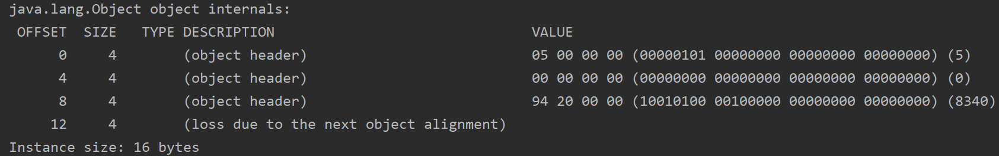
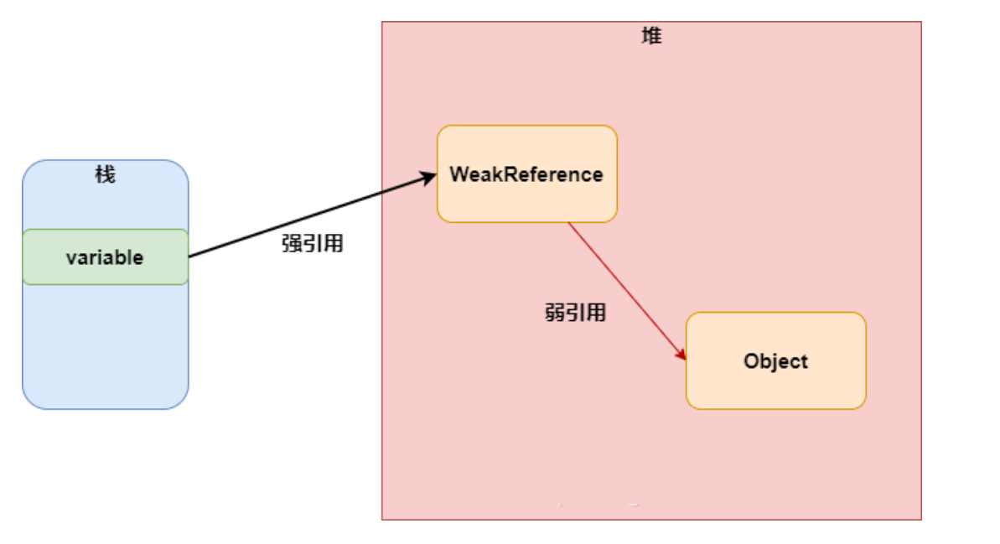

> Book 推荐
>
> 入门：《实战 Java 高并发程序设计》（葛一鸣)）
>
> 进阶：《 Java 并发编程的艺术》

# 1. 概念

## 1.1 基本概念

1. 程序：指令和数据的有序集合，其本身没有任何运行的含义，是一个静态的概念
2. 进程：是执行程序的一次执行过程，是一个动态的概念。进程是操作系统资源分配的基本单位
3. 线程：一个进程中有多个线程（至少一个），不然进程没有存在的意义。线程使 CPU 调度和执行的基本单位

## 1.2 核心概念

1. 线程就是独立的执行路径；
2. 在程序运行时，即使没有自己创建线程，后台也会有多个线程，如主线程，gc 线程；
3. main()称为主线程，为系统的入口，用于执行整个程序；
4. 在一个进程中，如果开辟了多个线程，线程的运行由调度器安排调度，调度器是与操作系统紧密相关的，先后顺序是不能人为干预的；
5. 对同一份资源操作时，会存在资源抢夺问题，需要加入并发控制；
6. 线程会带来额外的开销，如 CPU 调度时间，并发控制开销；
7. 每个线程在自己的工作内存交互，内存控制不当会造成数据不一致

# 2. 线程的创建

## 2.1 继承 Thread 类

### 2.1.1 创建步骤

1. 自定义线程类继承 Thread 类
2. 重写 run() 方法，编写线程执行体
3. 创建自定义线程类对象，调用 start() 方法启动线程

### 2.1.2 注意事项

1. 线程 start 后，不一定立即执行，等待 cpu 的调度
2. 不建议使用：java 类是单继承的，如果继承了 Thread 类，就无法继承别的类了，有局限性

## 2.2 实现 Runnable 接口

### 2.2.1 创建步骤

1. 实现 Runnable 接口
2. 重写 run() 方法
3. 创建此实现类的实例作为参数传入 Thead 的构造函数中，调用 Thread 的 start() 方法即可启动该线程

### 2.2.2 优点

1. 避免单继承局限性，灵活方便

2. 方便同一个对象被多个线程使用

    ```java
    public class TestTread implements Runnable {
    	//票数
    	private int ticketNums = 10;
    	@Override
    	public void run() {
    		while(true){
    			if(ticketNums<=0){
    				break;
    			}			
    			//模拟延时
    			try {
    				Thread.sleep(200);
    			} catch (InterruptedException e) {
    				e.printStackTrace();
    			}			
    			System.out.println(Thread.currentThread().getName()+"-->拿到了第"+ticketNums-- +"票");
    		}
    	}
    	public static void main(String[] args) {
    		TestTread ticket = new TestTread();		
    		new Thread(ticket,"小明").start();
    		new Thread(ticket,"老师").start();
    		new Thread(ticket,"黄牛").start();
    	}
    }
    ```

    **灵魂拷问：Thread 本身也实现了 Runnable 接口，那不应该也能被多个线程使用？所以优点 2 确定是存在的？**

    start 方法只能被执行一次，所以不能被多个线程使用
    
    注意：一个对象被多个线程使用时，共享该对象的资源，所以 ticketNums 可以不是静态的，

## 2.3 实现 Callable 接口

# 3.  线程池的原理及实现

1. 多线程技术解决的问题：主要解决处理器单元内多个线程执行的问题，它可以显著减少处理器单元的闲置时间，增加处理器单元的吞吐能力

2. 线程池的使用场景：假设一个服务器完成一项任务所需时间为：T1 创建线程时间，T2 在线程中执行任务的时间，T3 销毁线程时间。如果：T1 + T3 远大于 T2，则可以采用线程池，以提高服务器性能。

3. 线程池的基本组成部分

    - 线程池管理器（ThreadPool）：用于创建并管理线程池，包括 创建线程池，销毁线程池，添加新任务；
    - 工作线程（PoolWorker）：线程池中线程，在没有任务时处于等待状态，可以循环的执行任务；
    - 任务接口（Task）：每个任务必须实现的接口，以供工作线程调度任务的执行，它主要规定了任务的入口，任务执行完后的收尾工作，任务的执行状态等；
    - 任务队列（taskQueue）：用于存放没有处理的任务。提供一种缓冲机制。

4. 优点：线程池技术

    - **降低资源消耗**。通过重复利用已创建的线程降低线程创建和销毁造成的消耗。
    - **提高响应速度**。当任务到达时，任务可以不需要等到线程创建就能立即执行。
    - **提高线程的可管理性**。线程是稀缺资源，如果无限制的创建，不仅会消耗系统资源，还会降低系统的稳定性，使用线程池可以进行统一的分配，调优和监控。

    - 正是关注如何缩短或调整T1,T3时间的技术，从而提高服务器程序性能的。它把T1，T3分别安排在服务器程序的启动和结束的时间段或者一些空闲的时间段，这样在服务器程序处理客户请求时，不会有T1，T3的开销了。

5. 线程池原理（代码实现）

    ```java
    ublic final class ThreadPool {
        // 线程池中默认线程的个数为5
        private static int worker_num = 5;
        // 工作线程
        private WorkThread[] workThrads;
        // 未处理的任务
        private static volatile int finished_task = 0;
        // 任务队列，作为一个缓冲,List线程不安全
        private List<Runnable> taskQueue = new LinkedList<Runnable>();
        private static ThreadPool threadPool;
    
        // 创建具有默认线程个数的线程池
        private ThreadPool() {
            this(5);
        }
    
        // 创建线程池,worker_num为线程池中工作线程的个数
        private ThreadPool(int worker_num) {
            ThreadPool.worker_num = worker_num;
            workThrads = new WorkThread[worker_num];
            for (int i = 0; i < worker_num; i++) {
                workThrads[i] = new WorkThread();
                workThrads[i].start();// 开启线程池中的线程
            }
        }
    
        // 单例模式，获得一个默认线程个数的线程池
        public static ThreadPool getThreadPool() {
            return getThreadPool(ThreadPool.worker_num);
        }
    
        // 单例模式，获得一个指定线程个数的线程池,worker_num(>0)为线程池中工作线程的个数
        // worker_num<=0创建默认的工作线程个数
        public static ThreadPool getThreadPool(int worker_num1) {
            if (worker_num1 <= 0) {
                worker_num1 = ThreadPool.worker_num;
            }
            if (threadPool == null) {
                threadPool = new ThreadPool(worker_num1);
            }
            return threadPool;
        }
    
        // 执行任务,其实只是把任务加入任务队列，什么时候执行有线程池管理器决定
        public void execute(Runnable task) {
            synchronized (taskQueue) {
                taskQueue.add(task);
                taskQueue.notify();
            }
        }
    
        // 批量执行任务,其实只是把任务加入任务队列，什么时候执行有线程池管理器决定
        public void execute(Runnable[] task) {
            synchronized (taskQueue) {
                Collections.addAll(taskQueue, task);
                taskQueue.notify();
    
            }
        }
    
        // 销毁线程池,该方法保证在所有任务都完成的情况下才销毁所有线程，否则等待任务完成才销毁
        public void destroy() {
            while (!taskQueue.isEmpty()) {// 如果还有任务没执行完成，就先睡会吧
                try {
                    Thread.sleep(10);
                } catch (InterruptedException e) {
                    e.printStackTrace();
                }
            }
            // 工作线程停止工作，且置为null
            for (int i = 0; i < worker_num; i++) {
                workThrads[i].stopWorker();
                workThrads[i] = null;
            }
            threadPool=null;
            taskQueue.clear();// 清空任务队列
        }
    
        // 返回工作线程的个数
        public int getWorkThreadNumber() {
            return worker_num;
        }
    
        // 返回已完成任务的个数,这里的已完成是只出了任务队列的任务个数，可能该任务并没有实际执行完成
        public int getFinishedTasknumber() {
            return finished_task;
        }
    
        // 返回任务队列的长度，即还没处理的任务个数
        public int getWaitTasknumber() {
            return taskQueue.size();
        }
    
        // 覆盖toString方法，返回线程池信息：工作线程个数和已完成任务个数
        @Override
        public String toString() {
            return "WorkThread number:" + worker_num + "  finished task number:"
                    + finished_task + "  wait task number:" + getWaitTasknumber();
        }
    
        /**
         * 内部类，工作线程
         */
        private class WorkThread extends Thread {
            // 该工作线程是否有效，用于结束该工作线程
            private boolean isRunning = true;
    
            /*
             * 关键所在啊，如果任务队列不空，则取出任务执行，若任务队列空，则等待
             */
            @Override
            public void run() {
                Runnable r = null;
                while (isRunning) {// 注意，若线程无效则自然结束run方法，该线程就没用了
                    synchronized (taskQueue) {
                        while (isRunning && taskQueue.isEmpty()) {// 队列为空
                            try {
                                taskQueue.wait(20);
                            } catch (InterruptedException e) {
                                e.printStackTrace();
                            }
                        }
                        if (!taskQueue.isEmpty()) {
                            r = taskQueue.remove(0);// 取出任务
                        }
                    }
                    if (r != null) {
                        r.run();// 执行任务
                    }
                    finished_task++;
                    r = null;
                }
            }
    
            // 停止工作，让该线程自然执行完run方法，自然结束
            public void stopWorker() {
                isRunning = false;
            }
        }
    }
    ```

    ```java
    public class TestThreadPool {
        public static void main(String[] args) throws InterruptedException {
            // 创建3个线程的线程池
            ThreadPool t = ThreadPool.getThreadPool(3);
            t.execute(new Runnable[] { new Task(), new Task(), new Task() });
            t.execute(new Runnable[] { new Task(), new Task(), new Task() });
            Thread.sleep(10);
            
            System.out.println(t);
            t.destroy();// 所有线程都执行完成才destory
            System.out.println(t);
        }
    
        // 任务类
        static class Task implements Runnable {
            private static volatile int i = 1;
    
            @Override
            public void run() {// 执行任务
                System.out.println("任务 " + (i++) + " 完成");
            }
        }
    }
    
    ```

6. java 类库中提供的线程池（常用 java.util.concurrent.ThreadPoolExecutor 类来创建线程池）

    

    1. 一个任务通过 execute(Runnable)方法被添加到线程池，任务就是一个 Runnable类型的对象，任务的执行方法就是 Runnable 类型对象的run()方法。

    2. ThreadPoolExecutor 的构造方法

        ```java
        private static final RejectedExecutionHandler defaultHandler = new AbortPolicy();
         /*
         	此处只是其中一个构造方法，其他重载的构造函数，是为了让后两个参数可选
         	ThreadFactory 默认值是 Executors.defaultThreadFactory()
         	RejectedExecutionHandler 默认值是一个 AbortPollcy 对象，本代码是部分源码
         */
        public ThreadPoolExecutor(int corePoolSize,
                                  int maximumPoolSize,
                                  long keepAliveTime,
                                  TimeUnit unit,
                                  BlockingQueue<Runnable> workQueue,
                                  ThreadFactory threadFactory,
                                  RejectedExecutionHandler handler) {
            if (corePoolSize < 0 || maximumPoolSize <= 0 || maximumPoolSize < corePoolSize || keepAliveTime < 0)
                throw new IllegalArgumentException();
            if (workQueue == null || threadFactory == null || handler == null)
                throw new NullPointerException();
            this.corePoolSize = corePoolSize;
            this.maximumPoolSize = maximumPoolSize;
            this.workQueue = workQueue;
            this.keepAliveTime = unit.toNanos(keepAliveTime);
            this.threadFactory = threadFactory;
            this.handler = handler;
        }
        ```

    3. 构造方法的参数介绍

        1. **corePoolSize**（必需）：核心线程数。默认情况下，核心线程会一直存活，但是当将**allowCoreThreadTimeout**设置为true时，核心线程也会超时回收。
        2. **maximumPoolSize**（必需）：线程池所能容纳的最大线程数。
        3. **keepAliveTime**（必需）：线程闲置超时时长。如果超过该时长，非核心线程就会被回收。如果将**allowCoreThreadTimeout**设置为true时，核心线程也会超时回收。
        4. **unit**（必需）：指定keepAliveTime参数的时间单位。常用的有：**TimeUnit.MILLISECONDS**（毫秒）、**TimeUnit.SECONDS**（秒）、**TimeUnit.MINUTES**（分）。
        5. **workQueue**（必需）：任务队列。通过线程池的 execute() 方法提交的 Runnable 对象将存储在该参数中。其采用阻塞队列实现。
        6. **threadFactory**（可选）：线程工厂。用于指定为线程池创建新线程的方式。
        7. **handler**（可选）：拒绝策略。当达到最大线程数时需要执行的饱和策略。

    4. #### 线程池的execute()和submit()方法

        - execute()，执行一个任务，没有返回值。

        - submit()，提交一个线程任务，有返回值。
        - submit(Callable task) 能获取到它的返回值，通过future.get()获取（ Future.get 方法会使取结果的线程进入阻塞状态，直到线程执行完成之后，唤醒取结果的线程，然后返回结果）。
        - 一般使用FutureTask+Callable配合使用（IntentService中有体现）。
        - submit(Runnable task, T result)能通过传入的载体result间接获得线程的返回值。
        - submit(Runnable task)则是没有返回值的，就算获取它的返回值也是null。

    5. 线程池的工作原理（当调用 execute() 方法添加一个任务时，线程池会做如下判断）

        

    6. handler的拒绝策略：

        1. AbortPolicy: 不执行新任务，直接抛出异常，提示线程池已满
        2. DisCardPolicy: 不执行新任务，也不抛出异常，直接丢弃
        3. DisCardOldestPolicy: 将消息队列中的第一个任务替换为当前新进来的任务执行
        4. CallerRunsPolicy: 直接调用execute来执行当前任务

    7. 四种常见的线程池：

        1. CachedThreadPool: 可缓存的线程池，该线程池中没有核心线程，非核心线程的数量为Integer.max_value，就是无限大，当有需要时创建线程来执行任务，没有需要时回收线程，适用于耗时少，任务量大的情况。
        2. ScheduledThreadPool: 周期性执行任务的线程池，按照某种特定的计划执行线程中的任务，有核心线程，但也有非核心线程，非核心线程的大小也为无限大。适用于执行周期性的任务。
        3. SingleThreadPool: 只有一条线程来执行任务，适用于有顺序的任务的应用场景。
        4. FixedThreadPool: 定长的线程池，有核心线程，核心线程的即为最大的线程数量，没有非核心线程

    8. 线程池使用举例

        ```java
        public class TestJavaPool {
            /**
             * 测试： 提交15个执行时间需要3秒的任务,看线程池的状况
             */
            public void testCommon(ThreadPoolExecutor threadPoolExecutor) throws Exception {
                // 测试： 提交15个执行时间需要3秒的任务，看超过大小的2个，对应的处理情况
                for (int i = 0; i < 15; i++) {
                    int n = i; // 注意此处：需要弄一个临时变量，否则输出结果可能都一样
                    threadPoolExecutor.submit(new Runnable() {
                        @Override
                        public void run() {
                            try {
                                Thread.sleep(3000L);
                                System.err.println("执行结束:" + n);
                            } catch (InterruptedException e) {
                                e.printStackTrace();
                            }
                        }
                    });
        
                    System.out.println("任务提交成功 :" + i);
                }
                // 查看线程数量，查看队列等待数量
                Thread.sleep(500L);
                System.out.println("当前线程池线程数量为：" + threadPoolExecutor.getPoolSize());
                System.out.println("当前线程池等待的数量为：" + threadPoolExecutor.getQueue().size());
                // 等待15秒，查看线程数量和队列数量（理论上，超出线程最大数量的线程自动销毁）
                Thread.sleep(15000L);
                System.out.println("当前线程池线程数量为：" + threadPoolExecutor.getPoolSize());
                System.out.println("当前线程池等待的数量为：" + threadPoolExecutor.getQueue().size());
            }
        
            public static void main(String[] args) throws Exception {
                new TestJavaPool().threadPoolExecutorTest2();
            }
            private void threadPoolExecutorTest2() throws Exception {
                // 创建一个 核心线程数量为5，最大数量为10,等待队列最大是3 的线程池，也就是最大容纳3个任务。
                // 默认的策略是抛出RejectedExecutionException异常，java.util.concurrent.ThreadPoolExecutor.AbortPolicy
                ThreadPoolExecutor threadPoolExecutor = new ThreadPoolExecutor(5, 10, 5, TimeUnit.SECONDS,
                        new LinkedBlockingQueue<Runnable>(3), new RejectedExecutionHandler() {
                    @Override
                    public void rejectedExecution(Runnable r, ThreadPoolExecutor executor) {
                        System.err.println("有任务被拒绝执行了");
                    }
                });
                testCommon(threadPoolExecutor);
                // 预期结果：
                // 1、 5个任务直接分配线程开始执行
                // 2、 3个任务进入等待队列
                // 3、 队列不够用，临时加开5个线程来执行任务(5秒没活干就销毁)
                // 4、 队列和线程池都满了，剩下2个任务，没资源了，被拒绝执行。
                // 5、 任务执行，5秒后，如果无任务可执行，销毁临时创建的5个线程
            }
        }
        
        ```

        


# 多线程 AND 高并发

## 1. CAS

1. 是什么
   
    - CAS 全称 compare and swap 或者 compare and exchange，是乐观锁的一种实现方式，是一种轻量级锁。JAVA1.5 开始引入了 CAS，JUC 下很多工具类都是基于 CAS。
    - 实际也就是自旋锁（也可以说他没有锁，自旋嘛，原地转圈，直到能修改成功为止，可以说是无锁，也可以说是自旋锁）
    
2. 应用场景

    - JUC 下面很多工具类都用到了 CAS。其主要依赖于 Unsafe 的 CAS 操作来进行实现。

3. CAS 的实现方式
    - CAS 有 3 个操作数，内存值 N，旧的预期值 E，要修改的新值 V。当且仅当预期值 E 和内存值 N 相同时，将内存值 N 修改为 V，否则什么都不做。当多个线程同时尝试使用 CAS 更新一个变量时，任何时候只有一个线程可以更新成功，若更新失败，线程会重新进入循环再次进行尝试。
    - 

4. CAS 带来的问题

    -  循环开销过大

        CAS 操作不成功的话，会导致一直自旋，CPU 的压力会很大。例如说 Unsafe 下的 getAndAddInt 方法会一直循环，直到成功才会返回。

    - 只能保证一个变量的原子操作
    - ABA 问题：见下面

5. ABA 问题

    1. 问题描述：
        - 当线程 A 修改某个变量的值时，其他线程把这个变量的值经过一些列修改后，这个变量的值恰好又变成了 A 线程读取时候的值，此时，线程 A 察觉不到这个变量已经被修改过了，因此可以成功修改。

    2. 解决方案：
        - 使用版本号 （时间戳），每次在执行数据的修改操作时，都会带上一个版本号，一旦版本号和数据的版本号一致就可以执行修改操作并对版本号加一，否则就执行失败。
        - 例如 AtomicStampedReference 就是通过对值加一个戳 (stamp) 来解决“ABA”问题的。

6. CAS 的底层实现

    - **CAS 如何保证 “比较是否相等并且写入新值 ” 这一操作的原子性：在底层汇编语言层面，使用 lock 锁定要修改变量值的内存，保证比较和赋值操作的原子性，修改值时，不允许其他 CPU 修改里面的值（前后加上屏障？）**

         cmpxchg = cas修改变量值

        ```assembly
         lock cmpxchg 指令 
        ```

        **注意：synchronized 和 volatile 的底层实现也是利用 lock 指令来实现**

## 2. 对象在内存中的存储布局


1. **markword 和 class  pointer 合在一起是对象头；对于数组，对象头包括 markword、class pointer、length 三部分（图中有误）**

    - 数组对象内存使用情况 ```new int[5]```
    - 普通对象内存使用情况 ```new object();```

2. markword 总是占用 8 个字节

3. **class pointer 默认情况下（开启了指针压缩）占用 4 个字节。不开启指针压缩，64 位的虚拟机，占用 8 个字节**

    - JVM 默认开启了  UseCompressedClassPoints （class pointer 类指针压缩）和 UseCompressedOops（ordinary object pointer 普通对象指针压缩），
    - 

4. 对齐 padding 为了使对象指针对齐，把对象占用的内存补齐到 8 的整数倍，便于内存操作。

5. 对于数组对象，对象头里还包含数组的长度，是一个整数 int，占用 4 个字节；实例数据内存大小 = length  * 引用指针大小（8 或者 4 取决于普通对象指针是否压缩）

6. 举例：```Object obj = new Object();``` 占用 16 个字节（开启类指针压缩）：markword(8) + class pointer(4) + instance data(0) + padding(4)。

    

    当然，obj 本身也是一个普通对象引用（指针），也占内存。

7. markword 所存储的信息

    - 锁的信息
    - GC 标记信息
    - 分代年龄（只使用了 4 bit，所以分代年龄最大是 15）

8. HotSpot 对象模型

    HotSpot 中采用了 OOP-Klass 模型，它是描述 Java 对象实例的模型，它分为两部分：
    - 类被加载到内存时，就被封装成了 klass，klass 包含类的元数据信息，像类的方法、常量池这些信息都是存在klass 里的，你可以认为它是 java 里面的 java.lang.Class 对象，记录了类的全部信息；
    - OOP（Ordinary Object Pointer）指的是普通对象指针，它包含 MarkWord 和元数据指针，MarkWord 用来存储当前指针指向的对象运行时的一些状态数据；元数据指针则指向 klass，用来告诉你当前指针指向的对象是什么类型，也就是使用哪个类来创建出来的；
    - 那么为何要设计这样一个一分为二的对象模型呢？**这是因为 HotSopt JVM 的设计者不想让每个对象中都含有一个 vtable（虚函数表），所以就把对象模型拆成 klass 和 oop，其中 oop 中不含有任何虚函数，而klass 就含有虚函数表，**可以进行 method dispatch。

## 3. 锁和 synchronized

1. 基础

    1. 非静态 synchronized 方法等价于 synchronized (this)；静态的 synchronized 方法等价于 synchronized (类名.class)。注意，锁定后，执行代码的范围可能不一样，毕竟 synchronized 方法覆盖了方法的全部代码，而 synchronized 代码块可以只覆盖一部分代码。 

    2. 同步方法和非同步方法可以同时执行。

    3. synchronized 是可重入锁

        ```java
        public class Sync {
            public synchronized void f(){
                System.out.println("f() begin");
                f1();
                System.out.println("f1() end");
            }
            public synchronized void f1(){
                System.out.println("f1()");
            }
            public static void main(String[] args) {
                Sync s = new Sync();
                new Thread(s::f).start();
            }
        }
        ```

        - 当同一线程申请同一把锁时，可以申请成功，即本例中 this 对象锁被调用 f() 函数的线程占有，而此线程调用了 f1() 方法，也需要获取这把锁，但是这个线程已经有了这把锁，就无需获取锁了。
        - 在同步方法 f() 中可以调用另外一个同步方法 f1()。如果 synchronized 是不可重入锁，那么 f() 会在调用 f1() 函数时由于 f1() 拿不到锁，而造成死锁。

    4. synchronized 必须是可重入锁

        - 再例如，继承时，子类继承了父类的 synchronized 方法，子类调用 super(...)，如果 synchronized 不是可重入锁，这种父子继承关系也会造成死锁。

    5. 程序在执行过程中，如果出现异常，默认情况锁会被释放，并发编程中，注意可能会有数据不一致的问题。

    6. **synchronized 锁定的对象不建议使用的类型：不可变类型**

        -  例如：String 常量，Integer、Byte、Short、Long。
        - 这些不可变对象，由于只有一份，所以可能和其他包（类库）冲突，造成不可预知的问题，所以不建议使用。虽然 new 出来的对象，不会出现这种问题，但是为了语义性，也没有必要使用。

    7. **使用对象作为锁时，如果对象的属性变化，不影响锁的使用；如果对象的引用指向了另外一个对象，锁定的对象发生改变，可能会出现问题（因为锁的信息记录在对象头的 markword 上）**

        - **所以一般情况下，使作为锁的对象声明为 final**

2. **synchronized 上锁时，锁的升级过程**。锁的信息记录在了 markword 里面（64 位，8 个字节）。

    

    

    1. 对象刚 new 出来时，没有任何锁
    2. 当第一个线程访问该对象时，上偏向锁。其实就是把 markword 的线程 ID 改为自己线程 ID 的过程（使  JavaThread 指针指向自己）
        - 偏向锁有个时延，默认是4秒（单位不是秒吧，ns?）
            why? 因为JVM虚拟机自己有一些默认启动的线程，里面有好多sync代码，这些sync代码启动时就知道肯定会有竞争，如果使用偏向锁，就会造成偏向锁不断的进行锁撤销和锁升级的操作，效率较低。
    3. 如果有线程竞争，撤销偏向锁，升级成轻量级锁。线程在自己的线程栈生成 Lock Record，用 CAS 操作将 markword 设置为指向自己这个线程的 Lock Record 指针，设置成功者得到锁，失败者自旋。
    4. 如果竞争加剧（有线程超过 10 次自旋， -XX:PreBlockSpin，或者自旋线程超过 CPU 核数的一半。1.6 之后，加入自适应自旋 Adapative Self Spinning， JVM 自己控制什么时候升级锁），升级为重量锁（向操作系统申请资源，linux mutex（互斥量） , 用户态经过内核态申请互斥量）。
        - 偏向锁由于有锁撤销的过程 revoke，会消耗系统资源，所以，在锁争用特别激烈的时候，用偏向锁未必效率高。还不如直接使用轻量级锁。

3. 锁的降级

    - 锁降级在特定情况下会发生，实际也就是，某一把锁不被任何线程锁定的时候，在 GC 时，会让这个锁降级，不过也没有意义了，因为只有 GC 线程才能访问到这把锁。所以可以简单的理解为锁降级不存在。

4. 锁消除 （lock eliminate）

    ```java
    public void add(String str1,String str2){
             StringBuffer sb = new StringBuffer();
             sb.append(str1).append(str2);
    }
    ```

    我们都知道 StringBuffer 是线程安全的，因为它的关键方法都是被 synchronized 修饰过的，但我们看上面这段代码，我们会发现，sb 这个引用只会在 add 方法中使用，不可能被其它线程引用（因为是局部变量，栈私有），因此 sb 是不可能共享的资源，JVM 会自动消除 StringBuffer 对象内部的锁。

5. 锁粗化 （lock coarsening）

    ```java
    public String test(String str){
           int i = 0;
           StringBuffer sb = new StringBuffer():
           while(i < 100){
               sb.append(str);
               i++;
           }
           return sb.toString():
    }
    ```

    JVM 会检测到这样一连串的操作都对同一个对象加锁（while 循环内 100 次执行 append，没有锁粗化的就要进行 100  次加锁/解锁），此时 JVM 就会将加锁的范围粗化到这一连串的操作的外部（比如 while 循环体外），使得这一连串操作只需要加一次锁即可。

## 4.  synchronized 

1. java 源码层级
    - synchronized(obj){}
2. 字节码层级
    - monitorenter、monitorexit
3. jvm 层级
    - 执行过程中可以自动进行锁升级
4. 操作系统层级
    - lock cmpxchg ...

## 5. synchronized vs Lock (CAS)

-  在高争用 高耗时的环境下 synchronized 效率更高
-  在低争用 低耗时的环境下 CAS 效率更高
-  synchronized 到重量级之后是等待队列（不消耗CPU）， CAS（等待期间消耗CPU）

## 6. 超线程


- 一个 ALU 对应多个 Registers + PC

- 例如：四核八线程，就是 一个 ALU 对应 2 个 Register 和 2 个 PC，可以在一定程度上减少线程上下文切换（context switch）的时间，实际也就是一个核里的那两个线程切换的速度快了

## 7.  cache line（缓存行）

### 7.1 缓存行对齐


从主存中读取数据的时候是按照 **块** 来读取的，因为（**程序的局部性原理**）相邻的数据在短时间内可能会被用到（**一块称之为一个 cache line，占用 64 个字节**）

### 7.2 缓存行:

- 缓存行越大，局部性空间效率越高，但读取时间慢
- 缓存行越小，局部性空间效率越低，但读取时间快
- 取一个折中值，目前多用：64 字节

### 7.3 Cache 一致性协议

> Intel cpu 使用 MESI 协议保证数据的一致性

每个 cache line 标记四种状态

- Modified
- Exclusive
- Shared
- Invalid

### 7.4 系统底层如何实现数据一致性

- MESI 如果能解决，就是用 MESI
- 如果不能，就锁总线（效率低）

### 7.5 系统底层如何保证有序性

- 内存屏障 sfence、mfence、lfence 等系统原语（由于可以执行不高，所以 hotspot 底层还是使用了类似于 synchronized 的方式，使用 lock 指令）
- 锁总线

## 8. volatile

### 8.1 保证线程可见性

```java
public class ABA {
    volatile Boolean isRunning = true;
    private void m(){
        System.out.println("enter");
        while (isRunning){}
        System.out.println("out");
    }
    public static void main(String[] args) {
        ABA a = new ABA();
        new Thread(a::m).start();
        try {
            TimeUnit.SECONDS.sleep(1);
        } catch (InterruptedException e) {
            e.printStackTrace();
        }
        a.isRunning = false;
    }
}
```

一个线程对 volatile 修饰的变量进行修改，其他使用此变量的线程可以感知到值被修改了。如果 isRunning 不是 volatile 的，新建的线程将感知不到主线程对 isRunning 的修改，从而永远不会结束。

intel 的缓存一致性协议 MESI

> - 一个线程访问变量的时候，会把那个变量的值复制到自己的线程本地（cpu 寄存器？）
> - 处理器为了提高处理速度，不直接和内存进行通讯，而是先将系统内存的数据读到内部缓存（L1,L2 或其他）后再进行操作，但操作完之后不知道何时会写到内存；如果对声明了 Volatile 变量进行写操作，JVM 就会向处理器发送一条 **Lock 前缀的指令**，将这个变量所在缓存行的数据写回到系统内存。但是就算写回到内存，如果其他处理器缓存的值还是旧的，再执行计算操作就会有问题，所以**在多处理器下，为了保证各个处理器的缓存是一致的，就会实现缓存一致性协议**，每个处理器通过嗅探在总线上传播的数据来检查自己缓存的值是不是过期了，当处理器发现自己缓存行对应的内存地址被修改，就会将当前处理器的缓存行设置成无效状态，当处理器要对这个数据进行修改操作的时候，会强制重新从系统内存里把数据读到处理器缓存里。
> - lock 前缀的指令在多核处理器下会引发了两件事情
>     - **将当前处理器缓存行的数据会写回到系统内存。**
>     - **这个写回内存的操作会引起在其他CPU里缓存了该内存地址的数据无效。**

### 8.2 禁止指令重排（禁止指令乱序执行）

0. **问题：DCL 单例模式需不需要加 volatile？**

    需要。因为```INSTANCE = new Instance()```不是原子性的，jvm 需要执行三步操作才能完成（new 对象的过程）：

    

    1. 为对象申请内存，成员变量赋默认值（引用类型为 null，数值类型为 0）

    2. 为对象成员变量初始化（用户设置的值）

    3. 使 INSTANCE 引用到这个对象

    如果在此期间，第二步和第三步发生了指令重排（因为这两步）

1. CPU 的乱序执行

    - 读指令的同时可以同时执行不影响的其他指令；而写的同时可以进行合并写 WCBuffer

2. 使用内存屏障（Memory Barrier）来保证指令有序性，防止指令重排。也可以锁总线

    - 内存屏障两边的指令不可以重排，保证有序。

3. 内存屏障

    - 

    1. 分类
        - Load Barrier 读屏障
        - Store Barrier 写屏障
    2. 作用
        - 阻止屏障两侧的指令重排序
        - 写的时候，强制把缓冲区或高速缓存中的数据写回主内存，并让缓冲中的数据失效；读的时候直接从主内存中读取

4. **volatile 如何解决指令重排序**

    1. 在源码层面

        - 使用 volatile 关键字标记

    2. 在字节码层面

        - 
        - **volatile 修饰的变量的字节码文件的 flags 中多了一个 ACC_VOLATILE 标志**

    3. 在 JVM 层面

        - 

    4. hotspot 实现

        > 没有使用系统底层提供的 sfence、mfence、lfence 命令，而是直接锁总线。

        bytecodeinterpreter.cpp

        ```c++
        int field_offset = cache->f2_as_index();
                  if (cache->is_volatile()) {
                    if (support_IRIW_for_not_multiple_copy_atomic_cpu) {
                      OrderAccess::fence();
                    }
        ```

        orderaccess_linux_x86.inline.hpp

        ```c++
        inline void OrderAccess::fence() {
          if (os::is_MP()) {
            // always use locked addl since mfence is sometimes expensive
        #ifdef AMD64
            __asm__ volatile ("lock; addl $0,0(%%rsp)" : : : "cc", "memory");
        #else
            __asm__ volatile ("lock; addl $0,0(%%esp)" : : : "cc", "memory");
        #endif
          }
        }
        ```

        **可见，内部也是使用了 汇编的 lock，不过这里锁定的是空语句，意味着锁住总线；而 synchronized 使用了 lock cmpxchg 指令。**

### 8.3 volatile 不能替代 synchronized

1. volatile 并不能保证多个线程共同修改所修饰变量所带来的不一致性问题，也就是说 volatile 不能保证原子性
2. 因为对变量的修改是非原子操作，会执行多个指令，所以如果不保证原子性，只保证变量的可见性，变量的一致性问题就仍然会出现。
3. 例如，每个线程都会调用 cnt++ 操作，但是，可能会有多个线程读取到相同的 cnt 的值，此时对 cnt 加一的操作就会少执行。

## 9. java 中的引用类型（强软弱虚）

### 9.1 引用的继承图


### 9.2 强引用

> 强引用又称普通引用，它是最常见的一种引用类型。一般我们通过`new`关键字创建对象时，变量对于堆对象的引用就是强引用。

1. 引用图

    

2. 特点：
    - 如果堆中的一个对象被强引用指向，那么这个变量就处于可达的状态，是不会被 GC 回收的，因此强引用是造成 Java 内存泄漏的主要原因之一。
    - 在堆内存不够用的情况下，被强引用指向的对象也不会被回收，因此可能会抛出 OOM 错误（OutOfMemoryError）。
    - 只有在引用消失后，被强引用指向的对象才会被 GC 回收。

### 9.3 软引用

> 软引用是一种相对强引用弱化了一些的引用，借助 java.lang.ref.SoftReference 类实现

1. 引用图

    

2. 特点：

    - 可以让对象豁免一些垃圾回收。系统内存充足的时候，不会被回收。

    - **只有当堆内存不够用时**，被软引用指向的对象才会被 GC 回收。

3. 应用：

    - 对内存敏感的程序中，比如高速缓存。

    - 一个应用需要读取大量的本地图片，如果每次读取都从硬盘读取会严重影响性能，如果一次性全部加载到内存，内存可能会溢出。可以使用软引用解决这个问题，使用一个 HashMap 来保存图片路径和图片对象管理的软引用之间的映射关系，内存不足时，JVM 会自动回收缓存图片对象的占用空间，有效地避免了 OOM 问题

        ```**Map<String, SoftReference<Bitmap>> imageCache**```

### 9.4 弱引用

> 弱引用需要用java.lang.ref.WeakReference实现，它比软引用的生存期更短

1. 引用图

    

2. 特点：

    - 不管 JVM 的内存空间是否够，遇到 GC 就会回收被弱引用指向的对象。

3. 应用场景

    - WeakHashMap 的 静态内部类 Entry 继承了 WeakReference，它的 key 是一个 弱引用
    - ThreadLocal 的静态内部类 ThreadLocalMap 的静态内部类 Entry 继承了 WeakReference ，它的 key 是一个弱引用

### 9.5 虚引用

> 虚引用要通过 java.lang.ref.PhantomReference 类来实现

1. 引用图

    

2. 特点

    - 虚引用不会决定对象的生命周期，如果一个对象只有虚引用，就相当于没有引用，在任何时候都可能会被垃圾回收器回收。
    - PhantomReference 的 get 方法总是返回 null，所以无法获取虚引用指向的对象的值
    - 虚引用必须和引用队列联合使用，虚引用被回收时，会被放到引用队列中。

3. 应用场景

    - 主要用在堆外内存的管理。

    - 设置虚引用关联唯一的目的是在对象被收集器回收的时候收到一个系统通知，可以在后续添加进一步的处理

        ```java
        public class ABA {
            public static final ReferenceQueue<ABA> QUEUE = new ReferenceQueue<ABA>();
            public static final List<Object> LIST = new LinkedList<>();
            public static void main(String[] args)  {
                PhantomReference<ABA> p = new PhantomReference<>(new ABA(), QUEUE);
                new Thread(()->{
                    while (true){
                        LIST.add(new byte[1024 * 1024]);
                        try {
                            TimeUnit.SECONDS.sleep(1);
                        } catch (InterruptedException e) {
                            e.printStackTrace();
                        }
                        System.out.println(p.get());
                    }
                }).start();
                new Thread(()->{
                    while (true){
                        Reference<? extends ABA> poll = QUEUE.poll();
                        if (null != poll){
                            System.out.println("回收：" + poll);
                        }
                    }
                }).start();
            }
        }
        ```

        当内存不足时，会调用 GC，回收虚引用，此时 p 会被放到引用队列中，可以对引用队列操作，回收堆外内存

## 9. ThreadLocal

## 10. 多线程

### 10.1 java 中的线程状态

1. 线程状态转换图

    

### 10.2 基于 CAS 的其他锁

#### 10.2.1 ReentrantLock 可重入锁

> 内部实现：AQS（AbstractQueuedSynchronizer）
>
> 对比：synchronized 本身也是一种可重入锁
>
> 
>
> 

1. 举例分析什么是可重入锁

    ```java
    public class Sync {
        public synchronized void f(){
            System.out.println("f() begin");
            f1();
            System.out.println("f1() end");
        }
        public synchronized void f1(){
            System.out.println("f1()");
        }
        public static void main(String[] args) {
            Sync s = new Sync();
            new Thread(s::f).start();
        }
    }
    ```

    - 当同一线程申请同一把锁时，可以申请成功，即本例中 this 对象锁被调用 f() 函数的线程占有，而此线程调用了 f1() 方法，也需要获取这把锁，但是这个线程已经有了这把锁，就无需获取锁了。
    - 在同步方法 f() 中可以调用另外一个同步方法 f1()。如果 synchronized 是不可重入锁，那么 f() 会在调用 f1() 函数时由于 f1() 拿不到锁，而造成死锁。

2. 使用举例

    ```java
    public class ReentrantLockTest {
        Lock lock = new ReentrantLock();
        void f1(){
            lock.lock();
            try {
                System.out.println("f1");
                f2();
            } finally {
                lock.unlock();
            }
        }
        void f2(){
            lock.lock();
            try {
                System.out.println("f2");
            } finally {
                lock.unlock();
            }
        }
        public static void main(String[] args) {
            ReentrantLockTest t = new ReentrantLockTest();
            new Thread(t::f1).start();
        }
    }
    ```

    此时可以正常输出 f1、f2。说明 Reentrant 是可重入的。

3. lock.tryLock() 方法

    > - 使用 tryLock 进行尝试锁定，不管锁定与否，方法都将继续执行
    >
    > - 可以根据 tryLock() 的返回值来判定是否锁定成功
    >
    > - 可以指定 tryLock(long timeout, TimeUnit unit) 上锁等待的最长时间，由于此方法抛出 InterruptedException 异常，所以要注意 unlock() 一定要放在 finally 语句中
    >
    >     ```java
    >     try {
    >         isLocked = lock.tryLock(5, TimeUnit.SECONDS); // 5 秒钟之内如果能拿到锁，就拿，拿不到就算了。// TODO 代码块无论是否拿到锁，都一定会执行。
    >         // TODO
    >     } catch (InterruptedException e) {
    >         e.printStackTrace();
    >     } finally {
    >         if (isLocked){
    >             lock.unlock();
    >         }
    >     }
    >     ```

4. lock.lockInterruptibly() 方法

    > 可以使用 Thread 的成员方法 interrupt() 来中断上锁

5. ReentrantLock 构造函数传参 true ，可以获得一个公平锁

    > 空参构造函数创建非公平锁；使用 boolean 类型构造函数的参数，获取一个指定类型的锁（公平 or 非公平）

    

6. 使用 ReentrantLock 注意事项

    - **synchronized 发生异常等特殊情况， jvm 会自动释放锁，但是使用 Lock 一定要手动解锁。使用 ReentrantLock 上锁一定要结合 ```try {} finally{}``` 使用。确保使用完毕后，手动解锁。预防程序发生异常而造成一直上锁的问题。**

    - 一般使用的格式（阿里规范）

        ```java
        void f1(){
            lock.lock(); // 注意，上锁写在 try 外面，解锁写在 finally 里面，相当于 synchronized (this){}
            try {
                // TODO: 2020/12/9 
            } finally {
                lock.unlock();
            }
        }
        ```

        

#### 10.2.2 ReadWriteLock

> - 共享锁（读操作使用）
> - 排他锁（写操作使用）
>
> 内部实现：AQS

```java
import java.util.concurrent.TimeUnit;
import java.util.concurrent.locks.Lock;
import java.util.concurrent.locks.ReadWriteLock;
import java.util.concurrent.locks.ReentrantLock;
import java.util.concurrent.locks.ReentrantReadWriteLock;

public class ReadWriteLockTest {
    static Lock lock = new ReentrantLock();
    static ReadWriteLock readWriteLock = new ReentrantReadWriteLock();

    static void read(Lock lock){
        lock.lock();
        try {
            TimeUnit.SECONDS.sleep(1);
            System.out.println("over");
        } catch (InterruptedException e) {
            e.printStackTrace();
        } finally {
            lock.unlock();
        }
    }
    static void write(Lock lock, int v){
        lock.lock();
        try {
            TimeUnit.SECONDS.sleep(1);
            System.out.println("write over");
        } catch (InterruptedException e) {
            e.printStackTrace();
        } finally {
            lock.unlock();
        }
    }
    public static void main(String[] args) {
	  /* 方式一
            Runnable ra = ()-> read(readWriteLock.readLock());
            Runnable rb = ()-> write(readWriteLock.writeLock(), 3);
        */
        
        // 方式二
        Runnable ra = ()-> read(lock);
        Runnable rb = ()-> write(lock, 3);
        for (int i = 0; i < 10; i++) {
            new Thread(ra).start();
        }
        for (int i = 0; i < 3; i++){
            new Thread(rb).start();
        }
    }
}

```

- 使用方式一：读操作使用了读锁，写操作使用了写锁，所以 10 次读操作会一次性执行完毕，3 次写操作是排他锁，会分 3 次执行
- 使用方式二：读写操作都是在一个线程操作期间，其余线程等待。

### 10.3 Semaphore

> 内部实现：AQS
>
> 用途：限流
>
> 含义：最多允许多少个线程在运行
>
> 构造函数参数：第一个参数指定“许可证”的最大数，第二个参数可指定锁是否公平（默认是 false）
>
> 关于公平和非公平的理解：
>
> - 公平。会有一个等待队列，新来的加到队列尾部，队首的先执行。
> - 非公平。新来的也去直接争抢执行权，抢到就能执行。

举例

```java
package com.yato;

import java.util.concurrent.Semaphore;
import java.util.concurrent.TimeUnit;

public class SemaphoreTest {
    public static void main(String[] args) {
        Semaphore semaphore = new Semaphore(1);  // 控制数量
        new Thread(()->{
            try {
                semaphore.acquire();
                System.out.println("t1 running...");
                TimeUnit.SECONDS.sleep(1);
                System.out.println("t1 over...");
            } catch (InterruptedException e) {
                e.printStackTrace();
            } finally {
                semaphore.release();
            }
        }).start();
        new Thread(()->{
            try {
                semaphore.acquire();
                System.out.println("t2 running...");
                TimeUnit.SECONDS.sleep(1);
                System.out.println("t2 over...");
            } catch (InterruptedException e) {
                e.printStackTrace();
            } finally {
                semaphore.release();
            }
        }).start();
    }
}

```

- 如果创建 Semaphore 时，构造函数传入的 permits 的值是 1，可以理解为许可证只有 1 个。则在 t1 获取到之后， t2 就获取不到，就阻塞等待。
- 如果创建 Semaphore 时，构造函数传入的 permits 的值大于 1，可以理解为许可证有指定的数量，则在 t1 获取 1 个许可证之后，t2 仍能获取到，则不会等待 t1 释放许可证，就会继续向下执行。


