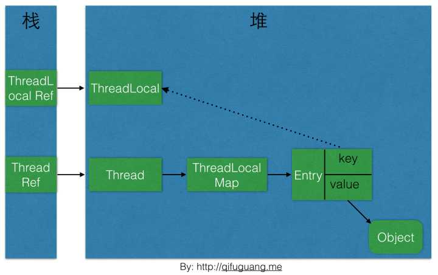
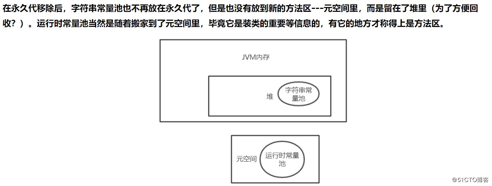
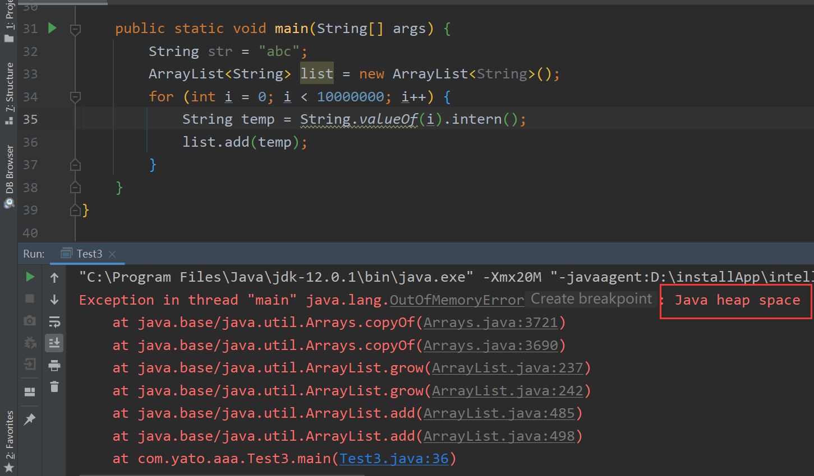

## 1. threadlocal 的原理

### 1.1 jdk 源码关于 threadloacl 的说明：

- *ThreadLocal 类用来提供线程内部的局部变量。这种变量在多线程环境下访问（通过 get 或 set 方法访问）时能保证各个线程里的变量相对独立于其他线程内的变量。ThreadLocal 实例通常来说都是*private static*类型的，用于关联线程和线程的上下文。*
- **总结起来：threadlocal 的作用是提供线程内的局部变量，这种变量在线程的生命周期内起作用，减少同一个线程内多个函数或者组件之间一些公共变量传递的复杂度**
- 这就是ThreadLocal设计的初衷：提供线程内部的局部变量，在本线程内随时随地可取，隔离其他线程。

### 1.2 From 知乎

作者：在下晨溪
链接：https://www.zhihu.com/question/23089780/answer/62097840
来源：知乎
著作权归作者所有。商业转载请联系作者获得授权，非商业转载请注明出处。


相信读者在网上也看了很多关于ThreadLocal的资料，很多博客都这样说：ThreadLocal为解决多线程程序的并发问题提供了一种新的思路；ThreadLocal的目的是为了解决多线程访问资源时的共享问题。如果你也这样认为的，那现在给你10秒钟，清空之前对ThreadLocal的**错误**的认知！

more

看看JDK中的源码是怎么写的：

*This class provides thread-local variables. These variables differ from their normal counterparts in that each thread that accesses one (via its {@code get} or {@code set} method) has its own, independently initialized copy of the variable. {@code ThreadLocal} instances are typically private static fields in classes that wish to associate state with a thread (e.g., a user ID or Transaction ID).*

翻译过来大概是这样的(英文不好，如有更好的翻译，请留言说明)：

*ThreadLocal类用来提供线程内部的局部变量。这种变量在多线程环境下访问(通过get或set方法访问)时能保证各个线程里的变量相对独立于其他线程内的变量。ThreadLocal实例通常来说都是*private static*类型的，用于关联线程和线程的上下文。*

可以总结为一句话：**ThreadLocal的作用是提供线程内的局部变量，这种变量在线程的生命周期内起作用，减少同一个线程内多个函数或者组件之间一些公共变量的传递的复杂度。**

举个例子，我出门需要先坐公交再做地铁，这里的坐公交和坐地铁就好比是同一个线程内的两个函数，我就是一个线程，我要完成这两个函数都需要同一个东西：公交卡（北京公交和地铁都使用公交卡），那么我为了不向这两个函数都传递公交卡这个变量（相当于不是一直带着公交卡上路），我可以这么做：将公交卡事先交给一个机构，当我需要刷卡的时候再向这个机构要公交卡（当然每次拿的都是同一张公交卡）。这样就能达到只要是我(同一个线程)需要公交卡，何时何地都能向这个机构要的目的。

有人要说了：*你可以将公交卡设置为全局变量啊，这样不是也能何时何地都能取公交卡吗？*但是如果有很多个人（很多个线程）呢？大家可不能都使用同一张公交卡吧(我们假设公交卡是实名认证的)，这样不就乱套了嘛。现在明白了吧？这就是ThreadLocal设计的初衷：提供线程内部的局部变量，在本线程内随时随地可取，隔离其他线程。

**ThreadLocal基本操作**

**构造函数**

ThreadLocal的构造函数签名是这样的：

```java
  /**
     * Creates a thread local variable.
     * @see #withInitial(java.util.function.Supplier)
     */
    public ThreadLocal() {
    }
```

内部啥也没做。

**initialValue函数**

initialValue函数用来设置ThreadLocal的初始值，函数签名如下：

```java
    protected T initialValue() {
        return null;
    }
```

该函数在调用get函数的时候会第一次调用，但是如果一开始就调用了set函数，则该函数不会被调用。通常该函数只会被调用一次，除非手动调用了remove函数之后又调用get函数，这种情况下，get函数中还是会调用initialValue函数。该函数是protected类型的，很显然是建议在子类重载该函数的，所以通常该函数都会以匿名内部类的形式被重载，以指定初始值，比如：

```java
package com.winwill.test;

/**
 * @author qifuguang
 * @date 15/9/2 00:05
 */
public class TestThreadLocal {
    private static final ThreadLocal<Integer> value = new ThreadLocal<Integer>() {
        @Override
        protected Integer initialValue() {
            return Integer.valueOf(1);
        }
    };
}
```

**get函数**

该函数用来获取与当前线程关联的ThreadLocal的值，函数签名如下：

```java
public T get()
```

如果当前线程没有该ThreadLocal的值，则调用initialValue函数获取初始值返回。

**set函数**

set函数用来设置当前线程的该ThreadLocal的值，函数签名如下：

```java
public void set(T value)
```

设置当前线程的ThreadLocal的值为value。

**remove函数**

remove函数用来将当前线程的ThreadLocal绑定的值删除，函数签名如下：

```java
public void remove()
```

在某些情况下需要手动调用该函数，防止内存泄露。

**代码演示**

学习了最基本的操作之后，我们用一段代码来演示ThreadLocal的用法，该例子实现下面这个场景：

*有5个线程，这5个线程都有一个值value，初始值为0，线程运行时用一个循环往value值相加数字。*

代码实现：

```java
package com.winwill.test;

/**
 * @author qifuguang
 * @date 15/9/2 00:05
 */
public class TestThreadLocal {
    private static final ThreadLocal<Integer> value = new ThreadLocal<Integer>() {
        @Override
        protected Integer initialValue() {
            return 0;
        }
    };

    public static void main(String[] args) {
        for (int i = 0; i < 5; i++) {
            new Thread(new MyThread(i)).start();
        }
    }

    static class MyThread implements Runnable {
        private int index;

        public MyThread(int index) {
            this.index = index;
        }

        public void run() {
            System.out.println("线程" + index + "的初始value:" + value.get());
            for (int i = 0; i < 10; i++) {
                value.set(value.get() + i);
            }
            System.out.println("线程" + index + "的累加value:" + value.get());
        }
    }
}
```

执行结果为：

> *线程0的初始value:0*
>
> *线程3的初始value:0*
>
> *线程2的初始value:0*
>
> *线程2的累加value:45*
>
> *线程1的初始value:0*
>
> *线程3的累加value:45*
>
> *线程0的累加value:45*
>
> *线程1的累加value:45*
>
> *线程4的初始value:0*
>
> *线程4的累加value:45*

可以看到，各个线程的value值是相互独立的，本线程的累加操作不会影响到其他线程的值，真正达到了线程内部隔离的效果。

**如何实现的**

看了基本介绍，也看了最简单的效果演示之后，我们更应该好好研究下ThreadLocal内部的实现原理。如果给你设计，你会怎么设计？相信大部分人会有这样的想法：

*每个ThreadLocal类创建一个Map，然后用线程的ID作为Map的key，实例对象作为Map的value，这样就能达到各个线程的值隔离的效果。*

没错，这是最简单的设计方案，JDK最早期的ThreadLocal就是这样设计的。JDK1.3（不确定是否是1.3）之后ThreadLocal的设计换了一种方式。

我们先看看JDK8的ThreadLocal的get方法的源码:

```java
public T get() {
        Thread t = Thread.currentThread();
        ThreadLocalMap map = getMap(t);
        if (map != null) {
            ThreadLocalMap.Entry e = map.getEntry(this);
            if (e != null) {
                @SuppressWarnings("unchecked")
                T result = (T)e.value;
                return result;
            }
        }
        return setInitialValue();
    }
```

其中getMap的源码：

```java
 ThreadLocalMap getMap(Thread t) {
        return t.threadLocals;
    }
```

setInitialValue函数的源码：

```java
 private T setInitialValue() {
        T value = initialValue();
        Thread t = Thread.currentThread();
        ThreadLocalMap map = getMap(t);
        if (map != null)
            map.set(this, value);
        else
            createMap(t, value);
        return value;
    }
```

createMap函数的源码：

```java
    void createMap(Thread t, T firstValue) {
        t.threadLocals = new ThreadLocalMap(this, firstValue);
    }
```

简单解析一下，get方法的流程是这样的：

1. 首先获取当前线程
2. 根据当前线程获取一个Map
3. 如果获取的Map不为空，则在Map中以ThreadLocal的引用作为key来在Map中获取对应的value e，否则转到5
4. 如果e不为null，则返回e.value，否则转到5
5. Map为空或者e为空，则通过initialValue函数获取初始值value，然后用ThreadLocal的引用和value作为firstKey和firstValue创建一个新的Map

然后需要注意的是Thread类中包含一个成员变量：

ThreadLocal.ThreadLocalMap threadLocals = null;

所以，可以总结一下ThreadLocal的设计思路：

**每个Thread维护一个ThreadLocalMap映射表，这个映射表的key是ThreadLocal实例本身，value是真正需要存储的Object。**

这个方案刚好与我们开始说的简单的设计方案相反。查阅了一下资料，这样设计的主要有以下几点优势：

- 这样设计之后每个Map的Entry数量变小了：之前是Thread的数量，现在是ThreadLocal的数量，能提高性能，据说性能的提升不是一点两点(没有亲测)
- 当Thread销毁之后对应的ThreadLocalMap也就随之销毁了，能减少内存使用量。

**再深入一点**

先交代一个事实：**ThreadLocalMap是使用ThreadLocal的弱引用作为Key的**：

```java
static class ThreadLocalMap {

        /**
         * The entries in this hash map extend WeakReference, using
         * its main ref field as the key (which is always a
         * ThreadLocal object).  Note that null keys (i.e. entry.get()
         * == null) mean that the key is no longer referenced, so the
         * entry can be expunged from table.  Such entries are referred to
         * as "stale entries" in the code that follows.
         */
        static class Entry extends WeakReference<ThreadLocal<?>> {
            /** The value associated with this ThreadLocal. */
            Object value;

            Entry(ThreadLocal<?> k, Object v) {
                super(k);
                value = v;
            }
        }
        ...
        ...
}
```

下图是本文介绍到的一些对象之间的引用关系图，实线表示强引用，虚线表示弱引用： 




然后网上就传言，ThreadLocal会引发内存泄露，他们的理由是这样的：

*如上图，ThreadLocalMap使用ThreadLocal的弱引用作为key，如果一个ThreadLocal没有外部强引用引用他，那么系统gc的时候，这个ThreadLocal势必会被回收，这样一来，ThreadLocalMap中就会出现key为null的Entry，就没有办法访问这些key为null的Entry的value，如果当前线程再迟迟不结束的话，这些key为null的Entry的value就会一直存在一条强引用链：*

**Thread Ref -> Thread -> ThreaLocalMap -> Entry -> value**

*永远无法回收，造成内存泄露。*

我们来看看到底会不会出现这种情况。 其实，在JDK的ThreadLocalMap的设计中已经考虑到这种情况，也加上了一些防护措施，下面是ThreadLocalMap的getEntry方法的源码：

```java
private Entry getEntry(ThreadLocal<?> key) {
            int i = key.threadLocalHashCode & (table.length - 1);
            Entry e = table[i];
            if (e != null && e.get() == key)
                return e;
            else
                return getEntryAfterMiss(key, i, e);
}
```

getEntryAfterMiss函数的源码：

```java
 private Entry getEntryAfterMiss(ThreadLocal<?> key, int i, Entry e) {
            Entry[] tab = table;
            int len = tab.length;

            while (e != null) {
                ThreadLocal<?> k = e.get();
                if (k == key)
                    return e;
                if (k == null)
                    expungeStaleEntry(i);
                else
                    i = nextIndex(i, len);
                e = tab[i];
            }
            return null;
 }
```

expungeStaleEntry函数的源码：

```java
 private int expungeStaleEntry(int staleSlot) {
            Entry[] tab = table;
            int len = tab.length;

            // expunge entry at staleSlot
            tab[staleSlot].value = null;
            tab[staleSlot] = null;
            size--;

            // Rehash until we encounter null
            Entry e;
            int i;
            for (i = nextIndex(staleSlot, len);
                 (e = tab[i]) != null;
                 i = nextIndex(i, len)) {
                ThreadLocal<?> k = e.get();
                if (k == null) {
                    e.value = null;
                    tab[i] = null;
                    size--;
                } else {
                    int h = k.threadLocalHashCode & (len - 1);
                    if (h != i) {
                        tab[i] = null;

                        // Unlike Knuth 6.4 Algorithm R, we must scan until
                        // null because multiple entries could have been stale.
                        while (tab[h] != null)
                            h = nextIndex(h, len);
                        tab[h] = e;
                    }
                }
            }
            return i;
 }
```

整理一下ThreadLocalMap的getEntry函数的流程：

1. 首先从ThreadLocal的直接索引位置(通过ThreadLocal.threadLocalHashCode & (len-1)运算得到)获取Entry e，如果e不为null并且key相同则返回e；
2. 如果e为null或者key不一致则向下一个位置查询，如果下一个位置的key和当前需要查询的key相等，则返回对应的Entry，否则，如果key值为null，则擦除该位置的Entry，否则继续向下一个位置查询

在这个过程中遇到的key为null的Entry都会被擦除，那么Entry内的value也就没有强引用链，自然会被回收。仔细研究代码可以发现，set操作也有类似的思想，将key为null的这些Entry都删除，防止内存泄露。 但是光这样还是不够的，上面的设计思路依赖一个前提条件：**要调用ThreadLocalMap的**genEntry**函数或者**set**函数。**这当然是不可能任何情况都成立的，所以很多情况下需要使用者手动调用ThreadLocal的remove函数，手动删除不再需要的ThreadLocal，防止内存泄露。所以JDK建议将ThreadLocal变量定义成private static的，这样的话ThreadLocal的生命周期就更长，由于一直存在ThreadLocal的强引用，所以ThreadLocal也就不会被回收，也就能保证任何时候都能根据ThreadLocal的弱引用访问到Entry的value值，然后remove它，防止内存泄露。

## 2.  Integer 和缓存

> - Integer、Short、Long、Byte 都有缓存池，并且都是 [-128, 127]，因此，Byte 全在缓存池中。
> - 上述类型原理和 Integer 相同，这里只介绍 Integer

### 2.1 问题引入

```java
public static void main(String[] args) {
        Integer a = 1;
        Integer b = 2;
        Integer c = 3;
        Integer d = 3;
        Integer e = 321;
        Integer f = 321;
        Integer x = 322;
        Long g = 3L;
        Long h = 2L;
        System.out.println(c == d);             // true
        System.out.println(e == f);             // false
        System.out.println(c == (a + b));       // true 比较的是数值
        System.out.println(c.equals(a + b));    // true
        System.out.println(g == (a + b));       // true
        System.out.println(g.equals(a + b));    // false
        System.out.println(g.equals(a + h));    // true
        System.out.println(g == (a + h));     // true
        System.out.println(x == f + a);      // true  比较的是数值
}
```

### 2.2 问题分析

1. Integer 缓存池（源码）

    ```java
    static final int low = -128;
    static final int high;
    
    static {
                // high value may be configured by property
                int h = 127;
                String integerCacheHighPropValue =
                    VM.getSavedProperty("java.lang.Integer.IntegerCache.high");
                if (integerCacheHighPropValue != null) {
                    try {
                        h = Math.max(parseInt(integerCacheHighPropValue), 127);
                        // Maximum array size is Integer.MAX_VALUE
                        h = Math.min(h, Integer.MAX_VALUE - (-low) -1);
                    } catch( NumberFormatException nfe) {
                        // If the property cannot be parsed into an int, ignore it.
                    }
                }
                high = h;
    
                // Load IntegerCache.archivedCache from archive, if possible
                VM.initializeFromArchive(IntegerCache.class);
                int size = (high - low) + 1;
    
                // Use the archived cache if it exists and is large enough
                if (archivedCache == null || size > archivedCache.length) {
                    Integer[] c = new Integer[size];
                    int j = low;
                    for(int i = 0; i < c.length; i++) {
                        c[i] = new Integer(j++);
                    }
                    archivedCache = c;
                }
                cache = archivedCache;
                // range [-128, 127] must be interned (JLS7 5.1.7)
                assert IntegerCache.high >= 127;
    }
    
    @HotSpotIntrinsicCandidate
    public static Integer valueOf(int i) {
            if (i >= IntegerCache.low && i <= IntegerCache.high)
                return IntegerCache.cache[i + (-IntegerCache.low)];
            return new Integer(i);
    }
    ```

2. 根据源码，一般情况下，缓存池的大小是 [-128, 127]

3. == 的情况

    - 比较 Integer 变量，默认比较的是地址
    - java 的 Integer 维护了从 [-128, 127] 的缓存池
    - 如果比较的某一边有操作表达式（例如 a + b），那么比较的是具体数值
    - 包装类的“==”运行符在不遇到算术运算的情况下不会自动**拆箱**

4. equals 方法
    - 源码

        ```java
        public boolean equals(Object obj) {
                if (obj instanceof Integer) {
                    return value == ((Integer)obj).intValue();
                }
                return false;
        }
        ```

    - 在比较值之前，会判断类型
    
5. 解释

    ```java
    public static void main(String[] args) {
            Integer a = 1;
            Integer b = 2;
            Integer c = 3;
            Integer d = 3;
            Integer e = 321;
            Integer f = 321;
            Long g = 3L;
            Long h = 2L;
            System.out.println(c == d);             // c、d 都在缓存池中，是同一对象，所以地址相同
            System.out.println(e == f);             // e、f 不在缓存池中，每次赋值都 new 了一个新对象，地址不同
            System.out.println(c == (a + b));       // 涉及到表达式，会转化成 c.intValue() == a.intValue() + b.intValue()，值相同
            System.out.println(c.equals(a + b));    // 比较的是数值
            System.out.println(g == (a + b));       // 涉及到表达式，会转化成 c.longValue() == a.intValue() + b.intValue()，值相同
            System.out.println(g.equals(a + b));    // 会判断类型，a + b 的值不是 Long 类型，返回 false
            System.out.println(g.equals(a + h));    // a + h 的结果会转换成 Long，并且值相同，返回 true
    }
    ```

    注意：对于 g == (a + b)，比较的是值，3 == 3L 也是 true，值是相同的。

## 3. 基础知识点

#### 3.1 面向对象的三个特征

- 封装、继承、多态。时候也会加上抽象

#### 3.2 多态

1. 多态的定义：
    - 指允许不同类的对象对同一消息做出响应。即同一消息可以根据发送对象的不同而采用多种不同的行为方式。（发送消息就是函数调用）。**例如快捷键，在不同程序中，同一快捷键呈现出不同的效果**
2. 实现多态的技术
    - 动态绑定（dynamic binding），是指在执行期间判断所引用对象的实际类型，根据其实际的类型调用其相应的方法。Hotspot 中 oop-klass 模型的实现，对象模型的对象头的 class pointer 指向本类的 class 对象。
3. 多态的作用：
    - 消除类型之间的耦合关系。
4. 多态的好处
    - **可替换性**（substitutability）。多态对已存在代码具有可替换性。例如，多态对圆 Circle 类工作，对其他任何圆形几何体，如圆环，也同样工作。
    - **可扩充性**（extensibility）。多态对代码具有可扩充性。增加新的子类不影响已存在类的多态性、继承性，以及其他特性的运行和操作。实际上新加子类更容易获得多态功能。例如，在实现了圆锥、半圆锥以及半球体的多态基础上，很容易增添球体类的多态性。
    - **接口性**（interface-ability）。多态是超类通过方法签名，向子类提供了一个共同接口，由子类来完善或者覆盖它而实现的。
    - **灵活性**（flexibility）。它在应用中体现了灵活多样的操作，提高了使用效率。
    - **简化性**（simplicity）。多态简化对应用软件的代码编写和修改过程，尤其在处理大量对象的运算和操作时，这个特点尤为突出和重要。
5. 多态三大要素
    - 继承、重写、父类引用指向子类对象

#### 3.3 接口和抽象类

1. 接口的意义：规范、扩展、回调
2. 抽象类的意义：
    - 为其他子类提供一个公共的类型
    - 封装子类中重复定义的内容
    - 定义抽象方法，子类虽然有不同的实现，但是定义是一致的
3. 接口和抽象类的区别（略）

#### 3.4 成员方法和成员变量的继承性和重写

1. 根据静态与否分为

    - 静态的成员变量
    - 非静态的成员变量
    - 静态的方法
    - 非静态的方法

2. 结论

    - 只有非静态的方法可以被继承并且被重写（override）
    - 其他三种，只能被继承，但是不能被重写，而是被隐藏
    - 多态性体现在非静态方法的重写特性上

3. 验证

    ```java
    class A {
        public static String staticStr = "A静态成员变量";
        public String str = "A非静态成员变量";
        public static void staticMethod() {
            System.out.println("A静态方法");
        }
        public void method(){
            System.out.println("A非静态方法");
        }
    }
    class C extends A {
    
    }
    class B extends A{
        public static String staticStr = "B静态成员变量";
        public String str = "B非静态成员变量";
        public static void staticMethod() {
            System.out.println("B静态方法");
        }
        @Override
        public void method(){
            System.out.println("B非静态方法");
        }
    }
    
    public class Test2 {
        public static void test1(){
            C c = new C();
            System.out.println(c.str);
            System.out.println(c.staticStr);
            c.staticMethod();
            c.method();
            //输出结果全部为父类 A 中的成员变量和方法，证明了静态的方法和成员变量可以被继承
        }
        public static void test2(){
            A a = new B();
            System.out.println(a.str);//A的非静态成员变量
            System.out.println(a.staticStr);//A的静态成员变量
            a.method();//B的非静态方法
            a.staticMethod();//A的静态方法
            //只有非静态的方法成功完成了重写，另外三个都是父类的方法和变量
        }
        public static void main(String[] args) {
            test1();
            test2();
        }
    }
    ```

#### 3.5 不可变对象

> 不可变对象 (Immutable Object)：对象一旦被创建后，对象所有的状态及属性在其生命周期内不会发生任何变化。

1. 举例

    - 自己构造一个不可变对象

        ```java
        public class ImmutableObject {
            private int value;
            public ImmutableObject(int value) {
                this.value = value;
            }
            public int getValue() {
                return this.value;
            }
        }
        ```

        ImmutableObject 不提供任何 setter 方法，并且成员变量 value 是基本数据类型，getter 方法返回的是 value 的拷贝，所以一旦 ImmutableObject 实例被创建后，该实例的状态无法再进行更改，因此该类具备不可变性。

    - String 对象

    - 包装类（Integer 等）

2. 使用不可变对象的好处

    - 在并发编程中，线程安全（因为对象不可变，所以任何线程任何时间获取到的该共享资源的值都是一致的、完整的资源状态）
    - 消除副作用（对象被修改，后续程序感知不到，造成不易察觉的问题）
    - 减少容器使用过程中出错的概率（对象被放入容器中，又进行了修改，以致判断此容器是否包含此对象返回 false）

3. 如何创建不可变对象（原则）

    - **所有成员变量必须是 private**
    - **最好同时用 final 修饰(非必须)**
    - **不提供能够修改原有对象状态的方法**（也可以提供）
        - 最常见的方式是不提供 setter 方法
        - 如果提供 setter 方法，需要新创建一个对象，并在新创建的对象上进行修改
    - **通过构造器初始化所有成员变量，引用类型的成员变量必须进行深拷贝 (deep copy)**
    - **getter 方法不能对外泄露 this 引用以及成员变量的引用**
    - **最好不允许类被继承(非必须)**

4. 不可变对象并非“完全不可改变”

    - 反射

5. 可以创建一个包含可变对象的不可变对象

    - ```final Person[] persons = new Persion[]{};``` persons 是不可变对象的引用，但是其中的实例 Person 可以修改
    - 注意：不要共享可变对象的引用。这种情况下，如果数据需要变化时，就返回原对象的一个拷贝。当然，视情况而定

6. 可以创建一个包含不可变对象的可变对象

    - ```List<Integer> list = new ArrayList<>();```

#### 3.6 java 创建对象的几种方式

1. 4 种方式

    | 方式                                                         | 是否调用构造函数 |
    | ------------------------------------------------------------ | ---------------- |
    | 使用 new 关键字                                              | 是               |
    | 使用 Class 类的 newInstance 方法（已被弃用）；<br/>使用 Constructor 类的 newInstance 方法 | 是               |
    | 使用 clone 方法                                              | 否               |
    | 使用反序列化                                                 | 否               |

2. 使用 Constructor 类的 newInstance 方法

    ```java
    class Demo{
        public Demo() {}
        public Demo(int a) {}
        public Demo(String a) {}
        public Demo(Integer a) {}
    }
    public class Test {
        public static void main(String[] args) throws Exception {
            Class<Demo> demo = Demo.class;
            Constructor<Demo> constructor = demo.getConstructor(int.class);
            Demo demo1 = constructor.newInstance(3);
            Demo demo2 = demo.getConstructor().newInstance();
            Demo demo3 = demo.getConstructor(String.class).newInstance("aaa");
            Demo demo4 = demo.getConstructor(Integer.class).newInstance(4);
            System.out.println(demo1);
            System.out.println(demo2);
            System.out.println(demo3);
            System.out.println(demo4);
        }
    }
    ```

    注意：**int 和 Integer 是不同的重载的构造函数**

3. 使用 clone 方法

    ```java
    class Demo implements Cloneable {
        @Override
        protected Object clone() throws CloneNotSupportedException {
            return super.clone();
        }
    }
    public class Test {
        public static void main(String[] args) throws Exception {
            Demo demo = new Demo();
            Demo demo2 = (Demo) demo.clone();
            System.out.println(demo);
            System.out.println(demo2);
        }
    }
    ```

    使用步骤：

    1. **实现 Cloneable 接口**
    2. **重写 object 类的 clone 方法（此方法是 protected 的，期望我们重写此方法）。**

    注意：

    1. 无论何时我们调用一个对象的 clone 方法， JVM 就会创建一个新的对象，将前面对象的内容全部拷贝进去（此时只是浅拷贝，引用类型只是拷贝了引用地址，所以需要重新改写 clone 方法）。
    2. **用 clone 方法创建对象并不会调用任何构造函数。**
    3. **虽然要求对象实现 Cloneable 接口，但是 clone 方法是 Object 对象中的，该接口只是一个标记，没有任何方法**

4. 使用反序列化

    ```java
    class Demo implements Serializable {
        String str = "str";
        int a = 1;
        List<Integer> list = Arrays.asList(1,2,3);
    }
    public class Test {
        public static void main(String[] args) throws Exception {
            Demo demo = new Demo();
            ByteArrayOutputStream baos = new ByteArrayOutputStream();
            ObjectOutputStream oos = new ObjectOutputStream(baos);
            oos.writeObject(demo);
            ObjectInputStream ois = new ObjectInputStream(new ByteArrayInputStream(baos.toByteArray()));
            Demo demo2 = (Demo) ois.readObject();
        }
    }
    ```

    使用步骤：

    - 让类实现 Serializable 接口

    - 使用 ObjectOutputStream 和 ObjectInputStream 来进行序列化和反序列化对象

    注意事项：

    - 在反序列化时，JVM 创建对象并不会调用任何构造函数。
    - 反序列化的对象是一个独立的对象，相当于深拷贝。

#### 3.7 switch 中可以使用的参数

1. 所有可以使用的参数有

    - char、Character
    - byte、Byte
    - short、Short
    - int、Integer
    - String
    - enum

2. 注意事项：
    - jdk 1.7 之后开始支持 String。
    - switch 的参数和 case 的参数都不能是 null，编译错误
    - **一直没有支持 long 类型。一直没有支持 long 类型。一直没有支持 long 类型。**

3. switch 支持类型的理解
    1. byte、short、char 类型可以在不损失精度的情况下向上转型成 int 类型
    2. 四个包装类可以经过拆箱转化成对应的基本数据类型
    3. 枚举类的 ordinal 方法（获取定义次序）返回值是一个 int，且唯一
    4. String 类型的 hashCode 算法的返回值是一个 int
    5. **总之，一切源于 int**

#### 3.8 Object 中的 equals() 和 hashcode() 的联系

- 如果两个对象使用 equals() 方法比较相等，那么这两个对象的 hashCode() 方法会产生相同的哈希值
- 如果两个对象使用 equals() 方法比较不相等，那么产生的哈希值也会有可能相同（哈希冲突）
- 如果哈希值不相同，这两个对象使用 equals 方法比较一定不相等。

注意：**不可以在 hashcode 中使用随机数字，因为同一对象的 hashcode 值必须是相同的**

#### 3.9 类的修饰符

1. 外部类
    - 一个文件只能有一个 public 的类，且类名和文件名一致
    - 一个文件可以有多个 default 的类（也就是不加修饰符）
    - 外部类不能使用 private 修饰
        - 因为如果使用 private 修饰 Java 外部类，那么这个类不能创建实例，这个类的属性和方法不能被访问，那么创建这个类毫无意义
    - 外部类不能使用 protected 修饰
        - 举个例子，如果类 A 用 protected 修饰，与类 A 不同包的类 B 想要访问类 A 的话，类 B 就必须是继承类 A 的（或者说类 B 必须为类 A 的子类），但是类 B 继承类 A 的前提又是类 B 可以访问到类 A，有点绕对吧，仔细想想会发现这里是冲突的，其实这就说明了为什么不能用 protected 来修饰外部类。再说，protected 是用来表示在继承关系中的访问权限的，在同一个包和子类中都可以访问，因为继承就是为了拥有父类的属性和方法，所以 protected 是用于修饰类的方法和属性的，也就是说，**我想要这个类的属性和方法可以被任何子类继承，我就用 protected。开发中，是有一丝丝强迫的意思的，比如 clone 方法是 protected 的，当我们需要使用它时，最好重写父类方法，因为需要避免浅拷贝的问题**
2. 内部类
    - 可以使用任何修饰符 public、private、默认、protected

#### 3.10 导入静态资源：import static java.lang.Math.max;

#### 3.11 final

- 被 final 修饰的类不可以被继承
- 被 final 修饰的方法不可以被重写（可以被子类继承，但不能重写，但却可以隐藏，见 3.4 ---- 成员方法和成员变量的继承性和重写）
- 被 final 修饰的变量不可以被改变，如果修饰引用，那么表示引用不可变，引用指向的内容可变.
- 被 final 修饰的方法，JVM会尝试将其内联，以提高运行效率
- 被 final 修饰的常量，在编译阶段会存入常量池中
- 编译器对 final 域要遵守的两个重排序规则
    - 在构造函数内对一个 final 域的写入，与随后把这个被构造对象的引用赋值给一个引用变量，这两个操作之间不能重排序
    - 初次读一个包含 final 域的对象的引用，与随后初次读这个 final 域，这两个操作之间不能重排序

#### 3.12 int 和 Integer 的区别

- Integer 是 int 的包装类型，在拆箱和装箱中，二者自动转换
- int 是基本类型，直接存数值，占用 4 个字节
- Integer 是对象，用一个引用指向这个对象。在 JVM 中对象需要一定的数据结构进行描述。占用内存 = 对象头（12 bytes）+ 数据（4 bytes）+ 对齐（0 bytes） = 16 字节。

#### 3.13 String 相关

> 字符串常量池存储位置
>
> 
>
> 总的来说就是
>
> - JDK1.7 之前，运行时常量池（字符串常量池也在里边）是存放在方法区，此时方法区的实现是永久代。
>
> - JDK1.7 字符串常量池被单独从方法区移到堆中，运行时常量池剩下的还在永久代（方法区）
>
> - JDK1.8 永久带更名为元空间（方法区的新的实现），但字符串常量池还在堆中，运行时常量池在元空间（方法区）。
>
> - jdk 12，可见，字符串常量池在堆中
>
>     

##### 3.13.1 创建对象问题

- `String s = new String("abc")`创建了几个 String 对象?
    - 2 个或者 1 个。一个是字符串字面常数，在字符串常量池中（可能已经创建过）；另一个是 new 出来的字符串对象，在堆中。

##### 3.13.2 intern 函数

> 　intern 函数是一个 native 方法，作用是将对应的符号常量进入特殊处理，在 1.6 以前 和 1.7 以后有不同的处理；
>
> - 在 1.6 中，intern 的处理是 先判断字符串常量是否在字符串常量池中，如果存在直接返回该常量，如果没有找到，则将该字符串常量加入到字符串常量区，也就是在字符串常量区建立该常量；
> - 在 1.7 中，intern 的处理是 先判断字符串常量是否在字符串常量池中，如果存在直接返回该常量，如果没有找到，说明该字符串常量在堆中，则处理是把堆区该对象的引用加入到字符串常量池中，以后别人拿到的是该字符串对象的引用，实际存在堆中；

```java
String s1 = new String("a") + new String("b");
System.out.println(s1.intern() == s1); // true
String s2 = new String("a");
System.out.println(s2.intern() == s2); // false
String s3 = new String("c");
System.out.println(s3.intern() == s3); // false
```

注意：

- ```new String("a") + new String("b") ```只要表达式中有变量字符串，就会使用 StringBuffer 组装成 “ab" 返回，**"ab" 不会被存到常量池** ；调用 intern 方法，由于使用的是 jdk 12，所以会把，s1 这个引用放在常量池中，所以第一个判断语句返回 true
- 对于第二个和第三个判断语句，会在常量池中新建字符常量，s2.intern 返回常量池中 “a”的引用，而 s2 是堆中的对象，对象里面的值引用常量池中的“a”，不是同一个引用，所以返回 false

##### 3.13.3 == 比较

**编译器会把常量表达式优化，例如 String s = "a" + "b" 会优化成 String s = "ab";**

```java
String s1 = "abc";
String s2 = "a";
String s3 = s2 + "bc";
String s4 = "a" + "bc";
String s5 = s3.intern();
System.out.println(s1 == s3); // false
System.out.println(s1 == s4); // true
System.out.println(s1 == s5); // true
```

- “abc" 这个字符串常量值会存在字符串常量池中，s1 是对其的引用；由于 s2 是个变量，编译器在编译期间无法确定该变量后续会不会改，因此无法直接将 s3 的值在编译期计算出来，因此 s3 是堆中 "abc" 的引用。**因此s1!=s3**
- 对于 s4 而言，其赋值号右边是常量表达式，因此可以在编译阶段直接被优化为 "abc”,由于 "abc" 已经在字符串常量池中存在，因此 s4 是对其的引用，此时也就意味 s1 和 s4 引用了常量池中的同一个"abc"。**所以s1==s4**
- 见上面

#### 3.14 String、StringBuffer 和 StringBuilder 区别

- String 是字符串常量，final修饰
- StringBuffer 字符串变量 (线程安全) 
- StringBuilder 字符串变量(线程不安全)
- 此外 StringBuilder 和 StringBuffer 实现原理一样，都是基于数组扩容来实现的。

#### 3.15 注意浮点数不精确表示的情况 0.1 * 3 == 0.3 返回 false

#### 3.16 如何将 byte[] 转为 String

- 可以使用 String 接收 byte[] 参数的构造器来进行转换，注意要使用的正确的编码，否则会使用平台默认编码。这个编码可能跟原来的编码相同，也可能不同。第二个参数即可指定编码字符集。

#### 3.17 a=a+b 与 a+=b 区别

- `+=`操作符会进行隐式自动类型转换，此处 a+=b 隐式的将加操作的结果类型**强制转换**为持有结果的类型，而 a=a+b 则不会自动进行类型转换。如：

    ```java
    byte a = 127;
    byte b = 127;
    b = a + b; // 报编译错误:cannot convert from int to byte
    b += a; 
    ```

- 下列代码是否报错

    ```java
    short | byte a = 2, b = 3;
    a = a + b; // 报错
    a = a + 1; // 报错
    a += b;
    a += 1;
    ```

    **short/byte 类型在进行运算时会自动提升为 int 类型，无论是否与 int 类型的值相加，都会提升为 int（当然，有 long 类型肯定会提升为 long），所以会出现报错。+= 由于会隐式类型转换，不会报错。如果溢出会有数据丢失。**

#### 3.18 泛型的上界和下界

1. Java 中常见的通配符主要有以下几种:
    - `<?>`: 无限制通配符
    - `<? extends E>`: extends 关键字声明了类型的上界，表示参数化的类型可能是所指定的类型，或者是此类型的子类
    - `<? super E>`: super 关键字声明了类型的下界，表示参数化的类型可能是指定的类型，或者是此类型的父类
2. 它们的目的都是为了使方法接口更为灵活，可以接受更为广泛的类型
    - `< ? extends E>`: 用于灵活**读取**，使得方法可以读取 E 或 E 的任意子类型的容器对象。
    - `< ? super E>`: 用于灵活**写入或比较**，使得对象可以写入父类型的容器，使得父类型的比较方法可以应用于子类对象。

#### 3.19 局部变量使用前需要显式地赋值，否则编译通过不了，为什么这么设计？

- 成员变量是可以不经初始化的，在类加载过程的准备阶段即可给它赋予默认值，但局部变量使用前需要显式赋予初始值。虽然 javac 足够有能力推断出局部变量并初始化默认值，然而它并没有这样做。
- 对于成员变量而言，其赋值和取值访问的先后顺序具有不确定性，可以在（取值）方法调用前赋值，也可以在（取值）方法调用后赋值，具体顺序是在运行时发生的，编译器确定不了，需要交给 JVM 去做。
- 而对于局部变量，赋值和取值的顺序是确定的。这样设计是一种约束，尽可能减少使用者犯错的可能。如果局部变量赋默认值，可能会造成忘记赋值的问题，从而出现不可预期的情况。

#### 3.20 private 修饰的方法可以通过反射访问，那么 private 的意义是什么

- Java 的 private 修饰符并不是为了绝对安全性设计的，更多是对用户常规使用 Java 的一种约束，是对 OOP（面向对象编程）的封装性的体现。
- 从外部对对象进行常规调试时，能够看到清晰的类结构

#### 3.21 Java 类初始化顺序

1. 基类静态代码块，基类静态成员字段（并列优先级，按照代码中出现的先后顺序执行，且只有第一次加载时执行）
2. 派生类静态代码块，派生类静态成员字段（并列优先级，按照代码中出现的先后顺序执行，且只有第一次加载时执行）
3. 基类普通代码块，基类普通成员字段（并列优点级，按代码中出现先后顺序执行）
4. 基类构造函数
5. 派生类普通代码块，派生类普通成员字段（并列优点级，按代码中出现先后顺序执行）
6. 派生类构造函数

#### 3.22 对方法区和永久区的理解以及它们之间的关系

- 方法区是 JVM 规范里要求的，永久区是 Hotspot 虚拟机对方法区的具体实现。前者是规范，后者是实现方式。并且在 jdk8 之后 Hotspot 就取消了了永久区。

#### 3.23 一个 Java 文件中有 n 个类，编译后生成几个 class 文件？

- 有几个类生成几个 class 文件，包括（静态）内部类等。

#### 3.24 ReadWriteLock 读写之间互斥吗 ？

- ReadWriteRock 读写锁，使用场景可分为 “读/读”、“读/写”、“写/写”。其中，除了“读/读”之间是共享的，其它都是互斥的。
- 接着会讨论怎样实现互斥锁和同步锁， 涉及到 AQS，CAS。

#### 3.25 Semaphore 拿到执行权的线程之间是否互斥？（待解决）

- Semaphore、CountDownLatch、CyclicBarrier、Exchanger 为 Java 并发编程的 4 个辅助类。面试中常问的 CountDownLatch 和 CyclicBarrier之间的区别。

- Semaphore 可有多把锁，可允许多个线程同时拥有执行权，这些有执行权的线程如并发访问同一对象，会产生线程安全问题。
- 所以，是否互斥？是？如果再次竞争其他的互斥资源还是会互斥？

#### 3.26 B 树和 B+ 树是解决什么样的问题的，怎样演化过来，之间区别？

- B 树和 B+ 树，这题即问 mysql 索引的实现原理，也问数据结构基础。
- 首先从二叉树搜索树说起，由于，二叉搜索树会产生退化现象，然后，提出了平衡二叉树
- 再提出怎样让每一层放的节点多一些来减少遍历高度，引申出 m 叉搜索树
- m 叉搜索树同样会有退化现象，引出 m 叉平衡树，也就是B树。B 树每个节点既放了 key 也放了 value
- 怎样使每个节点放尽可能多的 key 值，以减少遍历高度呢（访问磁盘次数），可以将每个节点只放 key 值，将 value 值放在叶子结点，在叶子结点的 value 值增加指向相邻节点指针，这就是优化后的 B+ 树。
- 然后谈谈数据库索引失效的情况，为什么给离散度低的字段（如性别）建立索引是不可取的，查询数据反而更慢，如果将离散度高的字段和性别建立联合索引会怎样，有什么需要注意的？

#### 2.27 mysql给离散度低的字段建立索引会出现什么问题，具体说下原因

> 先上结论：重复性较强的字段，不适合添加索引。mysql 给离散度低的字段，比如性别设置索引，再以性别作为条件进行查询反而会更慢。

- 一个表可能会涉及两个数据结构(文件)，一个是表本身，存放表中的数据，另一个是索引。
- 索引是什么？它就是把一个或几个字段（组合索引）按规律排列起来，再附上该字段所在行数据的物理地址（位于表中）。比如我们有个字段是年龄，如果要选取某个年龄段的所有行，那么一般情况下可能需要进行一次全表扫描。但如果以这个年龄段建个索引，那么索引中会按年龄值根据特定数据结构建一个排列，这样在索引中就能迅速定位，不需要进行全表扫描。
- 为什么性别不适合建索引呢？因为访问索引需要付出额外的 IO 开销，从索引中拿到的只是地址，要想真正访问到数据还是要对表进行一次 IO。假如要从表的 100 万行数据中取几个数据，那么利用索引迅速定位，访问索引的这 IO 开销就非常值了。但如果是从 100 万行数据中取 50 万行数据，就比如性别字段，那你相对需要访问50万次索引，再访问50万次表，加起来的开销并不会比直接对表进行一次完整扫描小。

- 当然如果把性别字段设为表的聚集索引，那么就肯定能加快大约一半该字段的查询速度了。聚集索引指的是表本身数据按哪个字段的值来进行排序。因此，聚集索引只能有一个，而且使用聚集索引不会付出额外 IO 开销。当然你得能舍得把聚集索引这么宝贵资源用到性别字段上。

- 可以根据业务场景需要，将性别和其它字段建立联合索引，比如时间戳，但是建立索引记得把时间戳字段放在性别前面。

#### 2.28 int i = 1 是原子操作吗？ i++ 是原子操作吗？

> **原子操作**是指 不会被线程调度机制打断的操作，这种操作一旦开始，就一直运行到结束，中间不会有任何 context switch （切换到另一个线程）。
>
> 也可以这样理解：如果这个操作所处的层 (layer) 的更高层不能发现其内部实现与结构，那么这个操作是一个原子 (atomic) 操作。
>
> 原子操作可以是一个步骤，也可以是多个操作步骤，但是其顺序不可以被打乱，也不可以被切割而只执行其中的一部分。将整个操作视作一个整体是原子性的核心特征。

- 给整型变量赋值一个确定的值，是原子操作。如 int a = 1;
- 变量自身增加或者减去一个值，非原子操作。如 a++;
- 给整型变量赋值为另一个变量，非原子操作。如 int a = b;

#### 2.29 synchronized 底层实现原理

- synchronized (this) 涉及两条指令：monitorenter，monitorexit；
- 再说同步方法，从同步方法反编译的结果来看，方法的同步并没有通过指令monitorenter 和 monitorexit 来实现，相对于普通方法，其常量池中多了ACC_SYNCHRONIZED 标示符。
- JVM 就是根据该标示符来实现方法的同步的：当方法被调用时，调用指令将会检查方法的 ACC_SYNCHRONIZED 访问标志是否被设置，如果设置了，执行线程将先获取 monitor，获取成功之后才能执行方法体，方法执行完后再释放 monitor。在方法执行期间，其他任何线程都无法再获得同一个 monitor 对象。
- 这个问题会接着追问：java对象头信息，偏向锁，轻量锁，重量级锁及其他们相互间转化。


