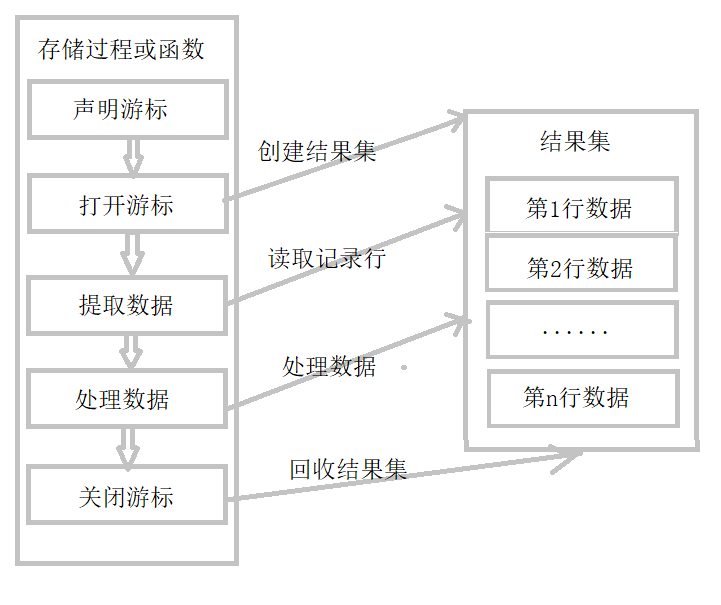
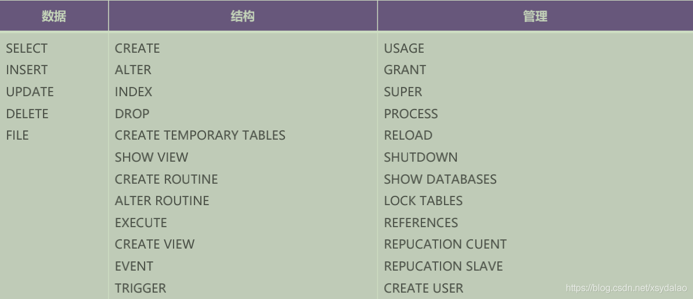
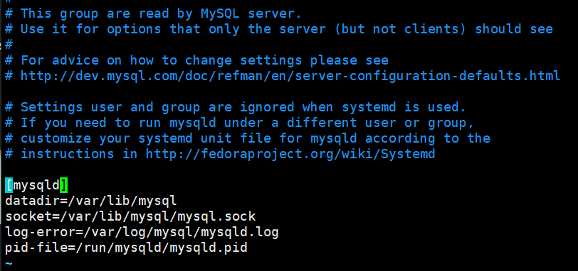
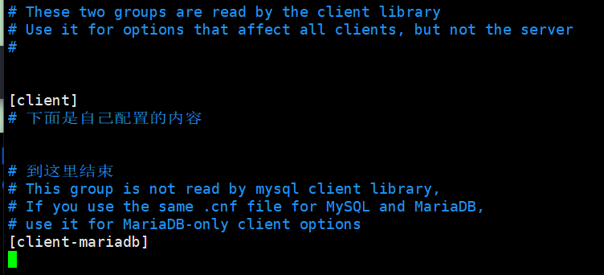
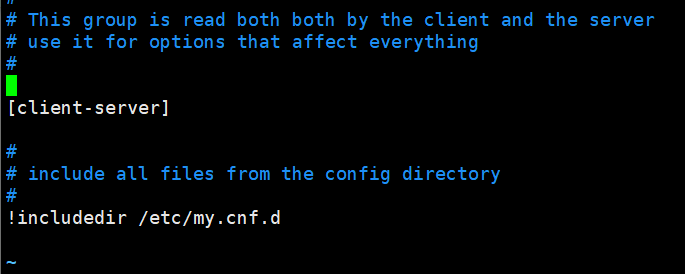

# mysql基础

[toc]

> 1. 为什么学习数据库
>     1. 持久化数据
>     2. 方便检索
>     3. 存储大量数据
>     4. 共享、安全
>     5. 通过组合分析，获取新的数据
> 2. mysql的细节：
>     1. 一个表取了别名后，就不能使用表名来获取某列数据了，只能使用别名。
>     2. 可以跨库操作数据，在表名前面加上**库名.**即可。

## 1. 前期准备

1. mysql 对应路径的作用
   
    | 路径             | 解释                       | 备注                         |
    | ---------------- | -------------------------- | ---------------------------- |
    | /var/lib/mysql   | mysql 数据库文件的存放路径 |                              |
    | /usr/share/mysql | 配置文件目录               | mysql.server 命令及配置文件  |
    | /usr/bin         | 相关命令目录               | mysqladmin、mysqldump 等命令 |
    
    
    
2. 服务的开启和关闭

    1. linux
        1. 开启：service mysql start 或者 systemctl start mysqld.service
        2. 关闭：service mysql stop 或者 systemctl stop mysqld.service
        3. 修改密码： /usr/bin/mysqladmin -u root password xxxxxx
    2. windows
        1. 开启：net start mysql    `注意这里的mysql是服务中的mysql的服务名字，名字可能会有出入`
        2. 关闭：net stop mysql     `同上。`
        3. 注意：在控制台开启关闭服务需要以管理员身份打开控制台。

3. 登录

    ```shell
    mysql -h localhost -P 3306 -u root -p123456
    ```

    细节：

    1. -h 指定主机名       连接本机可以省略

    2. -P 指定端口号       连接默认3306端口可以省略

    3. -u 指定用户名

    4. -p 指定密码

    5. 注意：

        > 除了指定密码外，其余三个参数和值之间的空格可写可不写。
        >
        > 指定密码的参数后面要紧跟密码，不能有空格，或者
        >
        > 可以不写密码，回车后，再输入密码。

4. 常见命令

    1. 查看当前所有的数据库

        show databases;

    2. 打开指定的库

        use 库名;

    3. 查看当前库的所有表

        show tables;

    4. 查看其他库的所有表

        show tables from 库名;

    5. 创建表

        create table 表名(

        列名 列类型,

        列名 列类型,

        ........);

    6. 查看表结构

        desc 表名;

        或者 show columns from employees;

    7. 查看表或视图的创建的语句

        show create table|view 表名|视图名;

    8. 查看当前所在的数据库

        select database();

    9. 查看当前mysql登录的用户

         select user();

    10. 修改mysql的字符集

        set names utf8;

        set names gbk;

    11. 查询当前数据库服务的时区

         SHOW VARIABLES LIKE 'time_zone';

    12. 更改当前数据库服务的时区

        SET time_zone ='system'; 设置时区为系统时区

        SET time_zone ='+8:00'; 设置时区为东八区

    13. 查看服务器的版本

           方式一：在mysql服务端内部

           ​		select version();

           方式二：没有登陆到mysql服务器

           ​		mysql --version 或者 mysql -V

    

5. mysql的语法规范

    1. 不区分大小写，但建议关键字大写，表名、列名小写

    2. 每条命令最好用分号结尾

    3. 每条命令根据需要，可以进行缩进或换行

    4. 注释的使用

        ​	单行注释：#注释文字

        ​	单行注释：-- 注释文字（注意--后面必须有一个空格）

        ​	多行注释：/* 注释文字 */

## 2. DQL（数据查询语言）

### 2.1 查询语句

1. 基础查询 select ... from ...;

    > 执行顺序：
    >
    > ​		先执行 `from 表名` 判断表是否存在，
    >
    > ​		再执行`select ...`选择显示出需要的列数据。

    1. mysql中加法的运算

        - 两个操作都是数值型：执行正常的加法。如 100 + 1.5 ===> 101.5

        - 其中一个操作数为字符型：将字符型数据强制转换成数值型，如果无法转换，则直接当做0来处理。如 '张无忌' + 100 ===> 100

        - 其中一个操作数为null，则整个式子为null。如 null + 100 ===> null

    2. 拼接字符串的函数（如果拼接到null的值，最后拼接的结果也是null）

        ```mysql
        select concat(first_name, last_name) as name from employees;
        /*
        concat用法：函数的参数是可变的，可传任意多个字符串，用来拼接。
        concat作用：concat会把查询的first_name和last_name这两列合并成一个新的列，列名取为name。         */
        ```

    3. distinct 的语法。

    4. ifnull(expr1, expr2)函数的用法

        ```mysql
        select ifnull(commission_pct, "空");
        /*
            用法：传入两个参数。
            作用：如果第一个表达式的值是null，则函数的值是第二个表达式，否则还是第一个表达式对应的值。
            例如：此例中，如果某行的commission_pct列对应的属性是null，则查询结果的commission_pct列的值显示为"空"（不带引号）。
        */
        ```

    5. length(str)函数的用法

        返回str字符串的长度。

2. 条件查询 select ... from ... where ...

    1. 执行顺序：
        - 先执行 `from 表名` 判断表是否存在
        - 再执行`where ...`选择出满足条件的数据
        - 最后执行`select ...`选择显示出需要的列数据。

    2. 筛选方式：

        1. 按关系表达式筛选
            - 关系运算符：>	<	>=	<=	=	<>
            - 补充：也可以使用 !=，等价与<>，但是不建议使用
        2. 按逻辑表达式筛选
            - 逻辑运算符：and	or	not
            - 补充：也可以使用 &&	||	!，但是不建议使用`

    3. 模糊查询

        - 常见的通配符
            - _ 代表任意单个字符
            - % 代表任意多个（包含0）字符

    4. escape关键字

         1. 作用：设置一个字符为转义字符
         2. 用法：
            - `select * from user where username like '_$_%' escape '$'`
            - `上面的语句作用是查询姓名第二个字符是'_'的用户信息。escape '$'代表把'$'作为转义字符，从而$_表一个普通的'_'。`

        3. like (not like)

            `功能：一般和通配符搭配使用，对字符型数据进行部分匹配查询。`

        4. in (not in)

            功能：查询某字段的值是否属于指定的列表之类。

        5. any(some这两个等价)

            功能：和子查询返回的某一个值比较（存在即可）

        6. all

            功能：和子查询返回的所有值比较（任意，所有的）

        7. between and (not between and)

            功能：判断某个字段的值是否介于xx到yy之间

            细节：如果yy > xx，则查询不到数据。

        8. is null (is not null)

            功能：筛选等于null的数据。

            细节：=null会选出0行数据，意味着，某行的某列为null，但与=进行比较还是不相等。

        9. = 和 is 和 <=>(安全等于) 

            1.  = 只能判断普通的内容
            2.  null 只能判断 null 值
            3.  <=> (语义性差，一般不用) 既能判断普通内容，也能判断 null 值

3. 排序查询 select ... from ... where ... order by ...

    > 执行顺序
    >
    > 1. from子句
    > 2. where子句
    > 3. select子句
    > 4. order by子句

    > select 查询列表 from 表名 【where 筛选条件】 order by 排序列表。
    >
    > 列表：意味着可以有多个。

    1. 排序列表可以是：

        单个字段

        ```mysql
        select * from employees where employee_id > 120 order by salary asc;
        ```

        多个字段

        ```mysql
        select last_name, salary, department_id from employees
        order by salary asc, department_id desc;
        /*先按salary升序，再按department_id降序排序*/
        ```

        表达式

        ```mysql
        select *, salary * 12 * (1 + ifnull(commission_pct, 0)) 年薪 
        from employees where commission_pct is not null 
        order by 年薪;
        ```

        函数

        ```mysql
        select length(last_name), last_name from employees
        order by length(last_name);
        ```

        列数(常量)（用的很少）

        ```mysql
        select * from employees order by first_name;
        select * from employees order by 2;
        /*如果employees表的第二列是first_name，这两行等价。
        通过列数（某一列）排序，实际也就是按某一列列名排序，但是语义没有列名明了，所以一般不用。*/
        ```

        以及以上的组合

    2. 升序，通过 asc ，默认行为
    3. 降序，通过 desc
    4. 可以按select中的别名进行排序。
       
        - select salary  工资 from user order by 工资

4. 分组查询 group by

    1. 语法：
    
        select 查询列表
    
        from 表名
    
        where 筛选条件
    
        group by 分组列表;
    
        having 分组后筛选
    
        order by 排序列表
    
        limit 偏移，条目数;
    
    2. 执行顺序：
    
        `1. from 子句`
    
        `2. where 子句`
    
        `3. group by 子句`
    
        `4. having 子句`
    
        `5. select 子句`
    
        `6. order by 子句`
    
        `7. limit 子句`
    
    3. 特点：
    
        1. 查询列表往往是 分组函数 和 被分组 的字段
    
            ```mysql
            select avg(salary), job_id from employees group by job_id;
            ```
    
        2. 分组查询中的筛选分为两类：
            1. 分组前的筛选（where），在group by前面使用，筛选的是原始表。
            2. 分组后的筛选（having），在group by后面使用，筛选的是分组后的虚表。
            3. 细节：
                1. 分组函数做条件，只可能放在having后面；
                2. 能使用分组前筛选的，就优先考虑使用分组前筛选。
            4. group by子句也支持多个字段分组（多个字段之间用逗号隔开，且顺序不影响数据）

### 2.2 常用函数

1. 字符函数

    1. concat(str1, str2, ...) 拼接字符串

    2. length(str) 获取字符串字节长度，mysql中utf-8编码，一个汉字占用三个字节。

    3. insert(str, index, len, instr) 将字符串str从第index位置开始，len个字符长的子串**替换**为字符串instr。

    4. char_length(str)获取字符串中字符的个数。（中文也算是一个字符）

    5. substr()（substring()这两个一样）截取子串

        - 起始索引从1开始（如果使用0会返回null）
        - substr(str, 起始索引, 截取字符串长度)。截取字符串长度如果省略，代表一直取到结尾。

    6. instr (str1, str2) 获取字符串str2在str1中第一次出现的索引（索引从1开始）

    7. trim(str) 去除str前后指定的字符(可以是字符串)，默认是空格。

        select trim("   aaa   aa   ");去除前后的空格后，是aaa   aaa

        select trim("x" from "xxxxaaaxxxaaxxxx");去除前后的x后，是aaaxxxaa

    8. lpad和rpad   左右填充

        select lpad("aaa", 10, "#"); 用字符串"#"对str最左边进行填充，知道str的长度为10个**字符**。字符串长度大于需要长度会截断。

    9. upper(str)=ucase(str)和lower(str)=lcase(str) 把str所有字符变成大写/小写。

    10. strcmp(str1, str2) 比较stt1和str2的大小，str1 < str2返回-1，相等返回0，否则返回1。 

    11. left(str, len) / right(str, len)  返回str最左/右边的len个字符。

2. 数学函数

    1. abs(val)取绝对值
    2. ceil(val)向上取整，返回>=该参数的最小整数
    3. floor(val)向下取整，返回<=该参数的最大整数
    4. round(val, precision)四舍五入，保留precision位小数，默认为0。
    5. truncate(val, precision) 截断。取precision位小数，后面的全部截掉。
    6. mod(a, b) 返回a%b的值，(a - (int)(a / b) * b)被模数决定结果的正负，类似于java。
    7. rand()获取随机数，返回[0,1]之间的实数。

    

3. 日期函数

    1. now() 返回当前精确时间，年月日时分秒

    2. curdate()返回当前日期，年月日

    3. curtime()返回当前时间，时分秒

    4. datediff(date1, date2) 返回date1 - date2，这两个日期相差的天数，有正负。

    5. data_format(date1, 格式)格式化date1，查表吧。

    6. str_to_date()按指定格式解析字符串为日期类型

        `select str_to_date('3/15 1998', '%m/%d %Y');`


​    

4. 流程控制函数

    1. if(expr1, expr2, expr3)判断函数，如果expr1为真，则结果是expr2, 否则是expr3.
    
    2. case函数
    
        ```mysql
        /*情况一，类似于switch*/
        case expr
        when val1 then ...
        when val2 then ...
        ...
        else ...
        end
        /*类似于多重if判断*/
        case when expr1 then ...
        	when expr2 then ...
        	......
        	else .....
        	end
        ```

5. 聚合函数（分组函数）

    1. sum(字段名)，求字段的和
    
    2. avg(字段名)，求平均数
    
    3. max(字段名)，求最大值
    
    4. min(字段名)，求最小值
    
    5. count(字段名)，计算非空字段值的个数。
    
        `count(*), count(id), count(distinct id), count(1)这个是给查询结果每一个都加上一个列，列值为1，再统计行的个数，等价于count(*)`
        
        - **效率问题：count(可空字段) < count(非空字段) = count(主键 id) < count(1) ≈ count(\*)**
    
    

### 2.3 内连接

#### 2.3.1 等值连接

1. 语法：

    ```mysql
    select 查询列表
    from 表名1 [别名1]，表名2 [别名2], ......
    where 等值连接的连接条件
    ```

2. 特点：
    1. 多表等值连接的结果为多表的交集部分
    2. n表连接，至少需要n-1个连接条件
    3. 多表的顺序没有要求
    4. 一般需要为表取别名
    5. 可以搭配其他句子使用。


#### 2.3.2 非等值连接

> 连接方式只要不是等于号，就是非等值连接。

案例1：查询员工的工资和工资级别

```mysql
select salary, grade_level
from employees e, job_grades g
where salary between g.lowest_sal and g.highest_sal;
/* and g.grade_level = 'A' 也可以加上前面很多句子 */
```


#### 2.3.3 自连接（单个表连接多次，该表需要满足特定特点）

```mysql
select yuangong.first_name, lingdao.first_name
from employees yuangong, employees lingdao
where yuangong.manager_id = lingdao.employee_id;
```


### 2.4 sql99语法(建议使用)

```mysql
select 查询列表
from 表1 别名1 
	【连接类型】 join 表2 别名2 on 连接条件
	where 筛选条件
	group by 分组条件
	having 筛选条件
	order by 排序列表
	
/*注意，此种连接方式，把连接条件从where子句中抽取出来，使连接条件和筛选条件分离。

把对应连接关键字(inner, right, left, cross)替换到语法的【连接类型】位置即可。
*/
```

#### 2.4.1 内连接

1. 内连接（包含**等值、非等值和自连接**）：inner  join（如果是内连接inner可以省略）

2. 特点
    1. 表的顺序可以调换
    2. 内连接的结果=多表的交集
    3. n表连接至少需要n-1个连接条件

3. 举例

    ```mysql
    # 查询每个工资级别的员工个数>20的个数，并按照工资级别降序排列
    select count(*), grade_level
    from employees e join job_grades g 
    	on e.salary between g.lowest_sal and g.highest_sal
    group by grade_level
    having count(*) > 20
    order by grade_level desc;
    
    # 2.3.3样例的另一种形式，使用inner
    select yuangong.first_name, lingdao.first_name
    from employees yuangong inner join employees lingdao
    on yuangong.manager_id = lingdao.employee_id;
    ```

    

#### 2.4.2 外连接

> 应用场景：用于查询一个表中有一个字段，另一个表中没有该字段的记录。
>

特点：

1. 左外连接，left join左边的是主表
2. 右外连接，right join右边的是主表
3. 左外和右外连接交换两个表的顺序，可以实现同样的效果，所以习惯上使用左外连接。
4. 外连接的查询结果是主表中的所有记录。
    - 如果从表中有和它匹配的记录，则显示匹配的值。
    - 如果从表中没有和它匹配的记录，则显示null
    - 外连接查询结果=主表全部记录+相关联结果 = 内连接+主表中与从表没有关联的结果。
5. 一般用于查询除了交集部分的剩余的不匹配的行（因为获取匹配的部分内连接就可以完成）

6. 外连接分类
    - 左外：left [outer]
    - 右外：right [outer]
    - 全外(mysql不支持)：full [outer] （两边都是主表）
    - 全外连接 = 左表全部记录+右表全部记录+相关连结果 = 左外连接+右外连接-相关联结果（即去重）

#### 2.4.3 交叉链接：cross

实际就是sql99语法的笛卡尔乘积

```mysql
select a.*, b.*;
from a cross join b;
等价于
select a.*, b.*;
from a, b;
```


### 2.5 子查询

1. 含义：出现在其他语句中的select语句，称为子查询（内查询）；外部的查询语句，称为主查询（外查询）
2. 分类：
    1. 按结果集的行列数不同：
        1. 标量子查询（结果集只有一行一列）**★**
        2. 列子查询（多行子查询）（结果集有一列多行）**★**
        3. 行子查询（结果集有一（多）行多列）
        4. 表子查询（结果集一般为多行多列）
    2. 按子查询出现的位置：
        1. select后面
            1. 仅支持标量子查询
        2. from后面
            1. 支持表子查询
        3. where或having后面**★**
            1. 支持标量子查询**★**
            2. 支持列子查询**★**
            3. 支持行子查询（用的较少）
        4. exists后面（相关子查询）
            1. 表子查询
3. 特点：
    1. 子查询放在小括号内
    2. 子查询一般放在条件右侧
    3. 标量子查询，一般搭配单行操作符使用
   4. 子查询的执行优先于主查询执行，主查询的条件用到了子查询的结果。

4. where后面的子查询
    1. 标量子查询

        > 非法使用标量子查询会报错：
        >
        > - 子查询的结果有多个（就不是标量子查询了）
        >
        > - 子查询没有查询结果。

        ```mysql
        # 查询工资比Abel高的员工的信息
        select * from employees
        where salary(
        	select salary from employees
            where last_name = 'Abel'
        );
        # 查询最低工资大于50号部门最低工资的部门id和其最低工资
        select MIN(salary), department_id from employees
        group by department_id
        having MIN(salary) > (
        	select MIN(salary) from employees
            where department_id = 50
        );
        ```

    2. 列子查询

        > ```mysql
        > # 返回其它工种中比job_id为‘IT_PROG’工种任一工资低的员工的信息。
        > select * from employees
        > where salary < any(
        > 	select distinct salary from employees
        >     where job_id = 'IT_PROG';
        > )
        > # 或者改成标量子查询
        > select * from employees
        > where salary < (
        > 	select max(salary) from employees
        >     where job_id = 'IT_PROG';
        > )
        > ```

    3. 行子查询（用处较少， 了解）

        ```mysql
        # 查询员工编号最小并且工资最高的员工信息
        #使用标量子查询
        select * from employees
        where employee_id = (
            select min(employee_id) from employees
        ) and salary = (
            select max(salary) from employees
        );
        # 使用行子查询
        # 使用要求：
        #		1. 查询的列使用相同的逻辑符号，如，都是用=号
        #		2. 查询的列放在小括号里面，用逗号隔开，同时在子查询中查出对应的列。
        select * from employees
        where (employee_id, salary) = (
            select min(employee_id), max(salary) from employees
        ) ;
        ```

5. select后面的子查询

    > 限制：仅仅支持标量子查询。

    ```mysql
    # 查询每个部门的员工个数
    select d.*, (select count(*) from employees e where e.department_id = d.department_id) as 个数
    from departments d;
    # 使用左外链接的写法
    select d.*, count(*) 
    from departments d left join employees e
    on d.department_id = e.department_id
    group by d.department_id;
    ```

    

6. from 后面的子查询

    ```mysql
    # 查询每个部门的平均工资的工资等级
    select ag_sal.*, grade_level from (
    	select avg(salary) ag, department_id from employees
     group by department_id
    ) as ag_sal inner join job_grades
    on ag_sal.ag between lowest_sal and highest_sal;
    ```

    

3. exists（可以用别的代替，用的比较少？）后面的子查询（相关子查询）

    - 语法：exists（完整的查询语句）
    
    - 结果：1或0
    
    - ```mysql
        # 查询有员工的部门名。 
        select department_name
        from departments d
        where exists(
        	select * from employees e
         where d.department_id = e.department_id
        );
        # 或者
        select department_name from departments d
        where d.department_id in (
         select distinct department_id from employees
        );
        ```

4. 分页查询（重点）

    > 应用场景：当要显示的数据，一页显示不全，需要分页提交sql请求
    >
    
    1. 语法：
    
        ```mysql
        select 查询列表
        from 表1 别名1 【【连接类型】 join 表2 别名2 on 连接条件
        where 筛选条件
        group by 分组条件
        having 筛选条件
        order by 排序列表】
        limit offset, size;
        # offset 要显示条目的起始索引（起始索引从0开始）
        # size 要显示的条目个数
        # 查询前五条员工信息
        select * from employees limit 0, 5;
        # offset为0时，可以把“0,”省略
        ```
    
    2. 特点：
        - limit 语句放在查询语句的最后
        - 公式：
            - 要显示的页码page， 每页的条目数siz
            - offset = (page - 1) * size;
            - size = siz;
    
9. 联合查询

    1. union 联合 合并：将多条查询语句的结果合并成一个结果

    ```mysql
    # 引入的案例：查询部门编号>90或邮箱包含a的员工信息
    select * from employees where email like '%a%' or department_id > 90;
    # 或者使用联合查询
    select * from employees where email like '%a%'
    union
    select * from employees where department_id > 90;
    ```

    2. 语法：

        ​	查询语句1

        ​	union

        ​	查询语句2

        ​	【union .......】

    3. 应用场景：

        ​	要查询的结果来自于多个表，且多个表没有直接的连接关系，但查询的信息一致时，可以用union合并查询结果。

    4. 意义：

        - 将一条比较复杂的查询语句拆分成多条语句
        - 适用于查询多个表的时候，查询的列基本一致

    5. 注意事项：

        - 要求多条查询语句的查询列数是一致的。
        - 要求多条查询语句的查询的每一列的类型和顺序最好一致。
        - union关键字默认去重，如果不需要去重，可以使用union all关键字

    

## 3. DML（数据操纵语言）

> 数据操纵语言关键字：
>
> 1. 插入：insert
> 2. 修改：update
> 3. 删除：delete

### 3.1 插入语句

1. 语法：

    ```mysql
    # 语法一：
    insert into 表名(列名1, ......) values(值1, ......);
    # 此种方式支持插入多条记录
    insert into 表名(列名1, ......) values(值11, ......)
    , (值21, ......), (值31, ......), ......;
    # 此种方式支持子查询
    insert into 表名(列名1, ......)
    select 列名1, ......
    from 表......
    where ......
    ......
    --------------------------------------------------
    
    # 语法二：
    insert into 表名
    set 列名1=值1, 列名2=值2, ......;
    # 注意，此种方式，如果列可以为空的，直接不写  列值对  即可。
    ```

2. 注意：
    1. 插入的值的类型要与列的类型一致或者兼容（能够隐式转换）（例如 "12345"可以转换成12345）
    2. 字段的个数和顺序不一定与原始表中的字段个数和顺序一致，但必须保证值和字段一一对应
    3. 列的约束为非null的，必须插入值
    4. 列的约束为null的，可以使用null值填充，或者，对应的列的列表中去掉那个列。
    5. 可以省略列名，默认插入所有列，并且值列表的顺序必须和表中列的顺序一致。

### 3.2 修改语句

#### 3.2.1 修改单表的记录

1. 语法：

    ```mysql
    update 表名
    set 列1=新值1，列2=新值，......
    where 筛选条件
    # 执行顺序：先执行where，再执行update，最后执行set
    ```

    

#### 3.2.2 修改多表的记录（级联更新）

1. 语法：

    ```mysql
    # sql99 语法：
    select 表1 别名
    	inner|left|right join 表2 别名 on 连接条件
    set 列=值, ......
    where 筛选条件;
    
    # sql92 语法：
    select 表1 别名, 表2 别名
    set 列=值, ......
    where 连接条件 and 筛选条件;
    ```

2. 例子

    ```mysql
    # 修改boy表张无忌的女朋友的手机号为114
    update boys inner join beauty on boys.id = beauty.boyfriend_id
    set beauty.phone = '114'
    where boys.boyName = '张无忌';
    ```

    

### 3.3 删除语句

#### 3.3.1 delete关键字

1. 单表的删除★

    ```mysql
    delete from 表名 where 筛选条件 [limit子句];
    ```

2. 多表的删除

    ```mysql
     # 如果只需要删除某单个表中的记录，就写上这个表的别名，如果两个表都需要删除，就需要把这两个表的别名都加上。
     delete 别名1, 别名2
     from 表1 别名1, 表2 别名2
     where 连接条件 and 筛选条件
     # 或者 sql99语法（记住这个就行了）
     delete 别名1, 别名2
     from 表1 别名1 
     left|right|inner join 表2 别名2
     on 连接条件
     where 筛选条件
    ```

    

#### 3.3.2 truncate关键字

 1. truncate table 表名;

    删除整个表的所有记录。

#### 3.3.3 delete 和 truncate对比（★★★）

1. delete 可以加筛选条件， truncate不能
2. truncate删除，效率比delete高
3. 如果删除的表中有自增长列，那么，当用delete删除数据后，再插入数据，自增长列的值从断点开始；当用truncate删除后，再插入数据，自增长列的值从**初始值：1** 开始（注意，如果在设计表时指定了自增长列的开始值，使用truncate 后也会从1开始，而非指定的值）。
4. delete删除有返回值，返回值意味着，改变了几行；truncate删除没有返回值。
5. truncate删除不能回滚； delete删除可以回滚。

## 4. DDL（数据定义语言）

### 4.1 库的管理（创建、修改、删除）

1. 库的创建
    1. 语法：

        ```mysql
        create database 库名 [character set 字符集名];
        # 增加容错性, 如果已存在，就不再创建。
        create database if not exists 库名 [character set 字符集名];
        # 通用的写法
        drop database if exists 库名;
        create database 库名;
        ```

2. 库的修改
    1.  修改库的名字（已被弃用）
        1. rename database 库名 to 新库名;
    2. 修改库的字符集
        1. alter database 库名 character set 字符集(例如gbk、utf-8);
3. 库的删除
   
    1. 语法：drop database [if exists] 库名;

### 4.2 表的管理（★★★）（创建、修改、删除）

1. 表的创建

    ```mysql
    create table [if not exists]表名(
    	列名 列的类型[长度] [约束],
        列名 列的类型[长度] [约束],
        ......
        列名 列的类型[长度] [约束]
    );
    # 通用的写法
    drop table if exists 表名;
    create table [if not exists]表名(
        ......
    );
    ```

2. 表的修改

    ```mysql
    alter table 表名 add|drop|modify|change column 表名 [列类型 约束];
    ```

    1. 修改列名

        ` alter table 表名 change column 列名 新列名 列的类型`

        ​	其中 column 可以省略。列的类型不能省略。

    2. 修改列的类型和约束

        `alter table 表名 modify column 列名 新的类型 [新的约束];`

    3. 添加新列

        `alter table 表名 add column 添加的列名 列的类型 [first | after 字段名];`

        first表示该列插入到第一列，after 字段名，表示插入到字段名那列的后面，不写默认是最后一列。一般也不会使用此标签，因为表的顺序意义不大。

    4. 删除列

        `alter table 表名 drop column 列名;`

    5. 修改表名

        `alter table 表名 rename [to] 新表名;`

    

3. 表的删除

    1. 语法

        ```mysql
        drop table 表名;
        # 加上容错处理
        drop table if exists 表名;
        ```

4. 表的复制

    1. 仅仅复制表的结构(新表里面没有数据)

        `create table 新表名 like 已存在的表名`

    2. 复制表的结构和数据

        ```mysql
        # 复制全部结构全部记录
        create table 新表名
        select * from 已存在的表名;
        
        # 自定义复制结构和记录，只会复制选中的列和记录。
        create table 新表名
        select 查询列表 from 已存在的表名
        [where 筛选条件]
        [各种语句都行]
        # 仅仅复制某些字段
        create table 新表名
        select 查询列表 from 已存在的表名
        where 1 = 2; # 或者 where 0;
        # 当然也可以跨数据库复制数据，只需要把表名改成  库名.表名  的形式。
        ```

### 4.3 数据类型

#### 4.3.1 数值型

1. 整型

    > 1. Tinyint	        占用1个字节	有符号范围：-128~127	无符号范围0~255。
    >
    > 2. Smallint          占用2个字节    范围自己推
    >
    > 3. Mediumint      占用3个字节
    >
    > 4. Int、integer    占用4个字节
    >
    > 5. Bigint              占用8个字节
    >
    > 6. 以上数据类型都有有符号和无符号范围，范围具体值根据字节算出。
    >
    > 7. 特点
    >
    >     1. 该类数据类型默认是有符号的，如果需要设置无符号，需要在类型后面加上unsigned关键字。
    >
    >         `create table t_uint(t1 int unsigned);`
    >
    >     2. 如果插入的数值超出了范围，会报out of range value的警告，并且插入的数值是临界值（超过最大值，插入的是最大值；小于最小值，插入的是最小值）
    >
    >     3. （？）如果不设置长度，会有默认的长度。长度代表了显示的最小宽度。如果使用了数据类型搭配zerofill关键字使用，没有达到最小宽度会在前面补0，但是指定了zerofill，数据会变成无符号的数。

2. 小数

    1. 浮点数
        1. float        占用4个字节    范围±1.755e-38  ~  ±3.403e38
        2. double    占用8个字节    范围±2.2e-308  ~  ±1.8e308
    2. 定点数
        1. DEC(M,D)    占用M+2个字节    最大取值返回与double相同，给定decimal的有效取值范围有M和D决定。
        2. DECIMAL(M,D)  和DEC一样
    3. 特点
        1. float、double也可以写成float(M,D)、double(M,D)的格式
        2. D代表小数的位数
        3. M代表整数的位数与小数的位数之和。
        4. 如果超过范围，插入的是临界值。
        5. 定点数和浮点数的(M,D)都可以省略。但是如果是decimal，则M默认为10， D默认为0；如果是浮点型，则会根据插入的数值的精度来决定精度（随便插入）。
        6. 定点型的精确度比浮点型高。 
    4. 数据类型的选择原则：
        1. 类型越简单越好。
        2. 能保存数值的类型越小越好。

#### 4.3.2 字符型

> 1. char、varchar：较短的文本
> 2. text、bolb(较长的二进制数据)：较长的文本
> 3. binary、varbinary：较短的二进制。
> 4. bit

1. char(M)
    1. M代表最多**字符**数，M>0且M<=255
    2. 这是一个不可变类型，长度固定为M
    3. M可以省略，默认为1
    4. 性能稍高
2. varchar(M) 
    1. M代表最多字符数，M>0且M<=65535
    2. 这是一个可变类型，长度为实际字符串的长度。
    3. M不可以省略
    4. 性能稍低

#### 4.4.2 枚举类型

1. 关键字enum

2. 例子（注意，mysql不区分大小写）

    ```mysql
    create table tab_tar( c1 enum('a', 'b', 'c'));
    insert into tab_tar values('a');
    insert into tab_tar values('A'); # 这俩等价
    ```

#### 4.3.4 Set类型

1. 说明：和Enum类型类似，里面可以保存0-64个成员。根据成员个数不同，存储占用的字节也不同，占用字节数 = (int)(成员数 - 1)/8 + 1

2. 与Enum的区别：set类型一次可以选取多个成员，而enum只能选一个。

3. 例子

    ```mysql
    create table tab(id set('a', 'b', 'c', 'd'));
    ① insert into tab values('a');
    # 语句二的逗号后不能有空格，否则报错
    # 插入多个值时，只能放在一个引号中，不能分开放到多个引号中。否则报错。
    ② insert into tab values('a,b');
    # 语句三的值和语句二的值一样，显示的顺序根据声明的顺序确定
    ③ insert into tab values('b,a');
    ```

    

#### 4.3.4 日期类型

> 1. 日期的值要求用单引号引起来
> 2. datetime的时间只和插入时的时区保持一致，不随时区变化而变化。
> 3. timestamp比较容易受时区、语法模式、版本的影响，更能反映当时时区的真实事件。
> 4. timestamp的时间会随着时区的变化而变化，更符合实际，并且内存较小，因此能用timestamp，就不用datetime

1. date             4个字节  最小值1000-01-01      最大值9999-12-31
2. datetime      8个字节  最小值1000-01-01 00:00:00    最大值9999-12-31 23:59:59
3. timestamp   4个字节  最小值19700101080001    最大值2038年的某个时刻
4. time             3个字节  最小值-838:59:59    最大值838:59:59
5. year             1个字节  最小值1901    最大值2155

### 4.4  常见约束

1. 含义：一种限制，用于限制表中的数据，为了保证表中的数据的准确和可靠性（数据的一致性）

2. 六大约束

    1. not null：非空约束，用于保证字段的值不能为空

    2. default：默认约束，用于保证字段有默认值

    3. primary key：主键，用于保证字段的值具有唯一性，并且非空

        `注意，主键约束的名字默认是primary，就算重新指定或者改名也没有效果，只能是primary。`

    4. unique：唯一约束，用于保证字段的值具有唯一性，可以为空

    5. check：检查约束（mysql中不支持）添加条件判断，插入的值必须满足该条件。

    6. foreign key：外键约束，限制两个表的关系，用于保证字段的值必须来自于主表的关联列的值。

3. 约束的添加分类

    1. 列级约束：
        1. 六大约束语法上都支持，但是外键约束没有效果，check约束也没有效果。
        2. 列级约束不支持取约束名
    2. 表级约束：
        1. 除了非空、默认，其他的都支持， check约束没有效果。
        2. 表级约束支持取约束名，使用constraint。

4. 添加约束的时机：

    1. 创建表时添加约束

        1. 列级约束：直接在字段名和类型后面追加  **约束类型**  即可。

        2. 列级约束：只支持默认约束、非空约束、主键约束、唯一性约束

            注意：联合主键（多列组合作为主键，只是一个主键约束）只能是表级约束。

            联合主键语法：`[constraint fk] primary key(id, stuname) `

            注意：联合唯一键只能是表级

            联合唯一键语法（多列组合是唯一的）：`[constraint uq] unique(seat, seat2)`

        3. 表级约束：在所有字段的下面

            语法：`[constraint 约束名] 约束类型(字段名)`

        4. 表级约束：除了非空约束和默认约束，其余都支持（当然check约束mysql根本就不支持）。

        5. 举例

            ```mysql
            1. 列级约束
                create table stuinfo(
                    id int primary key, # 同时也是not null
                    stuname varchar(2o) not null,
                    gender char(1) check(gender in ('男', '女')), # mysql 不支持，语法上不报错，但没有效果
                    seat int unique, # 唯一约束
                    age int default 18, # 默认约束
                    majorId int references major(id) # 外键约束，外键需要是表级约束，写在此位置语法上不报错，但没有效果。
                );
                
            2. 表级约束
            	create table stuinfo(
                	id int,
                    stuname varchar(20),
                    gender char(1), 
                    seat int,
                    age int,
                    majorid int,
                    # 注意，表级约束不能使用非空和默认约束。
                    # 注意，主键约束的名字默认是primary，就算重新指定或者改名也没有效果，只能是primary。
                    constraint stuinfo_pk primary key(id),
                    constraint stuinfo_uq unique(seat),
                    constraint stuinfo_ck check(gender = '男' or gender = '女'), # check 约束，可以写，但是没作用。
                    constraint fk_stuinfo_major foreign key(majorid) references major(id) # 外键
                );
            ```

        6. 创建表时添加约束一般写法（列级表级约束的使用情况）

            ```mysql
            create table if not exists stuinfo(
            	id int primary key,
                stuname varchar(20) not null,
                sex char(1),
                age int default 18,
                seat int unique,
                majorid int,
                # 外键约束名一般格式：fk_主表名_引用表名
                constraint fk_stuinfo_major foreign key(majorid) references major(id)
            );
            ```

            

    2. 主键和唯一约束的对比

        > 1. 主键约束和unique约束都能保证值的唯一性，但是主键不能为null，unique可以为null(最新版本的可以出现多个null，有的版本只能出现一个null)
        > 2. 一个表中最多只能有一个主键约束，但是可以有多个unique约束。
        > 3. 主键和unique都可以约束多列。（多列作为主键）（多列组合唯一）

    3. 外键的特点

        1. 用于限制两个表的关系，从表的某字段值引用了主表的某字段值。
        2. 要求在从表（需要引用别的表的表）设置外键关系
        3. 从表的外键列的类型和主表的关联列的类型要求一致或兼容，意义一致，名称无要求
        4. 主表的关联列必须是一个key（一般是主键或唯一键）
        5. 插入数据时，先插入主表，再插入从表
        6. 删除数据时，先删除从表，再删除主表

    4. 修改表时添加约束

        > - 添加列级约束
        >
        >     `alter table 表名 modify column 字段名 字段类型 新约束;`
        >
        > - 添加表级约束
        >
        >     `alter table 表名 add [constraint 约束名] 约束类型(字段名) [外键的引用];`

        1. 添加非空约束

            `alter table 表名 modify column 列名 (新的|原)类型 not null  `

        2. 添加默认约束

            `alter table 表名 modify column 列名 (新的|原)类型 default 值`

        3. 添加主键

            - 列级约束

                `alter table 表名 modify column 列名 (新的|原)类型 primary key`

            - 表级约束

                `alter table 表名 add [constraint 约束名] primary key(列名)`

        4. 添加唯一键约束

            - 列级约束

                `alter table 表名 modify column 列名 (新的|原)类型 unique`

            - 表级约束

                `alter table 表名 add [constraint 约束名] unique(列名);`

        5. 添加外键约束

            - 列级约束（语法上不报错，但没作用）

            - 表级约束

                `alter table 表名 add [constraint 约束名] foreign key(列名) references 被引用的表(列名);`

5. 修改表时删除约束

    1. 删除非空约束

        `alter table 表名 modify column 列名 列的类型 null;`

    2. 删除默认约束

        `alter table 表名 modify column 列名 列的类型;`

    3. 删除主键(不能使用modify)

        `alter table 表名 drop primary key;`

    4. 删除唯一键（注意）

    5. 

        `alter table 表名 drop index 索引名;`

    6. 删除外键

        `alter table 表名 drop foreign key 外键约束名;`

6. 更新外键约束的数据（级联删除和级联置空）

    1. 方式一：级联删除

        ```mysql
        # 使用alter子句添加外键约束，并且加上 on delete cascade关键字
        alter table 从表名 add constraint 外键约束名 foreign key(从表字段名) references 主表名(主表字段名) on delete cascade;
        # 注意：使用此种方式添加外键约束，在删除主表数据时，就不会报错了（不使用级联删除，需要先删从表数据，再删主表数据才能完成需求；直接删除主表数据会报错），同时，会把从表中引用主表中被删除数据的记录一并删除掉。
        ```

    2. 方式二：级联置空

        ```mysql
        # 使用alter子句添加外键约束，并且加上 on delete set null关键字
        alter table 从表名 add constraint 外键约束名 foreign key(从表字段名) references 主表名(主表字段名) on delete set null;
        # 此种方式，类似于级联删除，只不过不会删除从表中的数据，而是把从表中引用被删除主表数据的那一列字段设为null。
        ```


​    

7. 标识列

    1. 补充：zerofill可以和标识列搭配使用，前提是zerofill 必须放在auto_increment前面，否则报错。

8. 创建表时，添加标识列。

    1. 标识列，又称自增长列
    2. 含义：可以不用手动地插入值，系统提供默认的序列值
    3. 在列的类型后，添加上  auto_increment  关键字即可
    4. 自增长的步长默认为1，可以更改mysql全局变量auto_increment_increment的值，来更改步长。
    5. 自增长的偏移量（起始值）默认为1，可以更改mysql全局变量auto_increment_offset的值，来更改偏移量。
    6. 4和5的修改只针对当前连接有效，其他连接不受影响。
    7. 在插入数据时，当插入了自增列的值时，后面再插入的数据就要在此基础上自增。
    8. 特点：
        1. 标识列可以搭配的字段：要求搭配的字段是一个key（包含主键、外键、唯一键以及自定义的键）
        2. 一个表中最多只能有一个标识列。
        3. 标识列的类型：只能是数值型，一般是int
    
2. 修改表时，添加标识列
   
    `alter table 表名 modify column 字段名 字段类型 字段约束(此处要求有键的约束，才能使用标识列) auto_increment;`
    
3. 修改表时，删除标识列
   
    `alter table 表名 modify column 字段名 字段类型 [字段约束];`
    
    如果该字段有主键约束，即使字段约束那里不写primary key，主键约束也不会被清除，主键约束不能通过modify来清除，只能通过drop。

## 5. TCL（事务控制语言）

### 5.1 事务

1. 定义：一个最小的不可再分的工作单元（一个或一组sql语句组成一个执行单元，这个执行单元要么全部执行，要么全部不执行）。

2. mysql默认的存储引擎 innodb(此引擎支持事务)

3. 事务的ACID属性

    1. 原子性（Atomicity）

        原子性是指事务是一个不可分割的工作单位，事务中的操作要么都发生，要么都不发生。

    2. 一致性（Consistency）

        事务必须使数据库从一个一致性状态变换到另外一个一致性状态

    3. 隔离性（Isolation）

        一个事务的执行不能被其他事务干扰，即一个事务内部的操作及使用的数据对并发的其他事务是隔离的，并发执行的各个事务之间不能互相干扰。

    4. 持久性（Durability）

        持久性是指一个事务一旦被提交，它对数据库中数据的改变就是永久性的，接下来的其他操作和数据库故障不应该对其有任何影响。

### 5.2 事务的创建

#### 5.2.1 隐式（自动）事务

> 1. 事务没有明显的开启和结束的标记，因为自动提交autocommit是默认开启的，所以会执行一个语句，就会提交这个事务。
> 2. 比如insert、update、delete语句

#### 5.2.2 显式事务

1. 显式事务具有明显的开启和结束的标记。更改autocommit变量的值，只针对当前连接有效，别的连接或者下次连接还是默认值

2. 相关关键字：

    ```mysql
    commit; 提交事务
    savepoint 节点名; 设置保存点
    rollback; 回滚整个事务
    rollback 节点名; 回滚到保存点“节点名”。
    ```

    

3. 前提：必须首先设置自动提交autocommit功能为禁用。`set autocommit = 0;`

4. 语法：

    ```mysql
    set autocommit = 0; 
    start transaction;
    ......
    commit | rollback;
    ```

5. 注意：sql语句支持的是insert、update、delete、select（select没啥意义），不支持create等子句。

6. 事务与数据库底层数据

    > 在事物进行过程中，未结束之前，DML语句是不会更改底层数据，只是将历史操作记录一下，在内存中完成记录。只有在事物结束的时候，而且是成功的结束的时候，才会修改底层硬盘文件中的数据

7. delete和truncate在事务使用时的区别

    > delete语句可以使用rollback回滚
    >
    > truncate即使使用rollback回滚，数据仍然会被清除。

### 5.3 事务的隔离级别

1. 事务的并发问题

    > **多个事务同时操作同一个数据库的相同数据时，可能产生并发问题**，如果没有采取必要的隔离机制，就会导致各种并发问题。

    1. 脏读：指一个事务在处理数据的过程中，读取到另一个未提交事务的数据。。

    2. 不可重复读：指对于数据库中的某个数据，一个事务范围内的多次查询却返回了不同的结果。这是在查询过程中，数据被另外一个事务修改并提交导致的。

    3. 幻读：幻读是事务非独立执行时发生的一种现象。例如事务T1对一个表中所有的行的某个数据项做了从“1”修改为“2”的操作，这时事务T2又对这个表中插入了一行数据项，而这个数据项的数值还是为“1”并且提交给数据库。而操作事务T1的用户如果再查看刚刚修改的数据，会发现还有一行没有修改，其实这行是从事务T2中添加的，就好像产生幻觉一样，这就是发生了幻读

    4. 对比：

        1. 不可重复读和脏读的区别：

            - 脏读读取到的是一个未提交的数据，而不可重复读读取到的是前一个事务提交的数据

        2. 幻读和不可重复读的区别：

            - 幻读和不可重复读都是读取了另一条已经提交的事务（这点就脏读不同），所不同的是不可重复读查询的都是同一个数据项，而幻读针对的是一批数据整体（比如数据的个数）

            > 不可重复读和幻读是初学者不易分清的概念，总的来说，解决不可重复读的方法是 ***锁行***，解决幻读的方式是 ***锁表***。

2. 数据库事务的隔离性：数据库系统必须具有隔离并发运行各个事务的能力，使他们不会相互影响，避免上面的各种并发问题。

3. 隔离级别：一个事务与其他事务隔离的程度称为隔离级别。

4. 数据库提供的4中事务隔离级别

    1. read uncommitted（读未提交数据）
        - 允许事务读取未被其他事务提交的变更。脏读、不可重复度和幻读的问题都会出现
    2. read committed（读已提交数据）
    
        - 只允许事务读取已经被其他事务提交的变更。可以避免脏读，但不可重复读和幻读问题仍然可能出现。
    3. repeatable read（可重复读）
    
        - 确保事务可以多次从一个字段中读取相同的值。在这个事务持续期间，禁止其他事务对这个字段进行更新。可以避免脏读和可重复读，但幻读的问题仍然存在。
    4. serializable（串行化）
    
        - 确保事务可以从一个表中读取相同的行。在这个事务持续期间，禁止其他事务对该表执行插入、更新和删除操作。所有并发问题都可以避免，但性能十分低下。
    
5. oracle支持的2种事务隔离级别：read committed（默认值）， serializable。

6. mysql支持4中事务隔离级别。默认是repeatable read。

7. mysql中查看当前事务的隔离级别：

    ` select @@transaction_isolation; #8.x以上`

    ` select @@tx_isolation; #8.0以下`


8. mysql中设置当前会话（连接）的隔离级别

    `set session transaction isolation level 隔离级别;`

9. mysql中设置全局（所有连接）的隔离级别

    `set global transaction isolation level 隔离级别;`

    只对于新的连接生效，对于已存在的连接无效。

10. 重启mysql服务后，所有设置恢复默认。

​    

## 6. 视图

### 6.1 视图介绍

1. 含义：是一个虚拟表，行和列的数据来自于定义该视图的查询中使用的表，并且，这个虚拟表是在使用视图时动态生成的，只保存了sql逻辑，不保存查询结果。
2. mysql5.0.1版本出现的新特性，是通过表动态生成的数据。
3. 应用场景：
    - 多个地方用到同样的查询结果

    - 查询结果使用的sql语句较复杂
4. 好处：
    1. 简化sql语句
    2. 提高了sql的重用性
    3. 保护基表的数据，提高了安全性

### 6.2 视图的使用

1. 创建视图

    ```mysql
    create view 视图名 as
    查询语句;
    ```

2. 修改视图

    1. 方式一
    
        ```mysql
        # 如果视图存在，就修改（把以前的覆盖掉）；如果视图不存在，就创建。
        create or replace view 视图名 as
        查询语句;
        ```
    
    2. 方式二(修改的视图必须已存在)
    
        ```mysql
        alter view 视图名 as
        查询语句;
        ```

3. 删除视图

    ```mysql
    drop view 视图名1，视图名2,......
    ```

4. 查看视图（结构）

    ```mysql
    desc 视图名;
    show create view myv3;
    ```

5. 视图的更新（更新数据）

    1. 视图一般是用于查询的，而不是更新的。
    2. 意义：更新视图，同时会更新原始表的数据
    3. 语法：和更新表的语法一样
    4. 注意：一般情况下都不会更新视图中的数据。
    5. 视图的可更新性和视图中查询的定义有关系，以下类型的视图是不能更新的：
        1. 包含以下关键字的sql语句：分组函数、distinct、group by、having、union或者union all
        2. 常量视图
        3. select中包含子查询
        4. join（可以update）
        5. from一个不能更新的视图
        6. where子句的子查询引用了from子句中的表

6. 视图和表的对比

    |      | 创建语法的关键字 | 占用物理空间    | 使用     |
    | ---- | ---------------- | --------------- | -------- |
    | 视图 | create view      | 只保存了sql逻辑 | 增删改查 |
    | 表   | create table     | 保存了数据      | 增删改查 |
    
    注：视图一般不能增删改。视图主要用于查询数据。

## 7. 变量

### 7.1 系统变量

> - 全局变量
>
> - 会话变量

1. 查看所有的系统变量

    `show global | [session] variables; #查看全局|会话系统变量，都不写默认是会话系统变量`

2. 查看满足条件的部分系统变量

    `show global|[session] variables like '%char%'; #都不写默认是会话系统变量`

3. 查看指定的某个系统变量的值

    `select @@系统变量名; #查看会话系统变量`

    `select @@global|[session].系统变量名; # 查看全局|会话系统变量`

4. 为某个系统变量赋值

    1. `set global|[session] 系统变量名=值;`
    2. `set @@global|[session].系统变量名=值;`

5. 作用域：

    1. 全局变量：服务器每次启动将为所有的全局变量赋初始值，修改全局变量，对于所有的连接（会话）都有效。重启服务器还是会恢复默认值。
    2. 会话变量：仅针对于当前会话（连接）有效。对其他连接无影响。
    3. 可以修改服务器的配置文件，修改变量的默认值。
    4. 修改全局变量需要拥有super权限。

### 7.2 自定义变量

> - 用户变量
>
> - 局部变量

1. 说明：变量是用户自定义的，不是由系统提供的

2. 使用步骤：声明、赋值、使用（查看、比较、运算等）

3. 用户变量

    1. 作用域：指对于当前会话（连接）有效，同于会话变量的作用域

    2. 可以声明在会话的任何地方

    2. 声明并初始化

        `set @用户变量名=值;`

        `set @用户变量名:=值;`

        `select @用户变量名:=值; #注意，没有=的形式`

        注意：mysql变量是一个弱类型，先声明name=类型1，后又声明name=类型2，此声明会覆盖掉前面的声明，并不会报错。

    3. 赋值（更新用户变量的值）

        1. 方式一：等同于"声明并初始化"

        2. 方式二：通过select into

            `select 字段 into @用户变量名 from 表;`

            要求查出来的数据只能是一个值。

    4. 查看用户变量的值

        `select @用户变量名;`

4. 局部变量

    1. 作用域：仅在定义它的begin    end中有效。

    2. 注意事项：只能放在begin    end的第一句sql语句的位置。

    3. 声明：

        `declare 变量名 类型;`

        `declare 变量名 类型 default 值;`

    4. 赋值：等同于用户变量的赋值

        1. 方式一：

            `set 局部变量名=值;`

            `set 局部变量名:=值;`

            `select @局部变量名:=值; #注意，没有=的形式，有@符号`

        2. 方式二：通过select into

            `select 字段 into 局部变量名 from 表;`

            要求查出来的数据只能是一个值。

    5. 使用

        `select 局部变量名;`

5. 用户变量和局部变量的对比

    |          | 作用域      | 定义的位置                      | 语法                                                         |
    | -------- | ----------- | ------------------------------- | ------------------------------------------------------------ |
    | 用户变量 | 当前会话    | 会话中任何地方                  | 必须加@符号，不需要限定变量类型                              |
    | 局部变量 | begin end中 | 只能在begin end中，且为第一句话 | 一般不加@符号，只有在用select赋值时需要加@符号；需要限定变量类型 |

## 8. 存储过程和函数以及游标的使用

### 8.1 存储过程

> 存储过程是一组预先编译好的sql语句的集合。

1. 使用存储过程的好处：

    1. 提高代码的重用性
    2. 简化操作
    3. 减少了编译次数并且减少了和数据库服务器的连接次数，提高了效率。

2. 应用场景：批量插入、批量更新；

3. 和函数的区别：

    1. 存储过程可以有任意多个返回
    2. 函数有且只能有一个返回

4. 创建语法：

    ```mysql
    # 将mysql语句的结束符号从分号';'临时改为 '$$'(可以是别的)，使得存储过程体中使用的分号被直接传递到服务器，而不会被客户端解释。
    delimiter $$ 
    create procedure 存储过程名(参数列表)
    begin
    	存储过程体（一组合法的sql语句）
    end $$ # 注意这里加上结束标记
    delimiter ; # 将结束符号改成默认的。不改也没事，不过下面的sql语句的结束不再是分号，而是$$。
    ```

    注意事项：

    1. 参数列表包含三部分：参数模式 参数名 参数类型

        例如：`in stuname varchar(20)`

    2. 存储过程提供的三种参数模式：

        1. in(默认) 该参数可以作为输入，也就是该参数需要调用方传入值
        2. out        该参数可 以作为输出，也就是该参数可以作为返回值
        3. inout     该参数即可以作为输入，也可以作为输出，也就是需要传入值，也可以返回值

    3. 如果存储过程体仅仅只有一句话， begin end  可以省略。

    4. 存储过程体的每条sql语句的结尾必须加分号。

    5. 存储过程的结尾可以使用 delimiter 重新设置。

        语法：delimiter 结束标记。

5. 调用语法：

    ```mysql
    call 存储过程名(实参列表); 
    ```

6. 删除语法：

    ```mysql
    drop procedure 存储过程名;#一次只能删除一个。
    ```

7. 查看存储过程的结构

    ```mysql
    show create procedure 存储过程名;
    ```

8. 存储过程使用举例：

    ```mysql
    # （in的使用）创建存储过程实现，用户是否登录成功。
    delimiter $$
    create procedure loginSuccess(in username varchar(20), in password varchar(20))
    begin 
    	declare result varchar(20) default ''; # 声明局部变量并初始化
    	select count(*) into result #赋值
    	from admin
    	where admin.username = username and admin.password = password;
    	select result; # 使用
    end $$
    delimiter ;
    
    
    # out 的使用
    delimiter $$
    create procedure getInfo(in beautyName varchar(20), out boyName varchar(20), out userCp int)
    begin 
    	# 注意为多个变量赋值的格式。
    	select bo.boyName, bo.userCp into boyName, userCp
    	from boys bo
    	inner join beauty b on bo.id = b.boyfriend_id
    	where b.name = beautyName;
    end $$
    delimiter ;
    # 此时用户变量名可以不用声明，直接使用。
    call getInfo('小昭', @bName, @uCP);
    select @bName, @uCP;
    
    # inout的使用
    DELIMITER $$
    CREATE PROCEDURE doubleVar(INOUT a INT, INOUT b INT)
    BEGIN 
    	SET a = a * 2;
    	SET b = b * 2;
    END $$
    DELIMITER ;
    
    SET @aa = 3;
    SET @bb = 4;
    CALL doubleVar(@aa, @bb);
    SELECT @aa, @bb;
    ```

### 8.2 函数

> 函数和存储过程一样都是一组预先编译好的sql语句的集合。

1. 使用函数的好处（和存储过程一样）：

    1. 提高代码的重用性
    2. 简化操作
    3. 减少了编译次数并且减少了和数据库服务器的连接次数，提高了效率。

2. 应用场景：处理数据后返回一个结果

3. 和存储过程的区别：

    1. 存储过程可以有任意多个返回
    2. 函数有且只能有一个返回

4. 创建语法

    ```mysql
    create function 函数名(参数列表) returns 返回类型 # 注意是返回类型，不是返回值
    begin
    	函数体
    end
    ```

    注意事项：

    1. 参数列表包含两部分：参数名 参数类型
    2. 函数体中肯定会有return语句，否则会报错；return语句不一定放在函数体最后，但建议放在最后？？？
    3. 函数体中仅有一句话，则可以省略begin end
    4. 使用delimiter语句设置结束标记。

5. 调用语法：

    ```mysql
    # 调用函数后，会执行函数中的所有sql语句，并显示返回值。
    select 函数名(参数列表);
    ```

6. 注意事项

    ```mysql
    # 如果报错，错误代码是1418需要执行此代码
    SET @@global.log_bin_trust_function_creators = 1;
    ```

### 8.3 游标

1. 引入

    数据库开发人员编写存储过程或函数等存储程序时，有时需要访问select结果集中的具体数据行，对结果集中的每条记录进行处理。游标机制就是可以解决此类问题的主要方法。

2. 游标介绍

    1. 游标在mysql中是一种对select语句结果集进行访问的机制。mysql服务器会专门为游标开辟一定的内存空间，以存放游标操作的结果集数据，同时游标的使用也会根据具体情况对某些数据进行封锁。游标能够实现允许用户访问单独的数据行，而不是只能对整个结果集进行操作。
    2. 游标的组成：结果集和游标位置
        - 游标结果集：定义游标的select语句的结果集

        - 游标位置：指向结果集的某一行的指针

3. 游标的使用过程图

    

4. 游标的使用

    1. 声明游标：使用declare语句
    
        - 语法：declare 游标名 cursor for select语句;
    
    2. 打开游标：使用open语句
    
        - 注意：使用游标之前必须首先打开游标。使用open语句打开游标后，与该游标对应的select语句将被执行，mysql服务器内存中将存放于select语句对应的结果集。
    
        - 语法：open 游标名;
    
    3. 从游标中提取数据：使用fetch语句
    
        1. fetch语句功能：获取游标当前指针的记录，并传给指定变量列表。如需提取多行数据，需要使用循环语句执行fetch语句。
    
        2. 注意：mysql的游标是向前只读的，即只能顺序地从开始往后读取结果集，不能从后往前，也不能直接跳到中间的记录。
    
        3. 语法：fetch 游标名 into var1[,var2,...];
    
        4. 说明：
    
            1. 变量名的个数必须与声明游标时使用的select语句结果集中的字段个数保持一致。第一次执行fetch语句时，fetch语句从结果集中提取第一条记录，再次执行fetch语句，fetch语句从结果集中提取第二条记录。
    
            2. fetch语句每次从结果集中仅仅提取一条记录，因此fetch语句需要循环语句的配合。例如
    
                `fetchloop: loop`
    
                `fetch 游标名 into var1, var2, ...`
    
                `end loop;`
    
            3. 上述循环是个死循环，mysql是通过一个error handler的声明来进行判断的。该语句语法格式如下：
    
                `declare continue handler for not found ...;`
    
            4. 当使用fetch语句从游标中提取最后一条语句后，再次执行fetch语句会产生"Error 1339(02000): No data to fetch"错误信息，数据库开发人员可以针对mysql错误代码1329，自定义错误处理程序以便结束结果集的遍历。
            
            5. 游标错误处理程序应该放在声明游标语句之后。游标通常结合游标错误处理程序使用。
    
    4. 关闭游标：使用close语句
    
        1. 语法：`close 游标名;`
    
    5. 使用举例：
    
        ```mysql
        delimiter //
        create procedure proc_cursor()
        begin
        	declare v_tno varchar(6) default ''; # 接受数据的变量
        	declare v_tname varchar(8) default ''; # 接收数据的变量
        	declare teach_cursor cursor for select techerno, tname from teacher; # 声明游标
        	declare continue handler for not found set @dovar = 1; #定义错误处理程序
        	set @dovar = 0; # @dovar为1时，程序需要结束
        	open teach_cursor; # 打开游标
        	fetch_loop: loop # 循环提取结果集
        		fetch teach_cursor into v_tno, v_tname; # 把当前记录赋值到变量
        		if @dovar = 1 then leave fetch_loop; # 如果程序异常，说明读取完成，程序跳出
        		else select v_tno, v_tname; # 继续执行
        		end if;
        	end loop fetch_loop;
        	close teach_cursor; # 关闭游标
        	select @dovar; # 查看一下@dovar的值，结果是1
        end //
        delimiter ;
        # 利用declare定义一个句柄，当fetch抓取数据时，会自动调用该句柄。如果找不到数据，会自动调用最后的sql语句set @dovar = 1。其中not found等价于sqlstate '02000'。
        ```
    
    

## 9. 触发器

> 触发器是一种特殊的存储过程，可以是表定义的一部分。触发器基于一个表创建，但可以针对多个表进行操作，所以触发器可以用来对表实施复杂的完整性约束。当预定义的事件发生时，触发器被自动激活，从而防止对数据进行不正确的修改。

### 9.1 认识触发器

> 触发器可以分为insert、update和delete三类，每一类根据执行的先后顺序又可以分成before和after触发器

1. 触发器的优点：

    1. 触发器自动执行，在表的数据做了任何修改之后立即激活
    2. 触发器可以通过数据库中的相关表进行层叠（级联）更改。
    3. 触发器可以强制限制，这些限制比用check约束所定义的更复杂。并且触发器还可以引用其他表中的列。

2. 触发器的语法：

    ```mysql
    delimiter $$
    create trigger trigger_name(触发器名字) trigger_time(触发器时间) trigger_event(触发器事件)
    on table_name for each row 
    begin
    	trigger_statement
    end $$
    delimiter ;
    ```

    1. trigger_time：是触发程序的动作时间。可以是before和after。
    2. trigger_event：指明触发激活程序的语句类型。不支持在同一个表内同时存在两个有相同激活程序的类型。取值如下：
        1. insert：插入数据时触发。例如，通过insert、load data和replace语句
        2. update：更改数据时触发。例如，通过update语句
        3. delete：删除数据时触发。例如，通过delete和replace语句
    3. for each row：这个声明用来指定受触发事件影响的每一行，都要激活触发器的动作。目前mysql只支持行级触发程序，不支持语句级别的触发器
    4. 使用触发器时，触发器执行的顺序是before触发器、表数据修改操作、after触发器。严格意义上讲，一个数据库表最多可以设置6种类型的触发器。

3. 触发器中的old关键字和new关键字

    1. old表和new表是两个临时表
    2. 可以用 `old.字段名`的方式获取数据。
    3. old表存放将被删除的一条记录
    4. new表存放将被插入的一条记录
    5. insert语句中，只有new表
    6. delete语句中，只有old表
    7. update语句中，两个表都有。
    8. old表的记录是只读的，只能引用，不能更改。
    9. new表中数据可以修改。在before触发程序中，可以使用`set new.col_name = val;`语句更改new记录的值。

### 9.2 触发器的创建和管理

1. 查看触发器的状态和定义
    1. show triggers;
    2. select * from information_schema.triggers where trigger_name = 'XXX';
2. 使用触发器的注意事项
    1. 触发程序中如果包含select语句，该select语句不能返回结果集
    2. 同一个表不能创建两个相同触发时间、触发事件的触发程序，所以说一个表理论上最多可以创建6个触发器。
    3. 触发程序中不能使用以显示或隐式方式打开、开始或结束事物的语句，如start transaction、commit、rollback、或者set autocommit=0等语句。
    4. **mysql触发器针对记录进行操作，当进行批量更新数据时，引入触发器会导致更新操作性能降低**
    5. 在MyISAM存储引擎中，触发器不能保证原子性。InnoDB存储引擎支持事务，使用触发器可以保证更新操作与触发程序的原子性，此时触发程序和更新操作是在同一个事务中完成的。
    6. InnoDB存储引擎**实现外键约束关系时，建议使用级联选项维护外键数据**；不支持外键约束关系的存储引擎可以使用触发器实现级联修改和级联删除，模拟实现外键约束关系。
    7. mysql触发程序不能对本表使用更新语句。更新操作可以使用set命令替代。否则可能出现错误信息甚至是死循环。
    8. 在before触发程序中，auto_increment字段的new值为0，不是实际插入新纪录时自动生成的自增型字段值
    9. 添加触发器后，建议对其进行详细的测试，测试通过后再决定是否使用触发器。**尽量少使用触发器，不建议使用。**
        - **触发器尽量少的使用，因为不管如何，它还是很消耗资源，如果使用的话要谨慎的使用，确定它是非常高效的**
        - **触发器是针对每一行的；对增删改非常频繁的表上切记不要使用触发器，因为它会非常消耗资源。** 

### 9.3 删除触发器

​	`drop trigger [schema_name.]trigger_name;`

## 10. 事件

> 1. mysql中的事件（event）又称事件调度器（event scheduler），是一种定时任务机制，可以用于定时执行诸如删除记录、对数据进行汇总等特定任务，来取代原来只能由操作系统的计划任务来执行的工作。
> 2. mysql的事件调度器可以精确到每秒钟执行一个任务。
> 3. mysql的事件调度器是mysql数据库服务器的一部分，负责调用事件，并不断监视一个事件是否需要调用。开启事件调度器之后，才能创建事件。
> 4. 开始事件调度器：`set @@global.event_scheduler = true;`
> 5. 查看事件调度器：
>     - `show variables like 'event_scheduler;`
>     - `select @@event_scheduler;`

### 10.1 创建事件

> 创建事件可以创建在某一时刻发生的事件、指定区间周期性发生的事件，以及在事件中调用存储过程或存储函数的实际应用。

1. 一般格式

    ```mysql
    create event [if not exists] event_name
    on schedule schedule1
    [on completion [not] preserve]
    [enable|disable|disable on slave]
    [comment'comment']
    do sql_statement;
    
    # 其中：
    schedule1:
    		at timestamp[+interval interval1]  | 
    		every interval[starts timestamp [+ interval interval1]] [ends timestamp[+ interval interval1]]
    interval1:
    		count{ year | quarter | month | day | hour | minute | week | second | year_month | day_hour | day_minute | 					day_second | hour_minute | hour_second | minute_second }
    ```

    说明：

    1. event_name:表示事件名
    2. schedule1：是时间调度，表示事件何时发生或者每隔多久发生一次。
        - at子句：表示事件在某个时刻发生。timestamp表示一个具体的时间点，后面还可以加上一个时间间隔，表示在这个时间间隔后事件发生。interval表示这个时间间隔，由一个数值和单位构成，count是间隔时间的数值。

        - every子句：表示在指定时间区间内每隔多长时间事件发生一次，starts子句指定开始时间，ends子句指定结束时间。
    3. do sql_statement：事件启动时执行的sql代码，如果有多条sql语句，使用begin...end复合结构。

2. 使用举例

    ```mysql
    # 创建事件startweeks，要求从下周开始，每周都清空test1表，并且在2022年08月31日12:00结束
    delimiter $$
    create event startweeks on schedule every 1 week
    starts curdate() + interval 1 week
    ends "2022-08-31 12:00"
    do
    begin
    	truncate table test1;
    end $$
    delimiter ;
    ```

### 10.2 管理事件

1. 查看事件

    `show events [from schema_name] [like 'pattern'|where expr]`

    `show events\G `可以格式化显示所有事件

2. 查看event的创建信息

    `show create event event_name;`

3. 修改事件

    ```mysql
    alter event event_name [on schedule schedule1]
    [rename to new_event_name] on completion[not]preserve]
    [comment 'comment'][enable|disable][do sql_statement];
    ```

    使用举例

    ```mysql
    # 将事件test_insert进行如下操作：
    # 1. 临时关闭此事件
    alter event test_insert disable;
    # 2. 开启此事件
    alter event test_insert enable;
    # 3. 将每天清空test表改为7天清空1次
    alter event test_insert on schedule every 7 day;
    # 4. 重命名事件为new_test_insert，并加上注释
    alter event test_insert
    rename to new_test_insert comment '表test的数据操作';
    ```

4. 删除事件

    `drop event [if exists] [database_name.]event_name;`

## 11. 分支结构

### 11.1 if函数

1. 功能：实现简单的双分支
2. 语法：if(表达式1，表达式2，表达式3)
3. 执行顺序：如果表达式1成立，返回表达式2的值，否则返回表达式3的值。
4. 应用：任何地方

### 11.2 case结构

1. 类似于switch 

	1. 语法：

        ```mysql
        # case 结构作为表达式的语法
        case 变量|表达式|字段
        when 要判断的值 then 表达式1
        when 要判断的值 then 表达式2
        ......
        else 表达式n
        end;
           
        # case 结构作为独立的语句
        case 变量|表达式|字段
        when 要判断的值 then 表达式1|语句1; # 注意分号
        when 要判断的值 then 表达式2|语句2;
        ......
        else 表达式n|语句n;
        end case; # 注意case关键字
        ```
   
   2. 应用：一般用于实现等值判断
   
2. 类似于多重if else语句

    ```mysql
    # case 结构作为表达式的语法
    case
    when 要判断的条件1 then 表达式1
    when 要判断的条件2 then 表达式2
    ......
    else 表达式n
    end;
    
    # case 结构作为独立的语句的语法
    case
    when 要判断的条件1 then 表达式1|语句1; # 注意分号
    when 要判断的条件2 then 表达式2|语句2;
    ......
    else 表达式|语句n;
    end case; # 注意case关键字
    ```

3. 上面两种方式，作为表达式时，可以放在任何地方；作为独立的语句时，只能放在begin end块内部。

### 11.3 if结构

1. 功能：实现多重分支

2. 语法：

    ```mysql
    if 条件1 then 语句1;
    elseif 条件2 then 语句2;
    ...
    [else 语句n;]
    end if;
    ```

3. 限制：只能用在begin end块中

## 12. 循环结构

> 分类：while、loop、repeat
>
> 循环控制：
>
> ​		iterate类似于continue，结束本次循环，继续下一次
>
> ​		leave类似于break，结束当前所在的循环
>
> 限制：只能放在begin end块中
>
> 注意：如果循环中需要搭配循环控制语句（leave或iterate）使用，必须要为循环添加标签名。
>
> 好处：
>
> 1. 提高重用性
> 2. sql语句简单
> 3. 减少了和数据库服务器连接的次数，提高了效率。

### 12.1 while

1. 语法：

    ```mysql
    [标签:] while 循环条件 do
    	循环体;
    end while [标签];
    ```

2. 特点：先判断后执行

3. 使用举例

    ```mysql
    create procedure test_while(in insertCount int)
    begin
    	declare i int default 1;
    	aaa:while i <= insertCount do
    		insert into admin(username, `password`) values(concat('xiaohua', i), '0000');
    		if i >= 20 then leave aaa; # then iterate aaa;
    		end if;
    		set i = i + 1;
    	end while aaa;
    end
    ```

    

### 12.2 loop

1. 语法：

    ```mysql
    [标签:] loop
    	循环体;
    end loop [标签];
    ```

2. 特点：没有条件的死循环，可以搭配leave和iterate使用

### 12.3 repeat

1. 语法：

    ```mysql
    [标签:] repeat
    	循环体;
    until 结束循环的条件
    end repeat [标签];
    ```

2. 特点：先执行后判断

## 13. DCL（数据控制语言）

### 13.1 功能介绍

- 创建用户

- 删除用户

- 修改密码

- 赋予用户权限

- 撤销用户权限

### 13.2 管理用户

1. 创建用户

    ```mysql
    CREATE USER '用户名' [@'主机名'] [IDENTIFIED BY '密码'];
    create user 'user1'@'%' identified by '123456';  # 创建的账户可以从任何主机登录
    create user 'user2'@'192.160.0.222' identified by'123456';   # 创建的账户只能从特定地址主机才能登录
    ```

    注意事项：

    - MySQL 的用户账号由两部分组成：用户名和主机名，即用户名@主机名，主机名可以是IP或机器名称，
        主机名为%表示允许任何地址的主机远程登录MySQL数据库。
    - 创建出来的用户没有任何权限，需要授权才能操作数据库。否则仅能用来登录。
    - 创建用户时可不提供主机名，默认主机名为 %。

2. 删除用户

    ```mysql
    DROP USER '用户名' [@'主机名'];
    ```

3. 修改密码

    ```mysql
    ALTER USER '用户名'@'主机名' IDENTIFIED BY '新密码';
    ```

### 13.3 权限管理

1. 授予权限

    ```mysql
    grant all privileges on databaseName.tableName to '用户名' [@'主机名'] ;
    grant select on mydb.* to 'user1'@'%';   # 授予用户user1对于mydb数据库的查询权限
    ```

2. 撤销权限

    ```mysql
    revoke all privileges on databaseName.tableName from '用户名' [@'主机名'] ;
    revoke select on mydb.* from 'user1'@'%'
    ```

3. 使用grant和revoke进行授权、撤销授权时，一般需要指定具体是哪些权限，这些权限大体可以分为3类，数据类、结构类和管理类。

    

4. 刷新权限（通常对用户权限进行修改后想要立即生效需要进行刷新）

    ```mysql
    flush privileges;
    ```

5. 查看权限

    ```mysql
    show grants for '用户名' [@'主机名'];
    ```

6. 禁止用户远程登录

    在实际工作中，公司的DBA都会设置禁止root用户远程登录，主要原因有:

    - root是MySQL数据库的超级管理员，几乎拥有所有权限，一旦泄露后果非常严重。
    - root是MySQL数据库的默认用户，所有人都知道，如果不禁止远程登录，可以针对root用户暴力破解密码。

    想要禁止用户远程登录就要将root账户的host改为localhost

    ```mysql
    mysql> use mysql;
    Database changed
    mysql> select user, host from user;
    +------------------+-----------+
    | user             | host      |
    +------------------+-----------+
    | user2            | %         |
    | mysql.infoschema | localhost |
    | mysql.session    | localhost |
    | mysql.sys        | localhost |
    | root             | localhost |
    +------------------+-----------+
    ```


# mysql高级

# 1. mysql 配置信息

1. mysql 对应路径的作用

    | 路径             | 解释                       | 备注                         |
    | ---------------- | -------------------------- | ---------------------------- |
    | /var/lib/mysql   | mysql 数据库文件的存放路径 |                              |
    | /usr/share/mysql | 配置文件目录               | mysql.server 命令及配置文件  |
    | /usr/bin         | 相关命令目录               | mysqladmin、mysqldump 等命令 |

2. 服务的开启和关闭

    1. 开启：service mysql start 或者 systemctl start mysqld.service
    2. 关闭：service mysql stop 或者 systemctl stop mysqld.service
    3. 修改密码： /usr/bin/mysqladmin -u root password xxxxxx

3. 修改字符集

    1. 查看字符集

        ```bash
        mysql> show variables like '%char%';
        +--------------------------+----------------------------+
        | Variable_name            | Value                      |
        +--------------------------+----------------------------+
        | character_set_client     | utf8mb4                    |
        | character_set_connection | utf8mb4                    |
        | character_set_database   | utf8mb4                    |
        | character_set_filesystem | binary                     |
        | character_set_results    | utf8mb4                    |
        | character_set_server     | utf8mb4                    |
        | character_set_system     | utf8                       |
        | character_sets_dir       | /usr/share/mysql/charsets/ |
        +--------------------------+----------------------------+
        ```

        mysql 8 已经默认设置好了，不需要更改，注意 utf8 一个字符最多占用 3 个字节，而 utf8mb4 一个字符最多占用 4 个字节（可以看看 utf8 和 utf8mb4 的详细区别）

2. 修改 mysql 服务器配置文件的字符集信息（见下面）
5. mysql 的配置文件路径和配置默认配置信息
    1. /etc/my.cnf.d/mysql-server.cn

        

    2. /etc/my.cnf.d/client.cnf

        

    3. /etc/my.cnf

        

# 2. 架构介绍

# 3. 常见通用的 join 查询


1. 对于第一列第二个图的解释：

    > 取 A 独有的数据：通过左外连接可以获得 A 的全部数据 和 B 与 A 能连接上的数据之和，此时查出来的虚表中的记录只有两类，一类记录含有 B 的数据，一类记录只有 A 的数据，此时如果判定数据中 B 的主键为空，就意味着，B 和 A 连接上的数据就都不能选，因此虚表中只剩下了 Ａ 独有的数据。
    >
    > 举例如下：左边是 A 表，右边是 B 表
    >
    > | A.key | A.a  |      |      | B.key | B.b  |
    > | ----- | ---- | ---- | ---- | ----- | ---- |
    > | 1     | 1    |      |      | 1     | 1    |
    > | 2     | 2    |      |      | 2     | 2    |
    > | 3     | 3    |      |      | 5     | 5    |
    > | 4     | 4    |      |      | 6     | 6    |
    >
    > A 与 B 左外连接后
    >
    > | A.key | A.a  | B.key | B.b  |
    > | ----- | ---- | ----- | ---- |
    > | 1     | 1    | 1     | 2    |
    > | 2     | 2    | 2     | 2    |
    > | 3     | 3    | null  | null |
    > | 4     | 4    | null  | null |
    >
    > 所以如果选出 B.key 为 null 的记录，就肯定是 A 独有的数据
    >
    > | A.key | A.a  | B.key | B.b  |
    > | ----- | ---- | ----- | ---- |
    > | 3     | 3    | null  | null |
    > | 4     | 4    | null  | null |