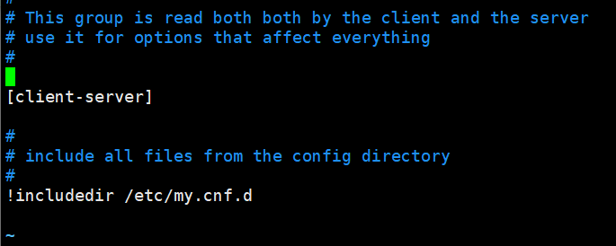

# mysql高级

# 1. mysql 配置信息

1. mysql 对应路径的作用

    | 路径             | 解释                       | 备注                         |
    | ---------------- | -------------------------- | ---------------------------- |
    | /var/lib/mysql   | mysql 数据库文件的存放路径 |                              |
    | /usr/share/mysql | 配置文件目录               | mysql.server 命令及配置文件  |
    | /usr/bin         | 相关命令目录               | mysqladmin、mysqldump 等命令 |

2. 服务的开启和关闭

    1. 开启：service mysql start 或者 systemctl start mysqld.service
    2. 关闭：service mysql stop 或者 systemctl stop mysqld.service
    3. 修改密码： /usr/bin/mysqladmin -u root password xxxxxx

3. 修改字符集

    1. 查看字符集

        ```bash
        mysql> show variables like '%char%';
        +--------------------------+----------------------------+
        | Variable_name            | Value                      |
        +--------------------------+----------------------------+
        | character_set_client     | utf8mb4                    |
        | character_set_connection | utf8mb4                    |
        | character_set_database   | utf8mb4                    |
        | character_set_filesystem | binary                     |
        | character_set_results    | utf8mb4                    |
        | character_set_server     | utf8mb4                    |
        | character_set_system     | utf8                       |
        | character_sets_dir       | /usr/share/mysql/charsets/ |
        +--------------------------+----------------------------+
        ```

        mysql 8 已经默认设置好了，不需要更改，注意 utf8 一个字符最多占用 3 个字节，而 utf8mb4 一个字符最多占用 4 个字节（可以看看 utf8 和 utf8mb4 的详细区别）

2. 修改 mysql 服务器配置文件的字符集信息（见下面）
5. mysql 的配置文件路径和配置默认配置信息
    1. /etc/my.cnf.d/mysql-server.cn

        

    2. /etc/my.cnf.d/client.cnf

        

    3. /etc/my.cnf

        

# 2. 架构介绍

# 3. 常见通用的 join 查询


1. 对于第一列第二个图的解释：

    > 取 A 独有的数据：通过左外连接可以获得 A 的全部数据 和 B 与 A 能连接上的数据之和，此时查出来的虚表中的记录只有两类，一类记录含有 B 的数据，一类记录只有 A 的数据，此时如果判定数据中 B 的主键为空，就意味着，B 和 A 连接上的数据就都不能选，因此虚表中只剩下了 Ａ 独有的数据。
    >
    > 举例如下：左边是 A 表，右边是 B 表
    >
    > | A.key | A.a  |      |      | B.key | B.b  |
    > | ----- | ---- | ---- | ---- | ----- | ---- |
    > | 1     | 1    |      |      | 1     | 1    |
    > | 2     | 2    |      |      | 2     | 2    |
    > | 3     | 3    |      |      | 5     | 5    |
    > | 4     | 4    |      |      | 6     | 6    |
    >
    > A 与 B 左外连接后
    >
    > | A.key | A.a  | B.key | B.b  |
    > | ----- | ---- | ----- | ---- |
    > | 1     | 1    | 1     | 2    |
    > | 2     | 2    | 2     | 2    |
    > | 3     | 3    | null  | null |
    > | 4     | 4    | null  | null |
    >
    > 所以如果选出 B.key 为 null 的记录，就肯定是 A 独有的数据
    >
    > | A.key | A.a  | B.key | B.b  |
    > | ----- | ---- | ----- | ---- |
    > | 3     | 3    | null  | null |
    > | 4     | 4    | null  | null |

2. **mysql 中不支持全外连接（full outer join），Oracle 数据库支持**。解决办法：

    > 引入：union 语法（联合查询）
    >
    > - 作用：将多条查询语句的结果合并成一个结果
    >
    > - 语法：`查询语句1 union 查询语句2 [union .......]`
    >
    > - 应用场景：要查询的结果来自于多个表，且多个表没有直接的连接关系，但查询的信息一致时，可以用union合并查询结果。
    >
    > - 意义：
    >
    >     1. 将一条比较复杂的查询语句拆分成多条语句
    >
    >     2. 适用于查询多个表的时候，查询的列基本一致
    >
    > - 注意事项：
    >     1. 要求多条查询语句的查询列数是一致的。
    >     2. 要求多条查询语句的查询的每一列的类型和顺序最好一致。
    >     3. union 关键字默认去重，如果不需要去重，可以使用 union all 关键字

    1. 等价与 最后一行第一个图（A 和 B 所有的部分） 的写法

        ```sql
        -- 查询 A 的全部
        select * from A left join B on A.key = B.key
        -- 合并，自动去重
        union
        -- 查询 B 的全部
        select * from A right join B on A.key = B.key
        ```

    2. 等价于 最后一行第二个图（A 和 B 所有的去掉公有的部分）

        ```sql
        -- 查询 A 的独有
        select * from A left join B on A.key = B.key  where B.key is null
        -- 合并，自动去重（此时根本就不会出现重复）
        union
        -- 查询 B 的独有
        select * from A right join B on A.key = B.key  where A.key is null
        ```

# 4. 索引

## 4.0 索引的分类

### 4.0.1 从存储结构上分

1. BTree索引（B-Tree 或 B+Tree 索引）

    使用 B-Tree（一般是B+Tree）数据结构来存储数据

2. Hash 索引

    哈希索引基于哈希表实现。哈希索引将所有的哈希码存储在索引中，同时在哈希表中保存指向每个数据行的指针。在 MySQL 中 Memory 引擎显式支持哈希索引。

    哈希索引的结构十分紧凑，因此查找速度非常快；哈希索引数据不是按照索引顺序存储的，无法用于排序；哈希索引不支持部分索引列匹配查找；哈希索引只支持等值比较查询，不支持范围查询。

3. full-index 全文索引

    全文索引主要是为了检索大文本数据中的关键字的信息，是目前搜索引擎数据库使用的一种技术。Mysql5.6 之前只有 MYISAM 引擎支持全文索引，5.6 之后 InnoDB 也支持了全文索引。

4. R-Tree 索引。

### 4.0.2 从应用层次来分

#### 4.0.2.1 主键索引

数据表的主键列使用的就是主键索引。

一张数据表有只能有一个主键，并且主键不能为 null，不能重复。

在 mysql 的 InnoDB 的表中，当没有显示的指定表的主键时，InnoDB 会自动先检查表中是否有唯一索引的字段，如果有，则选择该字段为默认的主键，否则 InnoDB 将会自动创建一个 6Byte 的自增主键。

#### 4.0.2.2 二级索引（辅助索引）

> 二级索引又称为辅助索引，是因为二级索引的叶子节点存储的数据是主键。也就是说，通过二级索引，可以定位主键的位置。

1. 唯一索引(Unique Key) ：唯一索引也是一种约束。**唯一索引的属性列不能出现重复的数据，但是允许数据为 NULL，一张表允许创建多个唯一索引。** 建立唯一索引的目的大部分时候都是为了该属性列的数据的唯一性，而不是为了查询效率。
2. 普通索引(Index) ：**普通索引的唯一作用就是为了快速查询数据，一张表允许创建多个普通索引，并允许数据重复和 NULL。**
3. 前缀索引(Prefix)：前缀索引只适用于字符串类型的数据。前缀索引是对文本的前几个字符创建索引，相比普通索引建立的数据更小， 因为只取前几个字符。

### 4.0.3 从数据的物理顺序与键值的逻辑（索引顺序）关系来分

#### 4.0.3.1 聚集索引

> 聚集索引即索引结构和数据一起存放的索引。主键索引属于聚集索引。

1. 概述：
    - 在 Mysql 中，InnoDB 引擎的表的 `.ibd`文件就包含了该表的索引和数据，对于 InnoDB 引擎表来说，该表的索引(B+树)的每个非叶子节点存储索引，叶子节点存储索引和索引对应的数据。
2. 优点：
    - 聚集索引的查询速度非常的快，因为整个 B+树本身就是一颗多叉平衡树，叶子节点也都是有序的，定位到索引的节点，就相当于定位到了数据。
3. 缺点：
    - **依赖于有序的数据** ：因为 B+树是多路平衡树，如果索引的数据不是有序的，那么就需要在插入时排序，如果数据是整型还好，否则类似于字符串或 UUID 这种又长又难比较的数据，插入或查找的速度肯定比较慢。
    - **更新代价大** ： 如果对索引列的数据被修改时，那么对应的索引也将会被修改， 而且况聚集索引的叶子节点还存放着数据，修改代价肯定是较大的， 所以对于主键索引来说，主键一般都是不可被修改的。

#### 4.0.3.2 非聚集索引

> 非聚集索引即索引结构和数据分开存放的索引。二级索引属于非聚集索引。

1. 概述：
    - MYISAM 引擎的表的.MYI 文件包含了表的索引， 该表的索引(B+树)的每个叶子非叶子节点存储索引， 叶子节点存储索引和索引对应数据的指针，指向.MYD 文件的数据。
    - 非聚集索引的叶子节点并不一定存放数据的指针， 因为二级索引的叶子节点就存放的是主键，根据主键再回表查数据。
2. 优点：
    - **更新代价比聚集索引要小** 。非聚集索引的更新代价就没有聚集索引那么大了，非聚集索引的叶子节点是不存放数据的
3. 缺点：
    - 跟聚集索引一样，非聚集索引也依赖于有序的数据
    - **可能会二次查询(回表)** ：这应该是非聚集索引最大的缺点了。 当查到索引对应的指针或主键后，可能（覆盖索引就不用回表了）还需要根据指针或主键再到数据文件或表中查询。

### 4.0.4 覆盖索引

> 如果一个索引包含（或者说覆盖）所有需要查询的字段的值，我们就称之为“覆盖索引”。我们知道在 InnoDB 存储引擎中，如果不是主键索引，叶子节点存储的是主键+列值。最终还是要“回表”，也就是要通过主键再查找一次。这样就会比较慢覆盖索引就是把要查询出的列和索引是对应的，不做回表操作！

- 覆盖索引即需要查询的字段正好是索引的字段，那么直接根据该索引，就可以查到数据了， 而无需回表查询。

- 如主键索引，如果一条 SQL 需要查询主键，那么正好根据主键索引就可以查到主键。

- 再如普通索引，如果一条 SQL 需要查询 name，name 字段正好有索引， 那么直接根据这个索引就可以查到数据，也无需回表。

## 4.1 定义

1. 什么是索引：**索引（Index）是**帮助 mysql 高效获取数据的**数据结构**（mysql 官方对索引的定义）
   
    - **可以简单理解为：排好序的快速查找数据结构★**
    
2. 覆盖索引：

    - select 的数据列只用从索引中就能够取得，不必从数据表中读取，换句话说查询列要被所使用的索引覆盖。
    -  索引是高效找到行的一个方法，当能通过检索索引就可以读取想要的数据，那就不需要再到数据表中读取行了。如果一个索引包含了（或覆盖了）满足查询语句中字段与条件的数据就叫 做覆盖索引。
    - 是非聚集组合索引的一种形式，它包括在查询里的Select、Join和Where子句用到的所有列（即建立索引的字段正好是覆盖查询语句[select子句]与查询条件[Where子句]中所涉及的字段，也即，索引包含了查询正在查找的所有数据）。

3. 索引会影响到 sql 语句中 where 后面的查找和 order by 后的排序

4. 索引的优势：
    - 类似大学图书馆建书目索引，提高数据检索的效率，降低数据库的 IO 成本
    - 通过索引列对数据进行排序，降低数据排序的成本，降低了 CPU 的消耗

5. 索引的劣势：
    - 实际上索引也是一张表，该表保存了主键与索引字段，并指向实体表的记录，所以索引列也是要占用空间的
    - 虽然索引**大大提高了查询速度**，同时**却会降低更新表的速度**，如对表进行 INSERT、UPDATE 和 DELETE。因为更新表时，MySQL 不仅要保存数据，还要保存一下索引文件每次更新添加了索引列的字段，都会调整因为更新所带来的键值变化后的索引信息
    - **索引只是提高效率的一个因素，如果你的MySQL有大数据量的表，就需要花时间研究建立最优秀的索引，或优化查询语句**

6. 哪些情况需要创建索引？

    1. 主键自动建立唯一索引
    2. 频繁作为**查询条件**的字段应该创建索引（where 后面的语句）
    3. 查询中与其他表关联的字段，外键关系建立索引
    4. 单键/组合索引的选择问题：在高并发下倾向创建组合索引
    5. **查询中排序的字段**，排序字段若通过索引去访问将大大提高排序速度
    6. **查询中统计或者分组字段**

7. 哪些情况不要创建索引

    1. 表记录太少

    2. 经常增删改的表

        - 建立索引虽然提高了查询速度，同时却会降低更新表的速度，如对表进行 INSERT、UPDATE 和 DELETE。因为更新表时， MySQL 不仅要保存数据，还要保存一下索引文件

    3. where 条件里用不到的字段不创建索引

        - 索引建多了影响增删改的效率，况且建索引也提高不了数据的获取速度

    4. 数据重复且分布平均的表字段不建立索引。因为如果某个数据列包含许多重复的内容，为它建立索引就没有太大的实际效果。

        

8. **总之，应该只为最经常查询和最经常排序的数据列建立索引**

## 4.2 explain

1. 是什么：查看执行计划

    - 使用 EXPLAIN 关键字可以模拟优化器（optimizer）执行 SQL 查询语句，从而知道 MySQL 是如何处理你的 SQL 语句的。分析你的查询语句或是表结构的性能瓶颈。

2. 能干嘛：

    - 表的读取顺序（id 列）
    - 哪些索引可以使用 （）
    - 数据读取操作的操作类型 （select_type 列）
    - 哪些索引被实际使用
    - 表之间的引用
    - 每张表有多少行被优化器查询

3. explain 显示信息的表头

    | 属性名        | 解释                                                         |
    | ------------- | ------------------------------------------------------------ |
    | id            | 表示查询中执行 select 子句或操作表的顺序                     |
    | select_type   | 查询的类型。主要是用于区别普通查询、联合查询、子查询等的复杂查询 |
    | table         | 显示这一行的数据是关于哪一张表的                             |
    | partitions    |                                                              |
    | type          | 显示查询使用了何种类型。从最好到最差依次是：system > const > eq_ref > ref > range > index > ALL |
    | possible_keys | 显示可能应用在这张表中的索引（一个或多个）。查询涉及到的字段上若存在索引，则该索引将被列出，**但不一定被查询实际使用** |
    | key           | 实际使用的索引，如果为 NULL，则没有使用索引。**查询中若使用了覆盖索引，则该索引和查询的 select 字段重叠** |
    | key_len       | 表示索引中使用的字节数，可通过该列计算查询中使用的索引的长度。key_len 字段能够帮你检查是否充分的利用上了索引 |
    | ref           | 显示索引的哪一列被使用了，如果可能的话，是一个常数。哪些列或常量被用于查找索引列上的值 |
    | rows          | rows 列显示 MySQL 认为它执行查询时必须检查的行数。（越少越好） |
    | filtered      |                                                              |
    | Extra         | 包含不适合在其他列中显示但十分重要的额外信息                 |

    **备注：一般来说，type 的值要保证查询至少达到 range 级别，最好能达到 ref**

    **关键衡量指标 id、type、key、rows、Extra**

4. join 语句的优化

    - 尽可能减少 join 语句中的 NestedLoop（嵌套循环） 的循环总次数；**“永远用小结果集驱动大的结果集”**
    - 优先优化 NestedLoop 的内层循环
    - **保证 join 语句中被驱动表上的 join 条件字段已经被索引**
    - 当无法保证被驱动表的 join 条件字段被索引，且内存资源充足的前提下，不要太吝啬 JoinBuffer 的设置

## 4.2 索引失效案例

1. 【**全值匹配我最爱，最左前缀要遵守**】全值匹配我最爱

    > 和所建的索引一一对应

2. 【**带头大哥不能死，中间兄弟不能断**】**最佳左前缀法则**：

    - 最佳左前缀法则含义：如果索引了多列，要遵守最左前缀法则。指的是查询从索引的最左前列开始并且不跳过索引中的列。
    - **and 忽略左右关系。**即使没有没有按顺序，由于优化器的存在，会自动优化。

3. 【**索引列上少计算**】不在索引列上做任何操作（计算、函数、[自动或手动]类型转换），会导致索引失效而转向全表扫描

4. 【**范围之后全失效**】存储引擎不能使用索引中范围条件右边的列。

    > 
    >
    > mysql 中，会根据实际数据量的大小来决定是否进行全表扫描，比如这种情况。（具体机制待查明）

5. 尽量使用覆盖索引（只访问索引的查询[索引列和查询列一致]），减少 select *

6. mysql 在使用不等于（!= 或者 <>）的时候无法使用索引，会导致全表扫描

7. is null, is not null 也无法使用索引

    > 注意：可能是新版 mysql 优化的问题：
    >
    > - **为指定字段设置了非空 (not null)，在使用`is null`或`is not null`时是不走索引的。而列定义允许为空，查询中也能使用到索引的。**
    >
    > 
    >
    > 

8. 【**Like 百分写最右，覆盖索引不写星】**like** 以通配符开头 ('%abc...') mysql 索引会失效，会变成全表扫描的操作

9. 【**字符串里有引号 | var 引号不可丢**】字符串不加单引号索引失效

10. 【**不等空值还有 or，索引失效要少用**】少用 or，用它来连接时会索引失效

    > 注意：**新版可能优化了， mysql8 使用 or 后，type 是 range 并且用到了索引**

## 4.3 mysql 性能分析

### 4.3.1 分析

- 分析
    1. 观察，至少跑一天，看看生产的慢 SQL 情况
    2. 开启慢查询日志，设置阈值，比如超过 5 秒钟的就是慢 SQL， 并将它们抓取出来
    3. explain + 慢 SQL 分析
    4. show profile
    5. 运维经理 or DBA，进行 SQL 数据库服务器的参数调优
- 总结
    1. 慢查询的开启并捕获
    2. explain + 慢 SQL 分析
    3. show profile 查询 SQL 在 Mysql 服务器里面的执行细节和生命周期情况
    4. SQL 数据库服务器的参数调优

### 4.3.2 sql 优化

1. 优化原则【**小表驱动大表**】：即小的数据集驱动大的数据集

    - case 1

        ```select * from A where id in(select id from B)```

        等价于

        ```for select id from B``` 

        ```for select * from A where A.id = B_.id```

        当 B 表的数据集小于 A 表的数据集时，用 in 优于 exists

    - case 2

        ```select * from A where exists (select 1 from B where B.id = A.id)```

        等价于

        ```for select * from A```

        ```for select * from B where B.id = A.id```

        当 A 表的数据集小于 B 表的数据集时，用 exists 优于 in

    - **注意上面的分析是建立在 A.id 和 B.id 建立了索引的基础上**

2. exists

    - ```select ... from table where exists (subquery)```
    - 该语法可以理解为：**将主查询的数据，放到子查询中做条件验证，根据验证结果（TRUE 或 FALSE）来决定主查询的数据结果是否得以保存**
    - 提示
        - exists(subquery) 只返回 TRUE 或 FALSE，因此子查询中的 select * 也可以是 select 1 或 select 'aaa'，官方说法是实际执行时会忽略 select 清单，因此没有区别
        - exists 子查询的实际执行过程可能经过了优化而不是我们理解上的逐条对比，如果担心效率问题，可以进行实际检验以确定是否有效率问题。
        - exists 子查询往往也可以用条件表达式、其他子查询或者 join 来替代，何种最优需要具体问题具体分析

3. order by

    

## 4.4 索引创建注意点

### 4.4.1 最左前缀原则

Mysql 版本较高，好像不遵守最左前缀原则，索引也会生效。 但是我们仍应遵守最左前缀原则，以免版本更迭带来的麻烦。

### 4.4.2 选择合适的字段

1. 不为 NULL 的字段

    索引字段的数据应该尽量不为 NULL，因为对于数据为 NULL 的字段，数据库较难优化。如果字段频繁被查询，但又避免不了为 NULL，建议使用 0,1,true,false 这样语义较为清晰的短值或短字符作为替代。

2. 被频繁查询的字段

    我们创建索引的字段应该是查询操作非常频繁的字段。

3. 被作为条件查询的字段

    被作为 WHERE 条件查询的字段，应该被考虑建立索引。

4. 被经常频繁用于连接的字段

    经常用于连接的字段可能是一些外键列，对于外键列并不一定要建立外键，只是说该列涉及到表与表的关系。对于频繁被连接查询的字段，可以考虑建立索引，提高多表连接查询的效率。

### 4.4.3 不合适创建索引的字段

1. 被频繁更新的字段应该慎重建立索引

    虽然索引能带来查询上的效率，但是维护索引的成本也是不小的。 如果一个字段不被经常查询，反而被经常修改，那么就更不应该在这种字段上建立索引了。

2. 不被经常查询的字段没有必要建立索引

3. 尽可能的考虑建立联合索引而不是单列索引

    因为索引是需要占用磁盘空间的，可以简单理解为每个索引都对应着一颗 B+树。如果一个表的字段过多，索引过多，那么当这个表的数据达到一个体量后，索引占用的空间也是很多的，且修改索引时，耗费的时间也是较多的。如果是联合索引，多个字段在一个索引上，那么将会节约很大磁盘空间，且修改数据的操作效率也会提升。

4. 注意避免冗余索引

    冗余索引指的是索引的功能相同，能够命中索引(a, b)就肯定能命中索引(a) ，那么索引(a)就是冗余索引。如（name,city ）和（name ）这两个索引就是冗余索引，能够命中前者的查询肯定是能够命中后者的 在大多数情况下，都应该尽量扩展已有的索引而不是创建新索引。

5. 考虑在字符串类型的字段上使用前缀索引代替普通索引

    前缀索引仅限于字符串类型，较普通索引会占用更小的空间，所以可以考虑使用前缀索引带替普通索引。

    

# 5. 锁机制

## 5.1 MyISAM 存储引擎（表锁）

> **表锁（偏向于读）：开销小，加锁快；无死锁；锁定粒度大，发生锁冲突的概率最高,并发度最低。**

### 5.1.1 加 **读锁（共享锁）**

> 我们为 mylock 表加 read 锁(读阻塞写例子)

|                          session_1                           |                          session_2                           |
| :----------------------------------------------------------: | :----------------------------------------------------------: |
| 获得表 mylock 的 READ 锁定 |                                                              |
| 当前 session 可以查询该表记录 | 其他 session 也可以查询该表的记录 |
| **当前 session 不能查询其它没有锁定的表** | 其他 session 可以查询或者更新未锁定的表 |
| **当前 session 中插入或者更新锁定的表都会提示错误：** | 其他 session 插入或者更新锁定表会一直等待获得锁： |
| 释放锁 | Session_2 获得锁，插入操作完成： |

### 5.1.2 加 **写锁（排它锁）**

> mylock write( MyISAM )

| session_1                                                    | session_2                                                    |
| :----------------------------------------------------------- | :----------------------------------------------------------- |
| 获得表 mylock 的 WRITE 锁定 |                                                              |
| 当前session对锁定表的查询+更新+插入操作都可以执行： | 其他session对锁定表的查询被阻塞，需要等待锁被释放： |
| 释放锁 | Session2获得锁，查询返回： |

**注意：**在锁表前，如果 session2 有数据缓存，锁表以后，在锁住的表不发生改变的情况下session2可以读出缓存数据，一旦数据发生改变，缓存将失效，操作将被阻塞住。

### 5.1.3 结论

1. MyISAM 在执行查询语句（SELECT）前，会自动给涉及的所有表加读锁，在执行增删改操作前，会自动给涉及的表加写锁。 
2. MySQL的表级锁有两种模式：
    - 表共享读锁（Table Read Lock）
    -  表独占写锁（Table Write Lock）
3. 对 MyISAM 表进行操作，会有以下情况： 
    - 对MyISAM表的读操作（加读锁），不会阻塞其他进程对同一表的读请求，但会阻塞对同一表的写请求。只有当读锁释放后，才会执行其它进程的写操作。 
    -  对 MyISAM 表的写操作（加写锁），会阻塞其他进程对同一表的读和写操作，只有当写锁释放后，才会执行其它进程的读写操作。
    -  **简而言之，就是读锁会阻塞写，但是不会堵塞读。而写锁则会把读和写都堵塞**

## 5.2 InnoDB 存储引擎（行锁）

> **行锁（偏向于写）：开销大，加锁慢；会出现死锁；锁定粒度最小，发生锁冲突的概率最低,并发度也最高。**
>
> InnoDB 与 MyISAM 存储引擎最大的不同：
>
> - InnoDB 支持了事务（TRANSACTION）
> - 采用了行级锁
>
> 行锁可以结合事务来看

### 5.2.1 无索引，行锁升级为表锁

- 当更新一行时，本应该锁一行，而没有索引，或者索引失效，造成全表扫描，也就意味着锁上整个表，致使效率变慢
- 比如：```select * from table where name = "1234"```，为 name 设置索引之后，ref 是 const，如果不建立索引，或者使用 ```name = 1234```致使索引失效，而造成了全表扫描。就会锁表。

### 5.2.2 **间隙锁**危害

> 间隙锁（Gap Lock）是 Innodb **在可重复读**提交下为了解决幻读问题时引入的锁机制，幻读的问题存在是因为新增或者更新操作，这时如果进行范围查询的时候（加锁查询），会出现不一致的问题，这时使用不同的行锁已经没有办法满足要求，需要对一定范围内的数据进行加锁，间隙锁就是解决这类问题的。在可重复读隔离级别下，数据库是通过行锁和间隙锁共同组成的（next-key lock）

1. 间隙锁加锁规则

    - 加锁的基本单位是（next-key lock）,他是前开后闭原则
    - 插叙过程中访问的对象会增加锁
    - 索引上的等值查询--给唯一索引加锁的时候，next-key lock升级为行锁
    - 索引上的等值查询--向右遍历时最后一个值不满足查询需求时，next-key lock 退化为间隙锁
    - 唯一索引上的范围查询会访问到不满足条件的第一个值为止

2. 案例数据

    | id(主键) | c（普通索引） | d（无索引） |
    | -------- | ------------- | ----------- |
    | 5        | 5             | 5           |
    | 10       | 10            | 10          |
    | 15       | 15            | 15          |
    | 20       | 20            | 20          |
    | 25       | 25            | 25          |

    以上数据为了解决幻读问题，更新的时候不只是对上述的五条数据增加行锁，还对于中间的取值范围增加了 6 个间隙锁，（-∞，5]（5，10]（10，15]（15，20]（20，25]（25，+supernum] 

    （其中 supernum 是数据库维护的最大的值。为了保证间隙锁都是左开右闭原则。）

3. 间隙锁可能会导致死锁

    - 不同于写锁相互之间是互斥的原则，间隙锁之间不是互斥的，如果一个事务 A 获取到了（5,10] 之间的间隙锁，另一个事务 B 也可以获取到（5,10]之间的间隙锁。此时，如果两个事务都想要更新 (5, 10] 之间的数据，就会发生死锁问题。


# MySQL 数据库管理实战

## 1. 索引

### 1.1 表的类型不同，索引的存放位置也不同

1. MyISAM 表
    - 数据行放在数据文件里，索引值放在索引文件里，一个表可以有多个索引，这些索引都放在一个索引里，一个索引其实就是一个排好序的键值数组，正是通过这些键值才可以实现对数据文件的快速定位访问
2. InnoDB 表
    - InnoDB 表的索引也是排好序的数组，但他的数据行与索引值是存放在同一个文件里的，存放在同一个表空间里面 **？？？**

### 1.2 索引缺点

> 事务都有两面性，索引在提高速度的同时，也有一些缺点

- 索引需要使用更多的磁盘空间，索引越多，占用磁盘空间越多
- 索引在加快检索速度的同时，还降低了插入、更新、删除的操作速度。因为他们多了一项工作就是更新索引，索引越多，速度就越慢

### 1.3 关于索引的建议

1. 最好使用唯一化索引
    - 在唯一化的数据列加索引效果是最明显的。如果一个字段存在许多相同的值，加上索引后效果不会比原来好。
    - **当查询优化器发现某数据在超过 30% 的行里都有出现时，通常会不使用索引而进行全表扫描。**
2. 索引长度要尽量短
    - 如果要对一个字符型的字段添加索引，可以指定一个前缀长度，如一个 char(50) 型的字段添加索引。如果它的前 10 个字节不同，后面基本相同，那么可以只对这前 10 个字节创建索引，这样既减少了索引所占的空间，又可以加快检索速度
    - 例如身份证号加索引的时候，还可以倒序存储身份证号，再使用前缀建立索引
3. 要充分利用最左侧前缀
    - 这个是针对复合索引而言的。如果检索条件没有涉及索引的最左前缀，MySQL 就用不到复合索引了。
    - 查看日志记录。将**慢查询**记录到日志文件内，通过查看记录的内容来决定是否添加索引来优化语句。

## 2. MySQL 中使用索引

### 2.1 创建语法

```mysql
create [unique | fulltext | spatial] index index_name
	[using index_type]
	on tbl_name (index_col_name, ......);
	
index_col_name:
	col_name [(length)] [asc | desc]
```

注意：

- char 和 varchar 列可以全部或只用列的一部分创建索引。创建索引时，使用 col_name(length) 语法只针对指定长度的前缀进行索引，这样可以减少索引文件的大小，节省磁盘空间，并能提高 insert 和 delete 速度
- blob 和 text 列也可以编制索引，但是必须指定前缀长度
- 自 MySQL 5.1 开始，对于 MyISAM 和 InnoDB 表，前缀最长为 **1000 字节**
- **前缀的最长长度以字节计算，而 create index 语句中的前缀长度指的是字符的数目。对于使用多字节字符集的列，在指定列的前缀长度时，要考虑这一点**

举例

```mysql
create index index_p_name on shopnc_product ( product_name(10) )
```

### 2.2 unique 实际开发中的使用方法

> - MySQL 唯一索引 unique 一般用于不重复数据字段，经常会把数据表中的 id 字段设置为唯一索引 unique。
>
> - **创建唯一索引的目的不是为了提高访问速度（普通索引是用来提高访问速度的），而只是为了避免数据出现重复。**
> - 唯一索引可以有多个，每个索引列值必须唯一，索引列值允许有空值。

1. 创建唯一索引可以使用关键字 unique 随表一同创建

    ```mysql
    create table tbl(
    	id smallint(8) unsigned not null,
    	catid smallint(5) unsigned not null default 0,
    	primary key(id),
    	unique key tbl_catid (catid)
    );
    ```

2. 创建表之后使用 create unique 命令来创建

    ```mysql
    create unique index tbl_catid_2 on tbl (catid);
    ```

3. 索引的删除

    ```mysql
    alter table tbl drop index tbl_catid_2;
    ```

4. 索引的增加

    ```mysql
    alter table tbl add unique tbl_catid_2 on(catid);
    ```

5. 主键索引

    > 主键索引是一种特殊的唯一索引，不允许有空值，一般是在建表的同时创建主键索引。当然，也可以使用 alter 命令添加主键索引

6. 小结

    - unique 类型索引列的值必须是唯一的，但允许有空值。如果是组合索引，则列值的组合必须唯一。

    - 创建索引

        ```create unique index indexname on tablename(tablecolumns(length))```

    - 修改索引

        ```alter tablename add unique [indexname] on (tablecolumns(length))```

    - 创建表的时候直接指定索引

        ```create table tablename ([...], unique [indexname] (tablecolumns(length)) );```

# 3. MySQL 的共享锁和排他锁

> MySQL 锁机制分为表级锁和行级锁

### 3.1 行级锁

> 行级锁分为共享锁和排他锁

1. 共享锁（又称读锁，简称 S 锁）
    - 共享锁就是多个事务对于同一数据可以共享同一把锁，都能访问到数据，但只能读不能修改
    - 简而言之，对于共享锁，多个事务只能读数据不能改数据
2. 排他锁（又称写锁，简称 X 锁）
    - 排他锁就是不能与其他锁并存，如一个事务获取了一个数据行的排他锁，其他事务就不能再获取该行的其他锁，包括共享锁和排他锁。获取了排他锁的事务是可以对数据进行读取和修改
    - 简而言之，对于排他锁，其他事务不能再在它的上面加其他锁。
    - 注意：加过排他锁的数据行不能被其他事务修改，也不能通过 for update 和 lock in share mode 锁的方式查询数据，但可以直接通过 select  ... from ... 查询数据，因为普通 select 查询是没有任何锁机制的。

3. 注意事项
    - **InnoDB 引擎默认的修改语句（UPDATE、DELETE、INSERT）都会自动给涉及的数据加上排他锁；SELECT 语句默认不会加任何锁类型**
    - **如果非要给 SELECT 语句加排他锁，可以使用 ```select ... ... for update;```语句**
    - **如果非要给 SELECT 语句加共享锁，可以使用 ```select ... ... lock in share mode; ```语句**

### 3.2 MySQL 的表级锁、页级锁与行级锁

> MySQL 的 “表级锁”“页级锁”“行级锁”将依据不同的存储引擎设定不同的锁类型，每种锁类型将体现出不同的最终结果，从而决定数据库应用采用何种技术，权衡利弊。

1. 表级锁
    - MyISAM 引擎。直接锁定整张表，在锁定期间，如果是读锁，其他进程无法对该表进行写操作，但可以进行读操作；如果是写锁，其他进程不允许对此表任何操作。
    - 适用：查询为主，只有少量按索引条件更新数据的应用，如 WEB 应用。
2. 页级锁（了解即可）
    - BDB 引擎。表级锁速度快，但冲突多，行级锁冲突少，但速度慢。所以页级锁折中了两种方案，一次锁定相邻的一组记录
    - 
3. 行级锁
    - InnoDB 引擎。仅对指定的行记录进行加锁，这样其他进程还是可以对同一个表中的其他记录进行操作。
    - 适用：有大量按索引条件并发更新少量不同数据，同时又有并发查询的应用，如一些在线事务处理（OLTP）系统。
4. InnoDB 引擎可能会产生死锁。
    - InnoDB的死锁检测一旦检测到死锁发生，会自动失败其中一个事务
5. 三种级别的锁的对比
    - 表级锁：开销小，加锁快；不会出现死锁；锁定粒度大，发生锁冲突的概率最高，并发度最低。
    - 行级锁：开销大，加锁慢；会出现死锁；锁定粒度最小，发生锁冲突的概率最低，并发度最高。
    - 页级锁：开销和加锁时间鉴于他们之间；会出现死锁；锁定粒度介于他们之间，并发度一般。

