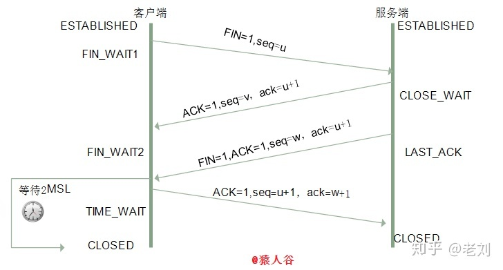

# 网络编程

> ~~网络编程就是可以让两台计算机进行数据交互~~

## 1. 网络编程三要素

1. IP 地址
    - 设备在网络中的地址，是唯一的标识。（设备在网络中的唯一标识）
2. 端口
    - 应用程序在设备中唯一的标识。
3. 协议
    - 数据在网络中传输的规则，常见的协议有 UDP 协议和 TCP 协议。

### 1.1 IP

> IP：全称“互联网协议地址”，也称 IP 地址。是分配给上网设备的数字标签。常见的 IP 分类为：ipv4 和 ipv6。
>
> 计算机在访问一个域名时，首先会访问 DNS 服务器，通过域名获取到 DNS 服务器根据域名解析出的 IP 地址；然后计算机再访问该 IP 地址访问所需访问的服务器，获取需要的信息。

#### 1.1.1 IPv4

- 

#### 1.1.2 IPv6

> 由于互联网的蓬勃发展，IP 地址的需求量越来越大，而 IPv4 的模式下 IP 的总数（256^4 = 4294967296）难以满足需求。
>
> IPv6 采用 128 位地 址长度，分成 8 组。

- 

#### 1.1.3 常用命令

1. ipconfig：查看本机 IP 地址
2. ping IP地址：检查网络是否连通
3. 特殊的 IP 地址：
    - 127.0.0.1：是回送地址也称本地回环地址，可以代表本机的 IP 地址，一般用来测试使用。

### 1.2 端口

> 端口：应用程序在设备中唯一的标识。
>
> 端口号：用两个字节表示的整数，它的取值范围是 0 - 65535。其中 0 - 1023 之间的端口号用于一些知名的网络服务或者应用

- **注意：一个端口号只能被一个应用程序使用。**

### 1.3 协议

> 协议：计算机网络中，连接和通信的规则被称为网络通信协议

#### 1.3.1 UDP 协议

> 用户数据报协议（User Datagram Protocol）

1. UDP 是**面向无连接**的通信协议
2. 特点
    - 速度快
    - 有大小限制（一次最多发送 64K）
    - 数据不安全，易丢失数据

#### 1.3.2 TCP 协议

> 传输控制协议（Transmission Control Protocol）

1. TCP 协议是**面向连接**的通信协议
2. 特点
    - 速度慢
    - 没有大小限制
    - 数据安全

## 2. UDP 通讯程序

### 2.1 UDP 的三种通信方式

> 根据**接收端**数量的不同，分为**单播、组播、广播**

- 单播：每次只有两个主机在通信。（发送方往接收方指定的 IP 端口发送数据）
- 组播：当前主机和当前局域网下一部分主机通信。
- 广播：当前主机和当前局域网下所有的主机通信
- 

### 2.2 单播使用举例

```java
// ClientDemo1.java
public class ClientDemo1 {
    public static void main(String[] args) throws IOException {
        // 发送端的端口号，可以不用指定
        DatagramSocket socket = new DatagramSocket();
        // 指定接收端的 host
        InetAddress address = InetAddress.getByName("localhost");
        // 指定接收端的 port
        int port = 10000;
        // 发送的信息
        String info = "数据info";
        byte[] bytes = info.getBytes();
        // 打包数据
        DatagramPacket dp = new DatagramPacket(bytes, bytes.length, address, port);
        // 发送数据
        socket.send(dp);

        socket.close();
    }
}

// ServerDemo1.java
public class ServerDemo1 {
    public static void main(String[] args) throws IOException {
        // 从 10000 端口接收数据
        DatagramSocket socket = new DatagramSocket(10000);
        // 把接收的数据存到 bytes 数组中，数组长度不足，会造成数据的截断
        byte[] bytes = new byte[1024];
        DatagramPacket dp = new DatagramPacket(bytes, bytes.length);

        // 阻塞式接收数据，封装到 dp 中
        socket.receive(dp);
        // 获取接收到的数据的长度
        int length = dp.getLength();
        // dp.getData() === bytes ，所以下面可以直接传递 bytes，但还是需要指定长度
//        String data = new String(dp.getData(), 0, length);
        String data = new String(bytes, 0, length);
        System.out.println("\"" + data + "\"");

        socket.close();
    }
}
```

### 2.3 组播使用举例

```java
// ClientGroup.java
public class ClientGroup {
    public static void main(String[] args) throws IOException {
        DatagramSocket ds = new DatagramSocket();

        String s = "hello 组播";
        byte[] bytes = s.getBytes();
        // 指定接收组的组播地址
        DatagramPacket dp = new DatagramPacket(bytes, bytes.length,
                InetAddress.getByName("224.0.1.0"), 10000);

        ds.send(dp);
        ds.close();
    }
}

// ServerGroup1.java
public class ServerGroup1 {
    public static void main(String[] args) throws IOException {
        // 使用 MulticastSocket 替代 DatagramSocket
        MulticastSocket ms = new MulticastSocket(10000);
        byte[] bytes = new byte[1024];

        DatagramPacket dp = new DatagramPacket(bytes, bytes.length);
        // 把当前服务器添加到指定组中
        ms.joinGroup(InetAddress.getByName("224.0.1.0"));

        ms.receive(dp);

        int len = dp.getLength();
        System.out.println("服务器1：" + new String(bytes, 0, len));

        ms.close();
    }
}
```

### 2.4 广播使用举例

```java
// ClientBroadcast.java
public class ClientBroadcast {
    public static void main(String[] args) throws IOException {
        DatagramSocket ds = new DatagramSocket();
        String data = "hello 广播";
        byte[] bytes = data.getBytes();
        // 指定 host 为 “255.255.255.255” ，路由器会把消息发送给所有能连接到的计算机
        InetAddress address = InetAddress.getByName("255.255.255.255");
        int port = 10000;
        DatagramPacket dp = new DatagramPacket(bytes, bytes.length, address, port);

        ds.send(dp);
        ds.close();
    }
}

// ServerDemo1.java 
// 广播的接收端和单播的接收端一样。
public class ServerDemo1 {
    public static void main(String[] args) throws IOException {
        DatagramSocket socket = new DatagramSocket(10000);
        byte[] bytes = new byte[1024];
        DatagramPacket dp = new DatagramPacket(bytes, bytes.length);
        socket.receive(dp);
        // 获取接收到的数据的长度
        int length = dp.getLength();
        String data = new String(bytes, 0, length);
        System.out.println("\"" + data + "\"");

        socket.close();
    }
}
```

## 3. TCP通信程序

> TCP 通信协议是一种可靠的网络协议，它在通信的两端各建立一个 Socket 对象。
>
> 通信之前要保证连接已经建立
>
> 通过 Socket 产生 IO 流来进行网络通信

### 3.1 TCP 发送数据的步骤

1. 创建客户端的 Socket 对象（Socket）与指定服务器连接。 ```Socket(String host, int port)```

2. 获取输出流，写数据。```OutputStream os = socket.getOutputStream();```

3. 释放资源

4. 举例

    ```java
    /**
     * 先运行客户端的情况下会报错j ava.net.ConnectException: Connection refused: connect
     */
    public class ClientDemo1 {
        public static void main(String[] args) throws IOException {
            Socket socket = new Socket("localhost", 10000);
    
            OutputStream os = socket.getOutputStream();
            os.write("hello".getBytes());
    
            os.close();
            socket.close();
        }
    }
    ```

### 3.2 TCP 接收数据

1. 创建服务器端的 Socket 对象（ServerSocket）。```ServerSocket(int port)```

2. 监听客户端连接（阻塞式），返回一个 Socket 对象。```Socket accept()```

3. 获取输入流，读数据，并处理数据。```InputStream is = socket.getInputStream();```

4. 释放资源

5. 举例

    ```java
    public class ServerDemo1 {
        public static void main(String[] args) throws IOException {
            ServerSocket serverSocket = new ServerSocket(12345);
    	// 阻塞式获取连接
            Socket socket = serverSocket.accept();
            InputStream is = socket.getInputStream();
    
            int b;
            // read() 方法也是阻塞式的，如果客户端在 write 之后加个死循环，此处会一直阻塞
            while ((b = is.read()) != -1) {
                System.out.print((char) b);
            }
            System.out.println();
            is.close();
            serverSocket.close();
        }
    }
    ```

### 3.3 TCP 客户端与服务端连接的流程


### 3.4 TCP 三次握手

> TCP 报文是交由 IP 网络来负责运输，IP 网络并不能保证 TCP 报文到达目的地，既然 IP 网络是指望不上了，那 TCP 就自力更生吧，TCP 必须依赖自身的努力来保证数据传输的可靠。

#### 3.4.1 报文分类

- 分类
    1. SYN
    2. Data（唯一携带用户数据）
    3. FIN
    4. Reset
    5.  ACK

- 其中 1、2、3 分别为**建立连接、数据传输、断开连接**，这三种报文对方接收到一定要 ACK 确认，为何要确认，因为这就是可靠传输的依赖的机制。如果对方在超时时间内不确认，发送方会一直重传，直到对方确认为止、或到达重传上限次数而 Reset 连接。
- 4、5 为**重置连接报文、确认ACK报文**，这两种报文对方接收到要 ACK 确认吧？不需要！自然发送方也不会重传这 2 种类型的报文。

- 为何 Reset 报文不需要 ACK 确认?

    > 因为发送 Reset 报文的一端，在发送完这个报文之后，和该 TCP Session 有关的内存结构体瞬间全部释放，无论对方收到或没有收到，关系并不大。如果对方收到 Reset 报文，也会释放该 TCP Session 的相关内存结构体。如果对方没有收到 Reset 报文，可能会继续发送让接收方弹射出 Reset 报文的报文，到最后对方一样会收到 Reset 报文，并最终释放内存。

- 为何 ACK 报文不需要 ACK 确认?

    > 这里的 ACK 报文，是指没有携带任何数据的裸 ACK 报文，对方收到这样的 ACK 报文，自然也不需要 ACK。否则，对方为了 ACK 己方的 ACK，那己方收到对方的 ACK，也要 ACK 对方的 ACK，这就是一个死循环，永无止息。所以为了避免这个死循环，一律不允许 ACK 对方的裸 ACK 报文。

#### 3.4.2 三次握手分析

1. 三次握手（Three-way  Handshake）其实就是指建立一个 TCP 连接时，需要客户端和服务器总共发送 3 个包。进行三次握手的主要作用就是为了确认双方的接收能力和发送能力是否正常、指定自己的初始化序列号为后面的可靠性传送做准备。实质上其实就是连接服务器指定端口，建立 TCP 连接，并同步连接双方的序列号和确认号，交换  TCP 窗口大小信息。

2. 刚开始客户端处于 Closed 的状态，服务端处于 Listen 状态。

3. 进行三次握手：
    - 第一次握手：客户端给服务端发一个 SYN 报文，并指明客户端的 **32 位长的初始化序列号**（Initial Sequence Number） ISN©。此时客户端处于 SYN_SEND 状态。首部的同步位 SYN=1，初始序号 seq=x，SYN=1 的报文段不能携带数据，但要消耗掉一个序号。
    - 第二次握手：服务器收到客户端的 SYN 报文之后，会以自己的 SYN 报文作为应答，并且也是指定了自己的初始化序列号 ISN(s)。同时会把客户端的 ISN + 1  作为 ACK 的值，表示自己已经收到了客户端的 SYN，此时服务器处于 SYN_REVD 的状态。在确认报文段中 SYN=1，ACK=1，确认号 ack=x+1，初始序号 seq=y。
    - 第三次握手：客户端收到 SYN 报文之后，会发送一个 ACK 报文，当然，也是一样把服务器的 ISN + 1 作为 ACK 的值，表示已经收到了服务端的 SYN  报文，此时客户端处于 ESTABLISHED 状态。服务器收到 ACK 报文之后，也处于 ESTABLISHED  状态，此时，双方已建立起了连接。确认报文段 ACK=1，确认号 ack=y+1，序号 seq=x+1（初始为 seq=x，第二个报文段所以要 +1），ACK 报文段可以携带数据，不携带数据则不消耗序号。
    - 发送第一个 SYN 的一端将执行主动打开（active open），接收这个 SYN 并发回下一个 SYN 的另一端执行被动打开（passive open）。

4. 在 socket 编程中，客户端执行 connect() 时，将触发三次握手。

    

#### 3.4.3 为什么不是两次握手？

1. 弄清这个问题，我们需要先弄明白三次握手的目的是什么，能不能只用两次握手来达到同样的目的。

    > - 第一次握手：客户端发送网络包，服务端收到了。这样服务端就能得出结论：客户端的发送能力、服务端的接收能力是正常的。
    > - 第二次握手：服务端发包，客户端收到了。这样客户端就能得出结论：服务端的接收、发送能力，客户端的接收、发送能力是正常的。不过此时服务器并不能确认客户端的接收能力是否正常。
    > - 第三次握手：客户端发包，服务端收到了。
    >
    > - 这样服务端就能得出结论：客户端的接收、发送能力正常，服务器自己的发送、接收能力也正常。因此，需要三次握手才能确认双方的接收与发送能力是否正常。

2. 试想如果是用两次握手，则会出现下面这种情况：

    > **三次握手为了防止已失效的连接请求报文段突然又传送到了服务端，因而产生错误**
    >
    > 如客户端发出连接请求，但因连接请求报文丢失而未收到确认，于是客户端再重传一次连接请求。后来收到了确认，建立了连接。数据传输完毕后，就释放了连接，客户端共发出了两个连接请求报文段，其中第一个丢失，第二个到达了服务端，但是第一个丢失的报文段只是在某些网络结点长时间滞留了，延误到连接释放以后的某个时间才到达服务端，此时服务端误认为客户端又发出一次新的连接请求，于是就向客户端发出确认报文段，同意建立连接，不采用三次握手，只要服务端发出确认，就建立新的连接了，此时客户端忽略服务端发来的确认，也不发送数据，则服务端一致等待客户端发送数据，浪费资源。

#### 3.4.4 为什么不是四次握手？

1. A 发送 SYN 报文给 B，这是第一次报文交互。
2. B 发送 ACK 确认 A 的 SYN 报文，这是第二次报文交互
3. B 发送自己的 SYN 报文给 A，这是第三次报文交互
4. A 需要 ACK 确认 B 的 SYN 报文，这是第四次报文交互**

以上的演绎没有问题，但是报文 2、3 为何要分开发送呢？增加了延迟不说，同时还白白浪费了网络的带宽，完全可以将报文 2、3 合并起来，不就是在报文 2 的 ACK 状态位的位置置“1”就结了吗？

#### 3.4.5 什么是半连接队列？

- 服务器第一次收到客户端的 SYN 之后，就会处于 SYN_RCVD 状态，此时双方还没有完全建立其连接，服务器会把此种状态下请求连接放在一个队列里，我们把这种队列称之为半连接队列。
- 当然还有一个全连接队列，就是已经完成三次握手，建立起连接的就会放在全连接队列中。如果队列满了就有可能会出现丢包现象。

这里在补充一点关于 SYN-ACK 重传次数的问题：

- 服务器发送完 SYN-ACK 包，如果未收到客户确认包，服务器进行首次重传，等待一段时间仍未收到客户确认包，进行第二次重传。如果重传次数超过系统规定的最大重传次数，系统将该连接信息从半连接队列中删除。

- 注意，每次重传等待的时间不一定相同，一般会是指数增长，例如间隔时间为 1s，2s，4s，8s…

#### 3.4.6 ISN(Initial Sequence Number)是固定的吗？

- 当一端为建立连接而发送它的 SYN 时，它为连接选择一个初始序号。ISN 随时间而变化，因此每个连接都将具有不同的 ISN。ISN 可以看作是一个 32 比特的计数器，每 4ms 加 1 。这样选择序号的目的在于防止在网络中被延迟的分组在以后又被传送，而导致某个连接的一方对它做错误的解释。
- 三次握手的其中一个重要功能是客户端和服务端交换 ISN(Initial Sequence Number)，以便让对方知道接下来接收数据的时候如何按序列号组装数据。如果 ISN 是固定的，攻击者很容易猜出后续的确认号，因此 ISN 是动态生成的。

#### 3.4.7 三次握手过程中可以携带数据吗？

- 其实第三次握手的时候，是可以携带数据的。但是，第一次、第二次握手不可以携带数据

- 为什么这样呢？大家可以想一个问题，假如第一次握手可以携带数据的话，如果有人要恶意攻击服务器，那他每次都在第一次握手中的 SYN 报文中放入大量的数据。因为攻击者根本就不理服务器的接收、发送能力是否正常，然后疯狂着重复发 SYN  报文的话，这会让服务器花费很多时间、内存空间来接收这些报文。
- 也就是说，第一次握手不可以放数据，其中一个简单的原因就是会让服务器更加容易受到攻击了。而对于第三次的话，此时客户端已经处于 ESTABLISHED 状态。对于客户端来说，他已经建立起连接了，并且也已经知道服务器的接收、发送能力是正常的了，所以能携带数据也没啥毛病。

#### 3.4.8 握手过程中数据的丢失问题

1. **第一个包，即 A 发给 B 的 SYN 中途丢失，没有到达 B。**此时 A 会周期性超时重传，直到收到 B 的确认。

2. **第二个包，即 B 发送给 A 的 SYN + ACK 中途丢失， 没有到达 A。**此时 B 会周期性超时重传，直到收到 A 的确认。、

3. **第三个包，即 A 发送给 B 的 ACK 中途丢失，没有到达 B。** 此时，A 发完 ACK，单方面认为 TCP 为 Established 状态，而 B 显然认为 TCP 为 Active 状态：
    - 假定此时双方都没有数据发送，B 会周期性超时重传，直到收到 A 的确认，收到 之后 B 的 TCP 连接也为 Established 状态，双向可以发包。
    - 假定此时 A 有数据发送，B 收到 A 的 Data + ACK，自然会切换为 Established 状态，并接受 A 的 Data。
    - 假定 B 有数据发送，数据发送不了，会一直周期性超时重传 SYN + ACK，直到收到 A 的确认才可以发送数据。

#### 3.4.9 SYN攻击是什么？

1. 服务器端的资源分配是在二次握手时分配的，而客户端的资源是在完成三次握手时分配的，所以服务器容易受到SYN洪泛攻击。SYN攻击就是Client在短时间内伪造大量不存在的IP地址，并向Server不断地发送SYN包，Server则回复确认包，并等待Client确认，由于源地址不存在，因此Server需要不断重发直至超时，这些伪造的SYN包将长时间占用半连接队列，导致正常的SYN请求因为队列满而被丢弃，从而引起网络拥塞甚至系统瘫痪。SYN 攻击是一种典型的 DoS/DDoS 攻击。

2. 检测 SYN 攻击非常的方便，当你在服务器上看到大量的半连接状态时，特别是源IP地址是随机的，基本上可以断定这是一次SYN攻击。在 Linux/Unix 上可以使用系统自带的 netstats 命令来检测 SYN 攻击。

    ```shell
    netstat -n -p TCP | grep SYN_RECV
    ```

3. 常见的防御 SYN 攻击的方法有如下几种：

    - 缩短超时（SYN Timeout）时间
    - 增加最大半连接数
    - 过滤网关防护
    - SYN cookies技术

### 3.5 四次挥手

> https://zhuanlan.zhihu.com/p/86426969

#### 3.5.1 四次挥手流程分析

1. 建立一个连接需要三次握手，而终止一个连接要经过四次挥手（也有将四次挥手叫做四次握手的）。这是由 TCP 的半关闭（half-close）造成的。所谓的半关闭，其实就是 TCP 提供了连接的一端在结束它的发送后还能接收来自另一端数据的能力。

2. TCP 的连接的拆除需要发送四个包，因此称为四次挥手 (Four-way handshake)，客户端或服务器均可主动发起挥手动作。

3. 刚开始双方都处于 ESTABLISHED 状态，假如是客户端先发起关闭请求。四次挥手的过程如下：
    - 第一次挥手：客户端发送一个 FIN 报文，报文中会指定一个序列号。此时客户端处于 FIN_WAIT1 状态。即发出连接释放报文段（FIN=1，序号 seq=u），并停止再发送数据，主动关闭 TCP 连接，进入 FIN_WAIT1（终止等待1）状态，等待服务端的确认。
    - 第二次挥手：服务端收到 FIN 之后，会发送 ACK 报文，且把客户端的序列号值 +1 作为 ACK 报文的序列号值，表明已经收到客户端的报文了，此时服务端处于 CLOSE_WAIT 状态。即服务端收到连接释放报文段后即发出确认报文段（ACK=1，确认号 ack=u+1，序号seq=v），服务端进入 CLOSE_WAIT（关闭等待）状态，此时的 TCP 处于半关闭状态，客户端到服务端的连接释放。客户端收到服务端的确认后，进入 FIN_WAIT2（终止等待2）状态，等待服务端发出的连接释放报文段。
    - 第三次挥手：如果服务端也想断开连接了，和客户端的第一次挥手一样，发给 FIN 报文，且指定一个序列号。此时服务端处于 LAST_ACK 的状态。即服务端没有要向客户端发出的数据，服务端发出连接释放报文段（FIN=1，ACK=1，序号 seq=w，确认号 ack=u+1），服务端进入 LAST_ACK（最后确认）状态，等待客户端的确认。
    - 第四次挥手：客户端收到 FIN 之后，一样发送一个 ACK 报文作为应答，且把服务端的序列号值 +1 作为自己 ACK 报文的序列号值，此时客户端处于  TIME_WAIT 状态。**需要过一阵子以确保服务端收到自己的 ACK 报文之后才会进入 CLOSED 状态**，服务端收到 ACK  报文之后，就处于关闭连接了，处于 CLOSED 状态。即客户端收到服务端的连接释放报文段后，对此发出确认报文段（ACK=1，seq=u+1，ack=w+1），客户端进入TIME_WAIT（时间等待）状态。此时 TCP 未释放掉，需要经过时间等待计时器设置的时间2MSL 后，客户端才进入 CLOSED 状态。

4. 收到一个 FIN 只意味着在这一方向上没有数据流动。客户端执行主动关闭并进入 TIME_WAIT 是正常的，服务端通常执行被动关闭，不会进入 TIME_WAIT 状态。在socket编程中，任何一方执行close()操作即可产生挥手操作。

    

#### 3.5.2 为什么是四次挥手

- 因为当服务端收到客户端的 SYN **连接请求**报文后，可以直接发送 SYN+ACK 报文。其中 ACK 报文是用来应答的，SYN 报文是用来同步的。但是**关闭连接**时，当服务端收到 FIN 报文时，很可能并不会立即关闭 Socket，所以只能先回复一个 ACK 报文，告诉客户端，“你发的 FIN 报文我收到了”。只有等到服务端所有的报文都发送完了，才能发送 FIN 报文，因此不能一起发送。故需要四次挥手。

#### 3.5.3 2MSL等待状态

- TIME_WAIT 状态也称为 2MSL 等待状态。每个具体 TCP 实现必须选择一个报文段最大生存时间MSL（Maximum Segment  Lifetime），它是任何报文段被丢弃前在网络内的最长时间。这个时间是有限的，因为 TCP 报文段以 IP 数据报在网络内传输，而 IP 数据报则有限制其生存时间的 TTL 字段。
- 对一个具体实现所给定的 MSL 值，处理的原则是：当 TCP 执行一个主动关闭，并发回最后一个 ACK，该连接必须在 TIME_WAIT 状态停留的时间为 **2 倍的 MSL**。这样可让 TCP 再次发送最后的 ACK 以防这个 ACK 丢失（另一端超时并重发最后的 FIN ）。

- 这种 2MSL 等待的另一个结果是这个 TCP 连接在 2MSL 等待期间，定义这个连接的插口（客户的 IP 地址和端口号，服务器的 IP 地址和端口号）不能再被使用。这个连接只能在 2MSL 结束后才能再被使用。

#### 3.5.4 四次挥手释放连接时，等待 2MSL 的意义?

1. MSL 是 Maximum Segment Lifetime 的英文缩写，可译为“最长报文段寿命”，它是任何报文在网络上存在的最长时间，超过这个时间报文将被丢弃。

2. 为了保证客户端发送的最后一个 ACK 报文段能够到达服务器。因为这个 ACK 有可能丢失，从而导致处在 LAST-ACK 状态的服务器收不到对 FIN-ACK 的确认报文。服务器会超时重传这个 FIN-ACK，接着客户端再重传一次确认，重新启动时间等待计时器。最后客户端和服务器都能正常的关闭。假设客户端不等待 2MSL，而是在发送完 ACK 之后直接释放关闭，一但这个 ACK 丢失的话，服务器就无法正常的进入关闭连接状态。

3. 两个理由：
    - **保证客户端发送的最后一个 ACK 报文段能够到达服务端。**这个 ACK 报文段有可能丢失，使得处于 LAST-ACK 状态的 B 收不到对已发送的 FIN+ACK 报文段的确认，服务端超时重传FIN+ACK 报文段，而客户端能在 2MSL 时间内收到这个重传的 FIN+ACK 报文段，接着客户端重传一次确认，重新启动 2MSL 计时器，最后客户端和服务端都进入到 CLOSED 状态，若客户端在 TIME-WAIT 状态不等待一段时间，而是发送完 ACK 报文段后立即释放连接，则无法收到服务端重传的 FIN+ACK 报文段，所以不会再发送一次确认报文段，则服务端无法正常进入到 CLOSED状态。
    - **防止“已失效的连接请求报文段”出现在本连接中。**客户端在发送完最后一个 ACK 报文段后，再经过 2MSL，就可以使本连接持续的时间内所产生的所有报文段都从网络中消失，使下一个新的连接中不会出现这种旧的连接请求报文段。

### 


> 如下图所示，粗的实线箭头表示正常的客户端状态变迁，粗的虚线箭头表示正常的服务器状态变迁。


## 4. HTTP 协议

> HTTP（Hyper Text Transfer Protocol）：超文本传输协议
>
> HTTP 协议是基于 TCP/IP 协议的
>
> 超文本：比普通文本更加强大
>
> 传输协议：客户端和服务器端的通信规则（握手规则）


### 4.1 HTTP 协议的请求

1. 请求的组成部分

    - 请求行

        > 格式：请求方式 提交路径[提交参数] HTTP/版本号

    - 请求头

        > 

    - 请求空行

        > 普通换行，用于区分请求头和请求体

    - 请求体

        > 只有 POST 提交方式才有请求体，用于显示提交参数

2. 请求的方式

    - GET
    - POST
    - **注意：只有 POST 请求方式才有请求体**

3. GET 方式

    

    - 由于 GET 方式没有请求体，所以是一个空行

4. POST 方式

    

### 4.2 HTTP 协议的响应

1. 响应的组成部分

    - 响应行

        > 格式：请求方式 HTTP/版本号 状态码 状态描述

    - 响应头

        > 

    - 响应空行

        > 普通换行，用来区分响应头和响应体

    - 响应体

        > 将资源文件发送给客户端浏览器进行解析

2. 响应的格式

    

3. 常见状态码

    


## 5. 从 url 到页面展示

#### 1、输入地址

​	当我们开始在浏览器中输入网址的时候，浏览器其实就已经在智能的匹配可能的 URL 了，他会从历史记录，书签等地方，找到已经输入的字符串可能对应的 URL，然后给出智能提示，让你可以补全 URL 地址。对于 google 的 chrome 的浏览器，他甚至会直接从缓存中把网页展示出来，就是说，你还没有按下 enter，页面就出来了。

#### 2、浏览器查找域名的 IP 地址　　

　　1、请求一旦发起，浏览器首先要做的事情就是解析这个域名，一般来说，浏览器会**首先查看本地硬盘的 hosts 文件**，看看其中有没有和这个域名对应的规则，如果有的话就直接使用 hosts 文件里面的 ip 地址。

   2、如果在本地的 hosts 文件没有能够找到对应的 ip 地址，浏览器会发出一个 DNS 请求到本地 DNS 服务器 。本地DNS 服务器一般都是你的网络接入服务器商提供，比如中国电信，中国移动。

　  3、查询你输入的网址的 DNS 请求到达本地 DNS 服务器之后，本地 DNS 服务器会首先查询它的缓存记录，如果缓存中有此条记录，就可以直接返回结果，此过程是递归的方式进行查询。如果没有，本地 DNS 服务器还要向 DNS 根服务器进行查询。

　　4、根 DNS 服务器没有记录具体的域名和 IP 地址的对应关系，而是告诉本地 DNS 服务器，你可以到域服务器上去继续查询，并给出域服务器的地址。这种过程是迭代的过程。

　　5、本地 DNS 服务器继续向域服务器发出请求，在这个例子中，请求的对象是 .com 域服务器。.com 域服务器收到请求之后，也不会直接返回域名和 IP 地址的对应关系，而是告诉本地 DNS 服务器，你的域名的解析服务器的地址。

　　6、最后，本地 DNS 服务器向域名的解析服务器发出请求，这时就能收到一个域名和 IP 地址对应关系，本地 DNS 服务器不仅要把 IP 地址返回给用户电脑，还要把这个对应关系保存在缓存中，以备下次别的用户查询时，可以直接返回结果，加快网络访问。

#### 3、浏览器向 web 服务器发送一个 HTTP 请求

　　拿到域名对应的 IP 地址之后，浏览器会以一个随机端口（1024<端口<65535）向服务器的 WEB 程序（常用的有httpd, nginx 等）80 端口发起 TCP 的连接请求。这个连接请求到达服务器端后（这中间通过各种路由设备，局域网内除外），进入到网卡，然后是进入到内核的 TCP/IP 协议栈（用于识别该连接请求，解封包，一层一层的剥开），还有可能要经过 Netfilter 防火墙（属于内核的模块）的过滤，最终到达 WEB 程序，最终建立了 TCP/IP 的连接。

​		建立了 TCP 连接之后，发起一个 http 请求。一个典型的 http request header 一般需要包括请求的方法，例如 GET 或者 POST 等，不常用的还有 PUT 和 DELETE 、HEAD、OPTION 以及 TRACE 方法，一般的浏览器只能发起 GET 或者 POST 请求。

　　客户端向服务器发起 http 请求的时候，会有一些请求信息，请求信息包含三个部分：

- 请求方法 URI 协议/版本
- 请求头(Request Header)
- 请求正文：

