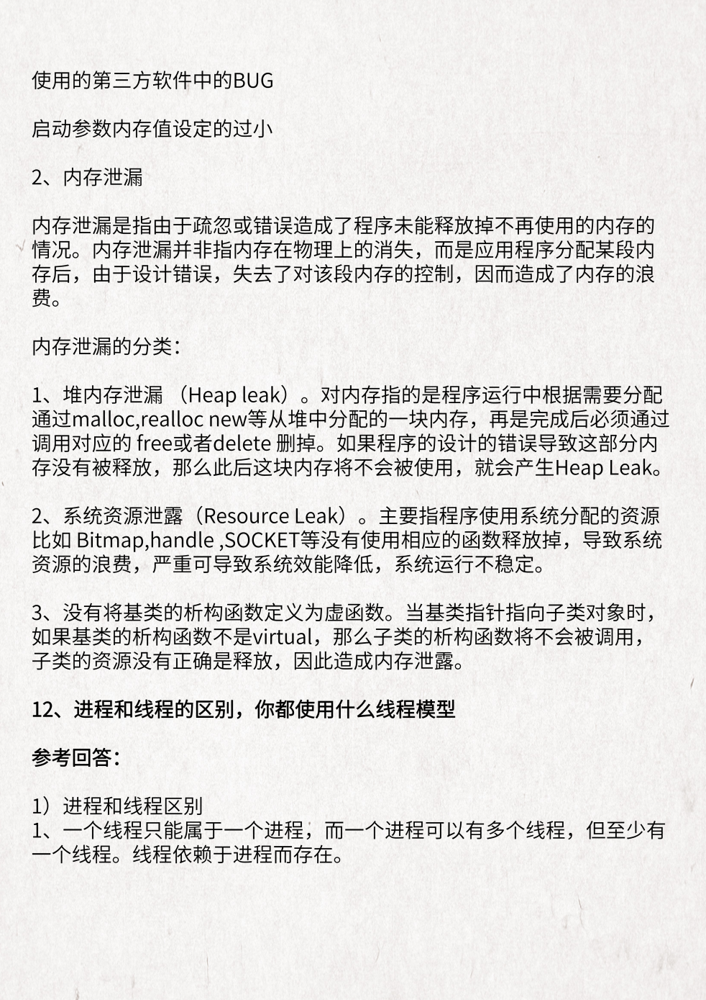

## 1. 什么是进程？什么是线程？二者区别？

> 进程是资源分配的基本单位，它是程序执行时的一个实例，在程序运行时创建；
> 线程是程序执行的最小单位，是进程的一个执行流，一个进程由多个线程组成的。

### 1.1 进程和线程的区别

1. 进程是资源分配的最小单位，线程是程序执行的最小单位（资源调度的最小单位）
2. 进程有自己的独立地址空间，每启动一个进程，系统就会为它分配地址空间，建立数据表来维护代码段、堆栈段和数据段，这种操作非常昂贵；
    而线程是共享进程中的数据的，使用相同的地址空间，因此 CPU 切换一个线程的花费远比进程要小很多，同时创建一个线程的开销也比进程要小很多。
3. 线程之间的通信更方便，同一进程下的线程共享全局变量、静态变量等数据；而进程之间的通信需要以通信的方式（IPC) （Inter-Process Communication，[进程间通信](https://baike.baidu.com/item/进程间通信/1235923)）进行。不过如何处理好同步与互斥是编写多线程程序的难点。
4. 但是多进程程序更健壮。多线程程序只要有一个线程死掉，整个进程也死掉了，而一个进程死掉并不会对另外一个进程造成影响，因为进程有自己独立的地址空间。

## 2. 线程的 5 种状态

1. 线程从创建、运行到结束总是处于下面五个状态之一：
    - 新建状态、就绪状态、运行状态、阻塞状态及死亡状态。

2. 新建状态(New)：
    当用new操作符创建一个线程时， 例如new Thread(r)，线程还没有开始运行，此时线程处在新建状态。 当一个线程处于新生状态时，程序还没有开始运行线程中的代码

3. 就绪状态(Runnable)

    一个新创建的线程并不自动开始运行，要执行线程，必须调用线程的start()方法。当线程对象调用start()方法即启动了线程，start()方法创建线程运行的系统资源，并调度线程运行run()方法。当start()方法返回后，线程就处于就绪状态。
    处于就绪状态的线程并不一定立即运行run()方法，线程还必须同其他线程竞争CPU时间，只有获得CPU时间才可以运行线程。因为在单CPU的计算机系统中，不可能同时运行多个线程，一个时刻仅有一个线程处于运行状态。因此此时可能有多个线程处于就绪状态。对多个处于就绪状态的线程是由Java运行时系统的线程调度程序(thread scheduler)来调度的。

4. 运行状态(Running)

    当线程获得CPU时间后，它才进入运行状态，真正开始执行run()方法.

5. 阻塞状态(Blocked)

    线程运行过程中，可能由于各种原因进入阻塞状态:

    - 线程通过调用sleep方法进入睡眠状态；
    - 线程调用一个在I/O上被阻塞的操作，即该操作在输入输出操作完成之前不会返回到它的调用者；
    - 线程试图得到一个锁，而该锁正被其他线程持有；
    - 线程在等待某个触发条件；
    - ....
    
    所谓阻塞状态是正在运行的线程没有运行结束，暂时让出CPU，这时其他处于就绪状态的线程就可以获得CPU时间，进入运行状态。
    
6. 死亡状态(Dead)

    有两个原因会导致线程死亡：

    - run方法正常退出而自然死亡
    - 一个未捕获的异常终止了run方法而使线程猝死。

    为了确定线程在当前是否存活着（就是要么是可运行的，要么是被阻塞了），需要使用isAlive方法。如果是可运行或被阻塞，这个方法返回true； 如果线程仍旧是new状态且不是可运行的， 或者线程死亡了，则返回false.

## 3. 死锁

1. 死锁是指在一组进程中的各个进程均占有不会释放的资源，但因互相申请被其他进程所站用不会释放的资源而处于的一种永久等待状态。死锁的四个必要条件：
    - 互斥条件(Mutual exclusion)：资源不能被共享，只能由一个进程使用。
    - 请求与保持条件(Hold and wait)：已经得到资源的进程可以再次申请新的资源。
    - 非剥夺条件(No pre-emption)：已经分配的资源不能从相应的进程中被强制地剥夺。
    - 循环等待条件(Circular wait)：系统中若干进程组成环路，该环路中每个进程都在等待相邻进程正占用的资源。

2. java中产生死锁可能性的最根本原因是：

    - 是多个线程涉及到多个锁，这些锁存在着交叉，所以可能会导致了一个锁依赖的闭环；
    - 默认的锁申请操作是阻塞的。

    如，线程在获得一个锁L1的情况下再去申请另外一个锁L2，也就是锁L1想要包含了锁L2，在获得了锁L1，并且没有释放锁L1的情况下，又去申请获得锁12，这个是产生死锁的最根本原因。

3. 避免死锁：

    - 方案一：破坏死锁的循环等待条件。

    - 方案二：破坏死锁的请求与保持条件，使用lock的特性，为获取锁操作设置超时时间。这样不会死锁(至少不会无尽的死锁)

    - 方案三：设置一个条件遍历与一个锁关联。该方法只用一把锁，没有chopstick类，将竞争从对筷子的争夺转换成了对状态的判断。仅当左右邻座都没有进餐时才可以进餐。提升了并发度。

## 4. 进程间的通信的几种方式

1. 管道（pipe）及命名管道（named pipe）
    - 管道可用于具有亲缘关系的父子进程间的通信，有名管道除了具有管道所具有的功能外，它还允许无亲缘关系进程间的通信；

2. 信号（signal）
    - 信号是一种比较复杂的通信方式，用于通知接收进程某个事件已经发生；

3. 消息队列
    - 消息队列是消息的链接表，它克服了上两种通信方式中信号量有限的缺点，具有写权限得进程可以按照一定得规则向消息队列中添加新信息；对消息队列有读权限得进程则可以从消息队列中读取信息；

4. 共享内存
    - 可以说这是最有用的进程间通信方式。它使得多个进程可以访问同一块内存空间，不同进程可以及时看到对方进程中对共享内存中数据得更新。这种方式需要依靠某种同步操作，如互斥锁和信号量等；

5. 信号量
    - 主要作为进程之间及同一种进程的不同线程之间得同步和互斥手段；

6. 套接字
    - 这是一种更为一般的进程间通信机制，它可用于网络中不同机器之间的进程间通信，应用非常广泛。

## 5. 线程同步的方式

1. 互斥量 Synchronized/Lock：采用互斥对象机制，只有拥有互斥对象的线程才有访问公共资源的权限。因为互斥对象只有一个，所以可以保证公共资源不会被多个线程同时访问

2. 信号量 Semphare：它允许同一时刻多个线程访问同一资源，但是需要控制同一时刻访问此资源的最大线程数量

3. 事件(信号)，Wait/Notify：通过通知操作的方式来保持多线程同步，还可以方便的实现多线程优先级的比较操作

## 6. 进程有哪几种状态？

- 就绪状态：进程已获得除处理机以外的所需资源，等待分配处理机资源；

- 运行状态：占用处理机资源运行，处于此状态的进程数小于等于CPU数；

- 阻塞状态： 进程等待某种条件，在条件满足之前无法执行；

- 

## 7. 操作系统进程调度算法？

1. **FCFS(先来先服务，队列实现，非抢占的)：**先请求CPU的进程先分配到CPU

2. **SJF(最短作业优先调度算法)：**平均等待时间最短，但难以知道下一个CPU区间长度

3. **优先级调度算法(可以是抢占的，也可以是非抢占的)：**优先级越高越先分配到CPU，相同优先级先到先服务，存在的主要问题是：低优先级进程无穷等待CPU，会导致无穷阻塞或饥饿；解决方案：老化

4. **时间片轮转调度算法(可抢占的)：**队列中没有进程被分配超过一个时间片的CPU时间，除非它是唯一可运行的进程。如果进程的CPU区间超过了一个时间片，那么该进程就被抢占并放回就绪队列。

5. **多级队列调度算法：**将就绪队列分成多个独立的队列，每个队列都有自己的调度算法，队列之间采用固定优先级抢占调度。其中，一个进程根据自身属性被永久地分配到一个队列中。

6. **多级反馈队列调度算法：**与多级队列调度算法相比，其允许进程在队列之间移动：若进程使用过多CPU时间，那么它会被转移到更低的优先级队列；在较低优先级队列等待时间过长的进程会被转移到更高优先级队列，以防止饥饿发生。

## 8. 什么是缓冲区溢出？有什么危害？其原因是什么？

1. **缓冲区溢出**是指当计算机向缓冲区内填充数据时，超过了缓冲区本身的容量，溢出的数据覆盖在合法数据上。

2. 危害：在当前网络与分布式系统安全中，被广泛利用的 50% 以上都是缓冲区溢出，其中最著名的例子是 1988 年利用 fingerd 漏洞的蠕虫。而缓冲区溢出中，最为危险的是堆栈溢出，因为入侵者可以利用堆栈溢出，在函数返回时改变返回程序的地址，让其跳转到任意地址，带来的危害一种是程序崩溃导致拒绝服务，另外一种就是跳转并且执行一段恶意代码，比如得到 shell，然后为所欲为。通过往程序的缓冲区写超出其长度的内容，造成缓冲区的溢出，从而破坏程序的堆栈，使程序转而执行其它指令，以达到攻击的目的。    

3. 造成缓冲区溢出的主原因是程序中没有仔细检查用户输入的参数。

## 9. 进程与线程的概念，为什么要有进程线程，其中有什么区别，他们各自又是怎么同步的？

进程间通信（IPC, Inter-Process Communication）

## 10. 请你说一说 Linux 虚拟地址空间

## 11. 请你说一说操作系统中的缺页中断

## 12. 请你说一说并发和并行

## 13. MySQL 端口号是多少，怎么修改这个端口号？

## 14. 有了进程，为什么还要有线程？

## 15. 讲述一下互斥锁机制，以及互斥锁和读写锁的区别

## 16. 进程与线程的区别

## 17. 软链接和硬链接的区别

## 18. 用户态和内核态的区别

## 19. 死循环 + 来连接时新建线程的方法效率有点低，怎么改进？

## 20. 说一下多线程的同步，锁的机制

## 21. 两个进程访问临界资源，会不会出现都获得自旋锁的情况？

## 22. 死锁产生的必要条件

## 23. 说一说内存溢出和内存泄漏

## 24. 进程和线程的区别，你都是用什么线程模型

